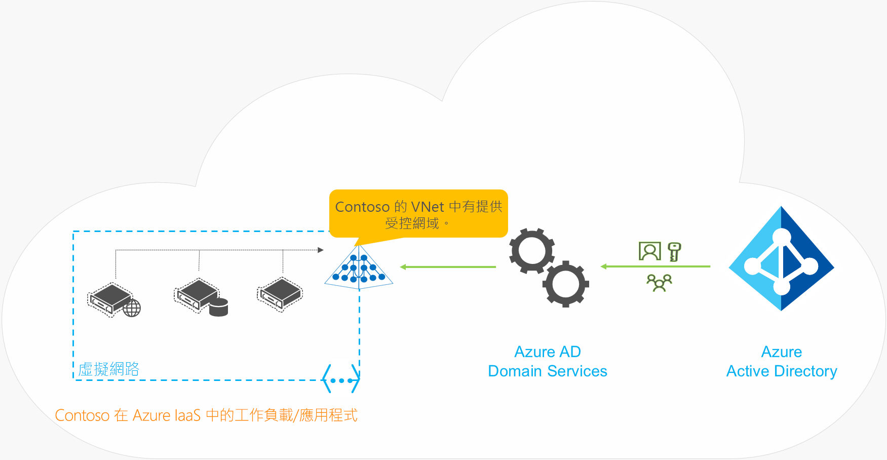

# 什麼是 Azure Active Directory Domain Services？

Azure Active Directory Domain Services (Azure AD DS) 提供受控網域服務，例如，網域加入、群組原則、輕量型目錄存取通訊協定 (LDAP) 和 Kerberos / NTLM 驗證，與 Windows Server Active Directory 完全相容。 您可以使用這些網域服務，而不需要在雲端部署、管理及修補網域控制站。 Azure AD DS 與您現有的 Azure AD 租用戶整合，讓使用者能夠使用其現有認證登入。 您也可以使用現有的群組與使用者帳戶，安全地存取資源，這樣能更順暢地將內部部署資源隨即轉移至 Azure。

Azure AD DS 會從 Azure AD 複寫身分識別資訊，因此適用於僅限雲端的 Azure AD 租用戶，或與內部部署 Active Directory Domain Services (AD DS) 環境同步處理的 Azure AD 租用戶。 這兩個環境都有一組相同的 Azure AD DS 功能。

* 如果您有現有的內部部署 AD DS 環境，您可以同步使用者帳戶資訊，為使用者提供一致的身分識別。
* 針對僅限雲端環境，您不需要傳統內部部署 AD DS 環境，就能使用 Azure AD DS 的集中式識別服務。

下列影片概述如何將 Azure AD DS 與您的應用程式和工作負載整合，以在雲端提供識別服務：

 

>[!VIDEO https://www.youtube.com/embed/T1Nd9APNceQ]

## 在雲端提供身分識別解決方案的常見方式

當您將現有的工作負載移轉至雲端時，目錄感知應用程式可能會將 LDAP 用於內部部署 AD DS 目錄的讀取或寫入存取權。 在 Windows Server 上執行的應用程式通常都會部署在已加入網域的虛擬機器 (VM) 上，因此只要使用群組原則就能安全地加以管理。 若要驗證終端使用者，應用程式也可以依賴 Windows 整合式驗證，例如 Kerberos 或 NTLM 驗證。

IT 系統管理員通常會使用下列其中一個解決方案，將識別服務提供給在 Azure 中執行的應用程式：

* 在於 Azure 中和內部部署 AD DS 環境中執行的工作負載之間設定站對站 VPN 連線。
    * 然後內部部署網域控制站會透過 VPN 連線提供驗證。
* 使用 Azure 虛擬機器 (VM) 建立複本網域控制站，從內部部署環境延伸 AD DS 網域 / 樹系。
    * 在 Azure VM 上執行的網域控制站會提供驗證，並複寫內部部署 AD DS 環境之間的目錄資訊。
* 使用在 Azure VM 上執行的網域控制站，在 Azure 中部署獨立 AD DS 環境。
    * 在 Azure VM 上執行的網域控制站會提供驗證，但不會從內部部署 AD DS 環境複寫任何目錄資訊。

使用這些方法，連線到內部部署目錄的 VPN 連線，會讓應用程式容易受暫時性網路問題或中斷影響。 如果您在 Azure 中使用 VM 部署網域控制站，則 IT 小組必須管理 VM，然後保護、修補、監視及備份網域控制站，以及對其進行疑難排解。

Azure AD DS 提供的替代方案適用於建立連線回內部部署 AD DS 環境的 VPN 連線，或在 Azure 中執行及管理 VM 以提供識別服務的需求。 因為 Azure AD DS 是受控服務，所以可降低為混合式和僅限雲端環境建立整合式身分識別解決方案的複雜性。

## Azure AD DS 的功能與優點

為了為雲端中的應用程式與 VM 提供識別服務，Azure AD DS 完全相容於傳統 AD DS 環境的作業，例如，網域加入、安全 LDAP (LDAPS)、群組原則與 DNS 管理，以及 LDAP 繫結和讀取支援。 LDAP 寫入支援可供在 Azure AD DS 受控網域中建立的物件使用，但不可供從 Azure AD 同步的資源使用。 Azure AD DS 的下列功能簡化了部署與管理作業：

* **簡化的部署體驗：** 使用 Azure 入口網站中的單一精靈為您的 Azure AD 租用戶啟用 Azure AD DS。
* **與 Azure AD 整合：** 使用者帳戶、群組成員資格與認證，都自動可從您的 Azure AD 租用戶取得。 新使用者、群組，或 Azure AD 租用戶或內部部署 AD DS 環境中的屬性變更，都會自動同步到 Azure AD DS。
    * 外部目錄中連結至 Azure AD 的帳戶無法在 Azure AD DS 中使用。 這些外部目錄無法使用認證，因此無法同步處理到 Azure AD DS 受控網域。
* **使用公司認證/密碼：** Azure AD DS 中使用者的密碼與您 Azure AD 租用戶中使用者的密碼相同。 使用者可以使用其公司認證來將機器加入網域，以互動方式或透過遠端桌面登入，以及向 Azure AD DS 受控網域驗證。
* **NTLM 和 Kerberos 驗證：** 利用對 NTLM 與 Kerberos 驗證的支援，您就能部署依賴 Windows 整合式驗證的應用程式。
* **高可用性：** Azure AD DS 包含多個網域控制站，為您的受控網域提供高可用性。 此高可用性可保證服務執行時間，且可從失敗復原。
    * 在支援 [Azure 可用性區域][availability-zones]的區域中，這些網域控制站也會分散到多個區域，以提高復原能力。

Azure AD DS 受控網域的一些關鍵層面如下：

* Azure AD DS 受控網域是獨立網域。 它不是內部部署網域的延伸。
    * 如有需要，您可以建立從 Azure AD DS 到內部部署 AD DS 環境的單向輸出樹系信任。 如需詳細資訊，請參閱 [Azure AD DS 的資源樹系概念和功能][ forest-trusts]。
* 您的 IT 小組不需要管理、修補或監視此 Azure AD DS 受控網域的網域控制站。

針對執行 AD DS 內部部署的混合式環境，您不需要管理對 Azure AD DS 受控網域的 AD 複寫。 使用者帳戶、群組成員資格與來自您內部部署目錄的認證會透過 [Azure AD Connect][azure-ad-connect] 同步到 Azure AD。 這些使用者帳戶、群組成員資格與認證，都會自動在 Azure AD DS 受控網域中提供。

## Azure AD DS 如何運作？

為了提供識別服務，Azure 會在您選擇的虛擬網路上建立 AD DS 執行個體。 在幕後會建立一對在 Azure VM 上執行的 Windows Server 網域控制站。 您不需要管理、設定或更新這些網域控制站。 Azure 平台會管理網域控制站，作為 Azure AD DS 服務的一部分。

Azure AD DS 受控網域已設定為從 Azure AD 執行單向同步，以提供對一組集中式使用者、群組與認證的存取權。 您可以直接在 Azure AD DS 受控網域中建立資源，但系統不會將它們同步回 Azure AD。 Azure 中連線到此虛擬網路的應用程式、服務與 VM 接著可以使用常見的 AD DS 功能，例如，網域加入、群組原則、LDAP 與 Kerberos / NTLM 驗證。

在具有內部部署 AD DS 環境的混合式環境中，[Azure AD Connect][azure-ad-connect] 會與 Azure AD 同步身分識別資訊，該資訊會接著同步至 Azure AD DS。

為查看 Azure AD DS 運作，讓我們來看幾個範例：

* [混合式組織的 Azure AD DS](#azure-ad-ds-for-hybrid-organizations)
* [僅限雲端的組織的 Azure AD DS](#azure-ad-ds-for-cloud-only-organizations)

### 混合式組織的 Azure AD DS

許多組織都執行包含雲端與內部部署應用程式工作負載的混合式基礎結構。 隸屬於隨即轉移策略且移轉至 Azure 的繼承應用程式，可使用傳統 LDAP 連線來提供身分識別資訊。 為了支援此混合式基礎結構，來自內部部署 AD DS 環境的身分識別資訊可同步至 Azure AD 租用戶。 Azure AD DS 接著可以使用身分識別來源在 Azure 中提供這些繼承應用程式，而不需要設定及管理對內部部署目錄服務的應用程式連線能力。

讓我們看看 Litware Corporation 的範例，此混合式組織執行內部部署與 Azure 資源：

* 需要網域服務的應用程式與伺服器工作負載會部署在 Azure 中的虛擬網路中。
    * 這可能包含作為隨即轉移策略一部分移轉至 Azure 的繼承應用程式。
* 為了從其內部部署目錄同步身分識別資訊到其 Azure AD 租用戶，Litware Corporation 部署了 [Azure AD Connect][azure-ad-connect]。
    * 同步的身分識別資訊包括使用者帳戶與群組成員資格。
* Litware 的 IT 小組為在此 (或對等的) 虛擬網路中的 Azure AD 租用戶啟用 Azure AD DS。
* 部署在 Azure 虛擬網路中的應用程式與 VM 之後可以使用網域加入、LDAP 讀取、LDAP 繫結、NTLM 與 Kerberos 驗證，以及群組原則等 Azure AD DS 功能。

> [!IMPORTANT]
> Azure AD Connect 應該只會為了與內部部署 AD DS 環境同步處理而安裝和設定。 不支援在 Azure AD DS 受控網域中安裝 Azure AD Connect，以將物件同步處理回 Azure AD。

### 僅限雲端的組織的 Azure AD DS

僅限雲端的 Azure AD 租用戶沒有內部部署身分識別來源。 例如，使用者帳戶與群組成員資格都可直接在 Azure AD 中建立和管理。

現在，讓我們看 Contoso 的範例，此僅限雲端的組織會使用 Azure AD 來進行身分識別驗證。 所有使用者身分識別、其認證與群組成員資格都是在 Azure AD 中建立及管理的。 不需要進行任何額外的 Azure AD Connect 設定，就能從內部部署目錄同步任何身分識別資訊。

* 需要網域服務的應用程式與伺服器工作負載會部署在 Azure 中的虛擬網路中。
* Contoso 的 IT 小組為在此 (或對等的) 虛擬網路中的 Azure AD 租用戶啟用 Azure AD DS。
* 部署在 Azure 虛擬網路中的應用程式與 VM 之後可以使用網域加入、LDAP 讀取、LDAP 繫結、NTLM 與 Kerberos 驗證，以及群組原則等 Azure AD DS 功能。

## 後續步驟

若要深入了解 Azure AD DS 與其身分識別解決方案的比較，以及同步的運作方式，請參閱下列文章：

* [比較 Azure AD DS 與 Azure AD、Azure VM 上的 Active Directory Domain Services，以及 Active Directory Domain Services 內部部署][compare] \(英文\)
* [了解 Azure AD Domain Services 如何與 Azure AD 目錄同步處理][synchronization]

若要開始使用，請[使用 Azure 入口網站建立 Azure AD DS 受控網域][tutorial-create]。

<!-- INTERNAL LINKS -->
[compare]: compare-identity-solutions.md
[synchronization]: synchronization.md
[tutorial-create]: tutorial-create-instance.md
[azure-ad-connect]: ../active-directory/hybrid/whatis-azure-ad-connect.md
[password-hash-sync]: ../active-directory/hybrid/how-to-connect-password-hash-synchronization.md
[availability-zones]: ../availability-zones/az-overview.md
[forest-trusts]: concepts-resource-forest.md
