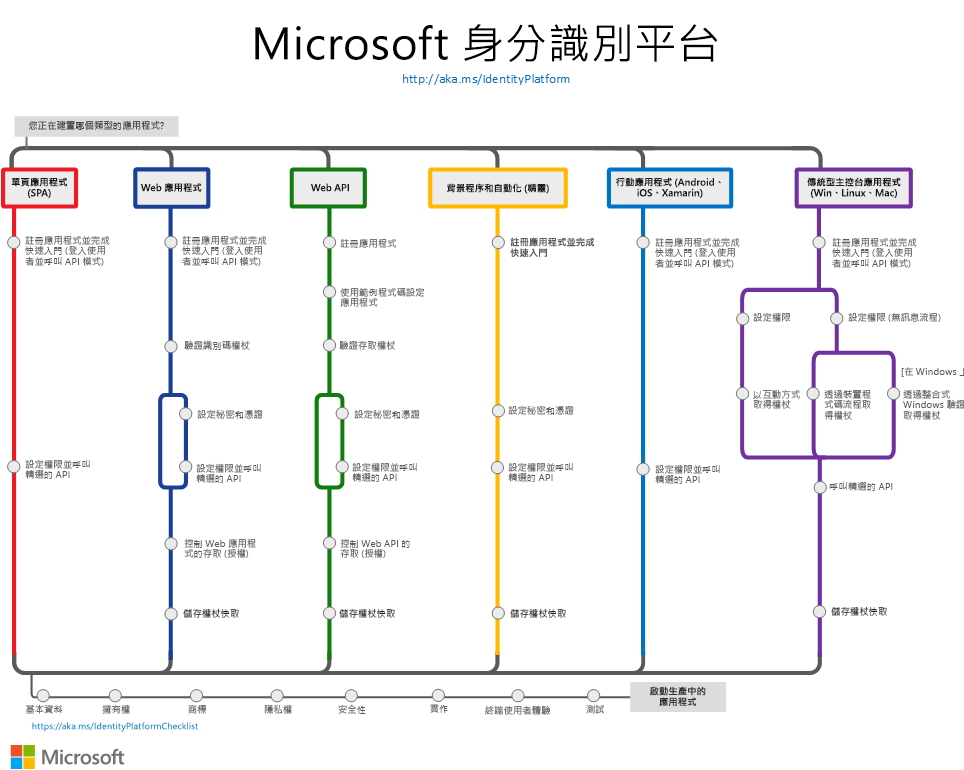

# Microsoft 身分識別平台 (v2.0) 概觀

Microsoft 身分識別平台是 Azure Active Directory (Azure AD) 開發人員平台的演化。 它可讓開發人員建置應用程式以登入所有 Microsoft 身分識別，並取得權杖以呼叫 Microsoft Graph 等 Microsoft API，或開發人員所建置的 API。 Microsoft 身分識別平台包含：

- **OAuth 2.0 和 OpenID Connect 符合標準的驗證服務**，可讓開發人員驗證任何 Microsoft 身分識別，包括：
  - 工作或學校帳戶 (透過 Azure AD 佈建)
  - 個人 Microsoft 帳戶 (例如 Skype、Xbox 及 Outlook.com)
  - 社交或本機帳戶 (透過 Azure AD B2C)
- **開放原始碼程式庫**：Microsoft 驗證程式庫 (MSAL) 和其他符合標準的程式庫支援
- **應用程式管理入口網站**：Azure 入口網站內建的註冊和設定體驗，以及所有其他 Azure 管理功能。
- **應用程式設定 API 和 PowerShell**：可讓應用程式透過 REST API (Microsoft Graph 和 Azure Active Directory Graph 1.6) 和 PowerShell 以程式設計方式進行設定，以便您將 DevOps 工作自動化。
- **開發人員內容**：概念和參考文件、快速入門範例、程式碼範例、教學課程及操作指南。

對於開發人員，Microsoft 身分識別平台會提供身分識別和安全性空間創新的無縫整合，例如無密碼驗證、設定驗證和條件式存取。  您不需要自行實作這類功能：與 Microsoft 身分識別平台整合的應用程式可以原生方式利用這類創新。

透過 Microsoft 身分識別平台，您可以撰寫程式碼一次並觸及任何使用者。 您可以建置應用程式一次並讓它在許多平台上運作，或建置可當作用戶端以及資源應用程式 (API) 的應用程式。

## 開始使用

使用身分識別一點都不難。 

觀看 [Microsoft 身分識別平台影片](identity-videos.md)以了解基本概念。 

選擇您適用的[案例](authentication-flows-app-scenarios.md) — 每個案例路徑都有快速入門和概觀頁面，可讓您在短短幾分鐘內啟動並執行：

- [建置單一頁面應用程式](scenario-spa-overview.md)
- [建置可登入使用者的 Web 應用程式](scenario-web-app-sign-user-overview.md)
- [建置可呼叫 Web API 的 Web 應用程式](scenario-web-app-call-api-overview.md)
- [建置受保護的 Web API](scenario-protected-web-api-overview.md)
- [建置可呼叫 Web API 的 Web API](scenario-web-api-call-api-overview.md)
- [建置傳統型應用程式](scenario-desktop-overview.md)
- [建置精靈應用程式](scenario-daemon-overview.md)
- [建置行動應用程式](scenario-mobile-overview.md)

下圖概述常見的驗證應用程式案例 – 整合 Microsoft 身分識別平台與您的應用程式時，使用此圖作為參考。

## 後續步驟

如果您想要深入了解核心驗證概念，建議您從下列主題著手：

- [驗證流程和應用程式情節](authentication-flows-app-scenarios.md)
- [驗證基本概念](authentication-scenarios.md)
- [應用程式與服務主體](app-objects-and-service-principals.md)
- [對象](v2-supported-account-types.md)
- [權限和同意](v2-permissions-and-consent.md)
- [識別碼權杖](id-tokens.md)和[存取權杖](access-tokens.md)

建置資料豐富的應用程式以呼叫 [Microsoft Graph](https://docs.microsoft.com/graph/overview)。

當您準備好在**生產環境**中啟動應用程式時，請檢閱下列最佳做法：

- 在應用程式中[啟用記錄](msal-logging.md)功能。
- 在應用程式中啟用遙測功能。
- 啟用 [Proxy 和自訂 HTTP 用戶端](msal-net-provide-httpclient.md)。
- 遵循 [Microsoft 身分識別平台整合檢查清單](identity-platform-integration-checklist.md)來測試您的整合。

## 深入了解

如果您打算建置可登入社交和本機身分識別的客戶面向應用程式，請參閱 [Azure AD B2C 概觀](https://docs.microsoft.com/azure/active-directory-b2c/tutorial-add-identity-providers)。
