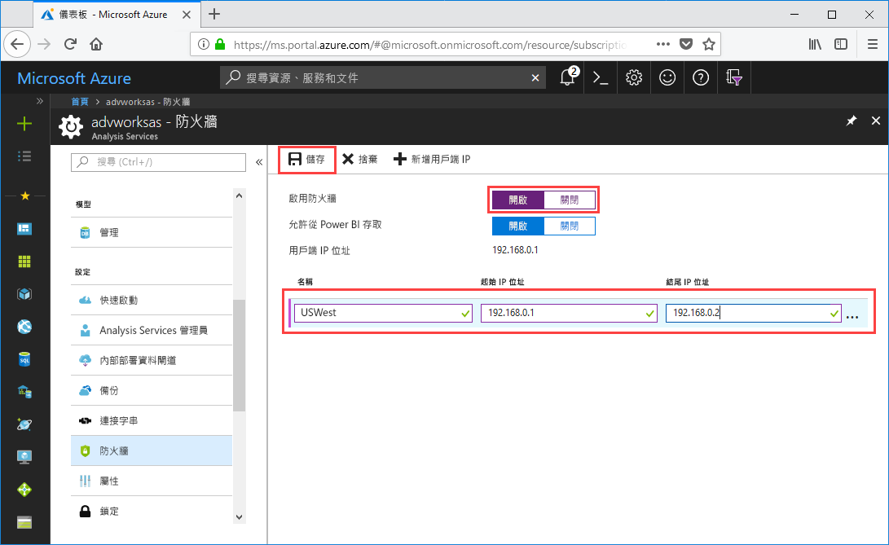

# 快速入門：設定伺服器防火牆 - 入口網站

本快速入門可協助您設定 Azure Analysis Services 伺服器的防火牆。 針對存取伺服器的電腦啟用防火牆並設定 IP 位址範圍，是保護伺服器和資料的重要環節。

## 必要條件

- 訂用帳戶中的 Analysis Services 伺服器。 若要深入了解，請參閱[快速入門：建立伺服器 - 入口網站](analysis-services-create-server.md)或[快速入門：建立伺服器 - PowerShell](analysis-services-create-powershell.md)
- 用戶端電腦的一或多個 IP 位址範圍 (如有需要)。

## 登入 Azure 入口網站 

[登入入口網站](https://portal.azure.com)

## 設定防火牆

1. 按一下您的伺服器，以開啟 [概觀] 頁面。 
2. 在 [設定]   > [防火牆]   > [啟用防火牆]  中，按一下 [開啟]  。
3. 若要允許從 Power BI 服務的 DirectQuery 存取，請在 [允許從 Power BI 存取]  中按一下 [開啟]  。  
4. (選用) 指定一或多個 IP 位址範圍。 輸入每個範圍的名稱、起始和結束 IP 位址。 防火牆規則名稱應該限制在 128 個字元內，而且只能包含大寫字元、小寫字元、數字、底線和連字號。 不允許使用空格和其他特殊字元。
5. 按一下 [檔案]  。

     

## 清除資源

不再需要 IP 位址範圍時請加以刪除，或停用防火牆。

## 後續步驟
在本快速入門中，您已了解如何為您的伺服器設定防火牆。 現在您已有伺服器，並使用防火牆加以保護，接下來您可以從入口網站為其新增基本範例資料模型。 範例模型有助於您了解如何設定模型資料庫角色以及測試用戶端連線。 若要深入了解，請繼續進行新增範例模型的教學課程。

> [!div class="nextstepaction"]
> [教學課程：將範例模型新增至您的伺服器](analysis-services-create-sample-model.md)
