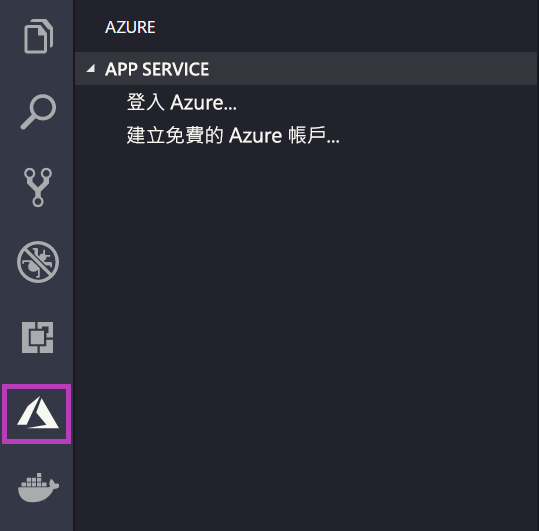
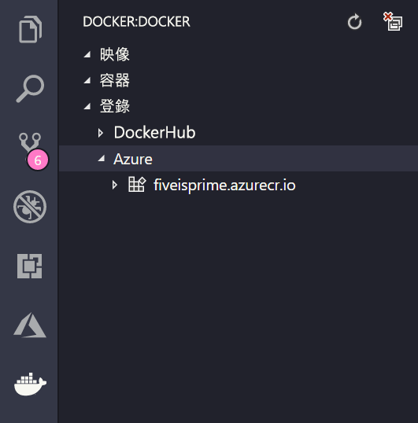

# <a name="deploy-a-custom-linux-container-to-azure-app-service"></a>將自訂 Linux 容器部署至 Azure App Service

Linux 上的 App Service 提供 Linux 上的預先定義應用程式堆疊，且支援 .NET、PHP、Node.js 等其他語言。 您也可以使用自訂 Docker 映像，在尚未於 Azure 中定義的應用程式堆疊上執行 Web 應用程式。 本快速入門說明如何將映像從 [Azure Container Registry](/azure/container-registry) (ACR) 部署至 App Service。

## <a name="prerequisites"></a>Prerequisites

* [Azure 帳戶](https://azure.microsoft.com/free/?utm_source=campaign&utm_campaign=vscode-tutorial-docker-extension&mktingSource=vscode-tutorial-docker-extension)
* [Docker](https://www.docker.com/community-edition)
* [Visual Studio Code](https://code.visualstudio.com/)
* [適用於 VS Code 的 Azure App Service 擴充功能](vscode:extension/ms-azuretools.vscode-azureappservice)。 您也可以使用此擴充功能在 Azure 平台即服務 (PaaS) 上建立、管理和部署 Linux Web Apps。
* [適用於 VS Code 的 Docker 擴充功能](vscode:extension/ms-azuretools.vscode-docker)。 您可以使用此擴充功能來簡化本機 Docker 映像和命令的管理，以及將組建應用程式映像部署至 Azure。

## <a name="create-an-image"></a>建立映像

若要完成本快速入門，您將需要一個儲存在 [Azure Container Registry](/azure/container-registry) 中的適當 Web 應用程式映像。 遵循[快速入門：使用 Azure 入口網站建立私人容器登錄](/azure/container-registry/container-registry-get-started-portal)中的指示，但使用 `mcr.microsoft.com/azuredocs/go` 映像，而不是 `hello-world` 映像。 如需參考，[在 Azure 範例存放庫中可找到範例 Dockerfile](https://github.com/Azure-Samples/go-docs-hello-world)。

> [!IMPORTANT]
> 當您建立容器登錄時，請務必將 [管理使用者]  選項設定為 [啟用]  。 您也可以在 Azure 入口網站中，從登錄頁面的 [存取金鑰]  區段擷取它。 這是 App Service 存取的必要設定。

## <a name="sign-in"></a>登入

接下來，啟動 VS Code 並使用 App Service 擴充功能登入您的 Azure 帳戶。 若要這麼做，請在活動列中選取 Azure 標誌，瀏覽至 [APP SERVICE]  總管，然後選取 [Sign in to Azure]  \(登入 Azure\)，並遵循指示操作。



## <a name="check-prerequisites"></a>檢查必要條件

現在您可以檢查是否已正確安裝及設定所有必要條件。

在 VS Code 中，您應該會在狀態列中看到您的 Azure 電子郵件地址，並在 [APP SERVICE]  總管中看到您的訂用帳戶。

接下來，確認您已安裝且正在執行 Docker。 下列命令會顯示 Docker 版本 (如果它正在執行中)。

```bash
docker --version
```

最後，請確定您的 Azure Container Registry 已連線。 若要這麼做，請在活動列中選取 Docker 標誌，然後瀏覽至 [REGISTRIES]  \(登錄\)。



## <a name="deploy-the-image-to-azure-app-service"></a>將映像部署到 Azure App Service

設定好所有項目之後，您就可以直接從 Docker 擴充功能總管將您的映像部署到 [Azure App Service](https://azure.microsoft.com/services/app-service/)。

在 **DOCKER** 總管的 [Registries]  \(登錄\) 節點底下尋找映像，並展開它以顯示其標籤。 以滑鼠右鍵按一下標籤，然後選取 [Deploy Image to Azure App Service]  \(將映像部署至 Azure App Service\)。

從這裡，遵循提示來選擇訂用帳戶、全域唯一應用程式名稱、資源群組和 App Service 方案。 針對定價層和區域選擇 [B1 Basic]  \(B1 基本\)。

部署之後，您的應用程式可以在 `http://<app name>.azurewebsites.net` 取得。

**資源群組**是 Azure 中所有應用程式資源的具名集合。 例如，資源群組可以包含網站、資料庫和 Azure 函式的參考。

**App Service 方案**定義用來裝載您網站的實體資源。 本快速入門使用 **Linux** 基礎結構上的**基本**主控方案，這表示網站會與其他網站一起裝載在 Linux 機器上。 如果您開始使用**基本**方案，可以使用 Azure 入口網站來相應增加，讓您的網站是在機器上執行的唯一網站。

## <a name="browse-the-website"></a>瀏覽網站

[輸出]  面板會在部署期間開啟，以指出作業的狀態。 當作業完成時，尋找您在 [APP SERVICE]  總管中建立的應用程式，並以滑鼠右鍵按一下，然後選取 [Browse Website]  \(瀏覽網站\)，以在瀏覽器中開啟網站。

> [!div class="nextstepaction"]
> [我遇到問題](https://www.research.net/r/PWZWZ52?tutorial=quickstart-docker&step=deploy-app)

## <a name="next-steps"></a>後續步驟

恭喜，您已成功完成本快速入門！

接下來，請參閱其他 Azure 擴充功能。

* [Cosmos DB](https://marketplace.visualstudio.com/items?itemName=ms-azuretools.vscode-cosmosdb)
* [Azure Functions](https://marketplace.visualstudio.com/items?itemName=ms-azuretools.vscode-azurefunctions)
* [Azure CLI 工具](https://marketplace.visualstudio.com/items?itemName=ms-vscode.azurecli)
* [Azure Resource Manager](https://marketplace.visualstudio.com/items?itemName=msazurermtools.azurerm-vscode-tools) \(英文\)

或藉由安裝 [Azure Tools](https://marketplace.visualstudio.com/items?itemName=ms-vscode.vscode-node-azure-pack) 擴充功能套件來取得以上所有擴充功能。
