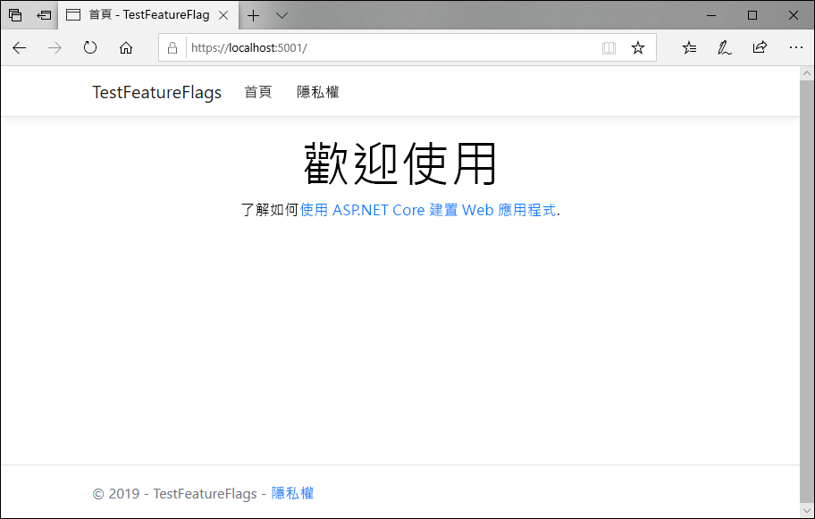
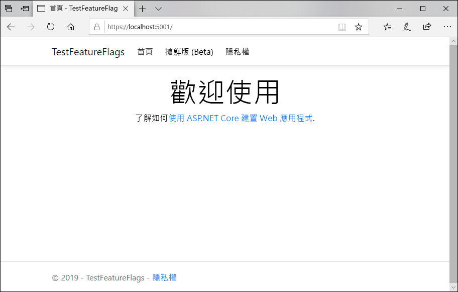

# <a name="quickstart-add-feature-flags-to-an-aspnet-core-app"></a>快速入門：將功能旗標新增至 ASP.NET Core 應用程式

在本快速入門中，您會將 Azure 應用程式組態納入 ASP.NET Core Web 應用程式中，以建立功能管理的端對端實作。 您可以使用應用程式組態服務來集中儲存所有功能旗標及控制其狀態。 

.NET Core 功能管理程式庫可透過全方位的功能旗標支援來擴充架構。 這些程式庫會建置在 .NET Core 組態系統之上。 並且可透過 .NET Core 組態提供者完美地與應用程式組態整合。

## <a name="prerequisites"></a>必要條件

- Azure 訂用帳戶 - [建立免費帳戶](https://azure.microsoft.com/free/)
- [.NET Core SDK](https://dotnet.microsoft.com/download)。

## <a name="create-an-app-configuration-store"></a>建立應用程式設定存放區

[!INCLUDE [azure-app-configuration-create](../../includes/azure-app-configuration-create.md)]

6. 選取 [功能管理員]   > [+新增]  以新增下列功能旗標：

    | Key | State |
    |---|---|
    | Beta | 關閉 |

## <a name="create-an-aspnet-core-web-app"></a>建立 ASP.NET Core Web 應用程式

您會使用 [.NET Core 命令列介面 (CLI)](https://docs.microsoft.com/dotnet/core/tools/) 來建立新的 ASP.NET Core MVC Web 應用程式專案。 使用 .NET Core CLI 而非 Visual Studio 的好處，在於 .NET Core CLI 在 Windows、macOS 和 Linux 平台上都可供使用。

1. 為您的專案建立新資料夾。 本快速入門會將其命名為 TestFeatureFlags  。

1. 在新的資料夾中，執行下列命令以建立新的 ASP.NET Core MVC Web 應用程式專案：

   ```    
   dotnet new mvc --no-https
   ```

## <a name="add-secret-manager"></a>新增祕密管理員

將[祕密管理員工具](https://docs.microsoft.com/aspnet/core/security/app-secrets) \(機器翻譯\) 新增至您的專案。 祕密管理員工具能儲存專案樹狀結構外開發工作的敏感性資料。 此作法能協助避免於原始程式碼內意外共用應用程式祕密。

1. 開啟 .csproj  檔案。
1. 新增 `UserSecretsId` 元素 (如下列範例所示)，並將其值取代為您自己的值 (此值通常是 GUID)：

    ```xml
    <Project Sdk="Microsoft.NET.Sdk.Web">

    <PropertyGroup>
        <TargetFramework>netcoreapp2.1</TargetFramework>
        <UserSecretsId>79a3edd0-2092-40a2-a04d-dcb46d5ca9ed</UserSecretsId>
    </PropertyGroup>

    <ItemGroup>
        <PackageReference Include="Microsoft.AspNetCore.App" />
        <PackageReference Include="Microsoft.AspNetCore.Razor.Design" Version="2.1.2" PrivateAssets="All" />
    </ItemGroup>

    </Project>
    ```

1. 儲存檔案。

## <a name="connect-to-an-app-configuration-store"></a>連線至應用程式設定存放區

1. 藉由執行下列命令，將參考新增至 `Microsoft.Azure.AppConfiguration.AspNetCore` 和 `Microsoft.FeatureManagement.AspNetCore` NuGet 套件：

    ```
    dotnet add package Microsoft.Azure.AppConfiguration.AspNetCore --version 2.0.0-preview-009470001-12
    dotnet add package Microsoft.FeatureManagement.AspNetCore --version 1.0.0-preview-009000001-1251
    ```

1. 執行下列命令以還原您專案的套件：

    ```
    dotnet restore
    ```

1. 將名為 ConnectionStrings:AppConfig  的祕密新增至祕密管理員。

    此祕密會包含用來存取應用程式組態存放區的連接字串。 請以應用程式組態存放區的連接字串取代下列命令中的 `<your_connection_string>` 值。

    此命令必須在和 *.csproj* 檔案相同的目錄中執行。

    ```
    dotnet user-secrets set ConnectionStrings:AppConfig <your_connection_string>
    ```

    祕密管理員僅可用來在本機測試 Web 應用程式。 例如，當您將應用程式部署至 [Azure App Service](https://azure.microsoft.com/services/app-service) 時，您會使用 App Service 中名為**連接字串**的應用程式設定，而不會使用祕密管理員來儲存連接字串。

    您可以使用應用程式組態 API 來存取此秘密。 在所有支援的平台上，應用程式組態 API 的組態名稱中都適用冒號 (:)。 請參閱[取決於環境的組態](https://docs.microsoft.com/aspnet/core/fundamentals/configuration)。

1. 開啟 Program.cs  ，並將參考新增至 .NET Core 應用程式組態提供者：

    ```csharp
    using Microsoft.Extensions.Configuration.AzureAppConfiguration;
    ```

1. 藉由呼叫 `config.AddAzureAppConfiguration()` 方法將 `CreateWebHostBuilder` 方法更新為使用應用程式設定。
    
    > [!IMPORTANT]
    > `CreateHostBuilder` 會取代 .NET Core 3.0 中的 `CreateWebHostBuilder`。  根據您的環境選取正確的語法。

    ### <a name="update-createwebhostbuilder-for-net-core-2x"></a>更新 .NET Core 2.x 的 `CreateWebHostBuilder`

    ```csharp
    public static IWebHostBuilder CreateWebHostBuilder(string[] args) =>
        WebHost.CreateDefaultBuilder(args)
            .ConfigureAppConfiguration((hostingContext, config) =>
            {
                var settings = config.Build();
                config.AddAzureAppConfiguration(options => {
                    options.Connect(settings["ConnectionStrings:AppConfig"])
                            .UseFeatureFlags();
                });
            })
            .UseStartup<Startup>();
    ```

    ### <a name="update-createhostbuilder-for-net-core-3x"></a>更新 .NET Core 3.x 的 `CreateHostBuilder`

    ```csharp
    public static IHostBuilder CreateHostBuilder(string[] args) =>
        Host.CreateDefaultBuilder(args)
        .ConfigureWebHostDefaults(webBuilder =>
        webBuilder.ConfigureAppConfiguration((hostingContext, config) =>
        {
            var settings = config.Build();
            config.AddAzureAppConfiguration(options => {
                    options.Connect(settings["ConnectionStrings:AppConfig"])
                            .UseFeatureFlags();
            });

        })
        .UseStartup<Startup>());
    ```


1. 開啟 Startup.cs  ，並將參考新增至 .NET Core 功能管理員：

    ```csharp
    using Microsoft.FeatureManagement;
    ```

1. 藉由呼叫 `services.AddFeatureManagement()` 方法更新 `ConfigureServices` 方法，以新增功能旗標支援。 (選擇性) 您可以呼叫 `services.AddFeatureFilter<FilterType>()`，以納入要用於功能旗標的任何篩選條件：

    ```csharp
    public void ConfigureServices(IServiceCollection services)
    {
        services.AddFeatureManagement();
    }
    ```

1. 更新 `Configure` 方法，以新增中介軟體，讓功能旗標值依週期性間隔重新整理，同時讓 ASP.NET Core Web 應用程式繼續接收要求。

    ```csharp
    public void Configure(IApplicationBuilder app, IHostingEnvironment env)
    {
        app.UseAzureAppConfiguration();
        app.UseMvc();
    }
    ```

1. 新增 MyFeatureFlags.cs  檔案：

    ```csharp
    namespace TestFeatureFlags
    {
        public enum MyFeatureFlags
        {
            Beta
        }
    }
    ```

1. 將 BetaController.cs  新增至 *Controllers* 目錄：

    ```csharp
    using Microsoft.AspNetCore.Mvc;
    using Microsoft.FeatureManagement;
    using Microsoft.FeatureManagement.Mvc;

    namespace TestFeatureFlags.Controllers
    {
        public class BetaController: Controller
        {
            private readonly IFeatureManager _featureManager;

            public BetaController(IFeatureManagerSnapshot featureManager)
            {
                _featureManager = featureManager;
            }

            [FeatureGate(MyFeatureFlags.Beta)]
            public IActionResult Index()
            {
                return View();
            }
        }
    }
    ```

1. 在 *Views* 目錄中開啟 _ViewImports.cshtml  ，並新增功能管理員標記協助程式：

    ```html
    @addTagHelper *, Microsoft.FeatureManagement.AspNetCore
    ```

1. 在 *Views*\\*Shared* 目錄中開啟 _Layout.cshtml  ，並將 `<body>` > `<header>` 底下的 `<nav>` 條碼列取代為下列程式碼：

    ```html
    <nav class="navbar navbar-expand-sm navbar-toggleable-sm navbar-light bg-white border-bottom box-shadow mb-3">
        <div class="container">
            <a class="navbar-brand" asp-area="" asp-controller="Home" asp-action="Index">TestFeatureFlags</a>
            <button class="navbar-toggler" type="button" data-toggle="collapse" data-target=".navbar-collapse" aria-controls="navbarSupportedContent"
            aria-expanded="false" aria-label="Toggle navigation">
            <span class="navbar-toggler-icon"></span>
            </button>
            <div class="navbar-collapse collapse d-sm-inline-flex flex-sm-row-reverse">
                <ul class="navbar-nav flex-grow-1">
                    <li class="nav-item">
                        <a class="nav-link text-dark" asp-area="" asp-controller="Home" asp-action="Index">Home</a>
                    </li>
                    <feature name="Beta">
                    <li class="nav-item">
                        <a class="nav-link text-dark" asp-area="" asp-controller="Beta" asp-action="Index">Beta</a>
                    </li>
                    </feature>
                    <li class="nav-item">
                        <a class="nav-link text-dark" asp-area="" asp-controller="Home" asp-action="Privacy">Privacy</a>
                    </li>
                </ul>
            </div>
        </div>
    </nav>
    ```

1. 在 *Views* 下建立 *Beta* 目錄，並在其中新增 Index.cshtml  ：

    ```html
    @{
        ViewData["Title"] = "Beta Home Page";
    }

    <h1>
        This is the beta website.
    </h1>
    ```

## <a name="build-and-run-the-app-locally"></a>於本機建置並執行應用程式

1. 若要使用 .NET Core CLI 來建置應用程式，請在命令殼層中執行下列命令：

    ```
    dotnet build
    ```

1. 建置成功完成後，請執行下列命令以在本機執行 Web 應用程式：

    ```
    dotnet run
    ```

1. 開啟瀏覽器視窗，並前往 `https://localhost:5001` (這是本機所裝載 Web 應用程式的預設 URL)。

    

1. 登入 [Azure 入口網站](https://portal.azure.com)。 選取 [所有資源]  ，然後選取您在快速入門中建立的應用程式組態存放區執行個體。

1. 選取 [功能管理員]  ，然後將 Beta  金鑰的狀態變更為 [開啟]  ：

    | Key | State |
    |---|---|
    | Beta | 另一 |

1. 切換回命令提示字元，然後按 `Ctrl-C` 以取消執行中 `dotnet` 程序，然後重新執行 `dotnet run`，藉以重新啟動您的應用程式。

1. 重新整理瀏覽器頁面，以查看新的組態設定。

    

## <a name="clean-up-resources"></a>清除資源

[!INCLUDE [azure-app-configuration-cleanup](../../includes/azure-app-configuration-cleanup.md)]

## <a name="next-steps"></a>後續步驟

在本快速入門中，您已建立新的應用程式組態存放區，並透過[功能管理程式庫](https://go.microsoft.com/fwlink/?linkid=2074664)用它來管理 ASP.NET Core Web 應用程式中的功能。

- 深入了解[功能管理](./concept-feature-management.md)。
- [管理功能旗標](./manage-feature-flags.md)。
- [在 ASP.NET Core 應用程式中使用功能旗標](./use-feature-flags-dotnet-core.md)。
- [在 ASP.NET Core 應用程式中使用動態設定](./enable-dynamic-configuration-aspnet-core.md)
