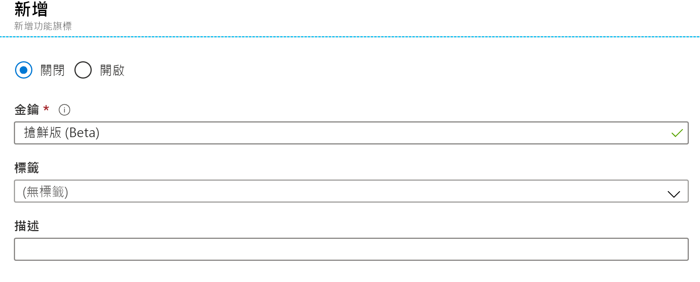

# <a name="quickstart-add-feature-flags-to-a-net-framework-app"></a>快速入門：將功能旗標新增至 .NET Framework 應用程式

在本快速入門中，您會將 Azure 應用程式組態納入 .NET Framework 應用程式中，以建立功能管理的端對端實作。 您可以使用應用程式組態服務來集中儲存所有功能旗標及控制其狀態。 

.NET 功能功能管理程式庫可透過全方位的功能旗標支援來擴充架構。 這些程式庫會建置在 .NET 組態系統之上。 此外，也可透過 .NET 組態提供者與應用程式組態密切整合。

## <a name="prerequisites"></a>Prerequisites

- Azure 訂用帳戶 - [建立免費帳戶](https://azure.microsoft.com/free/)
- [Visual Studio 2019](https://visualstudio.microsoft.com/vs)
- [.NET Framework 4.8](https://dotnet.microsoft.com/download)

## <a name="create-an-app-configuration-store"></a>建立應用程式組態存放區

[!INCLUDE [azure-app-configuration-create](../../includes/azure-app-configuration-create.md)]

6. 選取 [功能管理員]   > [+新增]  ，以新增名為 `Beta` 的功能旗標。

    > [!div class="mx-imgBorder"]
    > 

    目前將 `label` 保留為未定義。

## <a name="create-a-net-console-app"></a>建立 .NET 主控台應用程式

1. 啟動 Visual Studio，然後選取 [檔案]   > [新增]   > [專案]  。

1. 在 [建立新專案]  中，依照 [主控台]  專案類型篩選，然後按一下 [主控台應用程式 (.NET Framework)]  。 按 [下一步]  。

1. 在 [設定您的新專案]  中，輸入專案名稱。 在 [架構]  下，選取 [.NET Framework 4.8]  或更高版本。 按一下頁面底部的 [新增]  。

## <a name="connect-to-an-app-configuration-store"></a>連線至應用程式組態存放區

1. 以滑鼠右鍵按一下專案，然後選取 [管理 NuGet 套件]  。 在 [瀏覽]  索引標籤上，搜尋下列 NuGet 套件並新增至您的專案。 如果您找不到它們，請選取 [包括發行前版本]  核取方塊。

    ```
    Microsoft.Extensions.DependencyInjection
    Microsoft.Extensions.Configuration.AzureAppConfiguration
    Microsoft.FeatureManagement
    ```

1. 開啟 *Program.cs*，並新增下列陳述式：

    ```csharp
    using Microsoft.Extensions.DependencyInjection;
    using Microsoft.Extensions.Configuration;
    using Microsoft.Extensions.Configuration.AzureAppConfiguration;
    using Microsoft.FeatureManagement;
    ```

1. 指定 `UseFeatureFlags` 選項以擷取功能旗標，進而更新連線至應用程式組態的 `Main` 方法。 如果已啟用 `Beta` 功能旗標，則會顯示訊息。

    ```csharp
        public static async Task Main(string[] args)
        {         
            IConfigurationRoot configuration = new ConfigurationBuilder()
                .AddAzureAppConfiguration(options =>
                {
                    options.Connect(Environment.GetEnvironmentVariable("ConnectionString"))
                           .UseFeatureFlags();
                }).Build();

            IServiceCollection services = new ServiceCollection();

            services.AddSingleton<IConfiguration>(configuration).AddFeatureManagement();

            using (ServiceProvider serviceProvider = services.BuildServiceProvider())
            {
                IFeatureManager featureManager = serviceProvider.GetRequiredService<IFeatureManager>();

                if (await featureManager.IsEnabledAsync("Beta"))
                {
                    Console.WriteLine("Welcome to the beta!");
                }
            }

            Console.WriteLine("Hello World!");
        }
    ```

## <a name="build-and-run-the-app-locally"></a>於本機建置並執行應用程式

1. 將名為 **ConnectionString** 的環境變數設定為應用程式組態存放區的連接字串。 如果您使用 Windows 命令提示字元，請執行下列命令：

        setx ConnectionString "connection-string-of-your-app-configuration-store"

    如果您使用 Windows PowerShell，請執行下列命令：

        $Env:ConnectionString = "connection-string-of-your-app-configuration-store"

1. 重新啟動 Visual Studio，以讓變更生效。 

1. 按 Ctrl + F5 以建置並執行主控台應用程式。

    

## <a name="clean-up-resources"></a>清除資源

[!INCLUDE [azure-app-configuration-cleanup](../../includes/azure-app-configuration-cleanup.md)]

## <a name="next-steps"></a>後續步驟

在本快速入門中，您已在應用程式組態中建立功能旗標，並將其與 .NET Framework 主控台應用程式搭配使用。 若要了解如何在不重新啟動應用程式的情況下動態更新功能旗標和其他組態值，請繼續進行下一個教學課程。

> [!div class="nextstepaction"]
> [啟用動態組態](./enable-dynamic-configuration-dotnet.md)
