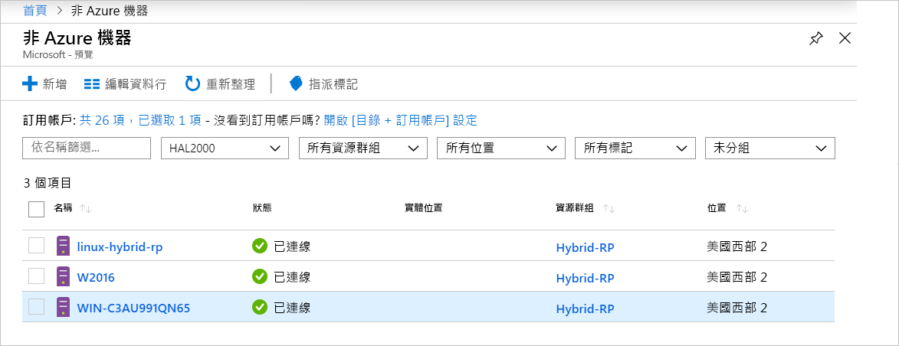

# <a name="what-is-azure-arc-for-servers"></a>什麼是適用於伺服器的 Azure Arc

適用於伺服器的 Azure Arc 可讓您管理 Azure 外部的機器。
非 Azure 機器連線到 Azure 時會變成**已連線的機器**，並且視為 Azure 中的資源。 每個**已連線的機器**都有資源識別碼，可在訂用帳戶內作為資源群組的一部分來管理，並可從標準的 Azure 結構中 (例如 Azure 原則和標籤) 獲益。

每部機器上都必須安裝代理程式套件，才能將其連線到 Azure。 本文件的其餘部分將更詳細地說明此程序。

根據代理程式近期的簽入時間，機器會有**已連線**或**已中斷連線**的狀態。 每個簽入動作皆稱為「活動訊號」。 如果機器在過去 5 分鐘內未進行簽入，其會顯示為離線，直到連線恢復為止。  <!-- For more information on troubleshooting agent connectivity, see [Troubleshooting Azure Arc for servers](troubleshoot/arc-for-servers.md). -->



## <a name="clients"></a>用戶端

### <a name="supported-operating-systems"></a>支援的作業系統

在公開預覽版本中，我們支援：

- Windows Server 2012 R2 和更新版本
- Ubuntu 16.04 和 18.04

公開預覽版本專為評估目的而設計，不應用來管理重要的生產資源。

## <a name="azure-subscription-and-service-limits"></a>Azure 訂用帳戶與服務限制

請確定您已閱讀 Azure Resource Manager 限制，並根據針對[訂用帳戶](../../azure-subscription-service-limits.md#subscription-limits---azure-resource-manager)和[資源群組](../../azure-subscription-service-limits.md#resource-group-limits)所列出的指導方針，規劃要連線的機器數目。 特別是，根據預設，每個資源群組各有 800 部伺服器的限制。

## <a name="networking-configuration"></a>網路設定

在安裝期間和執行階段，代理程式需要連線到 **Azure Arc 服務端點**。 如果使用防火牆封鎖輸出連線，請確定其預設值不會封鎖下列 URL。 所有連線都會從代理程式輸出至 Azure，並使用 **SSL** 加以保護。 所有流量都可以透過 **HTTPS** Proxy 來路由傳送。 如果您允許 IP 範圍或網域名稱，讓伺服器可以與之連線，那麼您必須允許連接埠 443 存取下列服務標籤和 DNS 名稱。

服務標籤：

* AzureActiveDirectory
* AzureTrafficManager

如需每個服務標籤/區域的 IP 位址清單，請參閱 JSON 檔案 - [Azure IP 範圍和服務標籤 – 公用雲端](https://www.microsoft.com/download/details.aspx?id=56519)。 Microsoft 會發佈每週更新，其中包含每個 Azure 服務和其使用的 IP 範圍。 如需詳細資訊，請參閱[服務標籤](https://docs.microsoft.com/azure/virtual-network/security-overview#service-tags)。

除了服務標籤 IP 範圍資訊之外，還會提供以下 DNS 名稱，因為大部分的服務目前都沒有服務標籤註冊，因此 IP 可能會變更。 如果您的防火牆設定需要 IP 範圍，則應該使用 **AzureCloud** 服務標籤來允許存取所有 Azure 服務。 請勿停用安全性監視或檢查這些 URL，但允許它們，如同其他網際網路流量。

| 網域環境 | 必要 Azure 服務端點 |
|---------|---------|
|management.azure.com|Azure Resource Manager|
|login.windows.net|Azure Active Directory|
|dc.services.visualstudio.com|Application Insights|
|agentserviceapi.azure-automation.net|來賓組態|
|*-agentservice-prod-1.azure-automation.net|來賓組態|
|*.his.hybridcompute.azure-automation.net|混合式識別服務|

### <a name="installation-network-requirements"></a>安裝的網路需求

從我們的官方散發伺服器下載 [Azure 連線的機器代理程式套件](https://aka.ms/AzureConnectedMachineAgent)，以便透過您的環境存取下列網站。 您可以選擇將套件下載到檔案共用，並從該處安裝代理程式。 在此案例中，您可能需要修改從 Azure 入口網站產生的上線指令碼。

Windows:

* `aka.ms`
* `download.microsoft.com`

Linux：

* `aka.ms`
* `packages.microsoft.com`

如需如何設定代理程式以使用 Proxy 的詳細資訊，請參閱 [Proxy 伺服器設定](quickstart-onboard-powershell.md#proxy-server-configuration)一節。

## <a name="register-the-required-resource-providers"></a>註冊所需的資源提供者

若要使用適用於伺服器的 Azure Arc，您必須註冊所需的資源提供者。

* **Microsoft.HybridCompute**
* **Microsoft.GuestConfiguration**

您可以透過下列命令來註冊資源提供者：

Azure PowerShell：

```azurepowershell-interactive
Login-AzAccount
Set-AzContext -SubscriptionId [subscription you want to onboard]
Register-AzResourceProvider -ProviderNamespace Microsoft.HybridCompute
Register-AzResourceProvider -ProviderNamespace Microsoft.GuestConfiguration
```

Azure CLI：

```azurecli-interactive
az account set --subscription "{Your Subscription Name}"
az provider register --namespace 'Microsoft.HybridCompute'
az provider register --namespace 'Microsoft.GuestConfiguration'
```

您也可以遵循 [Azure 入口網站](../../azure-resource-manager/resource-manager-supported-services.md#azure-portal)底下的步驟，使用入口網站來註冊資源提供者。

## <a name="machine-changes-after-installing-the-agent"></a>安裝代理程式之後的機器變更

如果您的環境中已部署變更追蹤解決方案，則可以使用下列清單來追蹤、識別和允許 **Azure 連線的機器代理程式 (AzCMAgent)** 安裝套件所做的變更。

在安裝代理程式後，您會看到伺服器有了以下變更。

### <a name="windows"></a>Windows

已安裝的服務：

* `Himds` - **Azure 連線的機器代理程式**服務。
* `Dscservice` 或 `gcd` - **來賓設定**服務。

已新增至伺服器的檔案：

* `%ProgramFiles%\AzureConnectedMachineAgent\*.*` - **Azure 連線的機器代理程式**檔案的位置。
* `%ProgramData%\GuestConfig\*.*` - **來賓設定**記錄。

登錄機碼位置：

* `HKEY_LOCAL_MACHINE\SOFTWARE\Microsoft\Azure Connected Machine Agent` - **Azure 連線的機器代理程式**的登錄機碼。

### <a name="linux"></a>Linux

已安裝的服務：

* `Himdsd` - **Azure 連線的機器代理程式**服務。
* `dscd` 或 `gcd` - **來賓設定**服務。

已新增至伺服器的檔案：

* `/var/opt/azcmagent/**` - **Azure 連線的機器代理程式**檔案的位置。
* `/var/lib/GuestConfig/**` - **來賓設定**記錄。

## <a name="supported-scenarios"></a>支援的案例

註冊節點之後，您就可以開始使用其他 Azure 服務來管理您的節點。

在公開預覽版本中，**已連線的機器**功能支援下列案例。

## <a name="guest-configuration"></a>來賓組態

將機器連線到 Azure 之後，您可以將 Azure 原則指派給**已連線的機器**，指派方式與 Azure 虛擬機器的原則指派相同。

如需詳細資訊，請參閱[了解 Azure 原則的來賓設定](../../governance/policy/concepts/guest-configuration.md)。

**已連線機器**的來賓設定代理程式記錄位於下列位置：

* Windows - `%ProgramFiles%\AzureConnectedMachineAgent\logs\dsc.log`
* Linux：- `/opt/logs/dsc.log`

## <a name="log-analytics"></a>Log Analytics

由 [Microsoft Monitoring Agent (MMA)](https://docs.microsoft.com/azure/azure-monitor/log-query/log-query-overview) 收集並儲存在 Log Analytics 工作區的記錄資料現在會包含機器專屬的屬性，例如 **ResourceId**，其可用於存取以資源為中心的記錄。

- 已安裝 MMA 代理程式的機器將透過更新的管理組件啟用 **Azure Arc** 功能。
- 整合適用於伺服器的 Azure Arc 需要 [MMA 代理程式版本 10.20.18011 或更新版本](https://docs.microsoft.com/azure/virtual-machines/extensions/oms-windows#agent-and-vm-extension-version)。
- 查詢 [Azure 監視器](https://docs.microsoft.com/azure/azure-monitor/log-query/log-query-overview)中的記錄資料時，傳回的資料結構描述會包含 `/subscriptions/<SubscriptionId/resourceGroups/<ResourceGroup>/providers/Microsoft.HybridCompute/machines/<MachineName>` 形式的混合式 **ResourceId**。

如需詳細資訊，請參閱[開始使用 Azure 監視器中的 Log Analytics](https://docs.microsoft.com/azure/azure-monitor/log-query/get-started-portal)。

<!-- MMA agent version 10.20.18011 and later -->

## <a name="next-steps"></a>後續步驟

使用適用於伺服器的 Azure Arc 來連線到機器有兩種方法。

* **互動式** - 遵循[入口網站快速入門](quickstart-onboard-portal.md)，從入口網站產生指令碼並在機器上執行。 如果您一次與一部機器連線，這是最佳選項。
* **大規模** - 遵循 [PowerShell 快速入門](quickstart-onboard-powershell.md)來建立服務主體，以非互動方式與機器連線。
