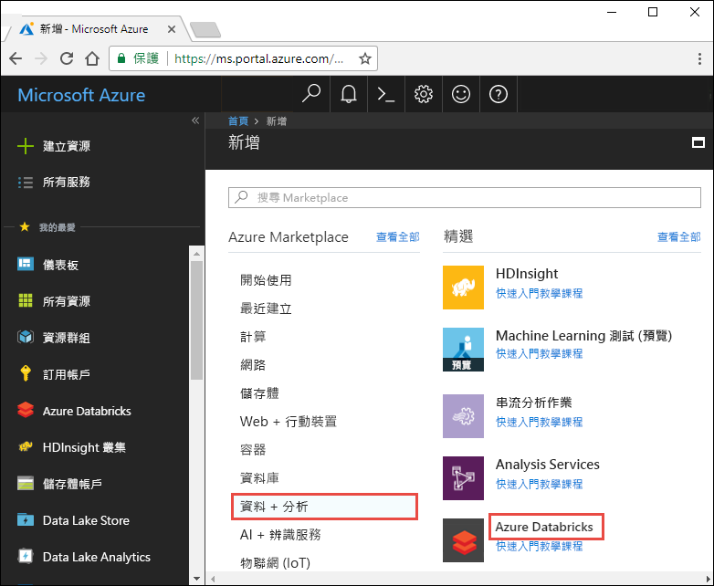
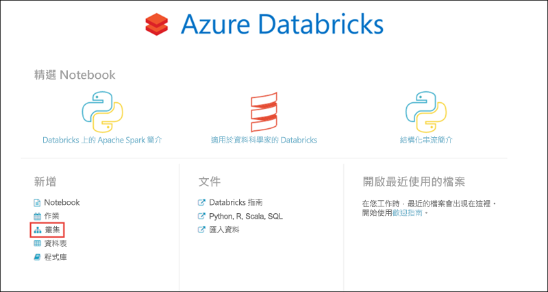
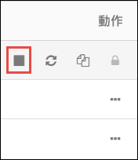

# <a name="tutorial-sentiment-analysis-on-streaming-data-using-azure-databricks"></a>教學課程：使用 Azure Databricks 對串流資料進行情感分析

在本教學課程中，您會了解如何使用 Azure Databricks 近乎即時地對資料的串流執行情感分析。 您會使用 Azure 事件中樞設定資料擷取系統。 您會使用 Spark 事件中樞連接器將訊息從事件中樞取用到 Azure Databricks。 最後，您會使用認知服務 API 來對串流資料執行情感分析。

本教學課程結束時，您將已從 Twitter 獲得含有 "Azure" 一詞的串流推文，並會對這些推文執行情感分析。

下圖顯示此應用程式流程：


本教學課程涵蓋下列工作：

> [!div class="checklist"]
> * 建立 Azure Databricks 工作區
> * 在 Azure Databricks 中建立 Spark 叢集
> * 建立 Twitter 應用程式來存取串流資料
> * 在 Azure Databricks 中建立 Notebook
> * 連結事件中樞與 Twitter API 的程式庫
> * 建立認知服務帳戶並取出存取金鑰
> * 將推文傳送至事件中樞
> * 從事件中樞讀取推文
> * 對推文執行情感分析

如果您沒有 Azure 訂用帳戶，請在開始之前先[建立免費帳戶](https://azure.microsoft.com/free/?WT.mc_id=sparkeventhubs-docs-alehall)。

> [!Note]
> 本教學課程不適用 **Azure 免費試用版的訂用帳戶**。
> 如果您有免費帳戶，請移至您的設定檔，並將訂用帳戶變更為**隨用隨付**。 如需詳細資訊，請參閱 [Azure 免費帳戶](https://azure.microsoft.com/free/)。 然後，為您所在區域的 vCPU [移除消費限制](https://docs.microsoft.com/azure/billing/billing-spending-limit#remove-the-spending-limit-in-azure-portal)並[要求增加配額](https://docs.microsoft.com/azure/azure-supportability/resource-manager-core-quotas-request)。 當您建立 Azure Databricks 工作區時，您可以選取 [試用版 (進階 - 14 天的免費 DBU)]  定價層，讓工作區可免費存取進階 Azure Databricks DBU 14 天。

## <a name="prerequisites"></a>Prerequisites

開始本教學課程之前，請確定您符合下列需求：
- Azure 事件中樞命名空間。
- 命名空間內的事件中樞。
- 用來存取事件中樞命名空間的連接字串。 連接字串的格式會類似 `Endpoint=sb://<namespace>.servicebus.windows.net/;SharedAccessKeyName=<key name>;SharedAccessKey=<key value>`。
- 事件中樞的共用存取原則名稱和原則金鑰。

您可以藉由完成[建立 Azure 事件中樞命名空間和事件中樞](../event-hubs/event-hubs-create.md)一文中的步驟，以符合這些需求。

## <a name="sign-in-to-the-azure-portal"></a>登入 Azure 入口網站

登入 [Azure 入口網站](https://portal.azure.com/?WT.mc_id=sparkeventhubs-docs-alehall)。

## <a name="create-an-azure-databricks-workspace"></a>建立 Azure Databricks 工作區

在本節中，您會使用 Azure 入口網站建立 Azure Databricks 工作區。

1. 在 Azure 入口網站中，選取 [建立資源]   > [資料 + 分析]   > [Azure Databricks]  。

    

3. 在 [Azure Databricks 服務]  底下，提供值以建立 Databricks 工作區。

    

    提供下列值：

    |屬性  |描述  |
    |---------|---------|
    |**工作區名稱**     | 提供您 Databricks 工作區的名稱        |
    |**訂用帳戶**     | 從下拉式清單中選取您的 Azure 訂用帳戶。        |
    |**資源群組**     | 指定您是要建立新的資源群組，還是使用現有資源群組。 資源群組是存放 Azure 方案相關資源的容器。 如需詳細資訊，請參閱 [Azure 資源群組概觀](../azure-resource-manager/management/overview.md)。 |
    |**位置**     | 選取 [美國東部 2]  。 如需其他可用的區域，請參閱[依區域提供的 Azure 服務](https://azure.microsoft.com/regions/services/?WT.mc_id=sparkeventhubs-docs-alehall)。        |
    |定價層      |  選擇 [標準]  或 [進階]  。 如需這些定價層的詳細資訊，請參閱 [Databricks 定價頁面](https://azure.microsoft.com/pricing/details/databricks/?WT.mc_id=sparkeventhubs-docs-alehall)。       |

    選取 [釘選到儀表板]  ，然後選取 [建立]  。

4. 建立帳戶需要幾分鐘的時間。 建立帳戶期間，入口網站右側會顯示 [提交 Azure Databricks 部署]  圖格。 您可能需要在儀表板上向右捲動以查看此圖格。 另外在畫面頂端附近還會顯示一個進度列。 您可以查看任何進度區域。

    

## <a name="create-a-spark-cluster-in-databricks"></a>在 Databricks 中建立 Spark 叢集

1. 在 Azure 入口網站中，移至您所建立的 Databricks 工作區，然後選取 [啟動工作區]  。

2. 系統會將您重新導向至 Azure Databricks 入口網站。 在入口網站中選取 [叢集]  。

    

3. 在 [新增叢集]  頁面上，提供值以建立叢集。

    

    接受下列值以外的所有其他預設值：

   * 輸入叢集的名稱。
   * 針對本文，請使用 6.0  執行階段建立叢集。
   * 請確定您已選取 [在活動\_\_分鐘後終止]  核取方塊。 請提供用來終止叢集的叢集未使用持續時間 (以分鐘為單位)。

   選取符合您技術準則和[預算](https://azure.microsoft.com/pricing/details/databricks/?WT.mc_id=sparkeventhubs-docs-alehall)的叢集背景工作角色和驅動程式節點大小。

     選取 [建立叢集]  。 叢集在執行後，您就可以將 Notebook 連結至叢集，並執行 Spark 作業。

## <a name="create-a-twitter-application"></a>建立 Twitter 應用程式

若要收到推文的串流，您必須在 Twitter 中建立應用程式。 請依照下列指示建立 Twitter 應用程式，並記錄要完成本教學課程所需的值。

1. 從網頁瀏覽器，移至 [Twitter For Developers](https://developer.twitter.com/en/apps)，然後選取 [Create an app (建立應用程式)]  。 您可能會看到一則訊息，指出您必須申請 Twitter 開發人員帳戶。 您可以隨意執行此動作，在您的應用程式獲得核准之後，您應該會看到一封確認電子郵件。 核准開發人員帳戶可能需要幾天的時間。

    

2. 在 [建立應用程式]  頁面上，提供新應用程式的詳細資料，然後選取 [建立 Twitter 應用程式]  。

    

    

3. 在應用程式頁面中，選取 [金鑰和權杖]  索引標籤，並複製 [取用者 API 金鑰]  和 [取用者 API 秘密金鑰]  的值。 此外，選取 [存取權杖和存取權杖密碼]  底下的 [建立]  來產生存取權杖。 複製 [存取權杖]  和 [存取權杖祕密]  的值。

    

儲存您所擷取的 Twitter 應用程式值。 在本教學課程後續的內容中，您會需要這些值。

## <a name="attach-libraries-to-spark-cluster"></a>將程式庫連結至 Spark 叢集

在本教學課程中，您會使用 Twitter API 將推文傳送至事件中樞。 您也會使用 [Apache Spark 事件中樞連接器](https://github.com/Azure/azure-event-hubs-spark?WT.mc_id=sparkeventhubs-docs-alehall)來讀取資料並將資料寫入至 Azure 事件中樞。 若要在叢集中使用這些 API，請將其作為程式庫新增至 Azure Databricks，讓這些 API 與您的 Spark 叢集產生關聯。 下列指示說明如何新增程式庫。

1. 在 Azure Databricks 工作區，選取 [叢集]  ，然後選擇現有的 Spark 叢集。 在叢集功能表內，選擇 [程式庫]  ，然後按一下 [安裝新的]  。

   

   

2. 在 [新增程式庫] 頁面中，針對 [來源]  選取 [Maven]  。 針對 [座標]  ，針對您要新增的套件按一下 [搜尋套件]  。 以下是本教學課程所使用之程式庫的 Maven 座標：

   * Spark 事件中樞連接器 - `com.microsoft.azure:azure-eventhubs-spark_2.11:2.3.10`
   * Twitter API - `org.twitter4j:twitter4j-core:4.0.7`

     

     

3. 選取 [安裝]  。

4. 在叢集功能表中，確定已正確安裝並連結兩個程式庫。

    

6. 對 Twitter 套件 `twitter4j-core:4.0.7` 重複執行這些步驟。

## <a name="get-a-cognitive-services-access-key"></a>取得認知服務存取金鑰

在本教學課程中，您會使用 [Azure 認知服務文字分析 API](../cognitive-services/text-analytics/overview.md) 近乎即時地對推文的串流執行情感分析。 在使用 API 之前，您必須先在 Azure 上建立 Azure 認知服務帳戶，並擷取存取金鑰以便使用文字分析 API。

1. 登入 [Azure 入口網站](https://portal.azure.com/?WT.mc_id=sparkeventhubs-docs-alehall)。

2. 選取 [+ 建立資源]  。

3. 在 Azure Marketplace 底下選取 [AI + 認知服務]   > [文字分析 API]  。

    

4. 在 [建立]  對話方塊中提供下列值：

    

   - 輸入認知服務帳戶的名稱。
   - 選取據以建立帳戶的 Azure 訂用帳戶。
   - 選取 Azure 位置。
   - 選取服務的定價層。 如需認知服務定價的詳細資訊，請參閱[定價頁面](https://azure.microsoft.com/pricing/details/cognitive-services/?WT.mc_id=sparkeventhubs-docs-alehall)。
   - 指定您是要建立新的資源群組，還是選取現有資源群組。

     選取 [建立]  。

5. 建立帳戶之後，從 [概觀]  索引標籤選取 [顯示存取金鑰]  。

    

    此外，複製端點 URL 的一部分，如螢幕擷取畫面所示。 教學課程中需要用到此 URL。

6. 在 [管理金鑰]  下，針對您要使用的金鑰選取 [複製] 圖示。

    

7. 儲存您在此步驟中所擷取之端點 URL 和存取金鑰的值。 稍後在本教學課程中需要用到。

## <a name="create-notebooks-in-databricks"></a>在 Databricks 中建立 Notebook

在本節中，您會在 Databricks 工作區中建立兩個具有下列名稱的 Notebook

- **SendTweetsToEventHub** - 生產者 Notebook，可供用來從 Twitter 取得推文，再將推文串流至事件中樞。
- **AnalyzeTweetsFromEventHub** - 取用者 Notebook，可供用來從事件中樞讀取推文並執行情感分析。

1. 在左側窗格中，選取 [工作區]  。 從 [工作區]  下拉式清單選取 [建立]  ，然後選取 [Notebook]  。

    

2. 在 [建立 Notebook]  對話方塊中輸入 **SendTweetsToEventHub**，選取 [Scala]  作為語言，然後選取您先前建立的 Spark 叢集。

    

    選取 [建立]  。

3. 重複上述步驟以建立 **AnalyzeTweetsFromEventHub** Notebook。

## <a name="send-tweets-to-event-hubs"></a>將推文傳送至事件中樞

在 **SendTweetsToEventHub** Notebook 中貼上下列程式碼，並將預留位置取代為您稍早所建立之事件中樞命名空間和 Twitter 應用程式的值。 此 Notebook 會將含有關鍵字 "Azure" 的推文即時串流到事件中樞。

> [!NOTE]
> Twitter API 有某些要求限制和[配額](https://developer.twitter.com/en/docs/basics/rate-limiting.html)。 如果您不滿意 Twitter API 中的標準速率限制，在此範例中，您不需使用 Twitter API 即可產生文字內容。 若要這麼做，請將變數 **dataSource** 設定為 `test` 而不是 `twitter`，並使用慣用的測試輸入填入清單 **testSource**。

```scala
    import scala.collection.JavaConverters._
    import com.microsoft.azure.eventhubs._
    import java.util.concurrent._
    import scala.collection.immutable._
    import scala.concurrent.Future
    import scala.concurrent.ExecutionContext.Implicits.global

    val namespaceName = "<EVENT HUBS NAMESPACE>"
    val eventHubName = "<EVENT HUB NAME>"
    val sasKeyName = "<POLICY NAME>"
    val sasKey = "<POLICY KEY>"
    val connStr = new ConnectionStringBuilder()
                .setNamespaceName(namespaceName)
                .setEventHubName(eventHubName)
                .setSasKeyName(sasKeyName)
                .setSasKey(sasKey)

    val pool = Executors.newScheduledThreadPool(1)
    val eventHubClient = EventHubClient.create(connStr.toString(), pool)

    def sleep(time: Long): Unit = Thread.sleep(time)

    def sendEvent(message: String, delay: Long) = {
      sleep(delay)
      val messageData = EventData.create(message.getBytes("UTF-8"))
      eventHubClient.get().send(messageData)
      System.out.println("Sent event: " + message + "\n")
    }

    // Add your own values to the list
    val testSource = List("Azure is the greatest!", "Azure isn't working :(", "Azure is okay.")

    // Specify 'test' if you prefer to not use Twitter API and loop through a list of values you define in `testSource`
    // Otherwise specify 'twitter'
    val dataSource = "test"

    if (dataSource == "twitter") {

      import twitter4j._
      import twitter4j.TwitterFactory
      import twitter4j.Twitter
      import twitter4j.conf.ConfigurationBuilder

      // Twitter configuration!
      // Replace values below with you

      val twitterConsumerKey = "<CONSUMER API KEY>"
      val twitterConsumerSecret = "<CONSUMER API SECRET>"
      val twitterOauthAccessToken = "<ACCESS TOKEN>"
      val twitterOauthTokenSecret = "<TOKEN SECRET>"

      val cb = new ConfigurationBuilder()
        cb.setDebugEnabled(true)
        .setOAuthConsumerKey(twitterConsumerKey)
        .setOAuthConsumerSecret(twitterConsumerSecret)
        .setOAuthAccessToken(twitterOauthAccessToken)
        .setOAuthAccessTokenSecret(twitterOauthTokenSecret)

      val twitterFactory = new TwitterFactory(cb.build())
      val twitter = twitterFactory.getInstance()

      // Getting tweets with keyword "Azure" and sending them to the Event Hub in realtime!
      val query = new Query(" #Azure ")
      query.setCount(100)
      query.lang("en")
      var finished = false
      while (!finished) {
        val result = twitter.search(query)
        val statuses = result.getTweets()
        var lowestStatusId = Long.MaxValue
        for (status <- statuses.asScala) {
          if(!status.isRetweet()){
            sendEvent(status.getText(), 5000)
          }
          lowestStatusId = Math.min(status.getId(), lowestStatusId)
        }
        query.setMaxId(lowestStatusId - 1)
      }

    } else if (dataSource == "test") {
      // Loop through the list of test input data
      while (true) {
        testSource.foreach {
          sendEvent(_,5000)
        }
      }

    } else {
      System.out.println("Unsupported Data Source. Set 'dataSource' to \"twitter\" or \"test\"")
    }

    // Closing connection to the Event Hub
    eventHubClient.get().close()
```

若要執行 Notebook，請按 **SHIFT + ENTER**。 您會看到如下面程式碼片段的輸出。 輸出中的每個事件都是擷取至事件中樞中含有 "Azure" 一詞的推文。

    Sent event: @Microsoft and @Esri launch Geospatial AI on Azure https://t.co/VmLUCiPm6q via @geoworldmedia #geoai #azure #gis #ArtificialIntelligence

    Sent event: Public preview of Java on App Service, built-in support for Tomcat and OpenJDK
    https://t.co/7vs7cKtvah
    #cloudcomputing #Azure

    Sent event: 4 Killer #Azure Features for #Data #Performance https://t.co/kpIb7hFO2j by @RedPixie

    Sent event: Migrate your databases to a fully managed service with Azure SQL Database Managed Instance | #Azure | #Cloud https://t.co/sJHXN4trDk

    Sent event: Top 10 Tricks to #Save Money with #Azure Virtual Machines https://t.co/F2wshBXdoz #Cloud

    ...
    ...

## <a name="read-tweets-from-event-hubs"></a>從事件中樞讀取推文

在 **AnalyzeTweetsFromEventHub** Notebook 中貼上下列程式碼，並將預留位置取代為您稍早所建立之 Azure 事件中樞的值。 此 Notebook 會讀取您稍早使用 **SendTweetsToEventHub** Notebook 串流至事件中樞的推文。

```scala

    import org.apache.spark.eventhubs._
    import com.microsoft.azure.eventhubs._

    // Build connection string with the above information
    val namespaceName = "<EVENT HUBS NAMESPACE>"
    val eventHubName = "<EVENT HUB NAME>"
    val sasKeyName = "<POLICY NAME>"
    val sasKey = "<POLICY KEY>"
    val connStr = new com.microsoft.azure.eventhubs.ConnectionStringBuilder()
                .setNamespaceName(namespaceName)
                .setEventHubName(eventHubName)
                .setSasKeyName(sasKeyName)
                .setSasKey(sasKey)

    val customEventhubParameters =
      EventHubsConf(connStr.toString())
      .setMaxEventsPerTrigger(5)

    val incomingStream = spark.readStream.format("eventhubs").options(customEventhubParameters.toMap).load()

    incomingStream.printSchema

    // Sending the incoming stream into the console.
    // Data comes in batches!
    incomingStream.writeStream.outputMode("append").format("console").option("truncate", false).start().awaitTermination()
```

您會獲得下列輸出︰


    root
     |-- body: binary (nullable = true)
     |-- offset: long (nullable = true)
     |-- seqNumber: long (nullable = true)
     |-- enqueuedTime: long (nullable = true)
     |-- publisher: string (nullable = true)
     |-- partitionKey: string (nullable = true)

    -------------------------------------------
    Batch: 0
    -------------------------------------------
    +------+------+--------------+---------------+---------+------------+
    |body  |offset|sequenceNumber|enqueuedTime   |publisher|partitionKey|
    +------+------+--------------+---------------+---------+------------+
    |[50 75 62 6C 69 63 20 70 72 65 76 69 65 77 20 6F 66 20 4A 61 76 61 20 6F 6E 20 41 70 70 20 53 65 72 76 69 63 65 2C 20 62 75 69 6C 74 2D 69 6E 20 73 75 70 70 6F 72 74 20 66 6F 72 20 54 6F 6D 63 61 74 20 61 6E 64 20 4F 70 65 6E 4A 44 4B 0A 68 74 74 70 73 3A 2F 2F 74 2E 63 6F 2F 37 76 73 37 63 4B 74 76 61 68 20 0A 23 63 6C 6F 75 64 63 6F 6D 70 75 74 69 6E 67 20 23 41 7A 75 72 65]                              |0     |0             |2018-03-09 05:49:08.86 |null     |null        |
    |[4D 69 67 72 61 74 65 20 79 6F 75 72 20 64 61 74 61 62 61 73 65 73 20 74 6F 20 61 20 66 75 6C 6C 79 20 6D 61 6E 61 67 65 64 20 73 65 72 76 69 63 65 20 77 69 74 68 20 41 7A 75 72 65 20 53 51 4C 20 44 61 74 61 62 61 73 65 20 4D 61 6E 61 67 65 64 20 49 6E 73 74 61 6E 63 65 20 7C 20 23 41 7A 75 72 65 20 7C 20 23 43 6C 6F 75 64 20 68 74 74 70 73 3A 2F 2F 74 2E 63 6F 2F 73 4A 48 58 4E 34 74 72 44 6B]            |168   |1             |2018-03-09 05:49:24.752|null     |null        |
    +------+------+--------------+---------------+---------+------------+

    -------------------------------------------
    Batch: 1
    -------------------------------------------
    ...
    ...

因為輸出採用二進位模式，請使用下列程式碼片段將它轉換成字串。

```scala
    import org.apache.spark.sql.types._
    import org.apache.spark.sql.functions._

    // Event Hub message format is JSON and contains "body" field
    // Body is binary, so we cast it to string to see the actual content of the message
    val messages =
      incomingStream
      .withColumn("Offset", $"offset".cast(LongType))
      .withColumn("Time (readable)", $"enqueuedTime".cast(TimestampType))
      .withColumn("Timestamp", $"enqueuedTime".cast(LongType))
      .withColumn("Body", $"body".cast(StringType))
      .select("Offset", "Time (readable)", "Timestamp", "Body")

    messages.printSchema

    messages.writeStream.outputMode("append").format("console").option("truncate", false).start().awaitTermination()
```

輸出現在會類似下列程式碼片段：

    root
     |-- Offset: long (nullable = true)
     |-- Time (readable): timestamp (nullable = true)
     |-- Timestamp: long (nullable = true)
     |-- Body: string (nullable = true)

    -------------------------------------------
    Batch: 0
    -------------------------------------------
    +------+-----------------+----------+-------+
    |Offset|Time (readable)  |Timestamp |Body
    +------+-----------------+----------+-------+
    |0     |2018-03-09 05:49:08.86 |1520574548|Public preview of Java on App Service, built-in support for Tomcat and OpenJDK
    https://t.co/7vs7cKtvah
    #cloudcomputing #Azure          |
    |168   |2018-03-09 05:49:24.752|1520574564|Migrate your databases to a fully managed service with Azure SQL Database Managed Instance | #Azure | #Cloud https://t.co/sJHXN4trDk    |
    |0     |2018-03-09 05:49:02.936|1520574542|@Microsoft and @Esri launch Geospatial AI on Azure https://t.co/VmLUCiPm6q via @geoworldmedia #geoai #azure #gis #ArtificialIntelligence|
    |176   |2018-03-09 05:49:20.801|1520574560|4 Killer #Azure Features for #Data #Performance https://t.co/kpIb7hFO2j by @RedPixie                                                    |
    +------+-----------------+----------+-------+
    -------------------------------------------
    Batch: 1
    -------------------------------------------
    ...
    ...

您現在已使用 Apache Spark 的事件中樞連接器，以近乎即時的方式將資料從 Azure 事件中樞串流至 Azure Databricks。 如需如何使用 Spark 事件中樞連接器的詳細資訊，請參閱[連接器文件](https://github.com/Azure/azure-event-hubs-spark/tree/master/docs?WT.mc_id=sparkeventhubs-docs-alehall)。

## <a name="run-sentiment-analysis-on-tweets"></a>對推文執行情感分析

在本節中，您會對使用 Twitter API 所收到的推文執行情感分析。 在本節中，您會將程式碼片段新增至相同的 **AnalyzeTweetsFromEventHub** Notebook。

一開始先在 Notebook 中新增程式碼單元，然後貼上下面所提供的程式碼片段。 此程式碼片段會定義資料類型以供使用語言和情感 API。

```scala
import java.io._
import java.net._
import java.util._

case class Language(documents: Array[LanguageDocuments], errors: Array[Any]) extends Serializable
case class LanguageDocuments(id: String, detectedLanguages: Array[DetectedLanguages]) extends Serializable
case class DetectedLanguages(name: String, iso6391Name: String, score: Double) extends Serializable

case class Sentiment(documents: Array[SentimentDocuments], errors: Array[Any]) extends Serializable
case class SentimentDocuments(id: String, score: Double) extends Serializable

case class RequestToTextApi(documents: Array[RequestToTextApiDocument]) extends Serializable
case class RequestToTextApiDocument(id: String, text: String, var language: String = "") extends Serializable
```

新增程式碼單元，然後貼上下面所提供的程式碼片段。 此程式碼片段會定義一個物件，其中所包含的函式會呼叫文字分析 API 來執行語言偵測和情感分析。 請務必要將預留位置 `<PROVIDE ACCESS KEY HERE>` 取代為您所擷取的認知服務帳戶值。

```scala
import javax.net.ssl.HttpsURLConnection
import com.google.gson.Gson
import com.google.gson.GsonBuilder
import com.google.gson.JsonObject
import com.google.gson.JsonParser
import scala.util.parsing.json._

object SentimentDetector extends Serializable {

    // Cognitive Services API connection settings
    val accessKey = "<PROVIDE ACCESS KEY HERE>"
    val host = "https://cognitive-docs.cognitiveservices.azure.com/"
    val languagesPath = "/text/analytics/v2.1/languages"
    val sentimentPath = "/text/analytics/v2.1/sentiment"
    val languagesUrl = new URL(host+languagesPath)
    val sentimenUrl = new URL(host+sentimentPath)
    val g = new Gson

    def getConnection(path: URL): HttpsURLConnection = {
        val connection = path.openConnection().asInstanceOf[HttpsURLConnection]
        connection.setRequestMethod("POST")
        connection.setRequestProperty("Content-Type", "text/json")
        connection.setRequestProperty("Ocp-Apim-Subscription-Key", accessKey)
        connection.setDoOutput(true)
        return connection
    }

    def prettify (json_text: String): String = {
        val parser = new JsonParser()
        val json = parser.parse(json_text).getAsJsonObject()
        val gson = new GsonBuilder().setPrettyPrinting().create()
        return gson.toJson(json)
    }

    // Handles the call to Cognitive Services API.
    def processUsingApi(request: RequestToTextApi, path: URL): String = {
        val requestToJson = g.toJson(request)
        val encoded_text = requestToJson.getBytes("UTF-8")
        val connection = getConnection(path)
        val wr = new DataOutputStream(connection.getOutputStream())
        wr.write(encoded_text, 0, encoded_text.length)
        wr.flush()
        wr.close()

        val response = new StringBuilder()
        val in = new BufferedReader(new InputStreamReader(connection.getInputStream()))
        var line = in.readLine()
        while (line != null) {
            response.append(line)
            line = in.readLine()
        }
        in.close()
        return response.toString()
    }

    // Calls the language API for specified documents.
    def getLanguage (inputDocs: RequestToTextApi): Option[Language] = {
        try {
            val response = processUsingApi(inputDocs, languagesUrl)
            // In case we need to log the json response somewhere
            val niceResponse = prettify(response)
            // Deserializing the JSON response from the API into Scala types
            val language = g.fromJson(niceResponse, classOf[Language])
            if (language.documents(0).detectedLanguages(0).iso6391Name == "(Unknown)")
                return None
            return Some(language)
        } catch {
            case e: Exception => return None
        }
    }

    // Calls the sentiment API for specified documents. Needs a language field to be set for each of them.
    def getSentiment (inputDocs: RequestToTextApi): Option[Sentiment] = {
        try {
            val response = processUsingApi(inputDocs, sentimenUrl)
            val niceResponse = prettify(response)
            // Deserializing the JSON response from the API into Scala types
            val sentiment = g.fromJson(niceResponse, classOf[Sentiment])
            return Some(sentiment)
        } catch {
            case e: Exception => return None
        }
    }
}
```

新增另一個資料格以定義用來判斷情感的 Spark UDF (使用者定義的函數)。

```scala
// User Defined Function for processing content of messages to return their sentiment.
val toSentiment =
    udf((textContent: String) =>
        {
            val inputObject = new RequestToTextApi(Array(new RequestToTextApiDocument(textContent, textContent)))
            val detectedLanguage = SentimentDetector.getLanguage(inputObject)
            detectedLanguage match {
                case Some(language) =>
                    if(language.documents.size > 0) {
                        inputObject.documents(0).language = language.documents(0).detectedLanguages(0).iso6391Name
                        val sentimentDetected = SentimentDetector.getSentiment(inputObject)
                        sentimentDetected match {
                            case Some(sentiment) => {
                                if(sentiment.documents.size > 0) {
                                    sentiment.documents(0).score.toString()
                                }
                                else {
                                    "Error happened when getting sentiment: " + sentiment.errors(0).toString
                                }
                            }
                            case None => "Couldn't detect sentiment"
                        }
                    }
                    else {
                        "Error happened when getting language" + language.errors(0).toString
                    }
                case None => "Couldn't detect language"
            }
        }
    )
```

新增最後的程式碼單元，以使用推文的內容以及與推文相關聯的情感來準備資料框架。

```scala
// Prepare a dataframe with Content and Sentiment columns
val streamingDataFrame = incomingStream.selectExpr("cast (body as string) AS Content").withColumn("Sentiment", toSentiment($"Content"))

// Display the streaming data with the sentiment
streamingDataFrame.writeStream.outputMode("append").format("console").option("truncate", false).start().awaitTermination()
```

您應該會看到如下列程式碼片段的輸出：

    -------------------------------------------
    Batch: 0
    -------------------------------------------
    +--------------------------------+------------------+
    |Content                         |Sentiment         |
    +--------------------------------+------------------+
    |Public preview of Java on App Service, built-in support for Tomcat and OpenJDK
    https://t.co/7vs7cKtvah   #cloudcomputing #Azure          |0.7761918306350708|
    |Migrate your databases to a fully managed service with Azure SQL Database Managed Instance | #Azure | #Cloud https://t.co/sJHXN4trDk    |0.8558163642883301|
    |@Microsoft and @Esri launch Geospatial AI on Azure https://t.co/VmLUCiPm6q via @geoworldmedia #geoai #azure #gis #ArtificialIntelligence|0.5               |
    |4 Killer #Azure Features for #Data #Performance https://t.co/kpIb7hFO2j by @RedPixie                                                    |0.5               |
    +--------------------------------+------------------+

在 [情感]  資料行中，接近 **1** 的值表示絕佳的 Azure 體驗。 接近 **0** 的值表示使用者在使用 Microsoft Azure 時所遇到的問題。

就這麼簡單！ 您已使用 Azure Databricks 成功地以近乎即時的速度將資料串流到 Azure 事件中樞、使用事件中樞連接器取用串流資料，然後對串流資料執行情感分析。

## <a name="clean-up-resources"></a>清除資源

在本教學課程執行完後，您可以終止叢集。 若要這樣做，請從 Azure Databricks 工作區的左窗格中選取 [叢集]  。 對於您想要終止的叢集，將游標移到 [動作]  資料行底下的省略符號上，然後選取 [終止]  圖示。



如果您不手動終止叢集，叢集將會自動停止，但前提是您已在建立叢集時選取 [在停止活動 \_\_ 分鐘後終止]  核取方塊。 在這種情況下，叢集將會在停止活動達指定時間後自動停止。

## <a name="next-steps"></a>後續步驟
在本教學課程中，您已了解如何使用 Azure Databricks 將資料串流到 Azure 事件中樞，然後從事件中樞即時讀取串流資料。 您已了解如何︰
> [!div class="checklist"]
> * 建立 Azure Databricks 工作區
> * 在 Azure Databricks 中建立 Spark 叢集
> * 建立 Twitter 應用程式來存取串流資料
> * 在 Azure Databricks 中建立 Notebook
> * 新增並連結事件中樞與 Twitter API 的程式庫
> * 建立 Microsoft 認知服務帳戶並取出存取金鑰
> * 將推文傳送至事件中樞
> * 從事件中樞讀取推文
> * 對推文執行情感分析

請前進到下一個教學課程，以了解如何使用 Azure Databricks 執行機器學習工作。

> [!div class="nextstepaction"]
>[使用 Azure Databricks 的機器學習服務](/azure/databricks/applications/machine-learning/mllib/decision-trees)

