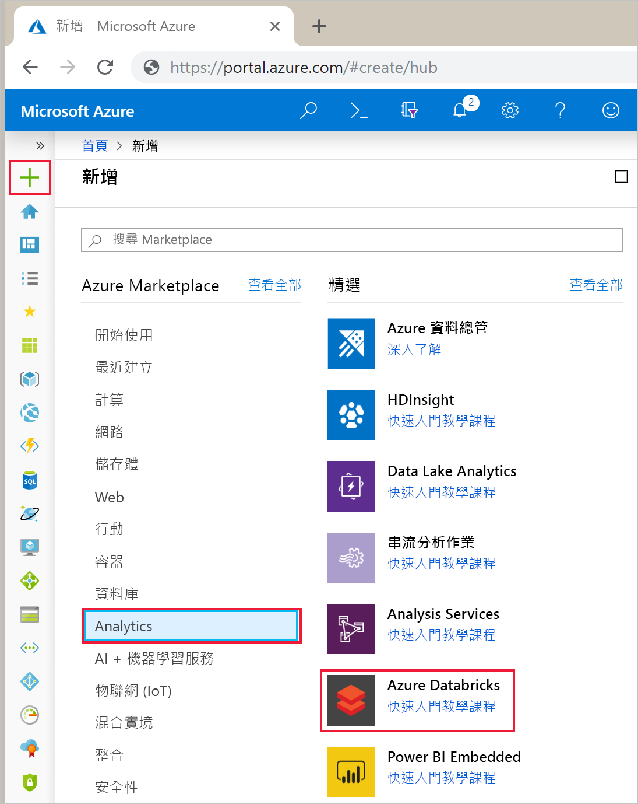
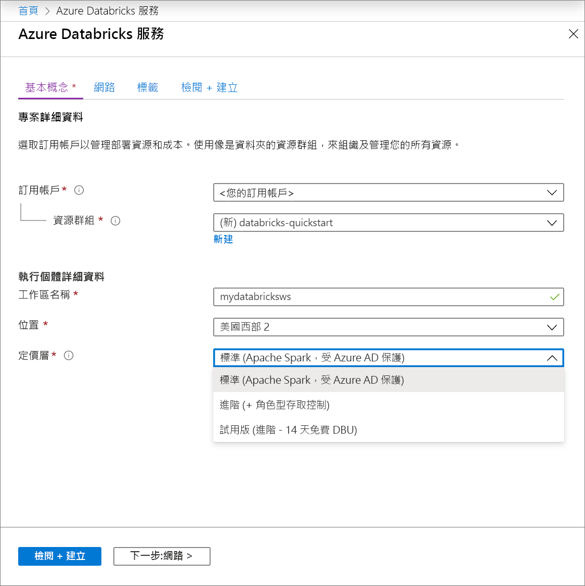
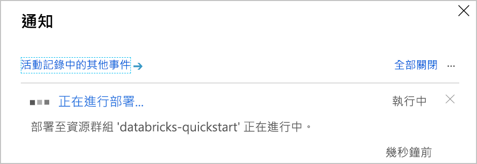
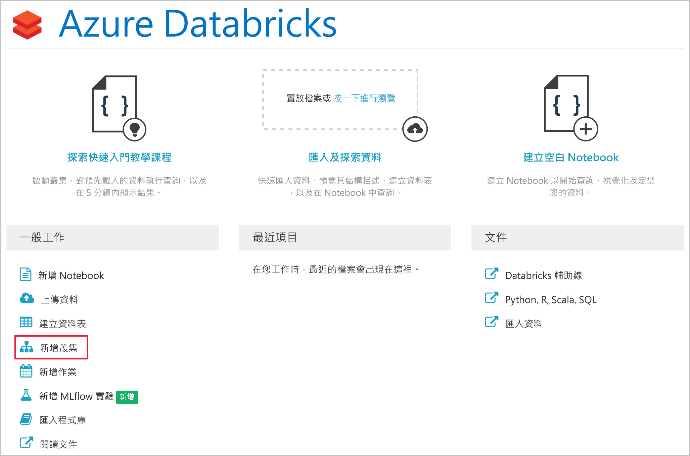
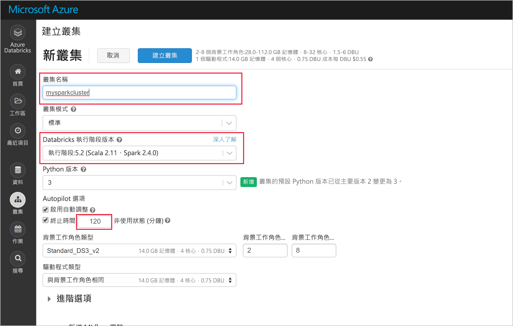
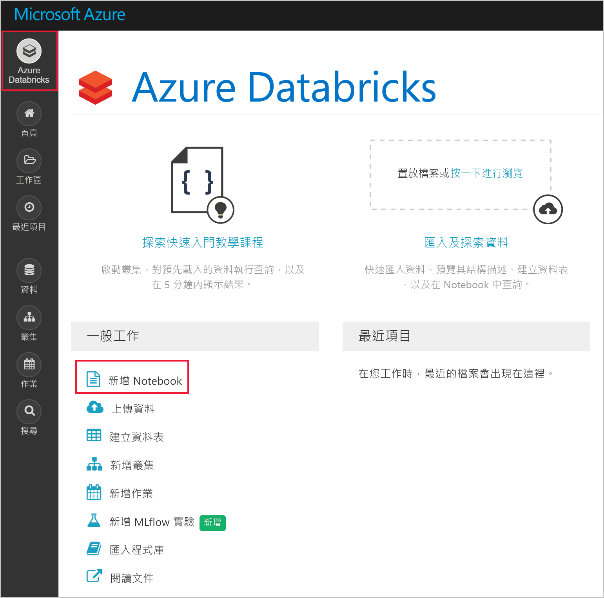

# <a name="quickstart-run-a-spark-job-on-azure-databricks-using-the-azure-portal"></a>快速入門：使用 Azure 入口網站在 Azure Databricks 上執行 Spark 作業

在本快速入門中，您會使用 Azure 入口網站建立具有 Apache Spark 叢集的 Azure Databricks 工作區。 您會在叢集上執行作業，並使用自訂圖形產生波士頓安全資料的即時報表。

## <a name="prerequisites"></a>必要條件

- Azure 訂用帳戶 - [建立免費帳戶](https://azure.microsoft.com/free/)

## <a name="sign-in-to-the-azure-portal"></a>登入 Azure 入口網站

登入 [Azure 入口網站](https://portal.azure.com)。 本教學課程不適用 Azure 免費試用訂用帳戶。 若要使用免費帳戶建立 Azure Databricks 叢集，在建立叢集之前，請先移至您的設定檔，並將訂用帳戶變更為**隨用隨付**。 如需詳細資訊，請參閱 [Azure 免費帳戶](https://azure.microsoft.com/free/)。

## <a name="create-an-azure-databricks-workspace"></a>建立 Azure Databricks 工作區

在本節中，您會使用 Azure 入口網站建立 Azure Databricks 工作區。

1. 在 Azure 入口網站中，選取 [建立資源]   > [分析]   > [Azure Databricks]  。

    

2. 在 [Azure Databricks 服務]  底下，提供值以建立 Databricks 工作區。

    

    提供下列值：
    
    |屬性  |說明  |
    |---------|---------|
    |**工作區名稱**     | 提供您 Databricks 工作區的名稱        |
    |**訂用帳戶**     | 從下拉式清單中選取您的 Azure 訂用帳戶。        |
    |**資源群組**     | 指定您是要建立新的資源群組，還是使用現有資源群組。 資源群組是存放 Azure 方案相關資源的容器。 如需詳細資訊，請參閱 [Azure 資源群組概觀](../azure-resource-manager/resource-group-overview.md)。 |
    |**位置**     | 選取 [美國西部 2]  。 如需其他可用的區域，請參閱[依區域提供的 Azure 服務](https://azure.microsoft.com/regions/services/)。        |
    |定價層      |  選擇 [標準]  、[進階]  或 [試用]  。 如需這些定價層的詳細資訊，請參閱 [Databricks 定價頁面](https://azure.microsoft.com/pricing/details/databricks/)。       |

    選取 [釘選到儀表板]  ，然後按一下 [建立]  。

4. 工作區建立需要幾分鐘的時間。 在工作區建立期間，您可以在 [通知]  中檢視部署狀態。

    

## <a name="create-a-spark-cluster-in-databricks"></a>在 Databricks 中建立 Spark 叢集

> [!NOTE]
> 若要使用免費帳戶建立 Azure Databricks 叢集，在建立叢集之前，請先移至您的設定檔，並將訂用帳戶變更為**隨用隨付**。 如需詳細資訊，請參閱 [Azure 免費帳戶](https://azure.microsoft.com/free/)。

1. 在 Azure 入口網站中，移至您所建立的 Databricks 工作區，然後按一下 [啟動工作區]  。

2. 系統會將您重新導向至 Azure Databricks 入口網站。 在入口網站中按一下 [新增叢集]  。

    

3. 在 [新增叢集]  頁面上，提供值以建立叢集。

    

    接受下列值以外的所有其他預設值：

   * 輸入叢集的名稱。
   * 針對本文，使用 **5.2** 執行階段建立叢集。
   * 請確定您已選取 [在活動\_\_分鐘後終止]  核取方塊。 請提供用來終止叢集的叢集未使用持續時間 (以分鐘為單位)。
    
     選取 [建立叢集]  。 叢集在執行後，您就可以將 Notebook 連結至叢集，並執行 Spark 作業。

如需如何建立叢集的詳細資訊，請參閱[在 Azure Databricks 建立 Spark 叢集](https://docs.azuredatabricks.net/user-guide/clusters/create.html)。

## <a name="run-a-spark-sql-job"></a>執行 Spark SQL 作業

執行下列工作，在 Databricks 中建立筆記本、將筆記本設定為從 Azure 開放資料集讀取資料，然後對資料執行 Spark SQL 作業。

1. 在左窗格中選取 [Azure Databricks]  。 從 [一般工作]  選取 [新增筆記本]  。

    

2. 在 [建立筆記本]  對話方塊中輸入名稱，選取 [Python]  作為語言，然後選取您先前建立的 Spark 叢集。

    

    選取 [建立]  。

3. 在此步驟中，從 [Azure 開啟資料集](https://azure.microsoft.com/services/open-datasets/catalog/boston-safety-data/#AzureDatabricks)使用波士頓安全資料建立 Spark 資料框架，並使用 SQL 查詢資料。

   下列命令會設定 Azure 儲存體存取資訊。 將此 PySpark 程式碼貼入第一個資料格，然後使用 **Shift+Enter** 執行該程式碼。

   ```python
   blob_account_name = "azureopendatastorage"
   blob_container_name = "citydatacontainer"
   blob_relative_path = "Safety/Release/city=Boston"
   blob_sas_token = r"?st=2019-02-26T02%3A34%3A32Z&se=2119-02-27T02%3A34%3A00Z&sp=rl&sv=2018-03-28&sr=c&sig=XlJVWA7fMXCSxCKqJm8psMOh0W4h7cSYO28coRqF2fs%3D"
   ```

   下列命令可讓 Spark 從遠端讀取 Blob 儲存體。 將此 PySpark 程式碼貼入下一個資料格，然後使用 **Shift+Enter** 執行該程式碼。

   ```python
   wasbs_path = 'wasbs://%s@%s.blob.core.windows.net/%s' % (blob_container_name, blob_account_name, blob_relative_path)
   spark.conf.set('fs.azure.sas.%s.%s.blob.core.windows.net' % (blob_container_name, blob_account_name), blob_sas_token)
   print('Remote blob path: ' + wasbs_path)
   ```

   下列命令會建立一個資料框架。 將此 PySpark 程式碼貼入下一個資料格，然後使用 **Shift+Enter** 執行該程式碼。

   ```python
   df = spark.read.parquet(wasbs_path)
   print('Register the DataFrame as a SQL temporary view: source')
   df.createOrReplaceTempView('source')
   ```

4. 執行 SQL 陳述式，以便從稱為 **source** 的暫存檢視傳回前 10 個資料列的資料。 將此 PySpark 程式碼貼入下一個資料格，然後使用 **Shift+Enter** 執行該程式碼。

   ```python
   print('Displaying top 10 rows: ')
   display(spark.sql('SELECT * FROM source LIMIT 10'))
   ```

5. 您會看到如下列螢幕擷取畫面所示的表格式輸出 (僅顯示某些資料行)：

    

6. 現在，您會建立此資料的視覺表示法來顯示有多少安全事件會使用 Citizens Connect App 和 City Worker App，而不是其他來源來報告。 從表格式輸出底部，選取 [長條圖]  圖示，然後按一下 [繪圖選項]  。

    

8. 在 [自訂繪圖]  中，如螢幕擷取畫面所示的方式拖放值。

    

   * 將 [索引鍵]  設定為 **source**。
   * 將 [值]  設定為 **<\id>** 。
   * 將 [彙總]  設定為 [計數]  。
   * 將 [顯示類型]  設定為 [圓形圖]  。

     按一下 [套用]  。

## <a name="clean-up-resources"></a>清除資源

在完成本文後，您可以終止叢集。 若要這樣做，請從 Azure Databricks 工作區的左窗格中選取 [叢集]  。 對於您想要終止的叢集，將游標移到 [動作]  資料行底下的省略符號上，然後選取 [終止]  圖示。


如果您不手動終止叢集，叢集將會自動停止，但前提是您已在建立叢集時選取 [在停止活動 \_\_ 分鐘後終止]  核取方塊。 在這種情況下，叢集將會在停止運作達指定時間後自動停止。

## <a name="next-steps"></a>後續步驟

在本文中，您已經在 Azure Databricks 中建立一個 Spark 叢集，並從 Azure 開放資料集使用資料來執行 Spark 作業。 您也可以查看 [Spark 資料來源](https://docs.azuredatabricks.net/spark/latest/data-sources/index.html)，以了解如何從其他資料來源將資料匯入到 Azure Databricks。 前往下一篇文章，以了解如何使用 Azure Databricks 執行 ETL 作業 (擷取、轉換及載入資料)。

> [!div class="nextstepaction"]
>[使用 Azure Databrick 擷取、轉換和載入資料](databricks-extract-load-sql-data-warehouse.md)
