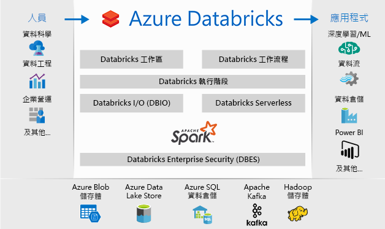

# 何謂 Azure Databricks？

Azure Databricks 是一個針對 Microsoft Azure 雲端服務平台進行最佳化的 Apache Spark 分析平台。 Databricks 由 Apache Spark 的創立者所設計，可與 Azure 整合，提供一鍵式設定、順暢的工作流程以及互動式的工作區，可讓資料科學家、資料工程師及企業分析師共同作業。

Azure Databricks 是快速、簡單且共同作業的 Apache Spark 架構分析服務。 對於巨量資料管線，資料 (原始或結構化) 會透過 Azure Data Factory 分批內嵌到 Azure 中，或使用 Kafka、事件中樞或 IoT 中樞以近乎即時的方式進行串流處理。 此資料會放置在 Data Lake 中長期持續儲存、在 Azure Blob 儲存體或 Azure Data Lake 儲存體中。 在您的分析工作流程中，使用 Azure Databricks 從多個資料來源 (例如 [Azure Blob 儲存體](../storage/blobs/storage-blobs-introduction.md)、[Azure Data Lake Storage](../data-lake-store/index.md)、[Azure Cosmos DB](../cosmos-db/index.yml) 或 [Azure SQL 資料倉儲](../sql-data-warehouse/index.yml)) 讀取資料，並使用 Spark 將它轉換成突破性見解。

## 以 Apache Spark 為基礎的分析平台

Azure Databricks 包含完整的開放原始碼 Apache Spark 叢集技術和功能。 Azure Databricks 中的 Spark 包括下列元件：

* **Spark SQL 和 Dataframe**：Spark SQL 是用於使用結構化資料的 Spark 模組。 DataFrame 則是組織成具名資料行的分散式資料集合。 其概念等同於關聯式資料庫中的資料表或 R/Python 中的資料框架。

* **串流**：分析應用程式和互動式應用程式的即時資料處理和分析。 與 HDFS、Flume 和 Kafka 整合。

* **MLlib**：一種機器學習程式庫，由常見的學習演算法和公用程式 (包括分類、迴歸、群集、協同篩選、維度縮減，以及基礎最佳化基本項目) 所組成。

* **GraphX**：圖表和圖表計算，適用於廣泛的使用案例範圍，從認知分析到資料探索。

* **Spark Core API**：包括 R、SQL、Python、Scala 和 Java 的支援。

## Azure Databricks 中的 Apache Spark

Azure Databricks 是以 Spark 的功能為基礎所建置，其方法是藉由提供包含下列各項的零管理雲端平台：

- 完全受控的 Spark 叢集
- 適用於探索和視覺效果的互動式工作區
- 為您最愛的 Spark 架構應用程式賦予能力的平台

### 雲端中完全受控的 Apache Spark 叢集

Azure Databricks 在雲端中擁有安全而可靠的生產環境，並由 Spark 專家管理和支援。 您可以：

* 在數秒鐘內建立叢集。
* 動態地自動擴大和縮減叢集規模 (包括無伺服器叢集)，並與所有小組分享這些叢集。 
* 透過 REST API，以程式設計方式使用叢集。 
* 使用以 Spark 為基礎所建置的安全資料整合功能，讓您不必集中資料就可予以整合。 
* 立即存取每個版本的最新 Apache Spark 功能。

### Databricks 執行階段
Databricks 執行階段是以 Apache Spark 為基礎所建置，並且原生就是針對 Azure 雲端所建置的。 

透過**無伺服器**選項，Azure Databricks 可完全去除基礎結構的複雜性，讓您不必擁有特殊的專業技術，就能安裝和設定資料基礎結構。 無伺服器選項可協助資料科學家猶如團隊一般地快速逐一查看。

至於重視生產作業效能的資料工程師，Azure Databricks 則提供 Spark 引擎，其可透過各種最佳化在 I/O 層和處理層 (Databricks I/O) 獲得較快的速度和較優異的效能。

### 共同作業的工作區

透過共同作業且整合的環境，Azure Databricks 可簡化資料探索、建立原型和在 Spark 中執行資料導向應用程式的程序。

* 決定如何利用簡單的資料探索來使用資料。
* 在 Notebook 中以 R、Python、Scala 或 SQL 記載進度。
* 點選幾下即可將資料視覺化，並使用熟悉的工具，例如 Matplotlib、ggplot 或 d3。
* 使用互動式儀表板來建立動態報告。
* 使用 Spark，並同時與資料互動。

## 企業安全性

Azure Databricks 可提供企業級的 Azure 安全性，包括 Azure Active Directory 整合、角色型控制，以及可保護您的資料和業務的 SLA。

* 與 Azure Active Directory 整合可讓您使用 Azure Databricks 執行完整的 Azure 型解決方案。
* Azure Databricks 的角色型存取可讓您針對 Notebook、叢集、作業和資料提供更細緻的使用者權限。
* 企業級 SLA。 

## Azure 服務整合

Azure Databricks 會與 Azure 資料庫和存放區深入整合：SQL 資料倉儲、Cosmos DB、Data Lake Store 和 Blob 儲存體。 

## Power BI 整合
透過 Power BI 的豐富整合，Azure Databricks 可讓您快速且輕鬆地探索和分享具有影響力的深入解析。 您也可以使用其他 BI 工具，例如透過 JDBC/ODBC 叢集端點使用 Tableau Software。

## 後續步驟

* [快速入門：在 Azure Databricks 執行 Spark 作業](quickstart-create-databricks-workspace-portal.md)
* [使用 Spark 叢集](/azure/databricks/clusters/index)
* [使用 Notebook](/azure/databricks/notebooks/index)
* [建立 Spark 作業](/azure/databricks/jobs)

 

