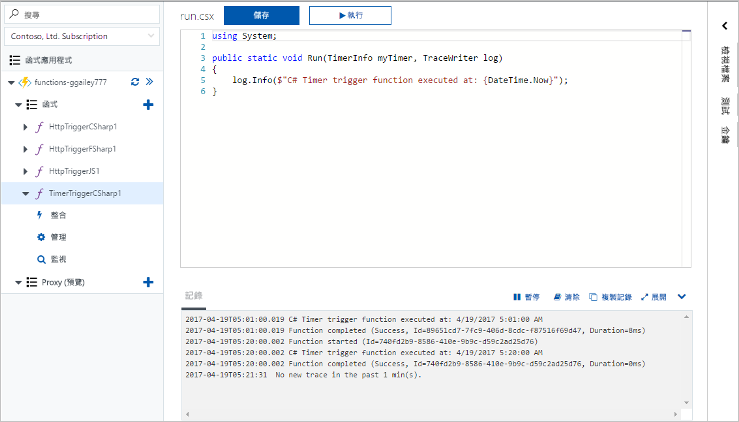
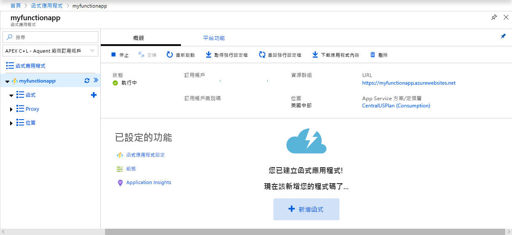
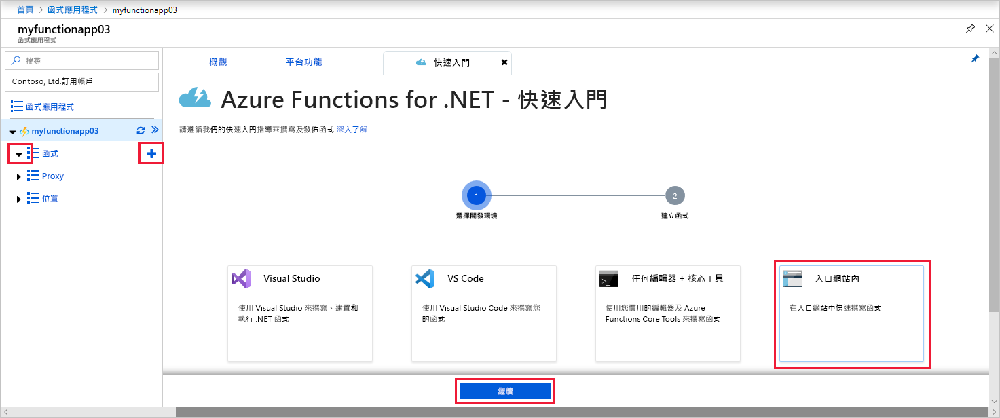
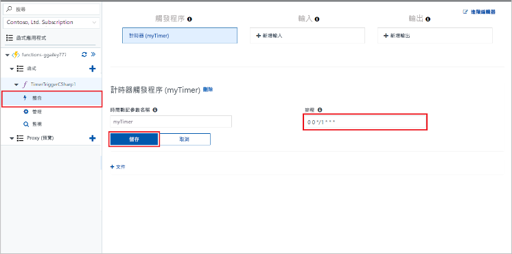

# 在 Azure 中建立由計時器觸發的函式

了解如何使用 Azure Functions 來建立[無伺服器](https://azure.microsoft.com/solutions/serverless/)函式，並使其按照您定義的排程來執行。

## 必要條件

若要完成本教學課程：

+ 如果您沒有 Azure 訂用帳戶，請在開始前建立[免費帳戶](https://azure.microsoft.com/free/?WT.mc_id=A261C142F)。

## 建立 Azure 函數應用程式

[!INCLUDE [Create function app Azure portal](../../includes/functions-create-function-app-portal.md)]

接下來，您要在新的函式應用程式中建立函式。

## 建立由計時器觸發的函式

1. 展開函式應用程式，然後按一下 [Functions]  旁的 [+]  按鈕。 如果這是函式應用程式中的第一個函式，請依序選取 [入口網站內]  和 [繼續]  。 否則，移至步驟 3。

   

2. 依序選擇 [更多範本]  和 [完成並檢視範本]  。

    

3. 在搜尋欄位中輸入 `timer`，並使用下圖下方的表格內指定的設定來設定新的觸發程序。

    

    | 設定 | 建議的值 | 說明 |
    |---|---|---|
    | **名稱** | 預設值 | 定義計時器觸發函式的名稱。 |
    | **排程** | 0 \*/1 \* \* \* \* | 含有六個欄位的 [CRON 運算式](functions-bindings-timer.md#ncrontab-expressions)，它會將函式排程為每分鐘執行一次。 |

4. 按一下頁面底部的 [新增]  。 系統隨即會以您所選的語言建立函式，並讓它每分鐘執行一次。

5. 檢視寫入到記錄的追蹤資訊以確認執行情形。

    

現在，您可以變更函式的排程，使其每小時執行一次，而非每分鐘執行一次。

## 更新計時器排程

1. 展開您的函式，然後按一下 [整合]  。 您可以在這裡定義函式的輸入和輸出繫結，以及設定排程。 

2. 輸入 `0 0 */1 * * *` 作為新的每小時 [排程]  值，然後按一下 [儲存]  。  

您現在已擁有每小時執行一次的函式。 

## 清除資源

[!INCLUDE [Next steps note](../../includes/functions-quickstart-cleanup.md)]

## 後續步驟

您已建立會根據排程來執行的函式。 如需有關計時器觸發程序的詳細資訊，請參閱[使用 Azure Functions 排程程式碼執行](functions-bindings-timer.md)。

[!INCLUDE [Next steps note](../../includes/functions-quickstart-next-steps.md)]
