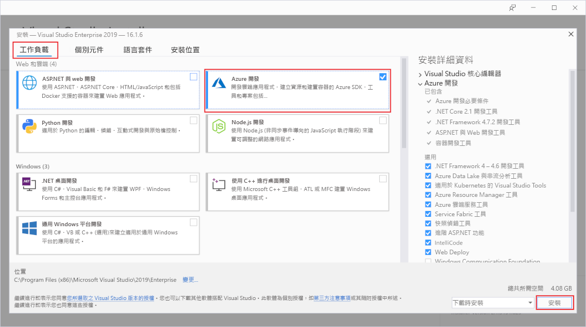

# 使用 Visual Studio 建立第一個函式

Azure Functions 可讓您在[無伺服器](https://azure.microsoft.com/solutions/serverless/)環境中執行程式碼，而不需要先建立 VM 或發佈 Web 應用程式。

在本文中，您將了解如何使用 Visual Studio 2019 在本機建立及測試 "hello world" 函式，然後將其發佈至 Azure。 本快速入門針對 Visual Studio 2019 所設計。 使用 Visual Studio 2017 建立 Functions 專案時，您必須先安裝[最新的 Azure Functions 工具](functions-develop-vs.md#check-your-tools-version)。

## 必要條件

若要完成本教學課程，您必須先安裝 [Visual Studio 2019](https://azure.microsoft.com/downloads/)。 確定也已經安裝 **Azure 開發**工作負載。

[!INCLUDE [quickstarts-free-trial-note](../../includes/quickstarts-free-trial-note.md)]

## 建立函式應用程式專案

[!INCLUDE [Create a project using the Azure Functions template](../../includes/functions-vstools-create.md)]

Visual Studio 會建立一個專案，其中的類別包含 HTTP 觸發程序函式類型的重複使用程式碼。 方法上的 `FunctionName` 屬性會設定函式名稱，其預設為 `HttpTrigger`。 `HttpTrigger` 屬性指定此函式是由 HTTP 要求所觸發。 重複使用程式碼會傳送 HTTP 回應，其中包含要求內文或查詢字串中的值。

您可以將適當的屬性套用至方法，進而使用輸入和輸出繫結來擴展您的函式功能。 如需詳細資訊，請參閱 [Azure Functions C# 開發人員參考](functions-dotnet-class-library.md)的[觸發程序和繫結](functions-dotnet-class-library.md#triggers-and-bindings)一節。

您現在已建立函式專案和 HTTP 觸發的函式，可以在本機電腦上進行測試。

## 在本機執行函式

Visual Studio 與 Azure Functions Core Tools 整合，以便您使用完整 Functions 執行階段在本機測試函式。  

[!INCLUDE [functions-run-function-test-local-vs](../../includes/functions-run-function-test-local-vs.md)]

確認函式在本機電腦上正確執行之後，就可以將專案發佈到 Azure。

## 將專案發佈到 Azure

您的 Azure 訂用帳戶中必須具有函式應用程式，才可以發佈您的專案。 Visual Studio 發佈會在您第一次發佈專案時，為您建立函式應用程式。

[!INCLUDE [Publish the project to Azure](../../includes/functions-vstools-publish.md)]

## 在 Azure 中測試您的函式

1. 從發行設定檔頁面複製函式應用程式的基底 URL。 使用新的基底 URL，取代在本機測試函式時所使用之 URL 的 `localhost:port` 部分。 如同以往，務必將查詢字串 `?name=<YOUR_NAME>` 附加至此 URL 並執行要求。

    呼叫 HTTP URL 觸發函式的 URL 應採用下列格式：

        http://<APP_NAME>.azurewebsites.net/api/<FUNCTION_NAME>?name=<YOUR_NAME> 

2. 將 HTTP 要求的新 URL 貼到瀏覽器的網址列。 下圖顯示瀏覽器中對於函式傳回之遠端 GET 要求所做出的回應︰

    

## 後續步驟

您已透過 Visual Studio，使用簡單的 HTTP 觸發函式在 Azure 中建立及發佈 C# 函式應用程式。 若要深入了解如何將函式開發為 .NET 類別庫，請參閱 [Azure Functions C# 開發人員參考](functions-dotnet-class-library.md)。

> [!div class="nextstepaction"]
> [將 Azure 儲存體佇列繫結新增至您的函式](functions-add-output-binding-storage-queue-vs.md)
