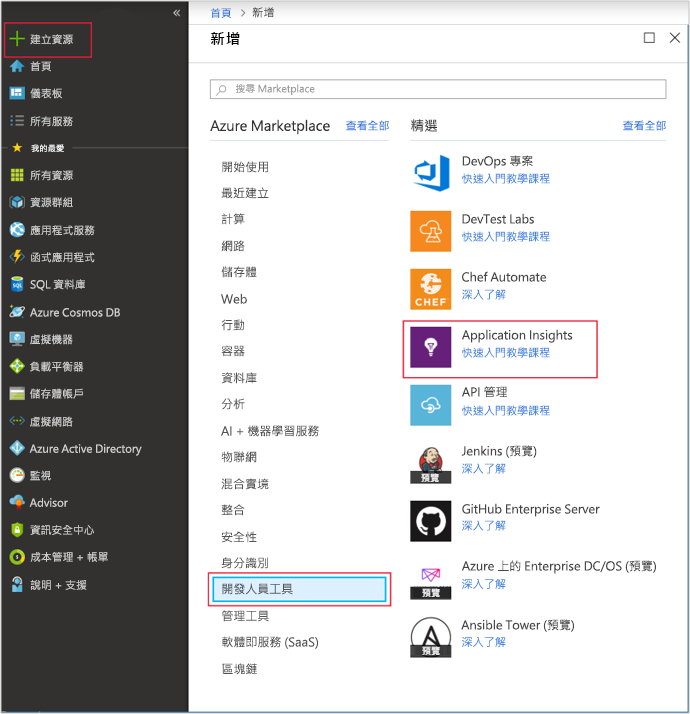
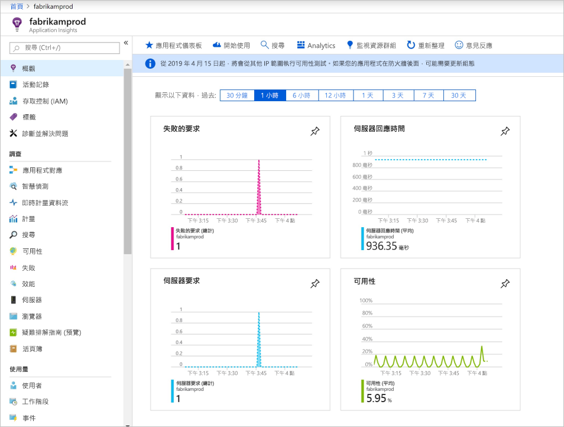
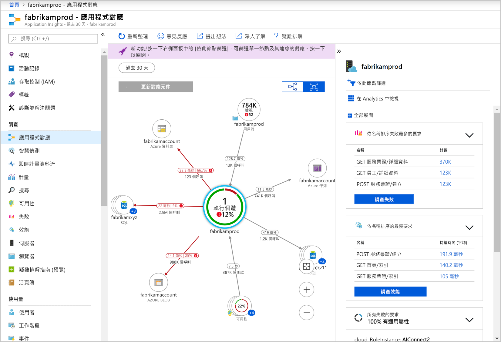
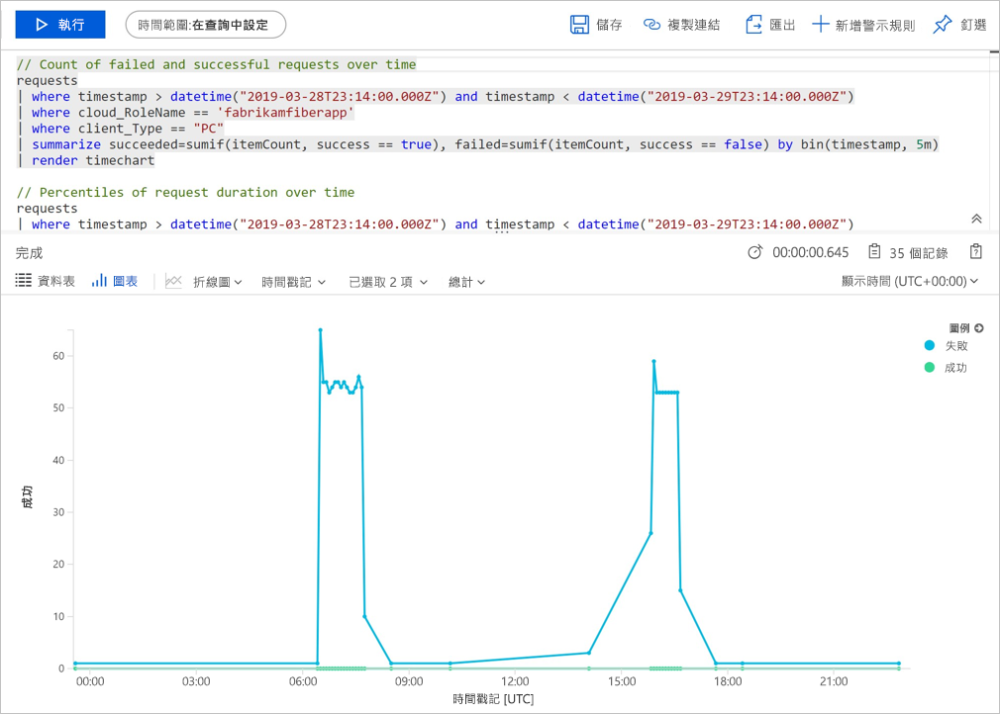
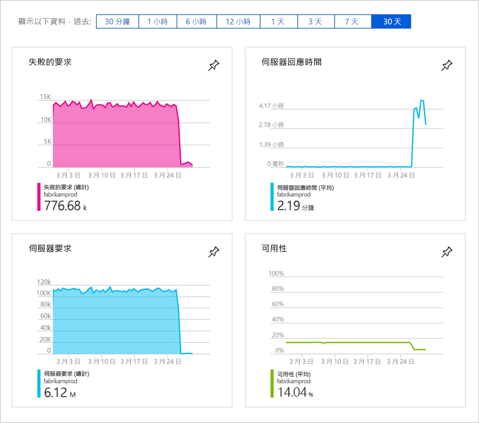
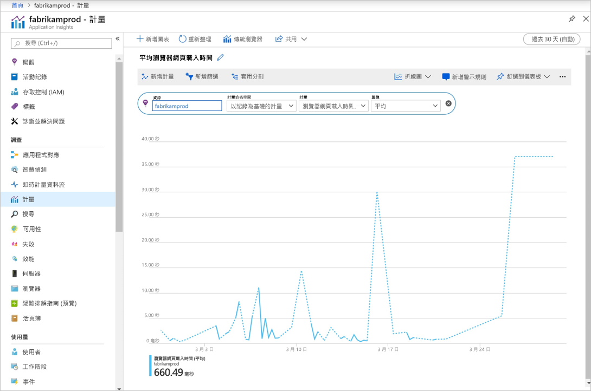

# <a name="quickstart-start-monitoring-your-nodejs-web-application-with-azure-application-insights"></a>快速入門：使用 Azure Application Insights 開始監視您的 Node.js Web 應用程式

在本快速入門中，您會將適用於 Node.js 的 Application Insights SDK 0.22 版新增至現有的 Node.js Web 應用程式。

Azure Application Insights 可讓您輕鬆監視 Web 應用程式的可用性、效能和使用情形。 還可讓您快速識別並診斷應用程式的錯誤，不必等使用者回報。 從 0.20 版 SDK 開始，您可以監視常見的第三方套件，包括 MongoDB、MySQL 和 Redis。

## <a name="prerequisites"></a>Prerequisites

* 具有有效訂用帳戶的 Azure 帳戶。 [免費建立帳戶](https://azure.microsoft.com/free/?ref=microsoft.com&utm_source=microsoft.com&utm_medium=docs&utm_campaign=visualstudio)。
* 正常運作的 Node.js 應用程式。

## <a name="enable-application-insights"></a>啟用 Application Insights

Application Insights 可以從任何連上網際網路的應用程式收集遙測資料，不論應用程式是在內部部署還是雲端中執行。 請使用下列步驟來開始檢視此資料。

1. 登入 [Azure 入口網站](https://portal.azure.com/)。

2. 選取 [建立資源]   > [開發人員工具]   > [Application Insights]  。

   

   > [!NOTE]
   >如果這是您第一次建立 Application Insights 資源，您可以瀏覽[建立 Application Insights 資源](https://docs.microsoft.com/azure/azure-monitor/app/create-new-resource)文件以進一步了解。

   設定頁面隨即出現；請使用下表來填寫輸入欄位。 

    | 設定        | 值           | 描述  |
   | ------------- |:-------------|:-----|
   | **名稱**      | 通用唯一值 | 用來識別您所監視之應用程式的名稱 |
   | **資源群組**     | myResourceGroup      | 用於裝載 AppInsights 資料之新資源群組的名稱。 您可以建立新的資源群組，或使用現有的資源群組。 |
   | **位置** | 美國東部 | 選擇您附近或接近應用程式裝載位置的地點 |

3. 選取 [建立]  。

## <a name="configure-appinsights-sdk"></a>設定 AppInsights SDK

1. 選取 [概觀]  ，然後複製應用程式的 [檢測金鑰]  。

   

2. 將 Application Insights SDK for Node.js 新增至您的應用程式。 從應用程式的根資料夾執行：

   ```bash
   npm install applicationinsights --save
   ```

3. 編輯應用程式的第一個 *.js* 檔案，並將以下兩行新增至指令碼的最上方。 如果您使用 [Node.js 快速入門應用程式](https://docs.microsoft.com/azure/app-service/app-service-web-get-started-nodejs)，請修改 *index.js* 檔案。 將 `<instrumentation_key>` 取代為應用程式的檢測金鑰。 

   ```JavaScript
   const appInsights = require('applicationinsights');
   appInsights.setup('<instrumentation_key>').start();
   ```

4. 重新啟動您的應用程式。

> [!NOTE]
> 經過 3-5 分鐘，資料就會開始出現在入口網站。 如果此應用程式是低流量測試應用程式，請記住，只有在使用中的要求或作業發生時，才會擷取大部分的計量。

## <a name="start-monitoring-in-the-azure-portal"></a>在 Azure 入口網站中開始監視

1. 現在，您可以在 Azure 入口網站中重新開啟 Application Insights [概觀]  頁面 (您先前在此擷取檢測金鑰)，以檢視目前執行中應用程式的詳細資料。

   

2. 選取 [應用程式對應]  ，以顯示應用程式元件之間相依性關係的視覺化配置。 每個元件會顯示負載、效能、失敗和警示等 KPI。

   

3. 選取 [應用程式分析]  圖示  [在 Analytics 中檢視]  。  此動作會開啟 **Application Insights Analytics** 而提供豐富的查詢語言，用以分析 Application Insights 收集的所有資料。 此案例中會為您產生查詢，可將要求計數以圖表呈現。 您可以撰寫自己的查詢來分析其他資料。

   

4. 返回 [概觀]  頁面，檢查 [KPI 圖形]。  此儀表板會提供應用程式健康情況的統計資料，包括連入要求數量、這些要求的持續時間，以及任何發生的失敗。

   

   若要在 [網頁檢視載入時間]  圖表中填入**用戶端遙測**資料，請將此指令碼新增至您要追蹤的每個頁面：

   ```HTML
   <!-- 
   To collect user behavior analytics tools about your application, 
   insert the following script into each page you want to track.
   Place this code immediately before the closing </head> tag,
   and before any other scripts. Your first data will appear 
   automatically in just a few seconds.
   -->
   <script type="text/javascript">
     var appInsights=window.appInsights||function(config){
       function i(config){t[config]=function(){var i=arguments;t.queue.push(function(){t[config].apply(t,i)})}}var t={config:config},u=document,e=window,o="script",s="AuthenticatedUserContext",h="start",c="stop",l="Track",a=l+"Event",v=l+"Page",y=u.createElement(o),r,f;y.src=config.url||"https://az416426.vo.msecnd.net/scripts/a/ai.0.js";u.getElementsByTagName(o)[0].parentNode.appendChild(y);try{t.cookie=u.cookie}catch(p){}for(t.queue=[],t.version="1.0",r=["Event","Exception","Metric","PageView","Trace","Dependency"];r.length;)i("track"+r.pop());return i("set"+s),i("clear"+s),i(h+a),i(c+a),i(h+v),i(c+v),i("flush"),config.disableExceptionTracking||(r="onerror",i("_"+r),f=e[r],e[r]=function(config,i,u,e,o){var s=f&&f(config,i,u,e,o);return s!==!0&&t["_"+r](config,i,u,e,o),s}),t
       }({
           instrumentationKey:"<insert instrumentation key>"
       });
       
       window.appInsights=appInsights;
       appInsights.trackPageView();
   </script>
   ```

5. 從左側選取 [計量]  。 使用計量瀏覽器來調查資源的健康情況和使用量。 您可以選取 [新增新的圖表]  來建立額外的自訂檢視，或選取 [編輯]  來修改現有圖表的類型、高度、調色盤、群組和計量。 例如，您可以製作圖表來顯示平均瀏覽器頁面載入時間，方法是從 [計量] 下拉式清單選取 [瀏覽器頁面載入時間] 並從 [彙總] 選取 [平均]。 若要深入了解 Azure 計量瀏覽器，請瀏覽[開始使用 Azure 計量瀏覽器](../../azure-monitor/platform/metrics-getting-started.md)。

   

若要深入了解監視 Node.js，請參閱[其他 AppInsights Node.js 文件](../../azure-monitor/app/nodejs.md)。

## <a name="clean-up-resources"></a>清除資源

完成測試後，您可以刪除資源群組和所有相關資源。 若要這樣做，請依照下列步驟執行。

> [!NOTE]
> 如果您使用了現有的資源群組，下列指示將沒有作用，而且您只需要刪除個別的 Application Insights 資源。 請記住，每當您刪除資源群組時，將會刪除屬於該群組的所有基礎資源。

1. 從 Azure 入口網站的左側功能表中，依序選取 [資源群組]  和 [myResourceGroup]  。
2. 在資源群組頁面上，選取 [刪除]  ，在文字方塊中輸入 **myResourceGroup**，然後選取 [刪除]  。

## <a name="next-steps"></a>後續步驟

> [!div class="nextstepaction"]
> [尋找並診斷效能問題](https://docs.microsoft.com/azure/application-insights/app-insights-analytics)
