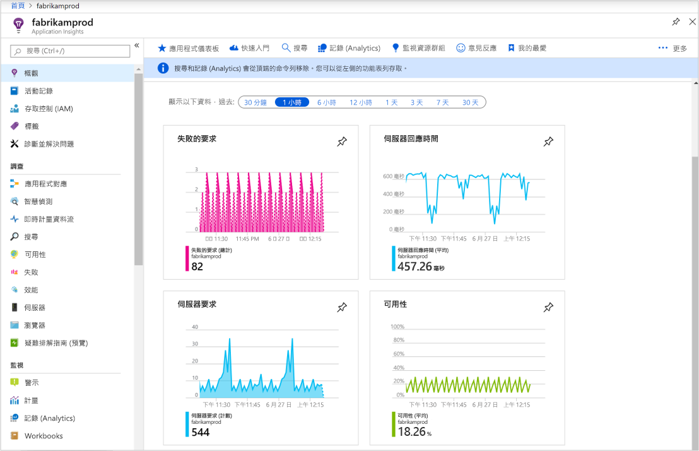
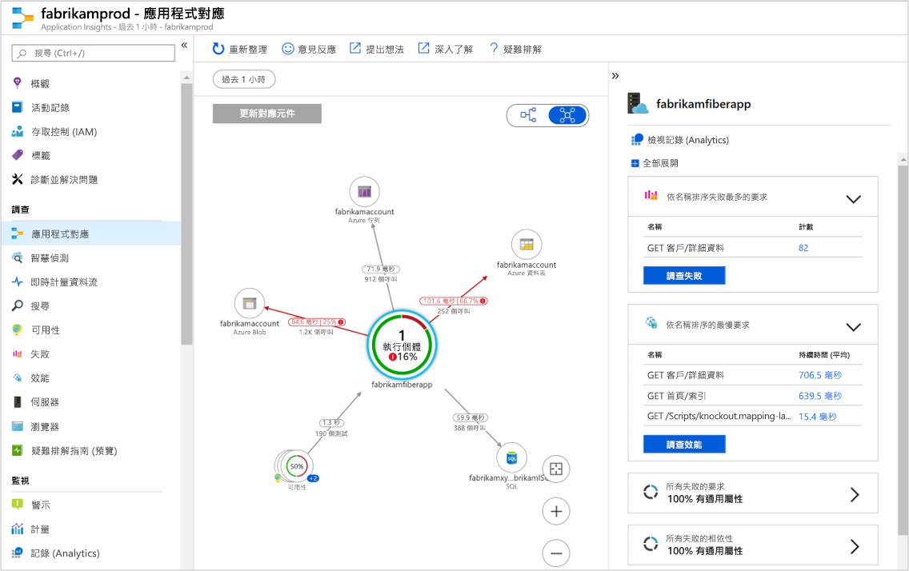

# <a name="start-monitoring-your-aspnet-web-application"></a>開始監視 ASP.NET Web 應用程式

利用 Azure Application Insights，您可以輕鬆監視 Web 應用程式的可用性、效能和使用情形。  還可讓您快速識別並診斷應用程式的錯誤，不必等使用者回報。  使用從 Application Insights 收集有關您的應用程式效能和效率的相關資訊，您可以進行謹慎的選擇來維護和改善您的應用程式。

本快速入門示範如何將 Application Insights 新增至現有的 ASP.NET Web 應用程式，並開始分析即時統計資料，而這只是您可用來分析應用程式的多種方法的其中一個。 如果您沒有 ASP.NET Web 應用程式，您可以遵循[建立 ASP.NET Web 應用程式快速入門](../../app-service/app-service-web-get-started-dotnet-framework.md)來建立。

## <a name="prerequisites"></a>必要條件
若要完成本快速入門：

- 使用下列工作負載[安裝 Visual Studio 2019](https://www.visualstudio.com/downloads/)：
    - ASP.NET 和 Web 開發
    - Azure 開發


如果您沒有 Azure 訂用帳戶，請在開始前建立[免費帳戶](https://azure.microsoft.com/free/)。

## <a name="enable-application-insights"></a>啟用 Application Insights

1. 在 Visual Studio 2019 中開啟您的專案。
2. 從 [專案] 功能表選取 [設定 Application Insights]  。 Visual Studio 會將 Application Insights SDK 新增至您的應用程式。

    > [!IMPORTANT]
    > 新增 Application Insights 的程序會因 ASP.NET 範本類型而異。 如果您使用 [空白]  或 [Azure 行動裝置應用程式]  範本，請選取 [專案]   > [新增 Application Insights 遙測]  。 至於其他所有 ASP.NET 範本，請參閱上述步驟中的指示。 

3. 按一下 [開始使用]  (舊版的 Visual Studio 有 [免費開始]  按鈕)。

    

4. 選取您的訂用帳戶，然後按一下 [註冊]  。

5. 選取 [專案]   > [管理 NuGet 套件]   > [套件來源: nuget.org]   > [更新]  ，將 Application Insights SDK 套件更新至最新穩定版本。

6. 從 [偵錯]  功能表選取 [開始偵錯]  或按 F5 鍵來執行您的應用程式。

## <a name="confirm-app-configuration"></a>確認應用程式設定

Application Insights 會為您的應用程式收集遙測資料，不論其執行所在位置為何。 請使用下列步驟來開始檢視此資料。

1. 按一下 [檢視]   -> [其他視窗]   -> [Application Insights 搜尋]  ，以開啟 Application Insights。  您會從您目前的工作階段查看遙測。<BR><br>

2. 按一下清單中的第一個要求 (此範例中的取得首頁/索引) 來查看要求詳細資料。 請注意，狀態碼和回應時間會隨著有關要求的其他重要資訊併入。<br><br>

## <a name="start-monitoring-in-the-azure-portal"></a>在 Azure 入口網站中開始監視

您現在可以在 Azure 入口網站中開啟 Application Insights 以檢視有關執行中應用程式的各種詳細資料。

1. 在方案總管中展開 [連線的服務]  資料夾 (雲端和加號圖示)，然後以滑鼠右鍵按一下 [Application Insights]  資料夾，並按一下 [開啟 Application Insights 入口網站]  。  您可以看到有關您的應用程式的某些資訊和各種選項。

    

2. 按一下 [應用程式對應]  ，取得應用程式元件之間相依性關聯性的視覺化配置。  每個元件會顯示負載、效能、失敗和警示等 KPI。

    

3. 按一下其中一個應用程式元件的 [應用程式分析]  圖示 [應用程式對應] [在記錄中檢視 (Analytics)]  。 這會開啟**記錄 (Analytics)** ，它可提供豐富的查詢語言，可用於分析 Application Insights 收集的所有資料。 此案例中會為您產生查詢，可將要求計數以圖表呈現。 您可以撰寫自己的查詢來分析其他資料。

    

4. 在 [調查] 底下的左邊按一下 [即時計量資料流]  。 這會顯示有關您的應用程式的即時統計資料，因為它在執行中。 這包含連入要求數量、這些要求的持續時間及發生的任何失敗之類的資訊。 您也可以檢查重要效能計量，例如處理器和記憶體。

    

    如果準備好要在 Azure 中裝載您的應用程式，您現在可以將它發佈。 請遵循[建立 ASP.NET Web 應用程式快速入門](../../app-service/app-service-web-get-started-dotnet.md#update-the-app-and-redeploy)中所述的步驟。

5. 如果您使用 Visual Studio 來新增 Application Insights 監視，您將可自動新增用戶端監視。 若要將用戶端監視手動新增至應用程式，請將下列 JavaScript 新增至應用程式：

```html
<!-- 
To collect user behavior analytics about your application, 
insert the following script into each page you want to track.
Place this code immediately before the closing </head> tag,
and before any other scripts. Your first data will appear 
automatically in just a few seconds.
-->
<script type="text/javascript">
var appInsights=window.appInsights||function(a){
  function b(a){c[a]=function(){var b=arguments;c.queue.push(function(){c[a].apply(c,b)})}}var c={config:a},d=document,e=window;setTimeout(function(){var b=d.createElement("script");b.src=a.url||"https://az416426.vo.msecnd.net/scripts/a/ai.0.js",d.getElementsByTagName("script")[0].parentNode.appendChild(b)});try{c.cookie=d.cookie}catch(a){}c.queue=[];for(var f=["Event","Exception","Metric","PageView","Trace","Dependency"];f.length;)b("track"+f.pop());if(b("setAuthenticatedUserContext"),b("clearAuthenticatedUserContext"),b("startTrackEvent"),b("stopTrackEvent"),b("startTrackPage"),b("stopTrackPage"),b("flush"),!a.disableExceptionTracking){f="onerror",b("_"+f);var g=e[f];e[f]=function(a,b,d,e,h){var i=g&&g(a,b,d,e,h);return!0!==i&&c["_"+f](a,b,d,e,h),i}}return c
  }({
      instrumentationKey:"<your instrumentation key>"
  });

window.appInsights=appInsights,appInsights.queue&&0===appInsights.queue.length&&appInsights.trackPageView();
</script>
```

若要深入了解，請瀏覽[開放原始碼 JavaScript SDK](https://github.com/Microsoft/ApplicationInsights-JS) 的 GitHub 存放庫。

## <a name="video"></a>影片

* 關於如何[使用 .NET 應用程式從零開始設定 Application Insights](https://www.youtube.com/watch?v=blnGAVgMAfA) 的外部逐步說明影片。

## <a name="clean-up-resources"></a>清除資源
當您完成測試時，您可以刪除資源群組和所有相關資源。 若要這樣做，請依照下列步驟執行。
1. 從 Azure 入口網站的左側功能表中，依序按一下 [資源群組]  和 [myResourceGroup]  。
2. 在資源群組頁面上，按一下 [刪除]  ，在文字方塊中輸入 **myResourceGroup**，然後按一下 [刪除]  。

## <a name="next-steps"></a>後續步驟
在這個快速入門中，您已啟用您的應用程式，供 Azure Application Insights 進行監視。  繼續進行教學課程，以了解如何使用它來監視統計資料和偵測應用程式中的問題。

> [!div class="nextstepaction"]
> [Azure Application Insights 教學課程](tutorial-runtime-exceptions.md)
