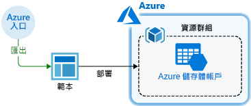

# 使用 IntelliJ IDEA 建立及部署 Azure Resource Manager 範本

了解如何使用 IntelliJ IDEA 對 Azure 部署 Resource Manager 範本，以及了解從 IDE 直接編輯和更新該範本的程序。 Resource Manager 範本是 JSON 檔案，該檔案定義您需要為您的解決方案部署的資源。 若要瞭解部署和管理 Azure 解決方案的相關概念，請參閱[範本部署總覽](overview.md)。

完成教學課程之後，您就可以部署 Azure 儲存體帳戶。 相同的程序也可用來部署其他 Azure 資源。

如果您沒有 Azure 訂用帳戶，請在開始之前先[建立免費帳戶](https://azure.microsoft.com/free/)。

## 必要條件

若要完成本文，您需要：

* 已安裝的 [IntelliJ IDEA](https://www.jetbrains.com/idea/download/) Ultimate Edition 或 Community Edition
* 已安裝的 [Azure Toolkit for IntelliJ](https://plugins.jetbrains.com/plugin/8053)，請查看 [IntelliJ 的外掛程式管理指南](https://www.jetbrains.com/help/idea/managing-plugins.html)以取得詳細資訊
* 已針對 Azure Toolkit for IntelliJ [登入](/java/azure/intellij/azure-toolkit-for-intellij-sign-in-instructions)您的 Azure 帳戶

## 部署快速入門範本

您可以從 [Azure 快速入門範本](https://azure.microsoft.com/resources/templates/)開啟範本，而無須從頭建立範本。 Azure 快速入門範本是 Resource Manager 範本的存放庫。 本文中使用的範本稱為「[建立標準儲存體帳戶](https://github.com/Azure/azure-quickstart-templates/tree/master/101-storage-account-create/)」。 此範本會定義 Azure 儲存體帳戶資源。

1. 以滑鼠右鍵按一下 [`azuredeploy.json`](https://raw.githubusercontent.com/Azure/azure-quickstart-templates/master/101-storage-account-create/azuredeploy.json) 和 [`azuredeploy.parameters.json`](https://raw.githubusercontent.com/Azure/azure-quickstart-templates/master/101-storage-account-create/azuredeploy.parameters.json)，然後將其儲存到本機電腦。

1. 如果您已正確安裝並登入 Azure Toolkit，應該會在 IntelliJ IDEA 的提要欄位中看到 Azure Explorer。 以滑鼠右鍵按一下 [資源管理]，然後選取 [建立部署]。

    

1. 設定 [部署名稱]、[訂用帳戶]、[資源群組] 和 [區域]。 在這裡，我們會將範本部署到新的資源群組 `testRG`。 然後，選取 `azuredeploy.json` 作為 [資源範本] 的路徑，並選取您下載的 `azuredeploy.parameters.json` 作為 [資源參數]。

    

1. 按一下 [確定] 之後，就會開始部署。 在部署完成之前，您可以從底部的 IntelliJ IDEA **狀態列**找到進度。

    

## 瀏覽現有部署

1. 部署完成之後，您會看到系統已建立新的資源群組 `testRG` 和新的部署。 以滑鼠右鍵按一下部署，您就會看到可行動作的清單。 現在選取 [顯示屬性]。

    

1. 隨即會開啟索引標籤檢視以顯示一些有用的屬性，例如部署狀態和範本結構。

    

## 編輯和更新現有部署

1. 從右鍵功能表或之前的 [顯示屬性] 檢視選取 [編輯部署]。 隨即會開啟另一個索引標籤檢視，其中會顯示 Azure 部署的範本和參數檔案。 若要將這些檔案儲存到本機，您可以按一下 [匯出範本檔案] 或 [匯出參數檔案]。

    

1. 您可以在此頁面上編輯這兩個檔案，並將變更部署至 Azure。 在此，我們會將參數檔案中的 **storageAccountType** 值從 `Standard_LRS` 修改為 `Standard_GRS`。 然後，按一下底部的 [更新部署]，並確認更新。

    

1. 更新部署完成後，您可以在入口網站上確認所建立的儲存體帳戶是否已變更為 `Standard_GRS`。

## 清除資源

1. 不再需要 Azure 資源時，可藉由刪除資源群組來清除您所部署的資源。 您可以從 Azure 入口網站或 Azure CLI 來執行此動作。 從 IntelliJ IDEA 在 Azure Explorer 中對您建立的**資源群組**按一下滑鼠右鍵，然後選取 [刪除]。

    

> [!NOTE]
> 請注意，刪除部署並不會刪除部署所建立的資源。 如果您不再需要對應的資源群組或特定資源，請將其刪除。

## 後續步驟

本文的主要重點是要使用 IntelliJ 概念，從 Azure 快速入門範本部署現有的範本。 您也已經了解如何在 Azure 上檢視和更新現有部署。 Azure 快速入門範本中的範本可能無法提供您所需的一切。 若要深入了解範本開發，請參閱我們的新初學者教學課程系列：

> [!div class="nextstepaction"]
> [初學者教學課程](./template-tutorial-create-first-template.md)

> [!div class="nextstepaction"]
> [造訪 Azure 上的 Java 開發人員中心](https://docs.microsoft.com/azure/java)
