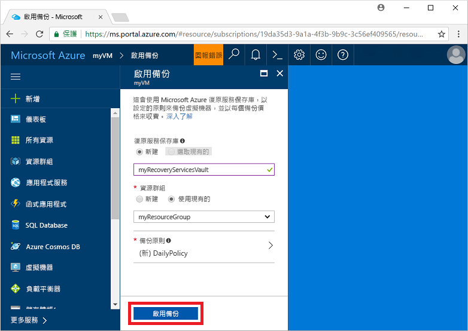
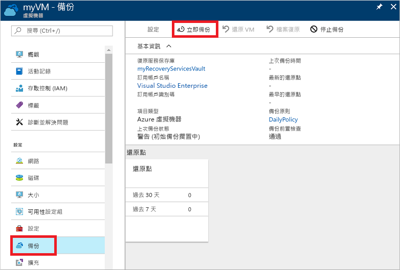
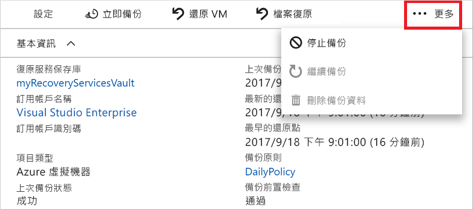

# 在 Azure 中備份虛擬機器

您可以透過 Azure 入口網站建立 Azure 備份。 此方法可提供以瀏覽器為基礎的使用者介面，以便建立和設定 Azure 備份及所有相關的資源。 您可以定期建立備份以保護您的資料。 Azure 備份會建立復原點，其可儲存在異地備援復原保存庫中。 本文詳述如何使用 Azure 入口網站來備份虛擬機器 (VM)。

本快速入門能夠在現有的 Azure VM 上進行備份。 如果您需要建立 VM，您可以[使用 Azure 入口網站來建立 VM](../virtual-machines/windows/quick-create-portal.md)。

## 登入 Azure

登入 [Azure 入口網站](https://portal.azure.com)。

## 選取要備份的 VM

建立復原服務保存庫的簡單排程每日備份。

1. 在左邊的功能表上，選取 [虛擬機器]  。
2. 從清單中選擇要備份的 VM。 如果您使用範例 VM 快速入門命令，則 VM 會在 myResourceGroup  資源群組中命名為 myVM  。
3. 在 [作業]  區段中，選擇 [備份]  。 [啟用備份]  視窗隨即開啟。

## 在 VM 上啟用備份

復原服務保存庫是一個邏輯容器，可儲存每個受保護資源 (例如 Azure VM) 的備份資料。 執行受保護資源的備份作業時，它會在復原服務保存庫內建立復原點。 然後您可以使用其中一個復原點，將資料還原到指定的時間點。

1. 選取 [新建]  並提供新存放庫的名稱，例如 *myRecoveryServicesVault*。
2. 如果尚未選取，請選擇 [使用現有]  ，然後從下拉式功能表中選取您 VM 的資源群組。

    

    根據預設，已針對異地備援儲存體設定保存庫。 若要進一步保護您的資料，此儲存體備援層級可確保備份資料會複寫到與主要地區距離數百英哩的次要 Azure 地區。

    您可以建立和使用相關原則，來定義備份作業的執行時以及復原點的儲存時間長度。 預設保護原則會每天執行備份作業並將復原點保留 30 天。 您可以使用這些預設原則值來快速保護您的 VM。

3. 若要接受預設備份原則值，請選取 [啟用備份]  。

需要一點時間才會建立復原服務保存庫。

## 開始備份作業

您可以立即開始備份，而非等候預設原則在排定的時間執行此作業。 這第一個備份作業會建立完整復原點。 此初始備份之後的每個備份作業會建立增量復原點。 增量復原點符合儲存和時間效率，因為它只會傳輸自上次備份後所做的變更。

1. 在您 VM 的 [備份]  視窗上，選取 [立即備份]  。

    

2. 若要接受 30 天的備份保留原則，請保留預設的 [保留備份到]  日期。 若要開始作業，請選取 [備份]  。

## 監視備份作業

VM 的 [備份]  視窗中會顯示備份的狀態及已完成的還原點數目。 VM 的備份作業完成後，[概觀]  視窗的右側會顯示有關 [上次備份時間]  、[最新的還原點]  和 [最舊的還原點]  的資訊。

## 清除部署

不再需要時，您可以停用 VM 的保護，移除還原點和復原服務保存庫，然後刪除資源群組和相關聯的 VM 資源。

如果您要繼續進行說明如何為您的 VM 還原資料的備份教學課程，請略過本節中的步驟並前往[後續步驟](#next-steps)。

1. 選取 VM 的 [備份]  選項。

2. 選取 [更多...]  以顯示其他選項，然後選擇 [停止備份]  。

    

3. 從下拉式功能表中選取 [刪除備份資料]  。

4. 在 [輸入備份項目的名稱]  對話方塊中，輸入您的 VM 名稱，例如 myVM  。 選取 [停止備份]  。

    一旦停止 VM 備份並移除復原點，您即可刪除資源群組。 如果您使用現有的 VM，建議您將資源群組和 VM 留在原處。

5. 在左側功能表上，選取 [資源群組]  。
6. 從清單中選擇您的資源群組。 如果您使用範例 VM 快速入門命令，資源群組就會命名為 myResourceGroup  。
7. 選取 [刪除資源群組]  。 若要確認，請輸入資源群組名稱，然後選取 [刪除]  。

    

## 後續步驟

在本快速入門中，您已建立復原服務保存庫、啟用 VM 的保護功能，並建立初始復原點。 若要深入了解 Azure 備份和復原服務，請繼續進行教學課程。

> [!div class="nextstepaction"]
> [備份多個 Azure VM](./tutorial-backup-vm-at-scale.md)
