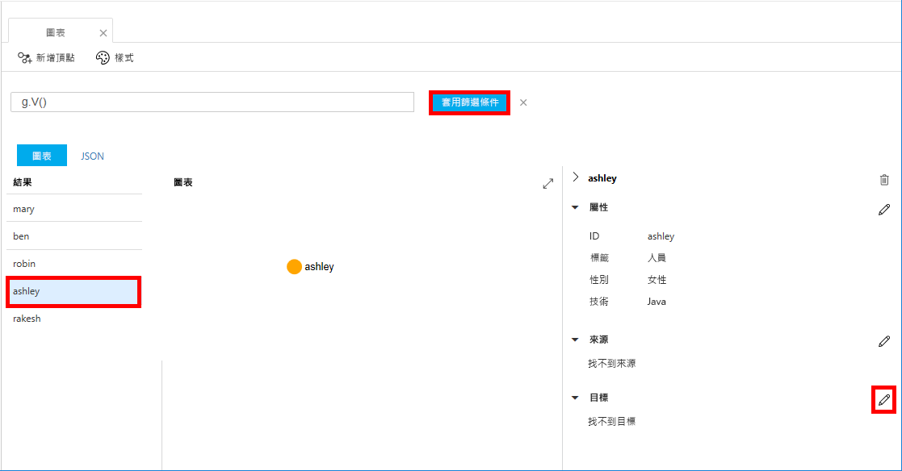

# <a name="quickstart-create-a-graph-database-in-azure-cosmos-db-using-the-java-sdk"></a>快速入門：使用 Java SDK 在 Azure Cosmos DB 中建立圖形資料庫 

> [!div class="op_single_selector"]
> * [Gremlin 主控台](create-graph-gremlin-console.md)
> * [.NET](create-graph-dotnet.md)
> * [Java](create-graph-java.md)
> * [Node.js](create-graph-nodejs.md)
> * [Python](create-graph-python.md)
> * [PHP](create-graph-php.md)
>  

Azure Cosmos DB 是 Microsoft 的全域分散式多模型資料庫服務。 您可使用 Azure Cosmos DB 快速地建立和查詢受控文件、資料表及圖形資料庫。 

本快速入門會使用 Azure Cosmos DB 適用的 Azure 入口網站工具，建立簡易的圖形資料庫。 本快速入門也說明如何透過使用 OSS [Apache TinkerPop](https://tinkerpop.apache.org/) 驅動程式的 [Gremlin API](graph-introduction.md) 資料庫，快速建立 Java 主控台應用程式。 本快速入門中的指示可運用在任何足以執行 Java 應用程式的作業系統上。 本快速入門可讓您熟悉如何在 UI 中或以程式設計方式建立和修改圖形 (不論您偏好哪種方式)。 

## <a name="prerequisites"></a>必要條件
[!INCLUDE [quickstarts-free-trial-note](../../includes/quickstarts-free-trial-note.md)]

此外：

* [JAVA 開發套件 (JDK) 8 版](https://aka.ms/azure-jdks) \(英文\)
    * 務必設定 JAVA_HOME 環境變數，以指向 JDK 安裝所在的資料夾。
* [下載](https://maven.apache.org/download.cgi)和[安裝 ](https://maven.apache.org/install.html) [Maven](https://maven.apache.org/) 二進位封存檔
    * 在 Ubuntu 上，您可以執行 `apt-get install maven` 來安裝 Maven。
* [Git](https://www.git-scm.com/)
    * 在 Ubuntu 上，您可以執行 `sudo apt-get install git` 來安裝 Git。

## <a name="create-a-database-account"></a>建立資料庫帳戶

您必須先使用 Azure Cosmos DB 建立 Gremlin (圖形) 資料庫帳戶，才可以建立圖形資料庫。

[!INCLUDE [cosmos-db-create-dbaccount-graph](../../includes/cosmos-db-create-dbaccount-graph.md)]

## <a name="add-a-graph"></a>新增圖形

[!INCLUDE [cosmos-db-create-graph](../../includes/cosmos-db-create-graph.md)]

## <a name="clone-the-sample-application"></a>複製範例應用程式

現在讓我們切換為使用程式碼。 我們將從 GitHub 複製 Gremlin API 應用程式、設定連接字串，然後加以執行。 您會看到，以程式設計方式來處理資料有多麼的容易。  

1. 開啟命令提示字元，建立名為 git-samples 的新資料夾，然後關閉命令提示字元。

    ```bash
    md "C:\git-samples"
    ```

2. 開啟 git 終端機視窗 (例如 git bash)，並使用 `cd` 命令變更至要安裝範例應用程式的資料夾。  

    ```bash
    cd "C:\git-samples"
    ```

3. 執行下列命令來複製範例存放庫。 此命令會在您的電腦上建立範例應用程式副本。 

    ```bash
    git clone https://github.com/Azure-Samples/azure-cosmos-db-graph-java-getting-started.git
    ```

## <a name="review-the-code"></a>檢閱程式碼

此為選用步驟。 若您想要瞭解如何在程式碼中建立資料庫資源，則可檢閱下列程式碼片段。 或者也可以直接跳至[更新您的連接字串](#update-your-connection-information)。

下列程式碼片段皆是取自 C:\git-samples\azure-cosmos-db-graph-java-getting-started\src\GetStarted\Program.java 檔案。

* Gremlin `Client` 已從 C:\git-samples\azure-cosmos-db-graph-java-getting-started\src\remote.yaml 檔案中的組態初始化。

    ```java
    cluster = Cluster.build(new File("src/remote.yaml")).create();
    ...
    client = cluster.connect();
    ```

* 已使用 `client.submit` 方法執行一系列的 Gremlin 步驟。

    ```java
    ResultSet results = client.submit(gremlin);

    CompletableFuture<List<Result>> completableFutureResults = results.all();
    List<Result> resultList = completableFutureResults.get();

    for (Result result : resultList) {
        System.out.println(result.toString());
    }
    ```

## <a name="update-your-connection-information"></a>更新您的連線資訊

現在，返回 Azure 入口網站以取得連線資訊，並將其複製到應用程式中。 這些設定可讓您的應用程式與託管資料庫進行通訊。

1. 在 [Azure 入口網站](https://portal.azure.com/)中，按一下 [金鑰]  。 

    複製 URI 值的第一個部分。

    ![在 Azure 入口網站的 [金鑰] 頁面中，檢視並複製存取金鑰](./media/create-graph-java/keys.png)
2. 開啟 src/remote.yaml 檔案，並將唯一 ID 貼至 `hosts: [$name$.graphs.azure.com]` 中的 `$name$`。

    remote.yaml 的行 1 現應如下所示 

    `hosts: [test-graph.graphs.azure.com]`

3. 在 `endpoint` 值中將 `graphs` 變更為 `gremlin.cosmosdb`。 (如果您已在 2017 年 12 月 20 日之前建立圖形資料庫帳戶，就不需要變更端點值，可繼續下一步。)

    端點值現在看起來應該像這樣：

    `"endpoint": "https://testgraphacct.gremlin.cosmosdb.azure.com:443/"`

4. 在 Azure 入口網站中，使用複製按鈕複製 PRIMARY KEY，然後將其貼上至 `password: $masterKey$` 中的 `$masterKey$`。

    remote.yaml 的行 4 現應如下所示 

    `password: 2Ggkr662ifxz2Mg==`

5. 變更 remote.yaml 的行 3，從

    `username: /dbs/$database$/colls/$collection$`

    to 

    `username: /dbs/sample-database/colls/sample-graph`

    如果您已使用範例資料庫或圖形的唯一名稱，請更新為適當值。

6. 儲存 remote.yaml 檔案。

## <a name="run-the-console-app"></a>執行主控台應用程式

1. 在 git 終端機視窗中，`cd` 至 azure-cosmos-db-graph-java-getting-started 資料夾。

    ```git
    cd "C:\git-samples\azure-cosmos-db-graph-java-getting-started"
    ```

2. 在 git 終端機視窗中，使用下列命令來安裝必要的 Java 套件。

   ```git
   mvn package
   ```

3. 在 git 終端機視窗中，使用下列命令以啟動 JAVA 應用程式。
    
    ```git
    mvn exec:java -D exec.mainClass=GetStarted.Program
    ```

    終端機視窗會顯示要新增至圖形的頂點。 
    
    如果遇到逾時錯誤，請檢查您已在[更新您的連線資訊](#update-your-connection-information)中正確更新連線資訊，也請嘗試重新執行最後一個命令。 
    
    程式停止後，按 Enter，然後在網際網路瀏覽器中切換回 Azure 入口網站。 

<a id="add-sample-data"></a>
## <a name="review-and-add-sample-data"></a>檢閱並新增範例資料

您現在可以移回 [資料總管] 並查看已新增到圖行的頂點，然後新增額外的資料點。

1. 按一下 [資料總管]  ，展開 **sample-graph**，按一下 [圖形]  ，然後再按一下 [套用篩選條件]  。 

   ![在 Azure 入口網站的 [資料總管] 中建立新文件](./media/create-graph-java/azure-cosmosdb-data-explorer-expanded.png)

2. 在 [結果]  清單中，請注意已新增到圖形的新使用者。 選取 [ben]  ，並注意到此使用者已連線到 robin。 您可以拖放移動周圍的頂點、捲動滑鼠滾輪執行縮放、使用雙箭號展開圖形大小。 

   

3. 現在來加入一些新使用者。 按一下 [新增頂點]  按鈕，將資料新增至您的圖形。

   ![在 Azure 入口網站的 [資料總管] 中建立新文件](./media/create-graph-java/azure-cosmosdb-data-explorer-new-vertex.png)

4. 在 [標籤] 方塊中，輸入「人員」  。

5. 按一下 [新增屬性]  ，以新增以下各項屬性。 請注意，您可以在圖形中為每個人建立獨特的屬性。 只需要識別碼索引鍵。

    索引鍵|value|注意
    ----|----|----
    id|ashley|頂點的唯一識別碼。 如果您未指定識別碼，系統會為您產生一個。
    gender|female| 
    tech | java | 

    > [!NOTE]
    > 在本快速入門中，您會建立非資料分割集合。 不過，如果您藉由在集合建立期間指定資料分割索引鍵來建立資料分割集合，您就必須包含資料分割索引鍵作為每個新頂點的索引鍵。 

6. 按一下 [確定]  。 您可能需要展開畫面，才能在螢幕底部看到 [確定]  。

7. 再次按一下 [新增頂點]  並新增額外的新使用者。 

8. 輸入*人員*的標籤。

9. 按一下 [新增屬性]  ，以新增以下各項屬性：

    索引鍵|value|注意
    ----|----|----
    id|rakesh|頂點的唯一識別碼。 如果您未指定識別碼，系統會為您產生一個。
    gender|male| 
    school|MIT| 

10. 按一下 [確定]  。 

11. 按一下 [套用篩選條件]  按鈕，預設的 `g.V()` 篩選條件會顯示圖形中的所有值。 所有使用者現在會顯示在 [結果]  清單中。 

    隨著您新增更多的資料，您可以使用篩選條件來限制您的結果。 依預設，[資料總管] 會使用 `g.V()` 擷取圖形中的所有頂點。 您可將其變更為不同的[圖形查詢](tutorial-query-graph.md) (例如 `g.V().count()`)，以使用 JSON 格式傳回圖形中所有頂點的計數。 若您變更篩選條件，請將篩選條件變更回 `g.V()`，然後按一下 [套用篩選條件]  ，即可再次顯示所有的結果。

12. 現在您可以將 rakesh 和 ashley 連線。 請確定已在 [結果]  清單中選取 **ashley**，然後按一下右下方 [目標]  旁邊的 []。 您可能需要加寬視窗，才可看到按鈕。

    

13. 在 [目標]  方塊中輸入 rakesh  ，並在 [邊緣標籤]  方塊中輸入 knows  ，然後按一下核取方塊。

    ![在 [資料總管] 中新增 ashley 與 rakesh 之間的連線](./media/create-graph-java/azure-cosmosdb-data-explorer-set-target.png)

14. 現在從 [結果] 清單中選取 **rakesh** 並查看 ashley 與 rakesh 是否已連線。 

    ![[資料總管] 中連線的兩個頂點](./media/create-graph-java/azure-cosmosdb-graph-explorer.png)

    這會完成本教學課程中的資源建立部分。 您可以繼續將頂點新增至圖形、修改現有的頂點，或是變更查詢。 現在讓我們檢閱 Azure Cosmos DB 提供的計量，然後再清除資源。 

## <a name="review-slas-in-the-azure-portal"></a>在 Azure 入口網站中檢閱 SLA

[!INCLUDE [cosmosdb-tutorial-review-slas](../../includes/cosmos-db-tutorial-review-slas.md)]

## <a name="clean-up-resources"></a>清除資源

[!INCLUDE [cosmosdb-delete-resource-group](../../includes/cosmos-db-delete-resource-group.md)]

## <a name="next-steps"></a>後續步驟

在本快速入門中，您已了解如何建立 Azure Cosmos DB 帳戶、如何使用 [資料總管] 來建立圖形，以及如何執行應用程式。 您現在可以使用 Gremlin 來建置更複雜的查詢和實作強大的圖形周遊邏輯。 

> [!div class="nextstepaction"]
> [使用 Gremlin 進行查詢](tutorial-query-graph.md)

