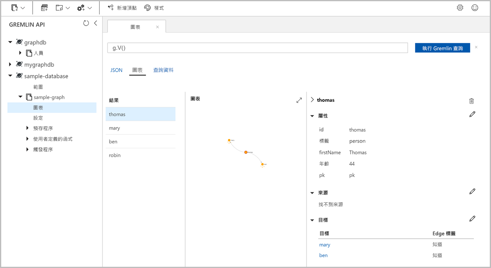

# <a name="quickstart-create-a-graph-database-in-azure-cosmos-db-using-python-and-the-azure-portal"></a>快速入門：使用 Python 和 Azure 入口網站在 Azure Cosmos DB 中建立圖形資料庫

> [!div class="op_single_selector"]
> * [Gremlin 主控台](create-graph-gremlin-console.md)
> * [.NET](create-graph-dotnet.md)
> * [Java](create-graph-java.md)
> * [Node.js](create-graph-nodejs.md)
> * [Python](create-graph-python.md)
> * [PHP](create-graph-php.md)
>  

本快速入門說明如何使用 Python 與 Azure Cosmos DB [Gremlin API](graph-introduction.md)，透過從 GitHub 複製範例來組建主控台應用程式。 本快速入門也會逐步引導您使用網頁型 Azure 入口網站建立 Azure Cosmos DB 帳戶。   

Azure Cosmos DB 是 Microsoft 的全域分散式多模型資料庫服務。 您可以快速建立及查詢文件、資料表、索引鍵/值及圖形資料庫，所有這些都受惠於位於 Azure Cosmos DB 核心的全域散發和水平調整功能。  

> [!NOTE]
> 此快速入門需要 2017 年 12 月 20 日之後建立的圖形資料庫帳戶。 現有帳戶在移轉至正式運作之後便會支援 Python。

## <a name="prerequisites"></a>必要條件

[!INCLUDE [quickstarts-free-trial-note](../../includes/quickstarts-free-trial-note.md)]或者，您可以[免費試用 Azure Cosmos DB](https://azure.microsoft.com/try/cosmosdb/)，無須 Azure 訂用帳戶，也無須任何費用和約定付款。

此外：
* [Python](https://www.python.org/downloads/) \(英文\) 3.5 版或更新版本
* [pip 套件管理員](https://pip.pypa.io/en/stable/installing/) \(英文\)
* [Git](https://git-scm.com/)
* [適用於 Gremlin 的 Python 驅動程式](https://github.com/apache/tinkerpop/tree/master/gremlin-python) \(英文\)

## <a name="create-a-database-account"></a>建立資料庫帳戶

您必須先使用 Azure Cosmos DB 建立 Gremlin (圖形) 資料庫帳戶，才可以建立圖形資料庫。

[!INCLUDE [cosmos-db-create-dbaccount-graph](../../includes/cosmos-db-create-dbaccount-graph.md)]

## <a name="add-a-graph"></a>新增圖形

[!INCLUDE [cosmos-db-create-graph](../../includes/cosmos-db-create-graph.md)]

## <a name="clone-the-sample-application"></a>複製範例應用程式

現在讓我們切換為使用程式碼。 我們將從 GitHub 複製 Gremlin API 應用程式、設定連接字串，然後加以執行。 您會看到，以程式設計方式來處理資料有多麼的容易。  

1. 開啟命令提示字元，建立名為 git-samples 的新資料夾，然後關閉命令提示字元。

    ```bash
    md "C:\git-samples"
    ```

2. 開啟 git 終端機視窗 (例如 git bash)，並使用 `cd` 命令變更至要安裝範例應用程式的資料夾。  

    ```bash
    cd "C:\git-samples"
    ```

3. 執行下列命令來複製範例存放庫。 此命令會在您的電腦上建立範例應用程式副本。 

    ```bash
    git clone https://github.com/Azure-Samples/azure-cosmos-db-graph-python-getting-started.git
    ```

## <a name="review-the-code"></a>檢閱程式碼

此為選用步驟。 若您想要瞭解如何在程式碼中建立資料庫資源，則可檢閱下列程式碼片段。 程式碼片段皆取自 C:\git-samples\azure-cosmos-db-graph-python-getting-started\ 資料夾中的 connect.py 檔案。 或者也可以直接跳至[更新您的連接字串](#update-your-connection-information)。 

* Gremlin `client` 是於 `connect.py` 的第 104 行初始化：

    ```python
    ...
    client = client.Client('wss://<YOUR_ENDPOINT>.gremlin.cosmosdb.azure.com:443/','g', 
        username="/dbs/<YOUR_DATABASE>/colls/<YOUR_COLLECTION_OR_GRAPH>", 
        password="<YOUR_PASSWORD>")
    ...
    ```

* `connect.py` 檔案開頭會宣告一連串的 Gremlin 步驟。 接著會使用 `client.submitAsync()` 方法執行那些步驟：

    ```python
    client.submitAsync(_gremlin_cleanup_graph)
    ```

## <a name="update-your-connection-information"></a>更新您的連線資訊

現在，返回 Azure 入口網站以取得連線資訊，並將其複製到應用程式中。 這些設定可讓您的應用程式與託管資料庫進行通訊。

1. 在 [Azure 入口網站](https://portal.azure.com/)中，按一下 [金鑰]  。 

    複製 URI 值的第一個部分。

    ![在 Azure 入口網站的 [金鑰] 頁面中，檢視並複製存取金鑰](./media/create-graph-python/keys.png)

2. 開啟 connect.py 檔案，並在第 104 行將 URI 值貼至下列程式碼的 `<YOUR_ENDPOINT>` 上：

    ```python
    client = client.Client('wss://<YOUR_ENDPOINT>.gremlin.cosmosdb.azure.com:443/','g', 
        username="/dbs/<YOUR_DATABASE>/colls/<YOUR_COLLECTION_OR_GRAPH>", 
        password="<YOUR_PASSWORD>")
    ```

    用戶端物件的 URI 部分現在看起來應該類似以下程式碼：

    ```python
    client = client.Client('wss://test.gremlin.cosmosdb.azure.com:443/','g', 
        username="/dbs/<YOUR_DATABASE>/colls/<YOUR_COLLECTION_OR_GRAPH>", 
        password="<YOUR_PASSWORD>")
    ```

3. 變更 `client` 物件的第二個參數，來取代 `<YOUR_DATABASE>` 和 `<YOUR_COLLECTION_OR_GRAPH>` 字串。 如果您使用建議的值，參數看起來應該類似以下程式碼：

    `username="/dbs/sample-database/colls/sample-graph"`

    整個 `client` 物件現在看起來應該類似以下程式碼：

    ```python
    client = client.Client('wss://test.gremlin.cosmosdb.azure.com:443/','g', 
        username="/dbs/sample-database/colls/sample-graph", 
        password="<YOUR_PASSWORD>")
    ```

4. 在 Azure 入口網站中，使用複製按鈕複製 PRIMARY KEY，然後將其貼上至 `password=<YOUR_PASSWORD>` 參數中的 `<YOUR_PASSWORD>`。

    整個 `client` 物件定義現在看起來應該類似以下程式碼：
    ```python
    client = client.Client('wss://test.gremlin.cosmosdb.azure.com:443/','g', 
        username="/dbs/sample-database/colls/sample-graph", 
        password="asdb13Fadsf14FASc22Ggkr662ifxz2Mg==")
    ```

6. 儲存 `connect.py` 檔案。

## <a name="run-the-console-app"></a>執行主控台應用程式

1. 在 git 終端機視窗中，`cd` 至 azure-cosmos-db-graph-python-getting-started 資料夾。

    ```git
    cd "C:\git-samples\azure-cosmos-db-graph-python-getting-started"
    ```

2. 在 git 終端機視窗中，使用下列命令來安裝所需的 Python 套件。

   ```
   pip install -r requirements.txt
   ```

3. 在 git 終端機視窗中，使用下列命令來啟動 Python 應用程式。
    
    ```
    python connect.py
    ```

    終端機視窗會顯示新增至圖形的頂點和邊緣。 
    
    如果遇到逾時錯誤，請檢查您已在[更新您的連線資訊](#update-your-connection-information)中正確更新連線資訊，也請嘗試重新執行最後一個命令。 
    
    程式停止後，按 Enter，然後在網際網路瀏覽器中切換回 Azure 入口網站。

<a id="add-sample-data"></a>
## <a name="review-and-add-sample-data"></a>檢閱並新增範例資料

在插入頂點和邊緣之後，您現在可以移回 [資料總管] 並查看已新增到圖行的頂點，然後新增額外的資料點。

1. 按一下 [資料總管]  ，展開 **sample-graph**，按一下 [圖形]  ，然後再按一下 [套用篩選條件]  。 

   ![在 Azure 入口網站的 [資料總管] 中建立新文件](./media/create-graph-python/azure-cosmosdb-data-explorer-expanded.png)

2. 在 [結果]  清單中，請注意圖形中已新增三個使用者。 您可以拖放移動周圍的頂點、捲動滑鼠滾輪執行縮放、使用雙箭號展開圖形大小。 

   

3. 現在來加入一些新使用者。 按一下 [新增頂點]  按鈕，將資料新增至您的圖形。

   ![在 Azure 入口網站的 [資料總管] 中建立新文件](./media/create-graph-python/azure-cosmosdb-data-explorer-new-vertex.png)

4. 輸入*人員*的標籤。

5. 按一下 [新增屬性]  ，以新增以下各項屬性。 請注意，您可以在圖形中為每個人建立獨特的屬性。 只需要識別碼索引鍵。

    索引鍵|value|注意
    ----|----|----
    pk|/pk| 
    id|ashley|頂點的唯一識別碼。 如果您未指定識別碼，系統會為您產生一個。
    gender|female| 
    tech | java | 

    > [!NOTE]
    > 在本快速入門中，建立非資料分割集合。 不過，如果您藉由在集合建立期間指定資料分割索引鍵來建立資料分割集合，您就必須包含資料分割索引鍵作為每個新頂點的索引鍵。 

6. 按一下 [確定]  。 您可能需要展開畫面，才能在螢幕底部看到 [確定]  。

7. 再次按一下 [新增頂點]  並新增額外的新使用者。 

8. 輸入*人員*的標籤。

9. 按一下 [新增屬性]  ，以新增以下各項屬性：

    索引鍵|value|注意
    ----|----|----
    pk|/pk| 
    id|rakesh|頂點的唯一識別碼。 如果您未指定識別碼，系統會為您產生一個。
    gender|male| 
    school|MIT| 

10. 按一下 [確定]  。 

11. 按一下 [套用篩選條件]  按鈕，預設的 `g.V()` 篩選條件會顯示圖形中的所有值。 所有使用者現在會顯示在 [結果]  清單中。 

    隨著您新增更多的資料，您可以使用篩選條件來限制您的結果。 依預設，[資料總管] 會使用 `g.V()` 擷取圖形中的所有頂點。 您可將其變更為不同的[圖形查詢](tutorial-query-graph.md) (例如 `g.V().count()`)，以使用 JSON 格式傳回圖形中所有頂點的計數。 若您變更篩選條件，請將篩選條件變更回 `g.V()`，然後按一下 [套用篩選條件]  ，即可再次顯示所有的結果。

12. 現在我們可以連線 rakesh 和 ashley。 請確定已在 [結果]  清單中選取 **ashley**，然後按一下右下方 [目標]  旁邊的編輯按鈕。 您可能需要加寬視窗，才可看到 [屬性]  區域。

    

13. 在 [目標]  方塊中輸入 rakesh  ，並在 [邊緣標籤]  方塊中輸入 knows  ，然後按一下核取方塊。

    ![在 [資料總管] 中新增 ashley 與 rakesh 之間的連線](./media/create-graph-python/azure-cosmosdb-data-explorer-set-target.png)

14. 現在從 [結果] 清單中選取 **rakesh** 並查看 ashley 與 rakesh 是否已連線。 

    ![[資料總管] 中連線的兩個頂點](./media/create-graph-python/azure-cosmosdb-graph-explorer.png)

    這會完成本教學課程中的資源建立部分。 您可以繼續將頂點新增至圖形、修改現有的頂點，或是變更查詢。 現在讓我們檢閱 Azure Cosmos DB 提供的計量，然後再清除資源。 

## <a name="review-slas-in-the-azure-portal"></a>在 Azure 入口網站中檢閱 SLA

[!INCLUDE [cosmosdb-tutorial-review-slas](../../includes/cosmos-db-tutorial-review-slas.md)]

## <a name="clean-up-resources"></a>清除資源

[!INCLUDE [cosmosdb-delete-resource-group](../../includes/cosmos-db-delete-resource-group.md)]

## <a name="next-steps"></a>後續步驟

在本快速入門中，您已了解如何建立 Azure Cosmos DB 帳戶、如何使用 [資料總管] 來建立圖形，以及如何執行應用程式。 您現在可以使用 Gremlin 來建置更複雜的查詢和實作強大的圖形周遊邏輯。 

> [!div class="nextstepaction"]
> [使用 Gremlin 進行查詢](tutorial-query-graph.md)

