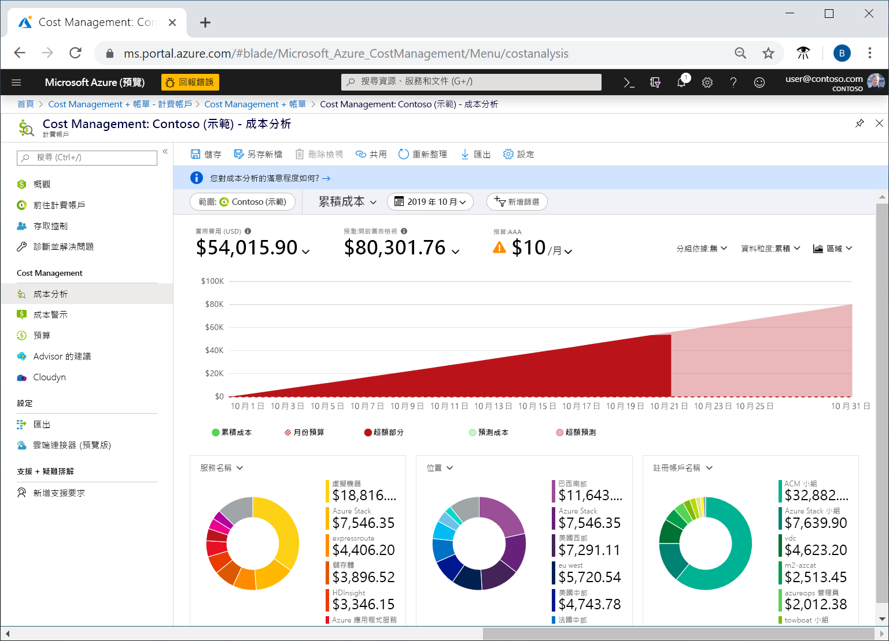
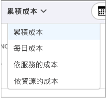
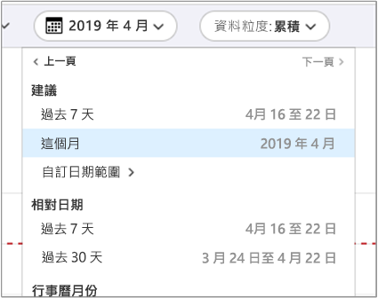
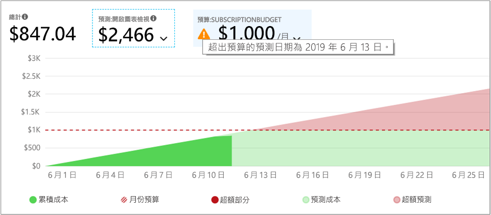
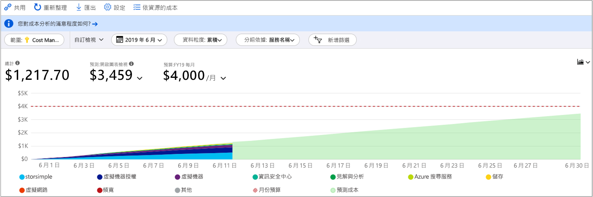
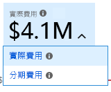
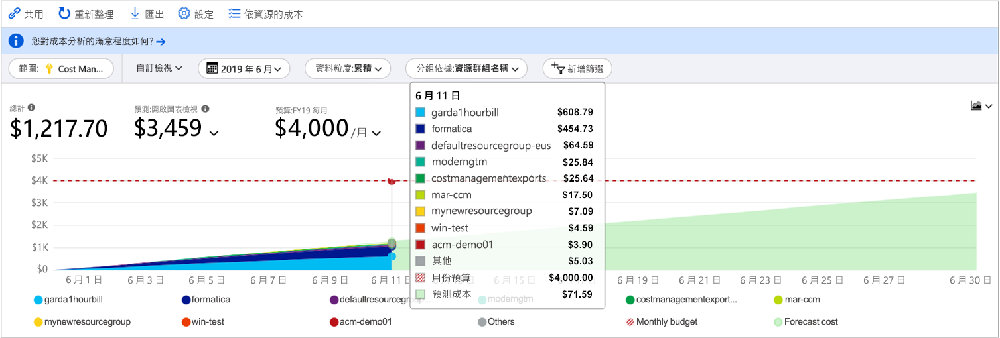
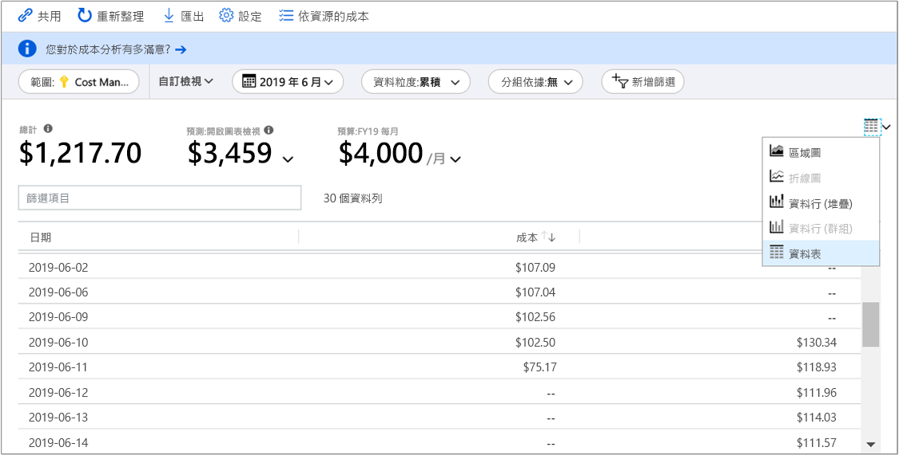

# <a name="quickstart-explore-and-analyze-costs-with-cost-analysis"></a>快速入門：使用成本分析探索及分析成本

您必須先了解成本源自組織內的何處，才能正確地控制 Azure 成本並進行最佳化。 了解您的服務成本，以及支援哪些環境與系統也很實用。 使各個層面的成本透明化，對於精確地了解組織費用模式而言至關重要。 您可以使用費用模式來強制執行成本控制機制 (例如預算)。

在本快速入門中，您可以使用成本分析來探索及分析組織成本。 您可依組織檢視彙總的成本，以了解經過一段時間所產生的成本，並找出費用趨勢。 您可以檢視經過一段時間累積的成本，對照預算來預估每月、每季，或甚至每年的成本趨勢。 預算有助於遵守財務限制。 預算同時也能用於檢視每天或每月的成本，以找出費用的異常情況。 此外，您可以下載目前報表的資料以供進一步分析，或在外部系統中使用。

在此快速入門中，您可了解如何：

- 在成本分析中檢閱成本
- 自訂成本檢視
- 下載成本分析資料


## <a name="prerequisites"></a>Prerequisites

成本分析支援不同的 Azure 帳戶類型。 若要檢視所支援帳戶類型的完整清單，請參閱[了解成本管理資料](understand-cost-mgt-data.md)。 若要檢視成本資料，您至少需要 Azure 帳戶的讀取存取。

如需 Azure 成本管理資料的存取權指派相關資訊，請參閱[指派資料的存取權](../../cost-management/assign-access-acm-data.md)。

## <a name="sign-in-to-azure"></a>登入 Azure

- 在 https://portal.azure.com 登入 Azure 入口網站。

## <a name="review-costs-in-cost-analysis"></a>在成本分析中檢閱成本

若要在成本分析中檢閱您的成本，請在 Azure 入口網站中開啟範圍，然後選取功能表中的 [成本分析]  。 例如，移至 [訂用帳戶]  、從清單中選取訂用帳戶，然後在功能表中選取 [成本分析]  。 使用 [範圍]  框，以切換至成本分析中的不同範圍。 如需有關範圍的詳細資訊，請參閱[了解並使用範圍](understand-work-scopes.md)。

您選取的範圍會在成本管理過程中全程使用，以提供資料彙總，並控制成本資訊的存取權。 當您使用範圍時，您不會多重選取。 而是會選取一個其他項目所積存的較大範圍，然後篩選出需要的巢狀範圍。 了解這個方法很重要，因為某些人並沒有單一父項範圍 (包含多個巢狀範圍) 的存取權。

最初的成本分析檢視包含下列區域。

**累積成本檢視**：代表預先定義的成本分析檢視設定。 每個檢視都包含日期範圍、資料粒度、分組依據和篩選條件設定。 預設檢視會顯示目前計費週期的累積成本，但您也可以變更為其他內建檢視。 如需詳細資訊，請參閱[自訂成本檢視](#customize-cost-views)。

**實際成本**：顯示當月所產生的實際使用量和購買成本，這些資料也會在您的帳單上顯示。

**預測**：顯示所選期間的總預測成本。 (預測功能目前為預覽版。)

**預算**：顯示已針對所選取範圍規劃的費用限制 (如果有的話)。

**累積資料粒度**：顯示從計費週期起始日開始的每日成本累積總額。 在為計費帳戶或訂用帳戶[建立預算](tutorial-acm-create-budgets.md)之後，即可對照預算，快速查看費用趨勢。 將滑鼠停留在一個日期上方，即可檢視累積到當天的費用。

**樞紐分析圖 (環圈圖)** ：提供動態樞紐分析，將總成本依一組常用的標準屬性進行細分。 它們會顯示目前月份的最大到最小成本。 您隨時都可選取不同的樞紐分析表來變更樞紐分析圖。 成本會依據服務 (計量類別)、位置 (區域)，以及子範圍 (預設) 來進行分類。 例如，計費帳戶下的註冊帳戶、訂用帳戶下的資源群組，以及資源群組下的資源。



## <a name="customize-cost-views"></a>自訂成本檢視

成本分析具備四個內建的檢視，並已針對最常見的目標最佳化：

檢視 | 回答如下問題
--- | ---
累積成本 | 我這個月到目前為止支出了多少費用？ 我將維持在預算範圍內嗎？
每日成本 | 過去 30 天每天的成本是否增加？
依服務區分的成本 | 為什麼過去三張發票列出的每月使用量落差很大？
依資源區分的成本 | 這個月到目前為止，哪一項資源最花錢？



不過，在許多情況下，您需要更深入的分析。 自訂會從選取頁面上方的日期開始。

成本分析預設會顯示當月的資料。 請使用日期選取器快速切換至一般的日期範圍。 範例包括過去七天、過去一個月、今年，或自訂日期範圍。 隨用隨付訂用帳戶也會包含以您的計費週期 (例如目前或上一張發票的計費週期) 為依據的資料範圍，且計費週期不受日曆月份限制。 可使用功能表頂端的 [< 上一個]  和 [下一個 >]  連結，分別跳至上一個或下一個週期。 例如，[<上一個]  會從 [過去 7 天]  切換至 [之前 8 到 14 天]  或 [之前 15 至 21 天]  。



此外，成本分析預設會顯示**累積**的成本。 累積的成本會包含每一天和之前天數的所有成本，以提供每日累積成本的持續成長檢視。 此檢視已經過最佳化，可顯示對照於所選時間範圍，您的預算趨勢為何。

使用預測圖表檢視找出潛在的預算缺口。 若有潛在的預算缺口，便會以紅色字體顯示預計的超額支出。 圖表中也會顯示指標符號。 將滑鼠停留在該符號上，便會顯示估計會產生預算缺口的日期。



另外，還有**每日**檢視，可顯示每一天的成本。 每日檢視並不會顯示成長趨勢。 因為成本尖峰或下降每日各有不同，所以該檢視設計為可顯示異常。 若您選取了預算，則每日檢視也會顯示每日預算的估計值。

若您的每日成本持續高於估計的每日預算，則您可預期將會超過每月預算。 估計的每日預算是協助您在較低層級將預算視覺化的一種方法。 當您的每日成本出現波動時，則相較於您的每月預算，估計的每日預算較不精準。

以下是開啟了費用預測的最新費用每日檢視。


若關閉費用預測，就不會看到未來日期的預計花費。 此外，當您查看過去時段的成本時，成本預測也不會顯示成本。

一般而言，您可以預期會在 8 到 12 小時內看到已耗用資源的資料或通知。


可使用 [分組方式]  依適用屬性分組，以細分成本並識別成本最高的參與者。 例如，若要依資源標記分組，請選取要作為分組方式的標記索引鍵。 系統就會依每個標記值細分成本，並提供一個額外區段以顯示未套用該標記的資源。

大部分的 [Azure 資源都支援標記](../../azure-resource-manager/management/tag-support.md)。 不過，某些標記無法在成本管理和計費中使用。 此外，也不支援資源群組標記。 標記支援適用於將標記套用至資源「之後」  所回報的使用量。 您無法追溯套用標記以彙總成本。

觀看[如何使用 Azure 成本管理檢閱標記原則](https://www.youtube.com/watch?v=nHQYcYGKuyw)影片，了解如何運用 Azure 標記原則提升成本資料可見性。

以下是當月 Azure 服務成本的檢視。



根據預設，成本分析會顯示所有產生的使用量和購買成本，且這些資料也會顯示在您的發票上，而這也稱為**實際成本**。 檢視實際成本適合用來進行發票對帳。 不過，如果您留意費用異常之處和其他成本變化，購買成本激增可能會讓您感到擔憂。 若要讓因為購買保留容量而造成成本激增的情形消失，請切換為 [分攤成本]  。



分攤成本會將購買的保留容量細分成每日區塊，並將其分散到保留容量期間的整個時段。 例如，您不會看到 1 月 1 日購買了 365 美元，而是會看到 1 月 1 日到 12 月 31 日每天購買 1 美元。 除了基本攤銷，這些成本也會透過使用已使用該保留容量的特定資源來重新配置且相關聯。 例如，如果該筆 1 美元的每日費用由兩部虛擬機器攤銷，您會看到當天有兩筆 0.50 美元的費用。 如果當天並未使用部分保留容量，您會看到一筆與適用虛擬機器相關聯的 0.50 美元費用，以及一筆收費類型為 `UnusedReservation` 的 0.50 美元費用。 請注意，只有在檢視攤銷成本時，才會看到未使用的保留容量成本。

由於成本的呈現方式會改變，請務必注意實際成本和分攤成本檢視所顯示的總額會不同。 一般而言，在檢視攤銷成本時，有購買保留容量的月份，其總成本會減少，而在購買保留容量後的月份，則會增加。 攤銷功能僅適用於購買的保留容量，目前並不適用於 Azure Marketplace 的購買項目。

下圖顯示資源群組名稱。 您可以依標籤分組以檢視每個標籤的總成本，也可以使用**依資源的成本**檢視以查看特定資源的所有標籤。



依特定屬性將成本分組時，會以最高至最低的順序，顯示前 10 名成本參與者。 如果超過10個，則會顯示前九個成本參與者與**其他**群組，以代表所有剩餘的群組合併。 當您依標記分組時，針對未套用標記索引鍵的成本會顯示 [未標記]  群組。 **未標記**一律放在最後，即使未標記的成本高於已標記的成本也一樣。 如果有 10 個以上的標記值存在，未標記的成本會包含在 [其他]  中。 切換至 [資料表] 檢視，並將資料細微性變更為 [無]  ，以查看從最高到最低成本排序的所有值。

「傳統」虛擬機器、網路與儲存體資源不會共用詳細的計費資料。 這些資源會在成本分組時合併成 [傳統服務]  。

主要圖表下的樞紐分析圖會顯示不同的群組，可讓您用更廣泛的視角來檢視所選期間與篩選條件下的整體成本。 選取屬性或標記來檢視以任何維度彙總的成本。


您可以檢視任何檢視的完整資料集。 您所套用的任何選取項目或篩選條件都會影響所顯示的資料。 若要查看完整的資料集，請選取 [圖表類型]  清單，然後選取 [資料表]  檢視。




## <a name="understanding-grouping-and-filtering-options"></a>了解群組和篩選選項

下表列出部分最常見的群組和篩選選項，以及其使用時機。

| 屬性 | 使用時機 |
| --- | --- |
| **計費週期** | 依發票月份細分成本。 此選項對於隨用隨付和開發/測試訂用帳戶來說很重要，不會繫結至行事曆月份。 EA/MCA 帳戶可以在日期選擇器或每月資料粒度中使用行事曆月份，來達到相同目標。 |
| **收費類型** | 細分使用量、購買金額、退款和未使用的保留容量成本。 只有在使用動作成本且不是使用攤銷成本時，才能使用購買的保留容量和退款。 只有在查看攤銷成本時，才能使用未使用的保留容量成本。 |
| **Cloud** | 依 AWS 和 Azure 細分成本。 只能從管理群組、外部計費帳戶和外部訂用帳戶看到 AWS 成本。 |
| **部門** / **發票區段** | 依 EA 部門或 MCA 發票區段細分成本。 此選項僅適用於 EA/MCA 計費帳戶與 MCA 帳單設定檔。 |
| **註冊帳戶** | 依照 EA 帳戶擁有者細分成本。 此選項僅適用於 EA 計費帳戶與部門。 |
| **頻率** | 細分以使用量為基礎、一次性和週期性的成本。 |
| **計量** | 依 Azure 使用量計量細分成本。 此選項僅適用於 Azure 使用量。 所有購買項目與 Marketplace 使用量都會顯示為「未指定」  或「未指派」  。 |
| **發行者類型** | 細分 AWS、Azure 和 Marketplace 成本。 |
| **保留容量** | 依保留容量細分成本。 未包含保留容量的任何使用量都會顯示為「未指定」  。 |
| **Resource** | 依資源細分成本。 所有購買項目都會顯示為「未指定」  ，因為其套用在 EA/PAYG 計費帳戶或 MCA 帳單設定檔層級。  |
| **資源群組** | 依資源群組細分成本。 此選項僅適用於非傳統使用量。 傳統資源使用量會顯示為「其他」  ，購買項目則會顯示為「未指定」  。 |
| **資源類型** | 依資源類型細分成本。 此選項僅適用於非傳統使用量。 傳統資源使用量會顯示為「其他」  ，購買項目則會顯示為「未指定」  。 |
| **服務名稱**或**計量類別** | 依 Azure 服務細分成本。 此選項僅適用於 Azure 使用量。 所有購買項目與 Marketplace 使用量都會顯示為「未指定」  或「未指派」  。 |
| **服務層**或**計量子類別** | 依 Azure 使用量計量子類別細分成本。 此選項僅適用於 Azure 使用量。 所有購買項目與 Marketplace 使用量都會顯示為「未指定」  或「未指派」  。 |
| **訂用帳戶** | 依訂用帳戶細分成本。 所有購買項目都會顯示「未指定」  。 |
| **Tag** | 依特定標籤金鑰的標籤值細分成本。 |

如需術語的詳細資訊，請參閱[了解 Azure 使用量和費用檔案中所使用的術語](../understand/understand-usage.md)。


## <a name="saving-and-sharing-customized-views"></a>儲存和共用自訂檢視

若要儲存自訂檢視並與其他人共用，請將成本分析釘選到 Azure 入口網站儀表板，或是複製成本分析的連結。

若要釘選成本分析，選取右上角的釘選圖示。 釘選成本分析只會儲存主要的圖表或資料表檢視。 請共用儀表板來讓其他人可以存取圖格。 請注意，這只會共用儀表板設定，而不會授與其他人存取基礎資料的權限。 如果您沒有成本存取權，但可以存取共用儀表板，您將會看到「存取遭拒」訊息。

若要共用成本分析的連結，請選取刀鋒視窗頂端的 [共用]  。 此時會顯示自訂 URL，它可以開啟此特定範圍的此特定檢視。 如果您沒有成本存取權並取得此 URL，您會看到「存取遭拒」訊息。

若要深入了解如何為每個支援範圍授與其成本的存取權，請檢閱[了解和使用範圍](understand-work-scopes.md)。

## <a name="automation-and-offline-analysis"></a>自動化和離線分析

有時候當您需要下載資料以便進一步分析時，請將其合併到您的自有資料中，或將其整合到您的自有系統。 成本管理功能可提供一些不同的選項。 作為起點，如果您需要一個臨機操作高階摘要 (就像您在成本分析中取得的內容)，請建置您需要的檢視。 然後選取 [匯出]  ，並選取 [將資料下載至 CSV]  或 [將資料下載至 Excel]  來下載它。 下載到 Excel 可針對您用來產生所下載資料的檢視提供額外的內容，例如範圍、查詢設定、總計和產生日期。

如果您需要完整的未彙總資料集，請從計費帳戶下載。 然後，從入口網站左側瀏覽窗格的服務清單中，移至 [成本管理 + 計費]  。 選取您的計費帳戶 (如果適用)。 移至 [使用方式 + 費用]  ，然後選取所需計費週期的 [下載]  圖示。

採取類似的方法來自動化成本資料接收作業。 使用[查詢 API](/rest/api/cost-management/query) 以便獲得更豐富的動態篩選、群組和彙總等分析功能，或使用 [UsageDetails API](/rest/api/consumption/usageDetails) 來獲得完整的未彙總資料集。 這些 API 的公開推出 (GA) 版本是 2019-01-01。 若要能夠在這些 API 內存取預覽版的保留容量和 Marketplace 購買項目，請使用 **2019-04-01-preview**。

例如，下列是依費用類型 (使用量、購買項目或退款)、發行者類型 (Azure 或 Marketplace)、資源群組 (若為購買項目則空白) 與保留容量 (如果不適用則會空白) 細分攤銷成本的彙總檢視。

```
POST https://management.azure.com/{scope}/providers/Microsoft.CostManagement/query?api-version=2019-04-01-preview
Content-Type: application/json

{
  "type": "AmortizedCost",
  "timeframe": "Custom",
  "timePeriod": { "from": "2019-04-01", "to": "2019-04-30" },
  "dataset": {
    "granularity": "None",
    "aggregation": {
      "totalCost": { "name": "PreTaxCost", "function": "Sum" }
    },
    "grouping": [
      { "type": "dimension", "name": "ChargeType" },
      { "type": "dimension", "name": "PublisherType" },
      { "type": "dimension", "name": "Frequency" },
      { "type": "dimension", "name": "ResourceGroup" },
      { "type": "dimension", "name": "SubscriptionName" },
      { "type": "dimension", "name": "SubscriptionId" },
      { "type": "dimension", "name": "ReservationName" },
      { "type": "dimension", "name": "ReservationId" },
    ]
  },
}
```

而且，如果您不需要彙總的資料而想要完整的原始資料集：

```
GET https://management.azure.com/{scope}/providers/Microsoft.Consumption/usageDetails?metric=AmortizedCost&$filter=properties/usageStart+ge+'2019-04-01'+AND+properties/usageEnd+le+'2019-04-30'&api-version=2019-04-01-preview
```

如果您需要實際成本功能顯示所產生的購買項目，請將 [類型/計量]   變更為 [ActualCost]  。 如需這些 API 的詳細資訊，請參閱[查詢](/rest/api/cost-management/query)和 [UsageDetails](/rest/api/consumption/usageDetails) API 文件。 請注意，所發佈的文件適用於公開推出版本。 不過，這兩份文件的內容對於 *2019-04-01-preview* API 版本來說都一樣，只有新類型/計量屬性和已變更的屬性名稱會有不同。 (如需詳細資訊，請參閱下方更多關於屬性名稱的說明。)

成本管理 API 適用於所有資源範圍：資源群組、訂用帳戶與管理群組；EA 計費帳戶 (註冊)；部門；以及透過 EA 入口網站存取的註冊帳戶等等。 請在[了解並使用範圍](understand-work-scopes.md)中深入了解範圍，包括如何判斷範圍識別碼或管理存取權。

## <a name="next-steps"></a>後續步驟

請前進到第一個教學課程，了解如何建立及管理預算。

> [!div class="nextstepaction"]
> [建立及管理預算](tutorial-acm-create-budgets.md)
