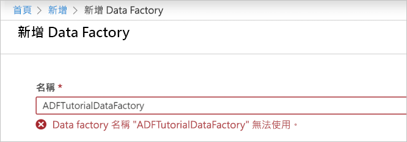

# <a name="copy-data-from-an-on-premises-sql-server-database-to-azure-blob-storage"></a>將資料從內部部署 SQL Server 資料庫複製到 Azure Blob 儲存體
在本教學課程中，您會使用 Azure Data Factory 使用者介面 (UI) 來建立資料處理站管線，以將資料從內部部署 SQL Server 資料庫複製到 Azure Blob 儲存體。 您要建立及使用自我裝載的整合執行階段，其會在內部部署與雲端資料存放區之間移動資料。

> [!NOTE]
> 本文不提供 Data Factory 的詳細簡介。 如需詳細資訊，請參閱 [Data Factory 簡介](introduction.md)。

在本教學課程中，您會執行下列步驟：

> [!div class="checklist"]
> * 建立資料處理站。
> * 建立自我裝載整合執行階段。
> * 建立 SQL Server 和 Azure 儲存體連結的服務。
> * 建立 SQL Server 和 Azure Blob 資料集。
> * 建立具有複製活動的管線來移動資料。
> * 啟動管線執行。
> * 監視管道執行。

## <a name="prerequisites"></a>Prerequisites
### <a name="azure-subscription"></a>Azure 訂用帳戶
開始之前，如果您還沒有 Azure 訂用帳戶，[請建立免費帳戶](https://azure.microsoft.com/free/)。

### <a name="azure-roles"></a>Azure 角色
若要建立資料處理站執行個體，您用來登入 Azure 的使用者帳戶必須具備「參與者」或「擁有者」角色，或必須是 Azure 訂用帳戶的「管理員」。

若要檢視您在訂用帳戶中擁有的權限，請前往 Azure 入口網站。 在右上角中，選取使用者名稱，然後選取 [權限]。 如果您有多個訂用帳戶的存取權，請選取適當的訂用帳戶。 如需如何將使用者新增至角色的範例指示，請參閱[使用 RBAC 和 Azure 入口網站來管理存取權](../role-based-access-control/role-assignments-portal.md)。

### <a name="sql-server-2014-2016-and-2017"></a>SQL Server 2014、2016 和 2017
在本教學課程中，您會使用內部部署 SQL 資料庫作為「來源」資料存放區。 您在本教學課程中建立於 Data Factory 的管線會將資料從此內部部署 SQL Server 資料庫 (來源) 複製到 Blob 儲存體 (接收)。 然後在 SQL Server 資料庫中建立名為 **emp** 的資料表，並在資料表中插入幾個範例項目。

1. 啟動 SQL Server Management Studio。 如果它尚未安裝在機器上，請移至[下載 SQL Server Management Studio](https://docs.microsoft.com/sql/ssms/download-sql-server-management-studio-ssms)。

1. 使用您的認證連線到 SQL Server 執行個體。

1. 建立範例資料庫。 在樹狀檢視中，以滑鼠右鍵按一下 [資料庫]，然後選取 [新增資料庫]。
1. 在 [新增資料庫] 視窗中，輸入資料庫的名稱，然後選取 [確定]。

1. 若要建立 **emp** 資料表並在其中插入一些範例資料，請針對資料庫執行下列查詢指令碼。 在樹狀檢視中，以滑鼠右鍵按一下您建立的資料庫，然後選取 [新增查詢]。

   ```
    CREATE TABLE dbo.emp
    (
        ID int IDENTITY(1,1) NOT NULL,
        FirstName varchar(50),
        LastName varchar(50)
    )
    GO

    INSERT INTO emp (FirstName, LastName) VALUES ('John', 'Doe')
    INSERT INTO emp (FirstName, LastName) VALUES ('Jane', 'Doe')
    GO
   ```

### <a name="azure-storage-account"></a>Azure 儲存體帳戶
在本教學課程中，您可以使用一般用途的 Azure 儲存體帳戶 (特別是 Blob 儲存體) 作為目的地/接收資料存放區。 如果您沒有一般用途的 Azure 儲存體帳戶，請參閱[建立儲存體帳戶](../storage/common/storage-account-create.md)戶。 您在本教學課程中建立於 Data Factory 的管線會將資料從內部部署 SQL Server 資料庫 (來源) 複製到 Blob 儲存體 (接收)。 

#### <a name="get-the-storage-account-name-and-account-key"></a>取得儲存體帳戶名稱和帳戶金鑰
您會在此教學課程中使用儲存體帳戶的名稱和金鑰。 採取下列步驟，以取得儲存體帳戶的名稱和金鑰：

1. 使用您的使用者名稱和密碼登入 [Azure 入口網站](https://portal.azure.com)。

1. 在左側窗格中選取 [所有服務]。 使用 **Storage** 關鍵字進行篩選，然後選取 [儲存體帳戶]。

    

1. 在儲存體帳戶清單中，篩選您的儲存體帳戶 (如有需要)。 然後選取您的儲存體帳戶。

1. 在 [儲存體帳戶] 視窗中，選取 [存取金鑰]。

1. 在 [儲存體帳戶名稱] 和 [金鑰1] 方塊中複製值，然後將它們貼到 [記事本] 或另一個編輯器中，以供稍後在教學課程中使用。

#### <a name="create-the-adftutorial-container"></a>建立 adftutorial 容器
在這一節中，您會在 Blob 儲存體中建立一個名為 **adftutorial** 的 Blob 容器。

1. 在 [儲存體帳戶] 視窗中，移至 [概觀]，然後選取 [Blob]。

    

1. 在 [Blob 服務] 視窗中，選取 [容器]。

1. 在 [新增容器] 視窗中的 [名稱] 下，輸入 **adftutorial**。 然後選取 [確定]。

1. 在容器清單中選取 [adftutorial]。

1. 保留 [容器] 視窗以供 **adftutorial** 開啟。 您可以在本快速入門結尾處使用它來確認輸出。 Data Factory 會在此容器中自動建立輸出資料夾，因此您不需要建立輸出資料夾。

## <a name="create-a-data-factory"></a>建立 Data Factory
在此步驟中，您可以建立資料處理站，並啟動 Data Factory 使用者介面，在資料處理站中建立管線。

1. 開啟 **Microsoft Edge** 或 **Google Chrome** 網頁瀏覽器。 目前，只有 Microsoft Edge 和 Google Chrome 網頁瀏覽器支援 Data Factory UI。
1. 在左側功能表上，選取 [建立資源] > [分析] > [資料處理站]：

   ![在 [新增] 窗格中選取資料處理站](./media/doc-common-process/new-azure-data-factory-menu.png)

1. 在 [新增資料處理站] 頁面的 [名稱] 下，輸入 **ADFTutorialDataFactory**。

   資料處理站的名稱必須是「全域唯一」的名稱。 如果您在 [名稱] 欄位看到下列錯誤訊息，請變更資料處理站的名稱 (例如 yournameADFTutorialDataFactory)。 如需 Data Factory 成品的命名規則，請參閱 [Data Factory 命名規則](naming-rules.md)。

   

1. 選取您要在其中建立資料處理站的 Azure **訂用帳戶**。
1. 針對 [資源群組]，採取下列其中一個步驟︰

   - 選取 [使用現有的]，然後從下拉式清單選取現有的資源群組。

   - 選取 [建立新的]，然後輸入資源群組的名稱。
        
     若要了解資源群組，請參閱[使用資源群組管理您的 Azure 資源](../azure-resource-manager/management/overview.md)。
1. 在 [版本] 下，選取 [V2]。
1. 在 [位置] 下，選取資料處理站的位置。 只有受到支援的位置會顯示在下拉式清單中。 Data Factory 所使用的資料存放區 (例如儲存體和 SQL Database) 和計算 (例如 Azure HDInsight) 可位於其他區域。
1. 選取 [建立]。

1. 建立完成之後，您會看到如圖中所示的 [Data Factory] 頁面：

    
1. 選取 [編寫與監視] 圖格，以在個別索引標籤中啟動 Data Factory 使用者介面。


## <a name="create-a-pipeline"></a>建立管線

1. 在 [現在就開始吧] 頁面中，選取 [建立管線]。 系統會自動為您建立管線。 您會在樹狀檢視中看到管線及其開啟的編輯器。

   

1. 在底部 [屬性] 視窗的 [一般] 索引標籤上，針對 [名稱] 輸入 **SQLServerToBlobPipeline**。

   

1. 在 [活動] 工具箱中，展開 [移動和轉換]。 將 [複製] 活動拖放至管線設計介面。 將這個活動的名稱設定為 **CopySqlServerToAzureBlobActivity**。

1. 在 [屬性] 視窗中，移至 [來源] 索引標籤，然後選取 [+ 新增]。

1. 在 [新增資料集] 對話方塊中，搜尋 **SQL Server**。 選取 **SQL Server**，然後選取 [繼續]。

1. 在 [設定屬性] 對話方塊中，於 [名稱] 底部輸入 **SqlServerDataset**。 在 [連結服務] 底下選取 [+ 新增]。 您會在此步驟中建立來源資料存放區 (SQL Server 資料庫) 的連線。

1. 在 [新增連結服務] 對話方塊中，新增 **SqlServerLinkedService** 作為 [名稱]。 在 [透過整合執行階段連線] 下，選取 [+ 新增]。  在本節中，您可以建立自我裝載整合執行階段，並使用 SQL Server 資料庫將它與內部部署電腦產生關聯。 自我裝載的整合執行階段是一項元件，可將資料從您機器上的 SQL Server 資料庫複製到 Blob 儲存體。

1. 在 [整合執行階段設定] 對話方塊中，選取 [自我裝載]，然後選取 [下一步]。

1. 在名稱底下，輸入 **TutorialIntegrationRuntime**。 然後選取 [下一步]。

1. 在 [設定] 中，選取 [按一下這裡啟動此電腦的快速設定]。此動作會在您的機器上安裝整合執行階段，並使用 Data Factory 進行註冊。 或者，您可以使用手動安裝選項來下載安裝檔案、執行它，並使用金鑰來註冊整合執行階段。

1. 在 [Integration Runtime (自我裝載) 快速安裝] 視窗中，選取 [關閉]。

    

1. 在 [新增連結服務] 對話方塊中，確認已在 [透過整合執行階段連線] 下選取 [TutorialIntegrationRuntime]。 然後採取下列步驟：

    a. 在 [名稱] 下輸入 **SqlServerLinkedService**。

    b. 在 [伺服器名稱] 下，輸入 SQL Server 執行個體的名稱。

    c. 在 [資料庫名稱] 下，輸入具有 **emp** 資料表的資料庫名稱。

    d. 在 [驗證類型] 下，選取適當的驗證類型供 Data Factory 用來連線到 SQL Server 資料庫。

    e. 在 [使用者名稱] 和 [密碼] 下，輸入使用者名稱和密碼。 如果您需要在使用者帳戶或伺服器名稱中使用反斜線 (\\)，請在它的前面加上逸出字元 (\\)。 例如，使用 mydomain *\\myuser\\* 。

    f. 選取 [測試連線]。 此步驟是為了確認 Data Factory 可以使用您建立的自我裝載整合執行階段，連線到 SQL Server 資料庫。

    g. 若要儲存連結服務，請選取 [完成]。

1. 您應該會回到視窗，且此時來源資料集是開啟狀態。 在 [屬性] 視窗的 [連線] 索引標籤上，採取下列步驟：

    a. 在 [連結服務] 中，確認您有看到 **SqlServerLinkedService**。

    b. 在 [資料表] 中，選取 **[dbo].[emp]** 。

1. 移至 **SQLServerToBlobPipeline** 的索引標籤，或在樹狀檢視中選取 [SQLServerToBlobPipeline]。

1. 移至 [屬性] 視窗底部的 [接收] 索引標籤，並選取 [+ 新增]。

1. 在 [新增資料集] 對話方塊中選取 [Azure Blob 儲存體]。 然後選取 [繼續]。

1. 在 [選取格式] 對話方塊中，選擇您資料的格式類型。 然後選取 [繼續]。

    

1. 在 [設定屬性] 對話方塊中，輸入 **AzureBlobDataset** 作為 [名稱]。 在 [連結服務] 文字方塊旁，選取 [+ 新增]。

1. 在 [新增連結服務 (Azure Blob 儲存體)] 對話方塊中輸入 **AzureStorageLinkedService** 作為名稱，然後從 [儲存體帳戶名稱] 清單中選取您的儲存體帳戶。 測試連線，然後選取 [完成] 以部署連結服務。
1. 建立連結服務之後，您會回到 [設定屬性] 頁面。 選取 [繼續]。

1. 您應該會回到視窗，且此時接收資料集是開啟狀態。 在 [連線] 索引標籤上，採取下列步驟：

    a. 在 [連結服務] 中確認已選取 [AzureStorageLinkedService]。

    b. 在 [檔案路徑] 中，為 [容器/目錄] 部分輸入 **adftutorial/fromonprem**。 如果在 adftutorial 容器中輸出資料夾不存在，Data Factory 會自動建立該輸出資料夾。

    c. 為 [檔案] 部分，選取 [新增動態內容]。
    

    d. 新增 `@CONCAT(pipeline().RunId, '.txt')`，然後選取 [完成]。 此動作會將檔案重新命名為 PipelineRunID.txt。

1. 移至已開啟管線的索引標籤，或選取樹狀檢視中的管線。 在 [接收資料集] 中確認已選取 [AzureBlobDataset]。

1. 若要驗證管線設定，選取管線工具列上的 [驗證]。 若要關閉 [管線驗證報告]，請選取 [關閉]。

1. 若要將您建立的實體發佈至 Data Factory，請選取 [全部發佈]。

1. 請等候，直到您看見 [發佈成功] 快顯訊息。 若要檢查發佈的狀態，請選取視窗頂端的 [顯示通知] 連結。 請選取 [關閉] 來關閉通知視窗。


## <a name="trigger-a-pipeline-run"></a>觸發管線執行
在管線的工具列上選取 [新增觸發程序]，然後選取 [立即觸發]。

## <a name="monitor-the-pipeline-run"></a>監視管道執行

1. 移至 [**監視**] 索引標籤。您會看到您在上一個步驟中手動觸發的管線。

    
1. 若要檢視與此管線執行相關聯的活動執行，選取 [動作] 資料行中的 [檢視活動執行] 連結。 您只會看到活動執行，因為該管線中只有一個活動。 若要看與關於複製作業的詳細資料，請選取 [動作] 資料行中的 [詳細資料] 連結 (眼鏡圖示)。 若要回到 [管線執行] 檢視，請選取頂端的 [管線執行]。

## <a name="verify-the-output"></a>驗證輸出
管道會自動在  *Blob 容器中建立名為 fromonprem*`adftutorial` 的輸出資料夾。 確認您在輸出資料夾中看到 *[pipeline().RunId].txt* 檔案。


## <a name="next-steps"></a>後續步驟
此範例中的管線會在Blob 儲存體中的不同位置之間複製資料。 您已了解如何︰

> [!div class="checklist"]
> * 建立資料處理站。
> * 建立自我裝載整合執行階段。
> * 建立 SQL Server 和儲存體連結的服務。
> * 建立 SQL Server 和 Blob 儲存體資料集。
> * 建立具有複製活動的管線來移動資料。
> * 啟動管線執行。
> * 監視管道執行。

如需 Data Factory 所支援的資料存放區清單，請參閱[支援的資料存放區](copy-activity-overview.md#supported-data-stores-and-formats)。

若要了解如何將大量資料從來源複製到目的地，請進入下列教學課程：

> [!div class="nextstepaction"]
>[複製大量資料](tutorial-bulk-copy-portal.md)
