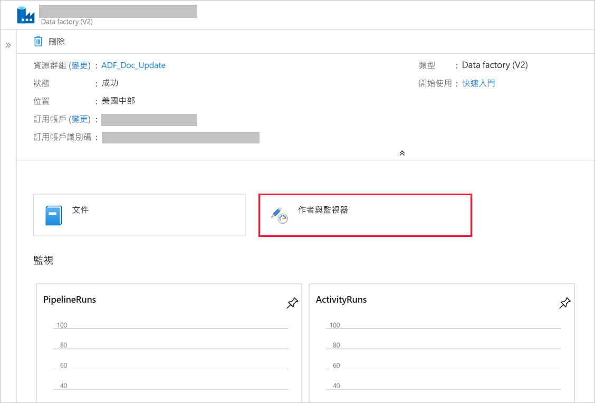

# Incrementally copy new files based on time partitioned file name by using the Copy Data tool

在這個教學課程中，您會使用 Azure 入口網站來建立資料處理站。 Then, you use the Copy Data tool to create a pipeline that incrementally copies new files based on time partitioned file name from Azure Blob storage to Azure Blob storage. 

> [!NOTE]
> 如果您不熟悉 Azure Data Factory，請參閱 [Azure Data Factory 簡介](introduction.md)。

在本教學課程中，您會執行下列步驟：

> [!div class="checklist"]
> * 建立資料處理站。
> * 使用複製資料工具建立管線。
> * 監視管線和活動執行。

## 必要條件

* **Azure 訂用帳戶**：如果您沒有 Azure 訂用帳戶，請在開始前建立[免費帳戶](https://azure.microsoft.com/free/)。
* **Azure storage account**: Use Blob storage as the _source_  and _sink_ data store. 如果您沒有 Azure 儲存體帳戶，請參閱[建立儲存體帳戶](../storage/common/storage-quickstart-create-account.md)中的指示。

### Create two containers in Blob storage

Prepare your Blob storage for the tutorial by performing these steps.

1. Create a container named **source**.  Create a folder path as **2019/02/26/14** in your container. Create an empty text file, and name it as **file1.txt**. Upload the file1.txt to the folder path **source/2019/02/26/14** in your storage account.  您可以使用各種工具來執行這些工作，例如 [Azure 儲存體總管](https://storageexplorer.com/)。
    
    
    
    > [!NOTE]
    > Please adjust the folder name with your UTC time.  For example, if the current UTC time is 2:03 PM on Feb 26th, 2019, you can create the folder path as **source/2019/02/26/14/** by the rule of **source/{Year}/{Month}/{Day}/{Hour}/** .

2. Create a container named **destination**. 您可以使用各種工具來執行這些工作，例如 [Azure 儲存體總管](https://storageexplorer.com/)。

## 建立 Data Factory

1. 在左側功能表上，選取 [建立資源] > [資料 + 分析] > [資料處理站]： 
   
   ![在 [新增] 窗格中選取資料處理站](./media/doc-common-process/new-azure-data-factory-menu.png)

2. 在 [新增資料處理站] 頁面的 [名稱] 下，輸入 **ADFTutorialDataFactory**。 
    
    資料處理站的名稱必須是「全域唯一」的名稱。 您可能會收到下列錯誤訊息：
   
   
   
   如果您收到有關名稱值的錯誤訊息，請輸入不同的資料處理站名稱。 例如，使用**您的名稱** **ADFTutorialDataFactory**。 如需 Data Factory 成品的命名規則，請參閱 [Data Factory 命名規則](naming-rules.md)。
3. 選取要在其中建立新資料處理站的 Azure **訂用帳戶**。 
4. 針對 [資源群組]，採取下列其中一個步驟︰
     
    a. 選取 [使用現有的]，然後從下拉式清單選取現有的資源群組。

    b.這是另一個 C# 主控台應用程式。 選取 [建立新的]，然後輸入資源群組的名稱。 
         
    若要了解資源群組，請參閱[使用資源群組管理您的 Azure 資源](../azure-resource-manager/resource-group-overview.md)。

5. 在 [版本] 下，選取 [V2] 作為版本。
6. 在 [位置] 下，選取資料處理站的位置。 只有受到支援的位置會顯示在下拉式清單中。 資料處理站所使用的資料存放區 (例如 Azure 儲存體和 SQL Database) 和計算 (例如 Azure HDInsight) 可位於其他地區和區域。
7. 選取 [釘選到儀表板]。 
8. 選取 [建立]。
9. 儀表板上的 [部署資料處理站] 圖格會顯示程序狀態。

    
10. 建立完成後，隨即會顯示 **Data Factory** 首頁。
   
    
11. 選取 [編寫與監視] 圖格，可在另一個索引標籤中啟動 Azure Data Factory 使用者介面 (UI)。 

## 使用複製資料工具建立管線

1. On the **Let's get started** page, select the **Copy Data** title to launch the Copy Data tool. 

   
   
2. On the **Properties** page, take the following steps:

    a. Under **Task name**, enter **DeltaCopyFromBlobPipeline**.

    b.這是另一個 C# 主控台應用程式。 Under **Task cadence or Task schedule**, select **Run regularly on schedule**.

    c. Under **Trigger type**, select **Tumbling Window**.
    
    d. Under **Recurrence**, enter **1 Hour(s)** . 
    
    e. 選取 [下一步]。 
    
    Data Factory 使用者介面會使用指定的工作名稱建立管線。 

    
3. 在 [來源資料存放區] 頁面上，完成下列步驟：

    a. Click  **+ Create new connection**, to add a connection.

    
    
    b.這是另一個 C# 主控台應用程式。 Select **Azure Blob Storage** from the gallery, and then click **Continue**.

    
    
    c. On the **New Linked Service** page, select your storage account from the **Storage account name** list, and then click **Finish**.
    
    
    
    d. Select the newly created linked service, then click **Next**. 
    
   
4. 在 [選擇輸入檔案或資料夾] 頁面上，執行以下步驟︰
    
    a. Browse and select the **source** container, then select **Choose**.
    
    
    
    b.這是另一個 C# 主控台應用程式。 Under **File loading behavior**, select **Incremental load: time-partitioned folder/file names**.
    
    
    
    c. Write the dynamic folder path as **source/{year}/{month}/{day}/{hour}/** , and change the format as followings:
    
    
    
    d. Check **Binary copy** and click **Next**.
    
         
5. On the **Destination data store** page, select the **AzureBlobStorage**, which is the same storage account as data source store, and then click **Next**.

     
6. On the **Choose the output file or folder** page, do the following steps:
    
    a. Browse and select the **destination** folder, then click **Choose**.
    
       
    
    b.這是另一個 C# 主控台應用程式。 Write the dynamic folder path as **source/{year}/{month}/{day}/{hour}/** , and change the format as followings:
    
        
    
    c. 按一下 [下一步]。
    
      
7. 在 [設定] 頁面上，選取 [下一步]。 

      
8. 在 [摘要] 頁面上檢閱設定，然後選取 [下一步]。

    
    
9. 在**部署頁面**上選取 [監視] 來監視管線 (工作)。
    
    
10. 請注意，系統會自動選取左側的 [監視] 索引標籤。  You need wait for the pipeline run when it is triggered automatically (about after one hour).  When it runs, the **Actions** column includes links to view activity run details and to rerun the pipeline. Select **Refresh** to refresh the list, and select the **View Activity Runs** link in the **Actions** column. 

    
11. 管線中只有一個活動 (複製活動)，所以您只會看到一個項目。 You can see the source file (file1.txt) has been copied from  **source/2019/02/26/14/**  to **destination/2019/02/26/14/** with the same file name.  

    
    
    You can also verify the same by using Azure Storage Explorer (https://storageexplorer.com/) to scan the files.
    
    
12. Create another empty text file with the new name as **file2.txt**. Upload the file2.txt file to the folder path **source/2019/02/26/15** in your storage account.   您可以使用各種工具來執行這些工作，例如 [Azure 儲存體總管](https://storageexplorer.com/)。   
    
    
    
    > [!NOTE]
    > You might be aware that a new folder path is required to be created. Please adjust the folder name with your UTC time.  For example, if the current UTC time is 3:20 PM on Feb 26th, 2019, you can create the folder path as **source/2019/02/26/15/** by the rule of **{Year}/{Month}/{Day}/{Hour}/** .
    
13. To go back to the **Pipeline Runs** view, select **All Pipelines Runs**, and wait for the same pipeline being triggered again automatically after another one hour.  

    

14. Select **View Activity Run** for the second pipeline run when it comes, and do the same to review details.  

    
    
    You can see the source file (file2.txt) has been copied from  **source/2019/02/26/15/**  to **destination/2019/02/26/15/** with the same file name.
    
     
    
    You can also verify the same by using Azure Storage Explorer (https://storageexplorer.com/) to scan the files in **destination** container
    
    

    
## 後續步驟
進入下列教學課程，以了解如何在 Azure 上使用 Spark 叢集來轉換資料：

> [!div class="nextstepaction"]
>[在雲端中使用 Spark 叢集轉換資料](tutorial-transform-data-spark-portal.md)