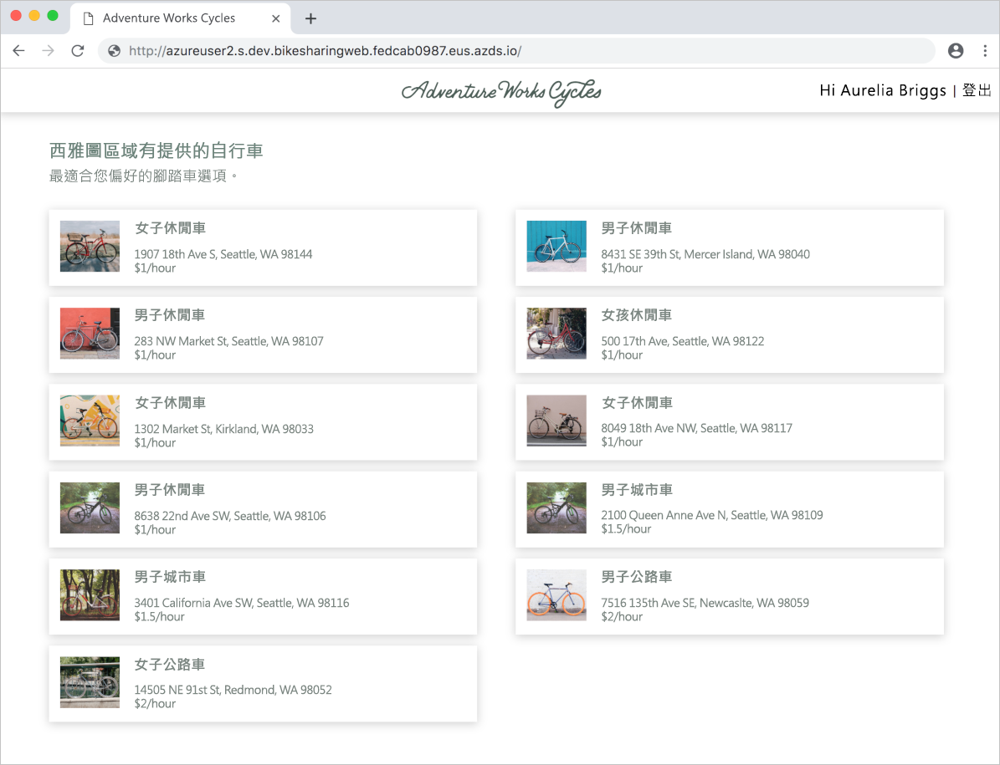

# <a name="quickstart-team-development-on-kubernetes-using-azure-dev-spaces"></a>快速入門：使用 Azure Dev Spaces 在 Kubernetes 上進行小組開發

在本指南中，您將了解如何：

- 在 Azure 中於受控 Kubernetes 叢集上設定 Azure Dev Spaces。
- 將具有多個微服務的大型應用程式部署至開發人員空間。
- 在獨立的開發人員空間中以完整應用程式的內容測試單一微服務。


## <a name="prerequisites"></a>必要條件

- Azure 訂用帳戶。 如果您沒有 Azure 訂用帳戶，您可以建立[免費帳戶](https://azure.microsoft.com/free)。
- [已安裝 Azure CLI](/cli/azure/install-azure-cli?view=azure-cli-latest)。
- [已安裝 Helm 2.13 或更新版本](https://github.com/helm/helm/blob/master/docs/install.md) \(英文\)。

## <a name="create-an-azure-kubernetes-service-cluster"></a>建立 Azure Kubernetes Service 叢集

您必須在[支援的區域][supported-regions]中建立 AKS 叢集。 下列命令會建立名為 MyResourceGroup  的資源群組與名為 MyAKS  的 AKS 叢集。

```cmd
az group create --name MyResourceGroup --location eastus
az aks create -g MyResourceGroup -n MyAKS --location eastus --disable-rbac --generate-ssh-keys
```

*MyAKS* 叢集也會搭配單一節點建立、使用 *Standard_DS2_v2* 大小，以及停用 RBAC。

## <a name="enable-azure-dev-spaces-on-your-aks-cluster"></a>在 AKS 叢集上啟用 Azure Dev Spaces

使用 `use-dev-spaces` 命令在 AKS 叢集上啟用 Dev Spaces，並遵循提示來進行。 下列命令會在 *MyResourceGroup* 群組中的 *MyAKS* 叢集上啟用 Dev Spaces，並建立稱為 *dev* 的開發空間。

```cmd
az aks use-dev-spaces -g MyResourceGroup -n MyAKS --space dev --yes
```

## <a name="get-sample-application-code"></a>取得應用程式範例的程式碼

在此文章中，您會使用 [Azure Dev Spaces 單車共享範例應用程式](https://github.com/Azure/dev-spaces/tree/master/samples/BikeSharingApp) \(英文\) 來示範如何使用 Azure Dev Spaces。

從 GitHub 複製應用程式，並瀏覽至其目錄：

```cmd
git clone https://github.com/Azure/dev-spaces
cd dev-spaces/samples/BikeSharingApp/
```

## <a name="retrieve-the-hostsuffix-for-dev"></a>擷取適用於 *dev* 的 HostSuffix

使用 `azds show-context` 命令來顯示適用於 *dev* 的 HostSuffix。

```cmd
$ azds show-context

Name                ResourceGroup     DevSpace  HostSuffix
------------------  ----------------  --------  -----------------------
MyAKS               MyResourceGroup   dev       fedcab0987.eus.azds.io
```

## <a name="update-the-helm-chart-with-your-hostsuffix"></a>搭配您的 HostSuffix 更新 Helm 圖表

開啟 [charts/values.yaml](https://github.com/Azure/dev-spaces/blob/master/samples/BikeSharingApp/charts/values.yaml) \(英文\) 並將所有 `<REPLACE_ME_WITH_HOST_SUFFIX>` 項目取代為您先前所擷取的 HostSuffix 值。 儲存變更並關閉該檔案。

## <a name="run-the-sample-application-in-kubernetes"></a>在 Kubernetes 中執行範例應用程式

在 Kubernetes 執行範例應用程式的命令為現有處理程序的一部分，且不具任何與 Azure Dev Spaces 工具的相依性。 在此情況下，Helm 是用來執行此範例應用程式的工具，但您可以使用其他工具來在叢集內的命名空間中執行您的整個應用程式。 Helm 命令是以您先前所建立的 *dev* 開發空間作為目標，但此開發空間也是 Kubernetes 命名空間。 因此，開發空間和其他命名空間相同，可以被其他工具作為目標。

無論用來部署應用程式的工具為何，您都可以在該應用程式已於叢集中執行之後，針對小組開發使用 Azure Dev Spaces。

使用 `helm init` 和 `helm install` 命令來在叢集上設定並安裝範例應用程式。

```cmd
cd charts/
helm init --wait
helm install -n bikesharing . --dep-up --namespace dev --atomic 
```
> [!Note]
> **如果您使用已啟用 RBAC 的叢集**，請務必設定 [Tiller 的服務帳戶](https://helm.sh/docs/using_helm/#role-based-access-control)。 否則，`helm` 命令將會失敗。

`helm install` 命令可能需要幾分鐘的時間才能完成。 命令的輸出會顯示其於完成時部署至叢集之所有伺服器的狀態：

```cmd
$ cd charts/
$ helm init --wait
...
Happy Helming!

$ helm install -n bikesharing . --dep-up --namespace dev --atomic

Hang tight while we grab the latest from your chart repositories...
...
NAME               READY  UP-TO-DATE  AVAILABLE  AGE
bikes              1/1    1           1          4m32s
bikesharingweb     1/1    1           1          4m32s
billing            1/1    1           1          4m32s
gateway            1/1    1           1          4m32s
reservation        1/1    1           1          4m32s
reservationengine  1/1    1           1          4m32s
users              1/1    1           1          4m32s
```

在範例應用程式已安裝至叢集上，且基於您已在叢集上啟用 Dev Spaces 的原因，請使用 `azds list-uris` 命令來顯示目前所選取 *dev* 中之範例應用程式的 URL。

```cmd
$ azds list-uris
Uri                                                 Status
--------------------------------------------------  ---------
http://dev.bikesharingweb.fedcab0987.eus.azds.io/  Available
http://dev.gateway.fedcab0987.eus.azds.io/         Available
```

開啟來自 `azds list-uris` 命令的公用 URL，來瀏覽至 *bikesharingweb* 服務。 在上述範例中，*bikesharingweb* 服務的公用 URL 是 `http://dev.bikesharingweb.fedcab0987.eus.azds.io/`。 選取 [Aurelia Briggs (customer)]  \(Aurelia Briggs (客戶)\) 作為使用者。 確認您能在頂端看見文字 [Hi Aurelia Briggs | Sign Out]  \(嗨 Aurelia Briggs | 登出\)。



## <a name="create-child-dev-spaces"></a>建立子系開發空間

使用 `azds space select` 命令來在 *dev* 底下建立兩個子系空間：

```cmd
azds space select -n dev/azureuser1 -y
azds space select -n dev/azureuser2 -y
```

上述命令會在 *dev* 底下建立名為 *azureuser1* 和 *azureuser2* 的兩個子系空間。 這兩個子系空間代表可供開發人員的 *azureuser1* 和 *azureuser2* 用來對範例應用程式進行變更的個別開發空間。

使用 `azds space list` 命令來列出所有開發空間，並確認已選取 *dev/azureuser2*。

```cmd
$ azds space list
   Name            DevSpacesEnabled
-  --------------  ----------------
   default         False
   dev             True
   dev/azureuser1  True
*  dev/azureuser2  True
```

使用 `azds list-uris` 來顯示目前所選取空間 (*dev/azureuser2*) 中之範例應用程式的 URL。

```cmd
$ azds list-uris
Uri                                                             Status
--------------------------------------------------              ---------
http://azureuser2.s.dev.bikesharingweb.fedcab0987.eus.azds.io/  Available
http://azureuser2.s.dev.gateway.fedcab0987.eus.azds.io/         Available
```

確認 `azds list-uris` 命令所顯示的 URL 具有 *azureuser2.s.dev* 前置詞。 此前置詞會確認目前所選取的空間是 *azureuser2*，其為 *dev*的子系。

開啟來自 `azds list-uris` 命令的公用 URL，來瀏覽至 *dev/azureuser2* 開發空間的 *bikesharingweb* 服務。 在上述範例中，*bikesharingweb* 服務的公用 URL 是 `http://azureuser2.s.dev.bikesharingweb.fedcab0987.eus.azds.io/`。 選取 [Aurelia Briggs (customer)]  \(Aurelia Briggs (客戶)\) 作為使用者。 確認您能在頂端看見文字 [Hi Aurelia Briggs | Sign out]  \(嗨 Aurelia Briggs | 登出\)。

## <a name="update-code"></a>更新程式碼

使用文字編輯器開啟 *BikeSharingWeb/components/Header.js*，並[使用 `userSignOut` className 變更 span 元素](https://github.com/Azure/dev-spaces/blob/master/samples/BikeSharingApp/BikeSharingWeb/components/Header.js#L16) \(英文\) 中的文字。

```html
<span className="userSignOut">
    <Link href="/devsignin"><span tabIndex="0">Welcome {props.userName} | Sign out</span></Link>
</span>
```

儲存變更並關閉該檔案。

## <a name="build-and-run-the-updated-bikesharingweb-service-in-the-devazureuser2-dev-space"></a>在 *dev/azureuser2* 開發空間中建置並執行更新的 bikesharingweb 服務

瀏覽至 *BikeSharingWeb/* 目錄，並執行 `azds up` 命令。

```cmd
$ cd ../BikeSharingWeb/
$ azds up

Using dev space 'dev/azureuser2' with target 'MyAKS'
Synchronizing files...2s
...
Service 'bikesharingweb' port 'http' is available at http://azureuser2.s.dev.bikesharingweb.fedcab0987.eus.azds.io/
Service 'bikesharingweb' port 80 (http) is available at http://localhost:54256
...
```

此命令會在 *dev/azureuser2* 開發空間中建置並執行 *bikesharingweb* 服務。 此服務會和在 *dev* 中執行的 *bikesharingweb* 服務一起執行，且只會被用來處理具有 *azureuser2.s* URL 前置詞的要求。 如需路由在父代和子系開發空間之間運作方式差異的詳細資訊，請參閱 [Azure Dev Spaces 的運作和設定方式](how-dev-spaces-works.md)。

開啟顯示於 `azds up` 命令之輸出中的公用 URL，來瀏覽至 *dev/azureuser2* 開發空間的 *bikesharingweb* 服務。 選取 [Aurelia Briggs (customer)]  \(Aurelia Briggs (客戶)\) 作為使用者。 確認您在右上角能看見更新的文字。 如果您無法立即看見這個變更，您可能需要重新整理該頁面或清除瀏覽器的快取。


> [!NOTE]
> 當您在執行 `azds up` 同時瀏覽至您的服務時，HTTP 要求追蹤也會顯示在 `azds up` 命令的輸出中。 這些追蹤可協助您針對服務進行疑難排解及偵錯。 當執行 `azds up` 時，您可以使用 `--disable-http-traces` 來停用這些追蹤。

## <a name="verify-other-dev-spaces-are-unchanged"></a>確認其他 Dev Spaces 皆未變更

如果 `azds up` 命令仍在執行，請按 *Ctrl+c*。

```cmd
$ azds list-uris --all
Uri                                                             Status
--------------------------------------------------              ---------
http://azureuser1.s.dev.bikesharingweb.fedcab0987.eus.azds.io/  Available
http://azureuser1.s.dev.gateway.fedcab0987.eus.azds.io/         Available
http://azureuser2.s.dev.bikesharingweb.fedcab0987.eus.azds.io/  Available
http://azureuser2.s.dev.gateway.fedcab0987.eus.azds.io/         Available
http://dev.bikesharingweb.fedcab0987.eus.azds.io/               Available
http://dev.gateway.fedcab0987.eus.azds.io/                      Available
```

在瀏覽器中瀏覽至 *dev* 版本的 *bikesharingweb*，選擇 [Aurelia Briggs (customer)]  \(Aurelia Briggs (客戶)\) 作為使用者，然後確認您能在右上角看見原始文字。 搭配 *dev/azureuser1* URL 重複執行這些步驟。 請注意，這些變更只會套用至 *dev/azureuser2* 版本的 *bikesharingweb*。 透過隔離對 *dev/azureuser2* 的變更，可讓 *azureuser2* 在不影響 *azureuser1* 的情況下進行變更。

若要讓這些變更反映在 *dev* 和 *dev/azureuser1* 中，您應該遵循您小組既有的工作流程或 CI/CD 管線。 例如，此工作流程可能會涉及將您的變更認可至版本控制系統，然後使用 CI/CD 管線或如 Helm 之類的工具來部署該更新。

## <a name="clean-up-your-azure-resources"></a>清除 Azure 資源

```cmd
az group delete --name MyResourceGroup --yes --no-wait
```

## <a name="next-steps"></a>後續步驟

了解 Azure Dev Spaces 如何協助您跨多個容器開發更複雜的應用程式，以及如何藉由在不同的空間中使用不同的程式碼版本或分支，來簡化共同開發。

> [!div class="nextstepaction"]
> [使用多個容器和小組開發](multi-service-nodejs.md)


[supported-regions]: about.md#supported-regions-and-configurations
