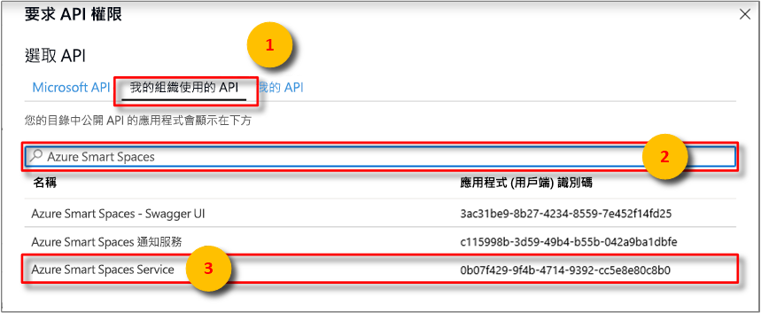
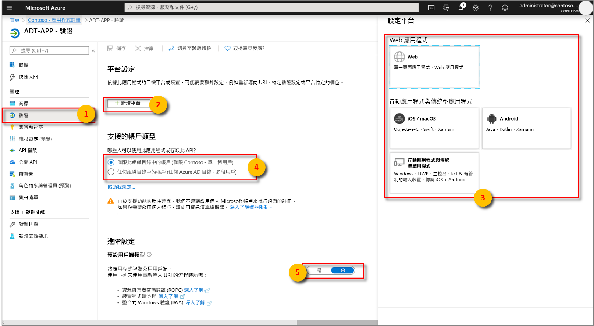

# <a name="how-to-configure-postman-for-azure-digital-twins"></a>如何針對 Azure Digital Twins 設定 Postman

本文說明如何設定 Postman REST 用戶端以進行互動，並測試 Azure Digital Twins 管理 API。 具體而言，其說明：

* 如何設定 Azure Active Directory 應用程式以使用 OAuth 2.0 隱含授與流程。
* 如何使用 Postman REST 用戶端，以向您的管理 API 提出權杖關聯的 HTTP 要求。
* 如何使用 Postman，以向您的管理 API 提出多部分的 POST 要求。

## <a name="postman-summary"></a>Postman 摘要

使用 REST 用戶端工具 (例如 [Postman](https://www.getpostman.com/) \(英文\)) 來準備您的本機測試環境，藉以開始使用 Azure Digital Twins。 Postman 用戶端可協助快速建立複雜的 HTTP 要求。 前往 [www.getpostman.com/apps](https://www.getpostman.com/apps) 以下載 Postman 用戶端的桌面版本。

[Postman](https://www.getpostman.com/) \(英文\) 是一個 REST 測試工具，可將重要的 HTTP 要求功能定位為以外掛程式為基礎的實用桌面 GUI。

透過 Postman 用戶端，解決方案開發人員可以指定 HTTP 要求的種類 (*POST*、*GET*、*UPDATE*、*PATCH* 和 *DELETE*)、要呼叫的 API 端點，以及 SSL 的用法。 Postman 也支援新增 HTTP 要求標頭、參數、表單資料和內文。

## <a name="configure-azure-active-directory-to-use-the-oauth-20-implicit-grant-flow"></a>設定 Azure Active Directory 以使用 OAuth 2.0 隱含授權流程

設定 Azure Active Directory 應用程式，以使用 OAuth 2.0 隱含授與流程。

1. 開啟應用程式註冊的 [API 權限] 窗格。 選取 [新增權限] 按鈕。 在 [要求 API 權限] 窗格中，選取 [我的組織使用的 API] 索引標籤，然後搜尋：
    
    1. `Azure Digital Twins`答案中所述步驟，工作帳戶即會啟用。 選取 **Azure Digital Twins** API。

        [](../../includes/media/digital-twins-permissions/aad-aap-search-api-dt.png#lightbox)

    1. 或者，搜尋 `Azure Smart Spaces Service`。 選取 [Azure 智慧空間服務] API。

        [](../../includes/media/digital-twins-permissions/aad-app-search-api.png#lightbox)

    > [!IMPORTANT]
    > 所顯示的 Azure AD API 名稱和識別碼取決於您的租用戶：
    > * 測試租用戶和客戶帳戶應搜尋 `Azure Digital Twins`。
    > * 其他 Microsoft 帳戶應搜尋 `Azure Smart Spaces Service`。

1. 選取的 API 會在相同的 [要求 API 權限] 窗格中顯示為 **Azure Digital Twins**。 選取 [讀取 (1)] 下拉式清單，然後選取 [Read.Write] 核取方塊。 選取 [新增權限] 按鈕。

    [](../../includes/media/digital-twins-permissions/aad-app-req-permissions.png#lightbox)

1. 根據您組織的設定，您可能需要執行其他步驟，授與對此 API 的系統管理員存取權。 請連絡系統管理員以取得詳細資訊。 管理員存取權一經核准，您 API 的 [API 權限] 窗格中的 [需要管理員同意] 資料行就會顯示如下：

    [](../../includes/media/digital-twins-permissions/aad-app-admin-consent.png#lightbox)

1. 設定 `https://www.getpostman.com/oauth2/callback`的第二個重新**導向 URI** 。

    [](media/how-to-configure-postman/authentication-redirect-uri.png#lightbox)

1. 若要確定[應用程式註冊為**公用應用程式**](https://docs.microsoft.com/azure/active-directory/develop/scenario-desktop-app-registration)，請開啟應用程式註冊的 [驗證] 窗格，並在該窗格中向下捲動。 在 [預設用戶端類型] 區段中，針對 [將應用程式視為公用用戶端] 選擇 [是]，然後點擊 [儲存]。

    檢查**存取權杖**，以在您的 Manifest.json 中啟用 **oauth2AllowImplicitFlow** 設定。

    [](../../includes/media/digital-twins-permissions/aad-configure-public-client.png#lightbox)

1. 複製並保存 Azure Active Directory 應用程式的**應用程式識別碼**。 用於後續的步驟中。

   [](../../includes/media//digital-twins-permissions/aad-app-reg-app-id.png#lightbox)


## <a name="obtain-an-oauth-20-token"></a>取得 OAuth 2.0 權杖

[!INCLUDE [digital-twins-management-api](../../includes/digital-twins-management-api.md)]

安裝和設定 Postman 以取得 Azure Active Directory token。 之後，使用取得的權杖來向 Azure Digital Twins 提出已驗證的 HTTP 要求：

1. 確認您的**授權 URL** 正確無誤。 其應採用下列格式：

    ```plaintext
    https://login.microsoftonline.com/YOUR_AZURE_TENANT.onmicrosoft.com/oauth2/authorize?resource=0b07f429-9f4b-4714-9392-cc5e8e80c8b0
    ```

    | 名稱  | 更換為 | 範例 |
    |---------|---------|---------|
    | YOUR_AZURE_TENANT | 您的租使用者或組織的名稱。 使用易記名稱，而不是 Azure Active Directory 應用程式註冊的英數位元**租使用者識別碼**。 | `microsoft` |

1. 前往 [www.getpostman.com](https://www.getpostman.com/) 以下載應用程式。

1. 開啟 Postman 應用程式，然後按一下 [New] (新增) | [Create new] (新建)，然後選取 [Request] (要求)。 輸入要求名稱。 選取要儲存的集合或資料夾，然後按一下 [儲存]。 

1. 我們想要提出 GET 要求。 選取 [**授權**] 索引標籤，選取 [OAuth 2.0]，然後選取 [**取得新的存取權杖**]。

    | 欄位  | 值 |
    |---------|---------|
    | 授與類型 | `Implicit` |
    | 回呼 URL | `https://www.getpostman.com/oauth2/callback` |
    | 驗證 URL | 使用**步驟 2**中的**授權 URL** |
    | 用戶端識別碼 | 使用在上一節中建立或重複使用之 Azure Active Directory 應用**程式的應用程式識別碼** |
    | 範圍 | 保留空白 |
    | 狀態 | 保留空白 |
    | 用戶端驗證 | `Send as Basic Auth header` |

1. 用戶端現在應該如下所示：

    [](media/how-to-configure-postman/configure-postman-oauth-token.png#lightbox)

1. 選取 [要求權杖]。
  
1. 向下捲動，然後選取 [使用權杖]。

## <a name="make-a-multipart-post-request"></a>提出多部分的 POST 要求

完成先前的步驟之後，設定 Postman 以提出已驗證的 HTTP 多部分 POST 要求：

1. 在 [**標頭**] 索引標籤下，新增 HTTP 要求標頭索引鍵**content-type** ，其值為 `multipart/mixed`。

   [](media/how-to-configure-postman/configure-postman-content-type.png#lightbox)

1. 將非文字資料序列化到檔案。 JSON 資料會儲存為 JSON 檔案。
1. 在 [**主體**] 索引標籤底下，選取 [`form-data`]。 
1. 藉由指派索引**鍵**名稱，然後選取 [`File`] 來新增每個檔案。
1. 接著，透過 [選擇檔案] 按鈕選取每個檔案。

   [](media/how-to-configure-postman/configure-postman-form-body.png#lightbox)

   >[!NOTE]
   > * Postman 用戶端不需要多部分區塊具有手動指派的 **Content-type** 或 **Content-disposition**。
   > * 您不需要為每個部分指定這些標頭。
   > * 您必須針對整個要求選取 `multipart/mixed` 或其他適當的 **Content-type**。

1. 最後，選取 [**傳送**] 以提交多部分 HTTP POST 要求。 `200` 或 `201` 的狀態碼表示成功的要求。 適當的回應訊息會出現在用戶端介面中。

1. 藉由呼叫 API 端點來驗證您的 HTTP POST 要求資料： 

   ```URL
   YOUR_MANAGEMENT_API_URL/spaces/blobs?includes=description
   ```

## <a name="next-steps"></a>後續步驟

- 若要深入了解 Digital Twins 管理 API，以及如何使用它們，請參閱[如何使用 Azure Digital Twins 管理 API](how-to-navigate-apis.md)。

- 使用多部分要求[將 blob 新增至 Azure Digital Twins 的實體](./how-to-add-blobs.md)。

- 若要了解如何使用管理 API 進行驗證，請閱讀[使用 API 進行驗證](./security-authenticating-apis.md)。
