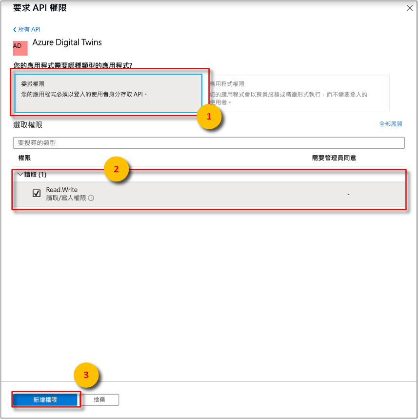

# <a name="how-to-configure-postman-for-azure-digital-twins"></a>如何針對 Azure Digital Twins 設定 Postman

本文說明如何設定 Postman REST 用戶端以進行互動，並測試 Azure Digital Twins 管理 API。 具體而言，其說明：

* 如何設定 Azure Active Directory 應用程式以使用 OAuth 2.0 隱含授與流程。
* 如何使用 Postman REST 用戶端，以向您的管理 API 提出權杖關聯的 HTTP 要求。
* 如何使用 Postman，以向您的管理 API 提出多部分的 POST 要求。

## <a name="postman-summary"></a>Postman 摘要

使用 REST 用戶端工具 (例如 [Postman](https://www.getpostman.com/) \(英文\)) 來準備您的本機測試環境，藉以開始使用 Azure Digital Twins。 Postman 用戶端可協助快速建立複雜的 HTTP 要求。 前往 [www.getpostman.com/apps](https://www.getpostman.com/apps) 以下載 Postman 用戶端的桌面版本。

[Postman](https://www.getpostman.com/) \(英文\) 是一個 REST 測試工具，可將重要的 HTTP 要求功能定位為以外掛程式為基礎的實用桌面 GUI。

透過 Postman 用戶端，解決方案開發人員可以指定 HTTP 要求的種類 (*POST*、*GET*、*UPDATE*、*PATCH* 和 *DELETE*)、要呼叫的 API 端點，以及 SSL 的用法。 Postman 也支援新增 HTTP 要求標頭、參數、表單資料和內文。

## <a name="configure-azure-active-directory-to-use-the-oauth-20-implicit-grant-flow"></a>設定 Azure Active Directory 以使用 OAuth 2.0 隱含授權流程

設定 Azure Active Directory 應用程式，以使用 OAuth 2.0 隱含授與流程。

1. 按照[此快速入門](https://docs.microsoft.com/azure/active-directory/develop/quickstart-v1-integrate-apps-with-azure-ad)的步驟來建立類型為「原生」的 Azure AD 應用程式。 或者，您可以重複使用現有的原生應用程式註冊。

1. 在 [必要權限]  底下，選取 [新增]  ，然後在 [加入 API 存取權]  底下輸入 **Azure Digital Twins**。 如果搜尋沒有找到 API，請改為搜尋 **Azure 智慧空間**。 然後，依序選取 [授與權限] > [委派的權限]  和 [完成]  。

    [](../../includes/media/digital-twins-permissions/aad-app-req-permissions.png#lightbox)

1. 選取 **資訊清單**開啟您的應用程式的應用程式資訊清單。 將 *oauth2AllowImplicitFlow* 設定為 `true`。

    [](media/how-to-configure-postman/implicit-flow.png#lightbox)

1. 將**回覆 URL** 設定為`https://www.getpostman.com/oauth2/callback`。

    [](media/how-to-configure-postman/reply-url.png#lightbox)

1. 複製並保存 Azure Active Directory 應用程式的**應用程式識別碼**。 用於後續的步驟中。

## <a name="obtain-an-oauth-20-token"></a>取得 OAuth 2.0 權杖

接下來，設定 Postman 以取得 Azure Active Directory 權杖。 之後，使用取得的權杖來向 Azure Digital Twins 提出已驗證的 HTTP 要求：

1. 前往 [www.getpostman.com](https://www.getpostman.com/) 以下載應用程式。
1. 確認您的**授權 URL** 正確無誤。 其應採用下列格式：

    ```plaintext
    https://login.microsoftonline.com/YOUR_AZURE_TENANT.onmicrosoft.com/oauth2/authorize?resource=0b07f429-9f4b-4714-9392-cc5e8e80c8b0
    ```

    | 名稱  | 更換為 | 範例 |
    |---------|---------|---------|
    | YOUR_AZURE_TENANT | 您的租用戶或組織的名稱 | `microsoft` |

1. 選取 [授權]  索引標籤、選取 [OAuth 2.0]  ，然後選取 [取得新的存取權杖]  。

    | 欄位  | 值 |
    |---------|---------|
    | 授與類型 | `Implicit` |
    | 回呼 URL | `https://www.getpostman.com/oauth2/callback` |
    | 驗證 URL | 使用取自步驟 2 的**授權 URL** |
    | 用戶端識別碼 | 使用從上一節中建立或重新決定用途之 Azure Active Directory 應用程式的**應用程式識別碼** |
    | `Scope` | 保留空白 |
    | State | 保留空白 |
    | 用戶端驗證 | `Send as Basic Auth header` |

1. 用戶端現在應該如下所示：

    [](media/how-to-configure-postman/postman-oauth-token.png#lightbox)

1. 選取 [要求權杖]  。

    >[!TIP]
    >如果您收到錯誤訊息「無法完成 OAuth 2」，請嘗試下列方法：
    > * 關閉 Postman 後重新開啟，然後再試一次。
  
1. 向下捲動，然後選取 [使用權杖]  。

<div id="multi"></div>

## <a name="make-a-multipart-post-request"></a>提出多部分的 POST 要求

完成先前的步驟之後，設定 Postman 以提出已驗證的 HTTP 多部分 POST 要求：

1. 在 [標頭]  索引標籤下，新增 HTTP 要求標頭索引鍵 **Content-Type** 且其值為 `multipart/mixed`。

   [](media/how-to-configure-postman/content-type.png#lightbox)

1. 將非文字資料序列化到檔案。 JSON 資料會儲存為 JSON 檔案。
1. 在 [主體]  索引標籤底下新增每個檔案，做法是指派**索引鍵**名稱，然後選取 `file` 或 `text`。
1. 接著，透過 [選擇檔案]  按鈕選取每個檔案。

   [](media/how-to-configure-postman/form-body.png#lightbox)

   >[!NOTE]
   > * Postman 用戶端不需要多部分區塊具有手動指派的 **Content-type** 或 **Content-disposition**。
   > * 您不需要為每個部分指定這些標頭。
   > * 您必須針對整個要求選取 `multipart/mixed` 或其他適當的 **Content-type**。

1. 最後，選取**傳送**提交多部分 HTTP POST 要求。

## <a name="next-steps"></a>後續步驟

- 若要深入了解 Digital Twins 管理 API，以及如何使用它們，請參閱[如何使用 Azure Digital Twins 管理 API](how-to-navigate-apis.md)。

- 使用多部分要求[將 blob 新增至 Azure Digital Twins 的實體](./how-to-add-blobs.md)。

- 若要了解如何使用管理 API 進行驗證，請閱讀[使用 API 進行驗證](./security-authenticating-apis.md)。