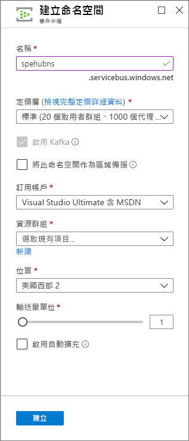

# 快速入門：使用 Azure 入口網站建立事件中樞
Azure 事件中樞是巨量資料串流平台和事件擷取服務，每秒可接收和處理數百萬個事件。 事件中樞可以處理及儲存分散式軟體和裝置所產生的事件、資料或遙測。 傳送至事件中樞的資料可以透過任何即時分析提供者或批次/儲存體配接器來轉換和儲存。 如需事件中樞的詳細概觀，請參閱[事件中樞概觀](event-hubs-about.md)和[事件中樞功能](event-hubs-features.md)。

在此快速入門中，您將使用 [Azure 入口網站](https://portal.azure.com)建立事件中樞。

## Prerequisites

若要完成本快速入門，請確定您具備︰

- Azure 訂用帳戶。 如果您沒有 Azure 訂用帳戶，請在開始前[建立免費帳戶](https://azure.microsoft.com/free/)。
- [Visual Studio 2019](https://www.visualstudio.com/vs) 或更新版本。
- [.NET Standard SDK](https://www.microsoft.com/net/download/windows)，2.0 版或更新版本。

## 建立資源群組

資源群組是 Azure 資源的邏輯集合。 所有資源都會在資源群組中部署與管理。 若要建立資源群組︰

1. 登入 [Azure 入口網站](https://portal.azure.com)。
2. 在左側導覽中，按一下 [資源群組]  。 然後按一下 [ **新增**]。

   

2. 在 [訂用帳戶]  中，選取要在其中建立資源群組的 Azure 訂用帳戶名稱。
3. 輸入**資源群組的唯一名稱**。 系統會立即檢查名稱是否可用於目前選取的 Azure 訂用帳戶。
4. 選取資源群組的**區域**。
5. 選取 [檢閱 + 建立]  。

   
6. 在 [檢閱 + 建立]  頁面上，選取 [建立]  。 

## 建立事件中樞命名空間

事件中樞命名空間提供唯一的範圍容器 (依其完整網域名稱來參考)，您可以在其中建立一或多個事件中樞。 若要使用入口網站在您的資源群組中建立命名空間，請執行下列動作：

1. 在 Azure 入口網站中，按一下畫面左上方的 [建立資源]  。
2. 選取左側功能表中的 [所有服務]  ，然後選取 [分析]  類別中 [事件中樞]  旁邊的 **星號 (`*`)** 。 確認 [事件中樞]  已新增至左側導覽功能表中的 [我的最愛]  。 
    
   
3. 選取左側導覽功能表中 [我的最愛]  下方的 [事件中樞]  ，然後選取工具列上的 [新增]  。

   ![[新增] 按鈕](./media/event-hubs-quickstart-portal/event-hubs-add-toolbar.png)
4. 在 [建立命名空間]  頁面上，採取下列步驟：
    1. 輸入命名空間的**名稱**。 系統會立即檢查此名稱是否可用。
    2. 選擇**定價層** (基本或標準)。
    3. 請注意，[啟用 Kafka]  選項會自動啟用。 Azure 事件中樞為您提供 Kafka 端點。 此端點可讓您的事件中樞命名空間在原生狀態下了解 [Apache Kafka](https://kafka.apache.org/intro) 訊息通訊協定和 API。 您可使用這項功能，像使用 Kafka 主題一樣與您的事件中樞通訊，而無須變更通訊協定用戶端或執行自己的叢集。 事件中樞支援 [Apache Kafka 1.0 版](https://kafka.apache.org/10/documentation.html)和更新版本。
    4. 選取您要在其中建立命名空間的**訂用帳戶**。
    5. 選取現有的**資源群組**或建立新的資源群組。 
    4. 選取命名空間的**位置**。
    5. 選取 [建立]  。 您可能必須等候幾分鐘，讓系統完整佈建資源。

       
5. 重新整理 [事件中樞]  頁面，以查看事件中樞命名空間。 您可以檢查警示中事件中樞建立的狀態。 

    
6. 選取命名空間。 您會在入口網站中看到**事件中樞命名空間**的首頁。 

   
    
## 建立事件中樞

若要在命名空間內建立事件中樞，請執行下列動作：

1. 在 [事件中樞命名空間] 頁面上，選取左功能表中的 [事件中樞]  。
1. 在視窗頂端，按一下 [+ 事件中樞]  。
   
    
1. 輸入您的事件中樞名稱，然後按一下 [建立]  。
   
    
4. 您可以檢查警示中事件中樞建立的狀態。 建立事件中樞之後，您會在事件中樞清單中看到它 (如下圖所示)：

    

恭喜！ 您已使用入口網站建立事件中樞命名空間和該命名空間內的事件中樞。 

## 後續步驟

在本文中，您已建立資源群組、事件中樞命名空間和事件中樞。 如需將事件傳送至事件中樞或從事件中樞接收事件的逐步指示，請參閱**傳送及接收事件**教學課程： 

- [.NET Core](get-started-dotnet-standard-send-v2.md)
- [Java](get-started-java-send-v2.md)
- [Python](get-started-python-send-v2.md)
- [JavaScript](get-started-java-send-v2.md)
- [Go](event-hubs-go-get-started-send.md)
- [C (僅傳送)](event-hubs-c-getstarted-send.md)
- [Apache Storm (僅接受)](event-hubs-storm-getstarted-receive.md)

[Azure portal]: https://portal.azure.com/
[3]: ./media/event-hubs-quickstart-portal/sender1.png
[4]: ./media/event-hubs-quickstart-portal/receiver1.png
