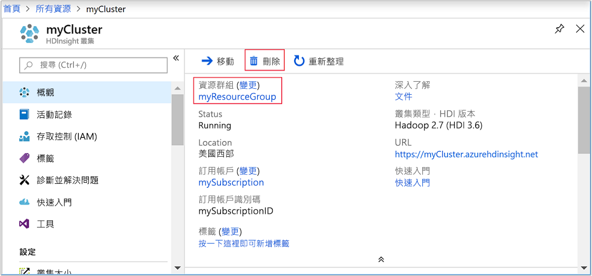

# <a name="quickstart-create-apache-hadoop-cluster-in-azure-hdinsight-using-azure-portal"></a>快速入門：使用 Azure 入口網站在 Azure HDInsight 中建立 Apache Hadoop 叢集

在本文中，您會了解如何使用 Azure 入口網站在 HDInsight 中建立 [Apache Hadoop](https://hadoop.apache.org/) \(英文\) 叢集，然後在 HDInsight 中執行 Apache Hive 作業。 大部分 Hadoop 作業都是批次作業。 您會建立叢集、執行一些工作，然後刪除叢集。 在本文中，您會執行所有這三個工作。

在本快速入門中，您會使用 Azure 入口網站來建立 HDInsight Hadoop 叢集。 您也可以使用 [Azure Resource Manager 範本](apache-hadoop-linux-tutorial-get-started.md)來建立叢集。

HDInsight 目前隨附 [7 個不同的叢集類型](../hdinsight-overview.md#cluster-types-in-hdinsight)。 每種叢集類型都支援一組不同的元件。 所有叢集類型都支援 Hive。 如需 HDInsight 中支援的元件清單，請參閱 [HDInsight 在 Apache Hadoop 叢集版本中提供的新功能](../hdinsight-component-versioning.md)  

如果您沒有 Azure 訂用帳戶，請在開始之前先[建立免費帳戶](https://azure.microsoft.com/free/)。

## <a name="create-an-apache-hadoop-cluster"></a>建立 Apache Hadoop 叢集

在本節中，您會使用 Azure 入口網站，在 HDInsight 中建立 Hadoop 叢集。

1. 登入 [Azure 入口網站](https://portal.azure.com)。

1. 在 Azure 入口網站中，移至 [建立資源]   > [分析]   > [HDInsight]  。

    

1. 在 [基本]  之下，輸入或選取下列值：

    |屬性  |說明  |
    |---------|---------|
    |訂用帳戶    |  選取 Azure 訂用帳戶。 |
    |資源群組     | 建立資源群組，或選取現有的資源群組。  資源群組是 Azure 元件的容器。  在此案例中，資源群組包含 HDInsight 叢集和相依的 Azure 儲存體帳戶。 |
    |叢集名稱   | 輸入 Hadoop 叢集的名稱。 由於 HDInsight 中的所有叢集共用相同的 DNS 命名空間，因此這個名稱必須是唯一的。 名稱最多可包含 59 個字元，而這些字元可以是字母、數字和連字號。 名稱的第一個和最後一個字元不可以是連字號。 |
    |位置    | 選取您要建立叢集的 Azure 位置。  選擇靠近您的位置，以獲得最佳效能。 |
    |叢集類型| 選取 [選取叢集類型]  。 然後選取 [Hadoop]  作為叢集類型。|
    |版本|將會指定叢集類型的預設版本。 如果您想要指定不同的版本，請從下拉式清單中選取。|
    |叢集登入使用者名稱和密碼    | 預設登入名稱為 **admin**。密碼長度至少必須為 10 個字元，且必須包含至少一個數字、一個大寫字母及一個小寫字母、一個非英數字元 (除了字元 ' " ` \)。 確定您**不會提供**常見密碼，例如 "Pass@word1"。|
    |安全殼層 (SSH) 使用者名稱 | 預設的使用者名稱為 **sshuser**。  您可以為 SSH 使用者名稱提供另一個名稱。 |
    |將叢集登入密碼用於 SSH| 選取此核取方塊，讓 SSH 使用者所使用的密碼等同於您提供給叢集登入使用者的密碼。|

    

    選取頁面底部的 [下一步:  儲存體>>]，以前進到儲存體設定。

1. 在 [儲存體]  索引標籤中，提供下列值：

    |屬性  |說明  |
    |---------|---------|
    |主要儲存體類型|使用預設值 [Azure 儲存體]  。|
    |選取方法|使用預設值 [從清單中選取]  。|
    |主要儲存體帳戶|使用下拉式清單來選取現有的儲存體帳戶，或選取 [新建]  。 如果您建立新的帳戶，其名稱的長度必須介於 3 到 24 個字元之間，且只能包含數字和小寫字母。|
    |容器|使用自動填入的值。|

    

    選取 [檢閱 + 建立]  索引標籤。

1. 在 [檢閱 + 建立]  索引標籤中，確認您在先前的步驟中選取的值。

    

1. 選取 [建立]  。 大約需要 20 分鐘的時間來建立叢集。

一旦建立叢集之後，您就會在 Azure 入口網站中看到叢集概觀頁面。


每個叢集都具備 [Azure 儲存體帳戶](../hdinsight-hadoop-use-blob-storage.md)或 [Azure Data Lake 帳戶](../hdinsight-hadoop-use-data-lake-store.md)相依性。 也稱為預設儲存體帳戶。 HDInsight 叢集及其預設儲存體帳戶必須共置於相同的 Azure 區域中。 刪除叢集並不會刪除儲存體帳戶。

> [!NOTE]  
> 如需其他叢集建立方法及了解本快速入門中所使用的屬性，請參閱[建立 HDInsight 叢集](../hdinsight-hadoop-provision-linux-clusters.md)。

## <a name="run-apache-hive-queries"></a>執行 Apache Hive 查詢

[Apache Hive](hdinsight-use-hive.md) 是 HDInsight 中使用的最受歡迎元件。 有許多方法可在 HDInsight 上執行 Hive 工作。 在本快速入門中，您將從入口網站使用 Ambari Hive 檢視。 如需提交 Hive 工作的其他方法，請參閱 [在 HDInsight 中使用 Hive](hdinsight-use-hive.md)。

1. 若要開啟 Ambari，請從上一個螢幕擷取畫面中，選取 [叢集儀表板]  。  您也可以瀏覽至 `https://ClusterName.azurehdinsight.net`，其中，`ClusterName` 是您在上一節建立的叢集。

    

2. 輸入您在建立叢集時所指定的 Hadoop 使用者名稱和密碼。 預設的使用者名稱為 **admin**。

3. 開啟 [Hive 檢視]  ，如下列螢幕擷取畫面所示：

    

4. 在 [查詢]  索引標籤中，將下列 HiveQL 陳述式貼到工作表中：

    ```sql
    SHOW TABLES;
    ```

    

5. 選取 [執行]  。 [結果]  索引標籤會出現 [查詢]  索引標籤下方，並顯示作業相關資訊。 

    查詢完成之後，[查詢]  索引標籤會顯示作業的結果。 您應該會看到一個名為 hivesampletable  的資料表。 所有 HDInsight 叢集都提供此範例 Hive 資料表。

    

6. 重複步驟 4 和 5，以執行下列查詢：

    ```sql
    SELECT * FROM hivesampletable;
    ```

7. 您也可以儲存查詢的結果。 選取右側功能表按鈕，然後指定您是否要以 CSV 檔案格式下載結果，或將其儲存至與叢集相關聯的儲存體帳戶。

    

完成 Hive 工作之後，您可以[將結果匯出至 Azure SQL 資料庫或 SQL Server 資料庫](apache-hadoop-use-sqoop-mac-linux.md)，也可以[使用 Excel 將結果視覺化](apache-hadoop-connect-excel-power-query.md)。 如需有關在 HDInsight 中使用 Hive 的詳細資訊，請參閱[搭配 HDInsight 中的 Apache Hadoop 使用 Apache Hive 和 HiveQL 來分析範例 Apache log4j 檔案](hdinsight-use-hive.md)。

## <a name="clean-up-resources"></a>清除資源

完成此快速入門之後，您可以刪除叢集。 利用 HDInsight，您的資料會儲存在 Azure 儲存體中，以便您在未使用叢集時安全地進行刪除。 您也需支付 HDInsight 叢集的費用 (即使未使用)。 由於叢集費用是儲存體費用的許多倍，所以刪除未使用的叢集符合經濟效益。

> [!NOTE]  
> 如果您要「立即」  前往下一篇文章，以了解如何使用 HDInsight 上的 Hadoop 來執行 ETL 作業，則建議讓叢集保持執行狀態。 這是因為在教學課程中，您必須重新建立 Hadoop 叢集。 不過，如果您不立即進行下一篇文章，則現在就必須刪除該叢集。

### <a name="to-delete-the-cluster-andor-the-default-storage-account"></a>刪除叢集和/或預設儲存體帳戶

1. 回到瀏覽器索引標籤，您可在其中存取 Azure 入口網站。 您應該位於叢集的 [概觀] 頁面上。 如果您只想刪除叢集，但保留預設儲存體帳戶，請選取 [刪除]  。

    

2. 如果您想要刪除叢集以及預設儲存體帳戶，則選取資源群組名稱 (上一個螢幕擷取畫面中醒目提示的項目) 來開啟資源群組頁面。

3. 選取 [刪除資源群組]  以刪除資源群組，其中包含了叢集和預設儲存體帳戶。 請注意，刪除資源群組會刪除儲存體帳戶。 如果您想要保留儲存體帳戶，請選擇只刪除叢集。

## <a name="next-steps"></a>後續步驟

在本快速入門中，您已了解如何使用 Resource Manager 範本建立以 Linux 為基礎的 HDInsight 叢集，以及如何執行基本的 Hive 查詢。 在下一篇文章中，您將了解如何使用 HDInsight 上的 Hadoop 來執行擷取、轉換及載入 (ETL) 作業。

> [!div class="nextstepaction"]
> [使用 HDInsight 上的互動式查詢來擷取、轉換和載入資料](../interactive-query/interactive-query-tutorial-analyze-flight-data.md)
