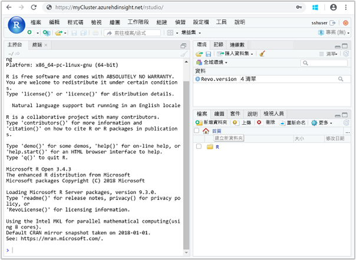

# <a name="quickstart-execute-an-r-script-on-an-ml-services-cluster-in-azure-hdinsight-using-rstudio-server"></a>快速入門：使用 RStudio Server 對 Azure HDInsight 中的 ML 服務叢集執行 R 指令碼

Azure HDInsight 上的 ML 服務可讓 R 指令碼使用 Apache Spark 和 Apache Hadoop MapReduce 執行分散式計算。 ML 服務可藉由設定計算內容來控制執行呼叫的方式。 叢集的邊緣節點提供便利的地方，以便連線到叢集以及執行 R 指令碼。 有了邊緣節點之後，即可選擇跨邊緣節點伺服器的核心，執行 RevoScaleR 的平行分散式函式。 您也可以使用 RevoScaleR 的 Hadoop Map Reduce 或 Apache Spark 計算內容，跨越叢集的節點來執行這些函式。

在本快速入門中，您將了解如何使用 RStudio Server 執行 R 指令碼，以示範如何使用 Spark 進行分散式 R 計算。 您將定義計算內容，以在邊緣節點上本機執行計算，然後分散到 HDInsight 叢集中的各個節點上計算。

## <a name="prerequisite"></a>必要條件

HDInsight 上的 ML 服務叢集。 請參閱[使用 Azure 入口網站建立 Apache Hadoop 叢集](../hdinsight-hadoop-create-linux-clusters-portal.md)，然後選取 [ML 服務]  作為 [叢集類型]  。

## <a name="connect-to-rstudio-server"></a>連線到 RStudio 伺服器

RStudio Server 會在叢集的邊緣節點上執行。 移至下列 URL，其中的 `CLUSTERNAME` 是您所建立 ML 服務叢集的名稱：

```
https://CLUSTERNAME.azurehdinsight.net/rstudio/
```

第一次登入時必須驗證兩次。 第一次出現驗證提示時，請提供叢集管理員登入與密碼，預設為 `admin`。 第二次出現驗證提示時，請提供 SSH 登入與密碼，預設為 `sshuser`。 之後再登入時，只需要提供 SSH 認證。

一旦連線後，您的畫面看起來應該像下列螢幕擷取畫面：



## <a name="use-a-compute-context"></a>使用計算內容

1. 在RStudio Server 中，使用下列程式碼將範例資料載入 HDInsight 的預設儲存體中：

    ```RStudio
    # Set the HDFS (WASB) location of example data
     bigDataDirRoot <- "/example/data"
    
     # create a local folder for storing data temporarily
     source <- "/tmp/AirOnTimeCSV2012"
     dir.create(source)
    
     # Download data to the tmp folder
     remoteDir <- "https://packages.revolutionanalytics.com/datasets/AirOnTimeCSV2012"
     download.file(file.path(remoteDir, "airOT201201.csv"), file.path(source, "airOT201201.csv"))
     download.file(file.path(remoteDir, "airOT201202.csv"), file.path(source, "airOT201202.csv"))
     download.file(file.path(remoteDir, "airOT201203.csv"), file.path(source, "airOT201203.csv"))
     download.file(file.path(remoteDir, "airOT201204.csv"), file.path(source, "airOT201204.csv"))
     download.file(file.path(remoteDir, "airOT201205.csv"), file.path(source, "airOT201205.csv"))
     download.file(file.path(remoteDir, "airOT201206.csv"), file.path(source, "airOT201206.csv"))
     download.file(file.path(remoteDir, "airOT201207.csv"), file.path(source, "airOT201207.csv"))
     download.file(file.path(remoteDir, "airOT201208.csv"), file.path(source, "airOT201208.csv"))
     download.file(file.path(remoteDir, "airOT201209.csv"), file.path(source, "airOT201209.csv"))
     download.file(file.path(remoteDir, "airOT201210.csv"), file.path(source, "airOT201210.csv"))
     download.file(file.path(remoteDir, "airOT201211.csv"), file.path(source, "airOT201211.csv"))
     download.file(file.path(remoteDir, "airOT201212.csv"), file.path(source, "airOT201212.csv"))
    
     # Set directory in bigDataDirRoot to load the data into
     inputDir <- file.path(bigDataDirRoot,"AirOnTimeCSV2012")
    
     # Make the directory
     rxHadoopMakeDir(inputDir)
    
     # Copy the data from source to input
     rxHadoopCopyFromLocal(source, bigDataDirRoot)
    ```

    此步驟可能約需要 8 分鐘才能完成。

1. 建立一些資料資訊並定義兩個資料來源。 在 RStudio 中輸入下列程式碼：

    ```RStudio
    # Define the HDFS (WASB) file system
     hdfsFS <- RxHdfsFileSystem()
    
     # Create info list for the airline data
     airlineColInfo <- list(
          DAY_OF_WEEK = list(type = "factor"),
          ORIGIN = list(type = "factor"),
          DEST = list(type = "factor"),
          DEP_TIME = list(type = "integer"),
          ARR_DEL15 = list(type = "logical"))
    
     # get all the column names
     varNames <- names(airlineColInfo)
    
     # Define the text data source in hdfs
     airOnTimeData <- RxTextData(inputDir, colInfo = airlineColInfo, varsToKeep = varNames, fileSystem = hdfsFS)
    
     # Define the text data source in local system
     airOnTimeDataLocal <- RxTextData(source, colInfo = airlineColInfo, varsToKeep = varNames)
    
     # formula to use
     formula = "ARR_DEL15 ~ ORIGIN + DAY_OF_WEEK + DEP_TIME + DEST"
    ```

1. 使用**本機**計算內容執行資料的羅吉斯迴歸。 在 RStudio 中輸入下列程式碼：

    ```RStudio
    # Set a local compute context
     rxSetComputeContext("local")
    
     # Run a logistic regression
     system.time(
        modelLocal <- rxLogit(formula, data = airOnTimeDataLocal)
     )
    
     # Display a summary
     summary(modelLocal)
    ```

    這些計算應可在約 7 分鐘內完成。 您應該會看到結尾類似以下程式碼片段的輸出：

    ```output
    Data: airOnTimeDataLocal (RxTextData Data Source)
     File name: /tmp/AirOnTimeCSV2012
     Dependent variable(s): ARR_DEL15
     Total independent variables: 634 (Including number dropped: 3)
     Number of valid observations: 6005381
     Number of missing observations: 91381
     -2*LogLikelihood: 5143814.1504 (Residual deviance on 6004750 degrees of freedom)
    
     Coefficients:
                      Estimate Std. Error z value Pr(>|z|)
      (Intercept)   -3.370e+00  1.051e+00  -3.208  0.00134 **
      ORIGIN=JFK     4.549e-01  7.915e-01   0.575  0.56548
      ORIGIN=LAX     5.265e-01  7.915e-01   0.665  0.50590
      ......
      DEST=SHD       5.975e-01  9.371e-01   0.638  0.52377
      DEST=TTN       4.563e-01  9.520e-01   0.479  0.63172
      DEST=LAR      -1.270e+00  7.575e-01  -1.676  0.09364 .
      DEST=BPT         Dropped    Dropped Dropped  Dropped
    
      ---
    
      Signif. codes:  0 ‘***’ 0.001 ‘**’ 0.01 ‘*’ 0.05 ‘.’ 0.1 ‘ ’ 1
    
      Condition number of final variance-covariance matrix: 11904202
      Number of iterations: 7
    ```

1. 使用 **Spark** 內容執行相同的羅吉斯迴歸。 Spark 內容會將處理作業散發到 HDInsight 叢集的所有背景工作節點中。 在 RStudio 中輸入下列程式碼：

    ```RStudio
    # Define the Spark compute context
     mySparkCluster <- RxSpark()
    
     # Set the compute context
     rxSetComputeContext(mySparkCluster)
    
     # Run a logistic regression
     system.time(  
        modelSpark <- rxLogit(formula, data = airOnTimeData)
     )
    
     # Display a summary
     summary(modelSpark)
    ```

    這些計算應可在約 5 分鐘內完成。

## <a name="clean-up-resources"></a>清除資源

完成此快速入門之後，您可以刪除叢集。 利用 HDInsight，您的資料會儲存在 Azure 儲存體中，以便您在未使用叢集時安全地進行刪除。 您也需支付 HDInsight 叢集的費用 (即使未使用)。 由於叢集費用是儲存體費用的許多倍，所以刪除未使用的叢集符合經濟效益。

若要刪除叢集，請參閱[使用您的瀏覽器、PowerShell 或 Azure CLI 刪除 HDInsight 叢集](../hdinsight-delete-cluster.md)。

## <a name="next-steps"></a>後續步驟

在本快速入門中，您已了解如何使用 RStudio Server 執行 R 指令碼，以示範如何使用 Spark 進行分散式 R 計算。  請前往下一篇文章，以了解可用來指定是否以及如何跨邊緣節點核心或 HDInsight 叢集將執行作業平行化的選項。

> [!div class="nextstepaction"]
>[在 HDInsight 上計算 ML 服務的內容選項](./r-server-compute-contexts.md)

> [!NOTE]
> 本頁面說明 RStudio 軟體的功能。 Microsoft Azure HDInsight 與 RStudio, Inc. 沒有附屬關係。
