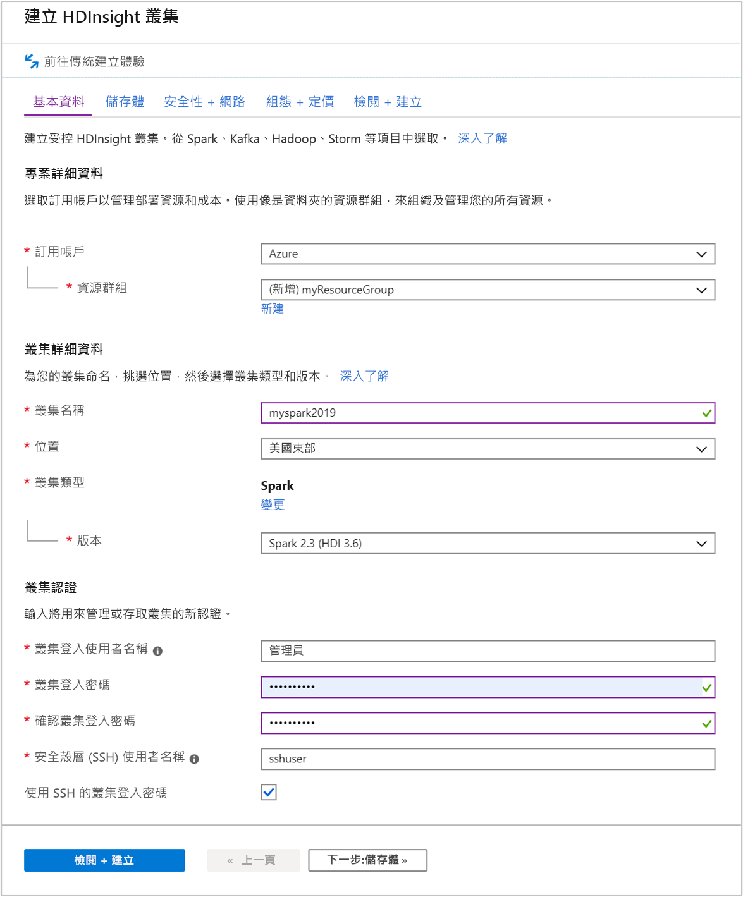
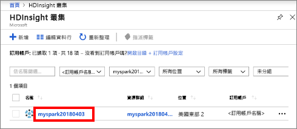

# <a name="quickstart-create-apache-spark-cluster-in-azure-hdinsight-using-azure-portal"></a>快速入門：使用 Azure 入口網站在 Azure HDInsight 中建立 Apache Spark 叢集

了解如何在 Azure HDInsight 中建立 Apache Spark 叢集，以及如何對 Hive 資料表執行 Spark SQL 查詢。 Apache Spark 能夠運用記憶體內部處理，使得資料分析及叢集運算更為快速。 如需 Spark on HDInsight 相關資訊，請參閱[概觀：Azure HDInsight 上的 Apache Spark](apache-spark-overview.md)。

在本快速入門中，您會使用 Azure 入口網站來建立 HDInsight Spark 叢集。 叢集會使用 Azure 儲存體 Blob 作為叢集存放區。 如需有關如何使用 Data Lake Storage Gen2 的詳細資訊，請參閱[快速入門：在 HDInsight 中設定叢集](../../storage/data-lake-storage/quickstart-create-connect-hdi-cluster.md)。

> [!IMPORTANT]  
> 不論使用與否，HDInsight 叢集都是按分鐘計費。 請務必在使用完叢集後將其刪除。 如需詳細資訊，請參閱本文的[清除資源](#clean-up-resources)一節。

如果您沒有 Azure 訂用帳戶，請在開始之前先[建立免費帳戶](https://azure.microsoft.com/free/)。

## <a name="create-an-hdinsight-spark-cluster"></a>建立 HDInsight Spark 叢集

1. 在 Azure 入口網站中，選取 [建立資源]   > [分析]   > [HDInsight]  。

    

1. 在 [基本]  下方，提供下列值：

    |屬性  |說明  |
    |---------|---------|
    |訂用帳戶  | 從下拉式清單中，選取用於此叢集的 Azure 訂用帳戶。 針對本快速入門所使用的訂用帳戶是 **Azure**。 |
    |資源群組 | 指定您是要建立新的資源群組，還是使用現有資源群組。 資源群組是存放 Azure 方案相關資源的容器。 針對本快速入門所使用的資源群組名稱是 **myResourceGroup**。 |
    |叢集名稱 | 提供 HDInsight Spark 叢集的名稱。 針對本快速入門所使用的叢集名稱是 **myspark2019**。|
    |位置   | 選取資源群組的位置。 此範本會使用這個位置，用於建立叢集以及預設叢集儲存體。 本快速入門所使用的位置是**美國東部**。 |
    |叢集類型| 選取 [spark]  作為叢集類型。|
    |叢集版本|一旦選取叢集類型，此欄位就會自動填入預設版本。|
    |叢集登入使用者名稱| 輸入叢集登入使用者名稱。  預設名稱為 *admin*。您稍後會在本快速入門中使用此帳戶來登入 Jupyter Notebook。 |
    |叢集登入密碼| 輸入叢集登入密碼。 |
    |安全殼層 (SSH) 使用者名稱| 輸入 SSH 使用者名稱。 針對本快速入門所使用的 SSH 使用者名稱是 **sshuser**。 根據預設，此帳戶會共用與「叢集登入使用者名稱」  帳戶相同的密碼。 |

    

    完成時，選取 [下一步:  儲存體>>] 繼續前往 [儲存體]  頁面。

1. 在 [儲存體]  下方，提供下列值：

    |屬性  |說明  |
    |---------|---------|
    |主要儲存體類型|使用預設值 [Azure 儲存體]  。|
    |選取方法|使用預設值 [從清單中選取]  。|
    |主要儲存體帳戶|使用自動填入的值。|
    |容器|使用自動填入的值。|

    

    選取 [檢閱 + 建立]  繼續執行。

1. 在 [檢閱 + 建立]  底下，選取 [建立]  。 大約需要 20 分鐘的時間來建立叢集。 您必須先建立叢集，才能繼續前往下一個工作階段。

如果您在建立 HDInsight 叢集時遇到問題，可能是您沒有這麼做的適當權限。 如需詳細資訊，請參閱[存取控制需求](../hdinsight-hadoop-create-linux-clusters-portal.md)。

## <a name="create-a-jupyter-notebook"></a>建立 Jupyter Notebook

Jupyter Notebook 是支援各種程式設計語言的互動式 Notebook 環境。 Notebook 可讓您與資料互動、將程式碼與 Markdown 文字相結合，並執行簡單的視覺效果。

1. 開啟 [Azure 入口網站](https://portal.azure.com)。

1. 選取 [HDInsight 叢集]  ，然後選取您所建立的叢集。

    

1. 從入口網站中選取 [叢集儀表板]  ，然後選取 [Jupyter Notebook]  。 出現提示時，輸入叢集的叢集登入認證。

   

1. 選取 [新增]   > [PySpark]  來建立 Notebook。

   

   新的 Notebook 隨即建立並以 Untitled(Untitled.pynb) 名稱開啟。

## <a name="run-spark-sql-statements"></a>執行 Spark SQL 陳述式

SQL (結構化查詢語言) 是最常見且廣泛使用的語言，可用於查詢及定義資料。 Spark SQL 可作為 Apache Spark 的擴充功能，可讓您使用熟悉的 SQL 語法來處理結構化資料。

1. 確認核心已就緒。 當您在 Notebook 中的核心名稱旁邊看到一個空心圓時，表示核心已準備就緒。 實心圓表示核心忙碌中。

    

    當您第一次啟動 Notebook 時，核心會在背景執行某些工作。 等待核心準備就緒。

1. 將以下程式碼貼入空白儲存格，然後按下 **SHIFT + ENTER** 鍵以執行此程式碼。 此命令會列出叢集上的 Hive 資料表：

    ```PySpark
    %%sql
    SHOW TABLES
    ```

    當您使用 Jupyter Notebook 搭配 HDInsight Spark 叢集時，您可取得預設的 `sqlContext`，用來執行使用 Spark SQL 的 Hive 查詢。 `%%sql` 會告知 Jupyter Notebook 使用預設的 `sqlContext` 來執行 Hive 查詢。 此查詢會擷取 Hive 資料表 (**hivesampletable**) 中的前 10 個資料列，依預設所有 HDInsight 叢集均隨附該資料表。 大約需要 30 秒才能取得結果。 輸出看起來如下：

    

    每當您在 Jupyter 中執行查詢時，網頁瀏覽器視窗標題將會顯示 Notebook 標題和 **(忙碌)** 狀態。 您也會在右上角的 **PySpark** 文字旁看到一個實心圓。

1. 執行另一個查詢，以查看 `hivesampletable` 中的資料。

    ```PySpark
    %%sql
    SELECT * FROM hivesampletable LIMIT 10
    ```

    畫面應會重新整理以顯示查詢輸出。

    

1. 從 Notebook 的 [檔案]  功能表中，選取 [關閉並終止]  。 關閉 Notebook 可釋出叢集資源。

## <a name="clean-up-resources"></a>清除資源

HDInsight 會將您的資料儲存於 Azure 儲存體或 Azure Data Lake Storage 中，以便您在未使用叢集時安全地進行刪除。 您也需支付 HDInsight 叢集的費用 (即使未使用)。 由於叢集費用是儲存體費用的許多倍，所以刪除未使用的叢集符合經濟效益。 如果您打算立即進行[後續步驟](#next-steps)中所列的教學課程，則建議保留叢集。

切換回 Azure 入口網站，然後選取 [刪除]  。


您也可以選取資源群組名稱來開啟資源群組頁面，然後選取 [刪除資源群組]  。 刪除資源群組時，會同時刪除 HDInsight Spark 叢集及預設儲存體帳戶。

## <a name="next-steps"></a>後續步驟

在本快速入門中，您已了解如何建立 HDInsight Spark 叢集和執行基本的 Spark SQL 查詢。 前往下一個教學課程，以了解如何使用 HDInsight Spark 叢集來執行範例資料的互動式查詢。

> [!div class="nextstepaction"]
> [在 Apache Spark 上執行互動式查詢](./apache-spark-load-data-run-query.md)
