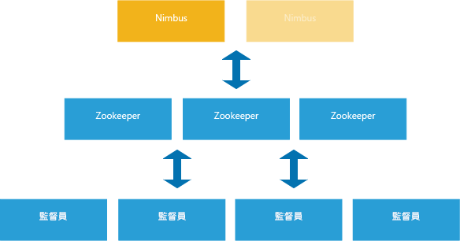

# <a name="what-is-apache-storm-on-azure-hdinsight"></a>什麼是 Apache Storm on Azure HDInsight？

[Apache Storm](https://storm.apache.org/) 是一個容錯的分散式開放原始碼計算系統。 您可以搭配 [Apache Hadoop](https://hadoop.apache.org/) 使用 Storm 來即時處理資料流。 Storm 解決方案也能夠重播最初未成功處理的資料，保證一定會處理資料。

## <a name="why-use-apache-storm-on-hdinsight"></a>為何使用 Apache Storm on HDInsight？

Storm on HDInsight 提供下列功能︰

* __Storm 運作時間的 99% 服務等級協定 (SLA)__ ：如需詳細資訊，請參閱[適用於 HDInsight 的 SLA 資訊](https://azure.microsoft.com/support/legal/sla/hdinsight/v1_0/)文件。

* 在建立期間或之後針對 Storm 叢集執行指令碼，可支援輕鬆自訂。 如需詳細資訊，請參閱[使用指令碼動作來自訂 HDInsight 叢集](../hdinsight-hadoop-customize-cluster-linux.md)。

* **以多種語言建立解決方案**：您可以用所選的語言撰寫 Storm 元件，例如 Java、C# 和 Python。

    * 整合 Visual Studio 與 HDInsight，以供開發、管理及監視 C# 拓撲。 如需詳細資訊，請參閱[使用 HDInsight Tools for Visual Studio 開發 C# Storm 拓撲](apache-storm-develop-csharp-visual-studio-topology.md)。

    * 支援 Trident Java 介面。 您可以建立 Storm 拓撲，以支援一次性處理訊息、交易式資料存放區持續性和一組常用的串流分析作業。

* **動態調整**：您可以新增或移除背景工作節點，而不影響執行 Storm 拓撲。 您必須停用並重新執行拓撲，才能利用透過調整作業新增的節點。

* **使用多項 Azure 服務建立串流管線**：HDInsight 上的 Storm 會與其他 Azure 服務整合，例如事件中樞、SQL Database、Azure 儲存體及 Azure Data Lake Storage。 如需與 Azure 服務整合的解決方案範例，請參閱[使用 Apache Storm on HDInsight 處理事件中樞的事件](https://github.com/Azure-Samples/hdinsight-java-storm-eventhub)。

如需使用 Apache Storm 作為即時分析解決方案的公司清單，請參閱[使用 Apache Storm 的公司](https://storm.apache.org/Powered-By.html)。

若要開始使用 Storm，請參閱[建立和監視 Azure HDInsight 中的 Apache Storm 拓撲](apache-storm-quickstart.md)。

## <a name="how-does-apache-storm-work"></a>Apache Storm 的運作方式

Storm 會執行拓撲，而不是您可能熟悉的 [Apache Hadoop MapReduce](https://hadoop.apache.org/docs/r1.2.1/mapred_tutorial.html) 作業。 Storm 拓撲是由有向非循環圖 (DAG) 中排列的多個元件所組成。 圖形中元件之間的資料流程。 每個元件會取用一或多個資料流，並可選擇性地發出一或多個資料流。 下圖說明資料在基本字數拓撲中的元件之間的流動方式：


* Spout 元件可將資料帶入拓撲中。 它們會將一或多個串流發出至拓撲。

* Bolt 元件會取用 Spout 或其他 Bolt 所發出的串流。 Bolt 可以選擇性地將串流發出至拓撲。 Bolt 也負責將資料寫入外部服務或儲存體，例如 HDFS、Kafka 或 HBase。

## <a name="reliability"></a>可靠性

即使資料分析分散在數以百計的節點中，Apache Storm 也能保證每則傳入訊息一律都會經過完整處理。

Nimbus 節點提供與 Apache Hadoop JobTracker 類似的功能，並會透過 [Apache Zookeeper](https://zookeeper.apache.org/) 將工作指派給叢集中的其他節點。 Zookeeper 節點可為叢集進行協調，並促進 Nimbus 與背景工作節點上的監督員處理序之間的通訊。 如果其中一個處理節點停止，Nimbus 節點會收到通知，然後將工作和相關資料指派給其他節點。

Apache Storm 叢集的預設組態只有一個 Nimbus 節點。 Storm on HDInsight 會提供兩個 Nimbus 節點。 如果主要節點失敗，Storm 叢集會切換至次要節點，直到主要節點復原為止。 下圖說明 Storm on HDInsight 的工作流程組態：



## <a name="ease-of-creation"></a>容易建立

只要花數分鐘即可在 HDInsight 上建立新的 Storm 叢集。 如需關於建立 Storm 叢集的詳細資訊，請參閱[使用 Azure 入口網站建立 Apache Hadoop 叢集](../hdinsight-hadoop-create-linux-clusters-portal.md)。

## <a name="ease-of-use"></a>容易使用

|使用 |描述 |
|---|---|
|安全殼層 (SSH) 連線|您可以使用 SSH 透過網際網路存取 Storm 叢集的前端節點。 您可以使用 SSH，直接在叢集上執行命令。 如需詳細資訊，請參閱[搭配 HDInsight 使用 SSH](../hdinsight-hadoop-linux-use-ssh-unix.md)。|
|Web 連線|所有 HDInsight 叢集都會提供 Ambari Web UI。 您可以使用 Ambari Web UI，輕鬆地監視、設定及管理叢集上的服務。 Storm 叢集也會提供 Storm UI。 您可以使用 Storm UI，從瀏覽器監視及管理執行中的 Storm 拓撲。 如需詳細資訊，請參閱[使用 Apache Ambari Web UI 管理 HDInsight](../hdinsight-hadoop-manage-ambari.md) 和[使用 Apache Storm UI 進行監視和管理](apache-storm-deploy-monitor-topology-linux.md#monitor-and-manage-a-topology-using-the-storm-ui)文件。|
|Azure PowerShell 和 Azure CLI|PowerShell 和 Azure CLI 兩者都提供您可以從用戶端系統使用的命令列公用程式，以便搭配 HDInsight 和其他 Azure 服務運作。|
|整合 Visual Studio|Azure Data Lake Tools for Visual Studio 包含可供使用 SCP.NET 架構建立 C# Storm 拓撲的專案範本。 Data Lake Tools 也提供一些工具，以利用 Storm on HDInsight 來部署、監視和管理解決方案。 如需詳細資訊，請參閱[使用 HDInsight Tools for Visual Studio 開發 C# Storm 拓撲](apache-storm-develop-csharp-visual-studio-topology.md)。|

## <a name="integration-with-other-azure-services"></a>與其他 Azure 服務整合

* __Azure Data Lake Storage__：如需使用 Data Lake Storage 搭配 Storm 叢集的範例，請參閱[搭配使用 Azure Data Lake Storage 與 HDInsight 上的 Apache Storm](apache-storm-write-data-lake-store.md)。

* __事件中樞__：如需使用事件中樞搭配 Storm 叢集的範例，請參閱下列範例：

    * [使用 Apache Storm on HDInsight 處理 Azure 事件中樞的事件 (Java)](https://github.com/Azure-Samples/hdinsight-java-storm-eventhub)

    * [使用 Apache Storm on HDInsight 處理 Azure 事件中樞的事件 (C#)](apache-storm-develop-csharp-event-hub-topology.md)

* __SQL Database__、__Cosmos DB__、__事件中樞__ 和 __HBase__：Data Lake Tools for Visual Studio 隨附範本範例。 如需詳細資訊，請參閱[開發 Apache Storm on HDInsight 的 C# 拓撲](apache-storm-develop-csharp-visual-studio-topology.md)。

## <a name="support"></a>支援

Storm on HDInsight 隨附完整的企業級連續支援。 Storm on HDInsight 也有 99.9% 的 SLA。 這表示 Microsoft 保證 Storm 叢集至少 99.9% 的時間具有外部連線能力。 如需詳細資訊，請參閱 [Azure 文章](https://azure.microsoft.com/support/options/)。

## <a name="apache-storm-use-cases"></a>Apache Storm 使用案例

以下是一些 Storm on HDInsight 可能的常見使用案例：

* 物聯網 (IoT)
* 詐騙偵測
* 社交分析
* 擷取、轉換和載入 (ETL)
* 網路監視
* 搜尋
* Mobile Engagement

如需真實案例的資訊，請參閱 [How companies are using Apache Storm](https://storm.apache.org/Powered-By.html) (公司如何使用 Apache Storm) 文件。

## <a name="development"></a>部署

.NET 開發人員可以使用 Data Lake Tools for Visual Studio，以 C# 語言設計和實作拓撲。 您也可以建立使用 Java 和 C# 元件的混合式拓撲。 如需詳細資訊，請參閱 [使用 Visual Studio 開發 Apache Storm on HDInsight 的 C# 拓撲](apache-storm-develop-csharp-visual-studio-topology.md)。

您也可以使用所選的 IDE 來開發 Java 解決方案。 如需詳細資訊，請參閱[開發 Apache Storm on HDInsight 的 Java 拓撲](apache-storm-develop-java-topology.md)。

Python 也可以用於開發 Storm 元件。 如需詳細資訊，請參閱[使用 Python on HDInsight 開發 Apache Storm 拓撲](apache-storm-develop-python-topology.md)。

## <a name="common-development-patterns"></a>常見的開發模式

### <a name="guaranteed-message-processing"></a>保證處理訊息

Apache Storm 可以提供不同程度的訊息處理保證。 例如，基本的 Storm 應用程式可以保證至少處理一次，而 [Trident](https://storm.apache.org/releases/current/Trident-API-Overview.html) 可以保證只處理一次。 如需詳細資訊，請參閱 apache.org 上的 [保證處理資料](https://storm.apache.org/about/guarantees-data-processing.html) (英文)。

### <a name="ibasicbolt"></a>IBasicBolt

讀取輸入 Tuple、發出零個以上的 Tuple，然後在執行方法結束時立即認可輸入 Tuple，是常見的模式。 Storm 提供 [IBasicBolt](https://storm.apache.org/releases/current/javadocs/org/apache/storm/topology/IBasicBolt.html) 介面將此模式自動化。

### <a name="joins"></a>聯結

資料流的聯結方式會隨應用程式而異。 例如，您可以將多個串流中的每個 Tuple 聯結成一個新的串流，也可以只聯結特定時間範圍的幾批 Tuple。 無論何者，都可利用 [fieldsGrouping](https://storm.apache.org/releases/current/javadocs/org/apache/storm/topology/InputDeclarer.html#fieldsGrouping-java.lang.String-org.apache.storm.tuple.Fields-) 來完成聯結。 群組欄位是一種定義 Tuple 如何路由傳送至 Bolt 的方法。

在下列 Java 範例中，會使用 fieldsGrouping 將源自元件 "1"、"2" 和 "3" 的 Tuple 路由傳送至 MyJoiner bolt：

```java
builder.setBolt("join", new MyJoiner(), parallelism) .fieldsGrouping("1", new Fields("joinfield1", "joinfield2")) .fieldsGrouping("2", new Fields("joinfield1", "joinfield2")) .fieldsGrouping("3", new Fields("joinfield1", "joinfield2"));
```

### <a name="batches"></a>批次

Apache Storm 提供稱為「計時 Tuple」的內部計時機制。 您可以設定在您的拓撲中發出計時 Tuple 的頻率。

如需使用 C# 元件中 tick tuple 的範例，請參閱 [PartialBoltCount.cs](https://github.com/hdinsight/hdinsight-storm-examples/blob/3b2c960549cac122e8874931df4801f0934fffa7/EventCountExample/EventCountTopology/src/main/java/com/microsoft/hdinsight/storm/examples/PartialCountBolt.java)。

### <a name="caches"></a>快取

通常會使用記憶體內部快取當做加速處理的機制，因為此方式可以將常用的資產保留在記憶體內。 由於拓撲會分散到多個節點，多個處理序位於每個節點內，您應該考慮使用 [fieldsGrouping](https://storm.apache.org/releases/current/javadocs/org/apache/storm/topology/InputDeclarer.html#fieldsGrouping-java.lang.String-org.apache.storm.tuple.Fields-)。 使用 `fieldsGrouping` 可確保含有快取查閱所用欄位的 Tuple 一律會路由傳送至相同程序。 此群組功能可避免快取項目在程序之間重複。

### <a name="stream-top-n"></a>串流「前 N 個」

當拓撲取決於計算前 N 個值時，您可平行地計算前 N 個值。 然後將這些計算的輸出合併成一個全域值。 此作業可利用 [fieldsGrouping](https://storm.apache.org/releases/current/javadocs/org/apache/storm/topology/InputDeclarer.html#fieldsGrouping-java.lang.String-org.apache.storm.tuple.Fields-) 來進行，依欄位路由傳送以便平行處理。 然後您可以路由傳送至 bolt 來整體決定前 N 個值。

如需計算前 N 個值的範例，請參閱 [RollingTopWords](https://github.com/apache/storm/blob/master/examples/storm-starter/src/jvm/org/apache/storm/starter/RollingTopWords.java) 範例。

## <a name="logging"></a>記錄

Storm 使用 [Apache Log4j 2](https://logging.apache.org/log4j/2.x/) 來記錄資訊。 預設會記錄大量的資料，因此難以排序整個資訊。 您可以將記錄組態檔納入 Storm 拓撲的一部分，以便控制記錄行為。

如需示範如何設定記錄的拓撲範例，請參閱 Storm on HDInsight 的 [以 Java 為基礎的 WordCount](apache-storm-develop-java-topology.md) 範例。

## <a name="next-steps"></a>後續步驟

深入了解使用 Apache Storm on HDInsight 的即時分析解決方案：

* [建立和監視 Azure HDInsight 中的 Apache Storm 拓撲](apache-storm-quickstart.md)
* [Apache Storm on HDInsight 的範例拓撲](apache-storm-example-topology.md)
