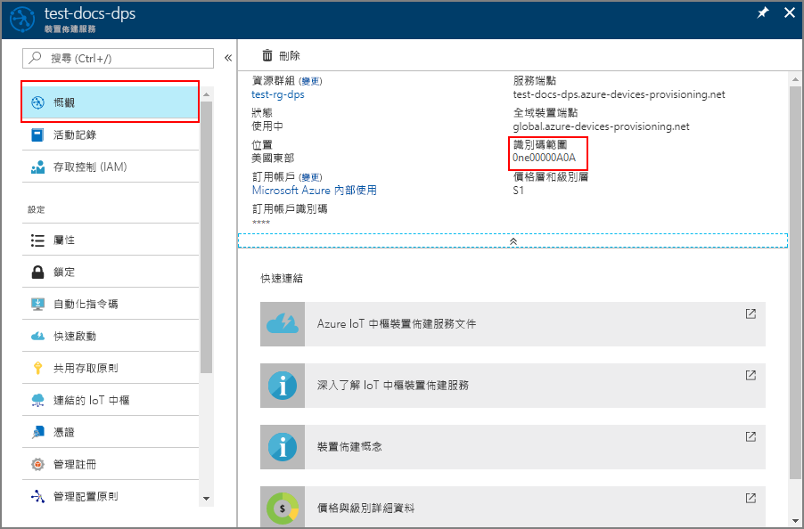

# <a name="how-to-provision-for-multitenancy"></a>如何針對多組織用戶佈建 

佈建服務定義的配置原則支援多種配置案例。 兩個最常見的案例為：

* **地理位置/地理延遲**：當裝置在位置之間移動時，可透過將裝置佈建至最接近每個位置的 IoT 中樞以改善網路延遲。 在此案例中，會選取一群跨越多個區域的 IoT 中樞進行註冊。 系統會針對這些註冊選取**最低延遲**配置原則。 此原則會促使裝置佈建服務評估裝置延遲，然後從一群 IoT 中樞中判斷出最接近的 IoT 中樞。 

* **多租用戶**：IoT 解決方案內使用的裝置可能需要指派給特定 IoT 中樞或 IoT 中樞群組。 解決方案可能需要特定租用戶的所有裝置與特定 IoT 中樞群組通訊。 在某些情況下，租用戶可能擁有 IoT 中樞，且要求將裝置指派給他們的 IoT 中樞。

合併這兩種案例是很常見的。 例如，多租用戶 IoT 解決方案通常會使用一群散佈在多個區域的 IoT 中樞指派租用戶裝置。 這些租用戶裝置可依據地理位置指派給該群組中最低延遲的 IoT 中樞。

此文章使用 [Azure IoT C SDK](https://github.com/Azure/azure-iot-sdk-c) 的模擬裝置範例，示範如何在多租用戶情況下跨多個區域佈建裝置。 您將在此文章中執行下列步驟：

* 使用 Azure CLI 建立兩個區域 IoT 中樞 (**美國西部**與**美國東部**)
* 建立多租用戶註冊
* 使用 Azure CLI 建立兩個區域 Linux VM 作為相同區域 (**美國西部**與**美國東部**) 中的裝置
* 在兩個 Linux VM 上設定適用於 Azure IoT C SDK 的開發環境
* 模擬裝置以查看它們在最接近的區域中針對相同租用戶佈建的狀況。


[!INCLUDE [quickstarts-free-trial-note](../../includes/quickstarts-free-trial-note.md)]


## <a name="prerequisites"></a>必要條件

* 完成[使用 Azure 入口網站設定 IoT 中樞裝置佈建服務](./quick-setup-auto-provision.md)快速入門。


[!INCLUDE [cloud-shell-try-it.md](../../includes/cloud-shell-try-it.md)]


## <a name="create-two-regional-iot-hubs"></a>建立兩個區域 IoT 中樞

在此節中，您將使用 Azure Cloud Shell 為租用戶在**美國西部**與**美國東部**區域建立兩個新的區域 IoT 中樞。


1. 使用 Azure Cloud Shell 以 [az group create](/cli/azure/group#az-group-create) 命令建立資源群組。 Azure 資源群組是在其中部署與管理 Azure 資源的邏輯容器。 

    下列範例會在 *eastus* 區域中建立名為 *contoso-us-resource-group* 的資源群組。 建議您將此群組用於在此文章中建立的所有資源。 這將會讓您在完成作業後更容易清除資源。

    ```azurecli-interactive 
    az group create --name contoso-us-resource-group --location eastus
    ```

2. 使用 Azure Cloud Shell 以 [az iot hub create](/cli/azure/iot/hub#az-iot-hub-create) 命令在 **eastus** 區域中建立 IoT 中樞。 此 IoT 中樞將會新增至 *contoso-us-resource-group*。

    下列範例會在 *eastus* 位置建立名為 *contoso-east-hub* 的 IoT 中樞。 您必須使用自己唯一的中樞名稱取代 **contoso-east-hub**。

    ```azurecli-interactive 
    az iot hub create --name contoso-east-hub --resource-group contoso-us-resource-group --location eastus --sku S1
    ```
    
    此命令可能需要數分鐘才能完成。

3. 使用 Azure Cloud Shell 以 [az iot hub create](/cli/azure/iot/hub#az-iot-hub-create) 命令在 **westus** 區域中建立 IoT 中樞。 此 IoT 中樞也會新增至 *contoso-us-resource-group*。

    下列範例會在 *westus* 位置建立名為 *contoso-west-hub* 的 IoT 中樞。 您必須使用自己唯一的中樞名稱取代 **contoso-west-hub**。

    ```azurecli-interactive 
    az iot hub create --name contoso-west-hub --resource-group contoso-us-resource-group --location westus --sku S1
    ```

    此命令可能需要數分鐘才能完成。


## <a name="create-the-multitenant-enrollment"></a>建立多租用戶註冊

在此節中，您將會為租用戶裝置建立新的註冊群組。  

為了簡單起見，此文章將在註冊中使用[對稱金鑰證明](concepts-symmetric-key-attestation.md)。 如需更安全的解決方案，請考慮使用 [X.509 憑證證明](concepts-security.md#x509-certificates)與信任鏈結。

1. 登入 [Azure 入口網站](https://portal.azure.com)，並開啟您的裝置佈建服務執行個體。

2. 選取 [管理註冊]  索引標籤，然後按一下頁面頂端的 [新增註冊群組]  按鈕。 

3. 在 [新增註冊群組]  上輸入下列資訊，然後按一下 [儲存]  按鈕。

    **群組名稱**：輸入 **contoso-us-devices**。

    **證明類型**：選取 [對稱金鑰]  。

    **自動產生金鑰**：此核取方塊應已勾選。

    **選取要如何將裝置指派到中樞**：選取 [最低延遲]  。

    


4. 在 [新增註冊群組]  上按一下 [連結新的 IoT 中樞]  ，以連結您的兩個區域中樞。

    訂用帳戶  ：如果您有多個訂用帳戶，請選擇您用來建立區域 IoT 中樞的訂用帳戶。

    **IoT 中樞**：選取您建立的其中一個區域中樞。

    **存取原則**：選擇 [iothubowner]  。

    


5. 在兩個區域 IoT 中樞都已連結後，您必須為註冊群組選取它們，然後按一下 [儲存]  以建立註冊的區域 IoT 中樞群組。

    


6. 儲存註冊之後，請重新開啟它，並記下 [主要金鑰]  。 您必須先儲存註冊，才能產生金鑰。 此金鑰將在後續用來產生兩個模擬裝置的唯一裝置金鑰。


## <a name="create-regional-linux-vms"></a>建立區域 Linux VM

在此節中，您將會建立兩部區域 Linux 虛擬機器 (VM)。 這些 VM 將從每一區域執行裝置模擬範例，以示範兩個區域的租用戶裝置佈建。

為了方便清除，這些 VM 將會新增至包含所建立 IoT 中樞的相同資源群組，亦即 *contoso-us-resource-group*。 但是，VM 將在個別區域 (**美國西部**與**美國東部**) 中執行。

1. 在 Azure Cloud Shell 中，變更下列命令中的參數並執行命令以建立**美國東部**區域 VM：

    **--name**：輸入您**美國東部**區域裝置虛擬機器的唯一名稱。 

    **--admin-username**：使用您自己的管理員使用者名稱。

    **--admin-password**：使用您自己的管理員密碼。

    ```azurecli-interactive
    az vm create \
    --resource-group contoso-us-resource-group \
    --name ContosoSimDeviceEast \
    --location eastus \
    --image Canonical:UbuntuServer:18.04-LTS:18.04.201809110 \
    --admin-username contosoadmin \
    --admin-password myContosoPassword2018 \
    --authentication-type password
    ```

    此命令將需要數分鐘才能完成。 在命令完成之後，記下您美國東部區域 VM 的 **publicIpAddress** 值。

1. 在 Azure Cloud Shell 中，變更下列命令中的參數並執行命令以建立**美國西部**區域 VM：

    **--name**：輸入您**美國西部**區域裝置虛擬機器的唯一名稱。 

    **--admin-username**：使用您自己的管理員使用者名稱。

    **--admin-password**：使用您自己的管理員密碼。

    ```azurecli-interactive
    az vm create \
    --resource-group contoso-us-resource-group \
    --name ContosoSimDeviceWest \
    --location westus \
    --image Canonical:UbuntuServer:18.04-LTS:18.04.201809110 \
    --admin-username contosoadmin \
    --admin-password myContosoPassword2018 \
    --authentication-type password
    ```

    此命令將需要數分鐘才能完成。 在命令完成之後，記下您美國西部區域 VM 的 **publicIpAddress** 值。

1. 開啟兩個命令列殼層。 使用 SSH 連線至每個殼層中的其中一個區域 VM。 

    將您的系統管理員使用者名稱與記下的 VM 公用 IP 位址，以參數方式傳遞至 SSH。 在系統提示時輸入系統管理員密碼。

    ```bash
    ssh contosoadmin@1.2.3.4

    contosoadmin@ContosoSimDeviceEast:~$
    ```

    ```bash
    ssh contosoadmin@5.6.7.8

    contosoadmin@ContosoSimDeviceWest:~$
    ```


## <a name="prepare-the-azure-iot-c-sdk-development-environment"></a>準備 Azure IoT C SDK 開發環境

在此節中，您將會將 Azure IoT C SDK 複製到每部 VM 上。 SDK 包含一個範例，此範例將會模擬從每個區域佈建租用戶裝置。


1. 使用下列命令為每部 VM 安裝 **Cmake**、**g++** 、**gcc** 與 [Git](https://git-scm.com/book/en/v2/Getting-Started-Installing-Git)：

    ```bash
    sudo apt-get update
    sudo apt-get install cmake build-essential libssl-dev libcurl4-openssl-dev uuid-dev git-all
    ```


1. 將 [Azure IoT C SDK](https://github.com/Azure/azure-iot-sdk-c) \(英文\) 複製到兩部 VM 上。

    ```bash
    cd ~/
    git clone https://github.com/Azure/azure-iot-sdk-c.git --recursive
    ```

    預期此作業需要幾分鐘的時間才能完成。

1. 為兩部 VM 在存放庫內部建立新的 **cmake** 資料夾，然後變更至該資料夾。

    ```bash
    mkdir ~/azure-iot-sdk-c/cmake
    cd ~/azure-iot-sdk-c/cmake
    ```

1. 為兩部 VM 執行下列命令，以建置您開發用戶端平台特有的 SDK 版本。 

    ```bash
    cmake -Dhsm_type_symm_key:BOOL=ON -Duse_prov_client:BOOL=ON  ..
    ```

    建置成功後，最後幾行輸出會類似於下列輸出：

    ```bash
    -- IoT Client SDK Version = 1.2.9
    -- Provisioning client ON
    -- Provisioning SDK Version = 1.2.9
    -- target architecture: x86_64
    -- Checking for module 'libcurl'
    --   Found libcurl, version 7.58.0
    -- Found CURL: curl
    -- target architecture: x86_64
    -- target architecture: x86_64
    -- target architecture: x86_64
    -- target architecture: x86_64
    -- iothub architecture: x86_64
    -- target architecture: x86_64
    -- Configuring done
    -- Generating done
    -- Build files have been written to: /home/contosoadmin/azure-iot-sdk-c/cmake
    ```    


## <a name="derive-unique-device-keys"></a>衍生唯一的裝置金鑰

搭配群組註冊使用對稱金鑰證明時，您不會直接使用註冊群組金鑰。 而是會為每部裝置建立唯一的衍生金鑰，並依照[使用對稱金鑰的群組註冊](concepts-symmetric-key-attestation.md#group-enrollments)中所述進行作業。

若要產生裝置金鑰，請使用群組主要金鑰為裝置計算唯一註冊識別碼的 [HMAC-SHA256](https://wikipedia.org/wiki/HMAC)，並將結果轉換為 Base64 格式。

請勿在裝置代碼中包含群組主要金鑰。

使用 Bash 殼層範例以使用 **openssl** 為每部裝置建立衍生的裝置金鑰。

- 將 **KEY** 的值取代為您先前為註冊記下的**主要金鑰**。

- 將 **REG_ID** 的值取代為您自己每部裝置的唯一註冊識別碼。 請使用小寫英數字元與破折號 ('-') 字元定義兩個識別碼。

為 *contoso-simdevice-east* 產生裝置金鑰的範例：

```bash
KEY=rLuyBPpIJ+hOre2SFIP9Ajvdty3j0EwSP/WvTVH9eZAw5HpDuEmf13nziHy5RRXmuTy84FCLpOnhhBPASSbHYg==
REG_ID=contoso-simdevice-east

keybytes=$(echo $KEY | base64 --decode | xxd -p -u -c 1000)
echo -n $REG_ID | openssl sha256 -mac HMAC -macopt hexkey:$keybytes -binary | base64
```

```bash
p3w2DQr9WqEGBLUSlFi1jPQ7UWQL4siAGy75HFTFbf8=
```

為 *contoso-simdevice-west* 產生裝置金鑰的範例：

```bash
KEY=rLuyBPpIJ+hOre2SFIP9Ajvdty3j0EwSP/WvTVH9eZAw5HpDuEmf13nziHy5RRXmuTy84FCLpOnhhBPASSbHYg==
REG_ID=contoso-simdevice-west

keybytes=$(echo $KEY | base64 --decode | xxd -p -u -c 1000)
echo -n $REG_ID | openssl sha256 -mac HMAC -macopt hexkey:$keybytes -binary | base64
```

```bash
J5n4NY2GiBYy7Mp4lDDa5CbEe6zDU/c62rhjCuFWxnc=
```


租用戶裝置將使用它們的衍生裝置金鑰與唯一註冊識別碼，於佈建期間搭配註冊群組對租用戶 IoT 中樞執行對稱金鑰證明。


## <a name="simulate-the-devices-from-each-region"></a>從每個區域模擬裝置


在此節中，您將會針對兩個區域 VM 更新 Azure IoT C SDK 中的佈建範例。 

此範例程式碼會模擬將佈建要求傳送至裝置佈建服務執行個體的裝置開機順序。 此開機順序能使裝置由系統辨識，並依據延遲指派給最接近的 IoT 中樞。

1. 在 Azure 入口網站中，選取您裝置佈建服務的 [概觀]  索引標籤，並記下 [識別碼範圍]  值。

     

1. 在兩部 VM 上開啟 **~/azure-iot-sdk-c/provisioning\_client/samples/prov\_dev\_client\_sample/prov\_dev\_client\_sample.c** 以進行編輯。

    ```bash
    vi ~/azure-iot-sdk-c/provisioning_client/samples/prov_dev_client_sample/prov_dev_client_sample.c
    ```

1. 找出 `id_scope` 常數，並將其值取代為您先前複製的 [識別碼範圍]  值。 

    ```c
    static const char* id_scope = "0ne00002193";
    ```

1. 在相同的檔案中找出 `main()` 函式的定義。 確定 `hsm_type` 變數如下所示設定為 `SECURE_DEVICE_TYPE_SYMMETRIC_KEY`，以符合註冊群組證明方法。 

    將變更儲存到兩部 VM 中的檔案。

    ```c
    SECURE_DEVICE_TYPE hsm_type;
    //hsm_type = SECURE_DEVICE_TYPE_TPM;
    //hsm_type = SECURE_DEVICE_TYPE_X509;
    hsm_type = SECURE_DEVICE_TYPE_SYMMETRIC_KEY;
    ```

1. 在兩部 VM 上，尋找在 **prov\_dev\_client\_sample.c** 中已標成註解的對 `prov_dev_set_symmetric_key_info()` 的呼叫。

    ```c
    // Set the symmetric key if using they auth type
    //prov_dev_set_symmetric_key_info("<symm_registration_id>", "<symmetric_Key>");
    ```

    取消註解函式呼叫，並將預留位置值 (包括角括號) 取代為每台裝置的唯一註冊識別碼和衍生裝置金鑰。 以下所示的金鑰僅供示範之用。 請使用您之前產生的金鑰。

    美國東部：
    ```c
    // Set the symmetric key if using they auth type
    prov_dev_set_symmetric_key_info("contoso-simdevice-east", "p3w2DQr9WqEGBLUSlFi1jPQ7UWQL4siAGy75HFTFbf8=");
    ```

    美國西部：
    ```c
    // Set the symmetric key if using they auth type
    prov_dev_set_symmetric_key_info("contoso-simdevice-west", "J5n4NY2GiBYy7Mp4lDDa5CbEe6zDU/c62rhjCuFWxnc=");
    ```

    儲存檔案。

1. 在兩部 VM 上，瀏覽至如下所示的範例資料夾，然後建立範例。

    ```bash
    cd ~/azure-iot-sdk-c/cmake/provisioning_client/samples/prov_dev_client_sample/
    cmake --build . --target prov_dev_client_sample --config Debug
    ```

1. 成功建立後，請在兩部 VM 上執行 **prov\_dev\_client\_sample.exe**，以從每個區域模擬租用戶裝置。 請注意，每個裝置都會配置給最接近模擬裝置所在區域的租用戶 IoT 中樞。

    執行模擬：
    ```bash
    ~/azure-iot-sdk-c/cmake/provisioning_client/samples/prov_dev_client_sample/prov_dev_client_sample
    ```

    從美國東部 VM 輸出的範例：

    ```bash
    contosoadmin@ContosoSimDeviceEast:~/azure-iot-sdk-c/cmake/provisioning_client/samples/prov_dev_client_sample$ ./prov_dev_client_sample
    Provisioning API Version: 1.2.9

    Registering Device

    Provisioning Status: PROV_DEVICE_REG_STATUS_CONNECTED
    Provisioning Status: PROV_DEVICE_REG_STATUS_ASSIGNING
    Provisioning Status: PROV_DEVICE_REG_STATUS_ASSIGNING

    Registration Information received from service: contoso-east-hub.azure-devices.net, deviceId: contoso-simdevice-east
    Press enter key to exit:

    ```

    從美國西部 VM 輸出的範例：
    ```bash
    contosoadmin@ContosoSimDeviceWest:~/azure-iot-sdk-c/cmake/provisioning_client/samples/prov_dev_client_sample$ ./prov_dev_client_sample
    Provisioning API Version: 1.2.9

    Registering Device

    Provisioning Status: PROV_DEVICE_REG_STATUS_CONNECTED
    Provisioning Status: PROV_DEVICE_REG_STATUS_ASSIGNING
    Provisioning Status: PROV_DEVICE_REG_STATUS_ASSIGNING

    Registration Information received from service: contoso-west-hub.azure-devices.net, deviceId: contoso-simdevice-west
    Press enter key to exit:
    ```


## <a name="clean-up-resources"></a>清除資源

如果您打算繼續使用在此文章中建立的資源，可以保留它們。 如果不打算繼續使用這些資源，請使用下列步驟刪除此文章建立的所有資源，以避免產生非必要費用。

以下步驟假設您依照指示在名為 **contoso-us-resource-group** 的相同資源群組中建立了此文章中的所有資源。

> [!IMPORTANT]
> 刪除資源群組是無法回復的動作。 資源群組和其中包含的所有資源都將永久刪除。 請確定您不會不小心刪除錯誤的資源群組或資源。 如果您在現有的資源群組內建立了 IoT 中樞，而該群組中包含您想要保留的資源，則您只需刪除 IoT 中樞本身即可，而不要刪除資源群組。
>

依名稱刪除資源群組：

1. 登入 [Azure 入口網站](https://portal.azure.com)，然後按一下 [資源群組]  。

2. 在 [依名稱篩選]  文字方塊中，輸入您的資源所屬的資源群組名稱 **contoso-us-resource-group**。 

3. 在結果清單中的資源群組右側，按一下 **...** ，然後按一下 [刪除資源群組]  。

4. 系統將會要求您確認是否刪除資源。 再次輸入您的資源群組名稱進行確認，然後按一下 [刪除]  。 片刻過後，系統便會刪除該資源群組及其所有內含的資源。

## <a name="next-steps"></a>後續步驟

- 若要深入了解更多的 Reprovisioning，請參閱[IoT 中樞裝置重新佈建概念](concepts-device-reprovision.md) 
- 若要深入了解更多的解除佈建，請參閱[如何取消佈建先前自動佈建的裝置](how-to-unprovision-devices.md) 


