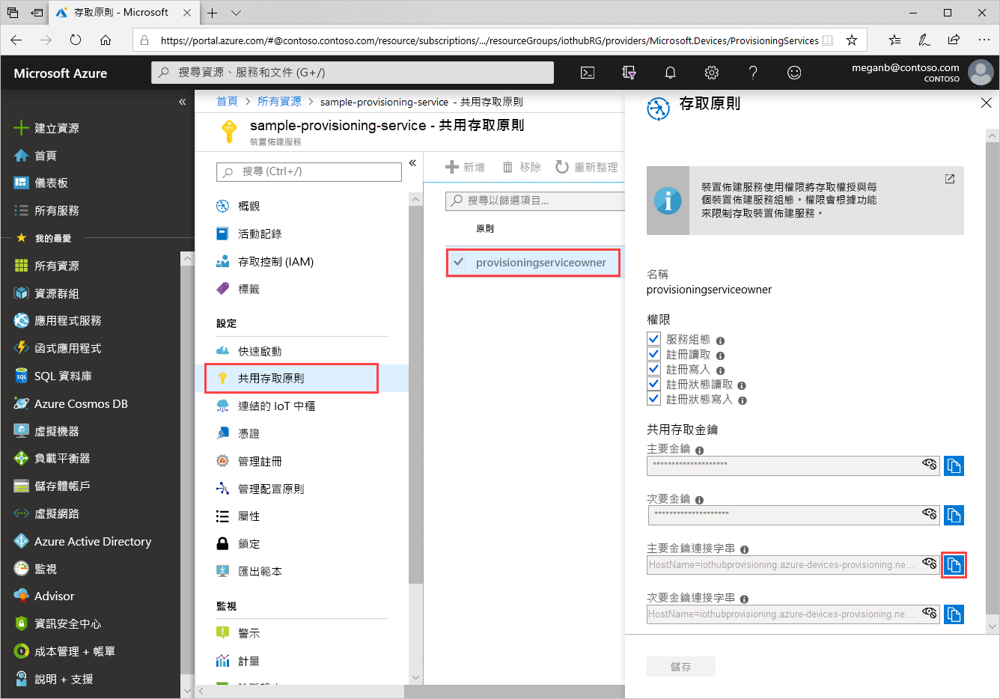
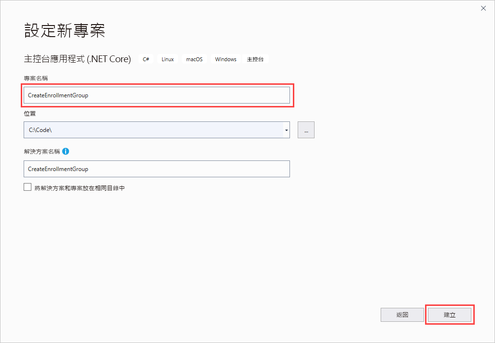
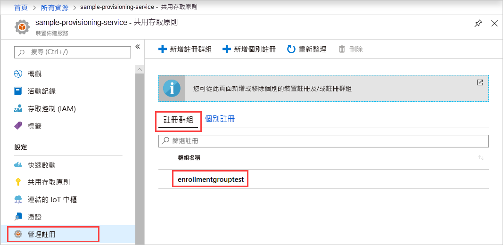

# <a name="quickstart-enroll-x509-devices-to-the-device-provisioning-service-using-c"></a>快速入門：使用 C# 向裝置佈建服務註冊 X.509 裝置

[!INCLUDE [iot-dps-selector-quick-enroll-device-x509](../../includes/iot-dps-selector-quick-enroll-device-x509.md)]

本快速入門說明如何使用 C# 以程式設計方式建立中繼或根 CA X.509 憑證的[註冊群組](concepts-service.md#enrollment-group)。 註冊群組可使用 [Microsoft Azure IoT SDK for .NET](https://github.com/Azure/azure-iot-sdk-csharp) 和範例 C# .NET Core 應用程式來建立。 註冊群組可針對共用憑證鏈結中通用簽署憑證的裝置，控制對於佈建服務的存取權。 若要深入了解，請參閱[使用 X.509 憑證控制對於佈建服務的裝置存取](./concepts-security.md#controlling-device-access-to-the-provisioning-service-with-x509-certificates)。 如需使用以 X.509 憑證為基礎的公開金鑰基礎結構 (PKI) 搭配 Azure IoT 中樞和裝置佈建服務的詳細資訊，請參閱 [X.509 CA 憑證安全性概觀](https://docs.microsoft.com/azure/iot-hub/iot-hub-x509ca-overview)。 

本快速入門預期您已建立 IoT 中樞和裝置佈建服務執行個體。 如果您尚未建立這些資源，請先完成[使用 Azure 入口網站設定 IoT 中樞裝置佈建服務](./quick-setup-auto-provision.md)快速入門，再繼續閱讀本文。

雖然本文中的步驟在 Windows 和 Linux 電腦上都可運作，但本文將使用 Windows 開發電腦。

[!INCLUDE [quickstarts-free-trial-note](../../includes/quickstarts-free-trial-note.md)]

## <a name="prerequisites"></a>必要條件

* 安裝 [Visual Studio 2019](https://www.visualstudio.com/vs/)。
* 安裝 [.NET Core SDK](https://www.microsoft.com/net/download/windows)。
* 安裝 [Git](https://git-scm.com/download/)。

## <a name="prepare-test-certificates"></a>準備測試憑證

在進行本快速入門時，您必須要有 .pem 或 .cer 檔案，且該檔案必須包含中繼或根 CA X.509 憑證的公開部分。 此憑證必須上傳至佈建服務，並由服務驗證。

[Azure IoT C SDK](https://github.com/Azure/azure-iot-sdk-c) 包含的測試工具可協助您建立 X.509 憑證鏈結、從該鏈結上傳根或中繼憑證，並使用驗證憑證的服務來執行所有權證明。

> [!CAUTION]
> SDK 工具建立的憑證僅供開發測試之用。
> 請勿在生產環境中使用這些憑證。
> 其中包含會在 30 天後到期的硬式編碼密碼，例如 1234  。
> 若要了解如何取得生產環境適用的憑證，請參閱 Azure IoT 中樞文件中的[如何取得 X.509 CA 憑證](https://docs.microsoft.com/azure/iot-hub/iot-hub-x509ca-overview#how-to-get-an-x509-ca-certificate)。
>

若要使用這項測試工具來產生憑證，請執行下列步驟：

1. 開啟命令提示字元視窗或 Git Bash 殼層，並切換至電腦上的工作資料夾。 執行下列命令以複製 [Azure IoT C SDK](https://github.com/Azure/azure-iot-sdk-c) GitHub 存放庫：

   ```cmd/sh
   git clone https://github.com/Azure/azure-iot-sdk-c.git --recursive
   ```

   預期此作業需要幾分鐘的時間才能完成。

   測試工具位於您所複製的存放庫 *azure-iot-sdk-c/tools/CACertificates* 中。

1. 依照[管理用於範例和教學課程的測試 CA 憑證](https://github.com/Azure/azure-iot-sdk-c/blob/master/tools/CACertificates/CACertificateOverview.md)中的步驟操作。

除了 C SDK 中的工具以外，*Microsoft Azure IoT SDK for .NET* 中的[群組憑證驗證範例](https://github.com/Azure-Samples/azure-iot-samples-csharp/tree/master/provisioning/Samples/service/GroupCertificateVerificationSample)會說明如何在 C# 中使用現有的 X.509 中繼或根 CA 憑證執行擁有權證明。

## <a name="get-the-connection-string-for-your-provisioning-service"></a>取得佈建服務的連接字串

對於本快速入門中的範例，您需要佈建服務的連接字串。

1. 登入 Azure 入口網站並選取 [所有資源]  ，然後開啟您的裝置佈建服務。

1. 選取 [共用存取原則]  ，然後選擇您要用來開啟其屬性的存取原則。 在 [存取原則]  中，複製並儲存主要索引鍵連接字串。

    

## <a name="create-the-enrollment-group-sample"></a>建立註冊群組範例 

本節將說明如何建立 .NET Core 主控台應用程式，以將註冊群組新增至您的佈建服務。 進行一些修改後，您也可以遵循下列步驟來建立 [Windows IoT Core](https://developer.microsoft.com/en-us/windows/iot) 主控台應用程式以新增註冊群組。 若要深入了解如何使用 IoT Core 進行開發，請參閱 [Windows IoT Core 開發人員文件](https://docs.microsoft.com/windows/iot-core/)。

1. 開啟 Visual Studio，然後選取 [建立新專案]  。 在 [建立新專案]  中，針對 C# 專案範本選擇 [主控台應用程式 (.NET Core)]  ，然後選取 [下一步]  。

1. 將專案命名為 CreateEnrollmentGroup  ，然後按 [建立]  。

    

1. 若在 Visual Studio 中開啟解決方案，請在 [方案總管]  窗格中，以滑鼠右鍵按一下 [CreateEnrollmentGroup]  專案，然後選取 [管理 NuGet 套件]  。

1. 在 [NuGet 套件管理員]  中選取 [瀏覽]  ，搜尋並選擇 **Microsoft.Azure.Devices.Provisioning.Service**，然後按 [安裝]  。

    

   此步驟會下載及安裝 [Azure IoT 佈建服務用戶端 SDK](https://www.nuget.org/packages/Microsoft.Azure.Devices.Provisioning.Service/) NuGet 套件及其相依項目，並新增對它的參考。

1. 在 `Program.cs` 的頂端，將下列 `using` 陳述式新增於其他 `using` 陳述式之後：

   ```csharp
   using System.Security.Cryptography.X509Certificates;
   using System.Threading.Tasks;
   using Microsoft.Azure.Devices.Provisioning.Service;
   ```

1. 將下列欄位新增至 `Program` 類別，並進行列出的變更。  

   ```csharp
   private static string ProvisioningConnectionString = "{ProvisioningServiceConnectionString}";
   private static string EnrollmentGroupId = "enrollmentgrouptest";
   private static string X509RootCertPath = @"{Path to a .cer or .pem file for a verified root CA or intermediate CA X.509 certificate}";
   ```

   * 使用您想要為其建立註冊的佈建服務連接字串，取代 `ProvisioningServiceConnectionString` 預留位置值。

   * 將 `X509RootCertPath` 預留位置值更換為 .pem 或 .cer 檔案的路徑。 此檔案包含中繼或根 CA X.509 憑證 (先前已上傳並向佈建服務驗證) 的公開部分。

   * 您可以選擇性地變更 `EnrollmentGroupId` 值。 此字串只可包含小寫字元和連字號。

   > [!IMPORTANT]
   > 在生產程式碼中，請注意下列安全性考量：
   >
   > * 替佈建服務管理員將連接字串硬式編碼會違反安全性最佳做法。 連接字串應以安全的方式保存，例如保存在安全的組態檔或保存在登錄中。
   > * 務必僅只上傳簽署憑證的公開部分。 決不將包含私密金鑰的 .pfx (PKCS12) 或 .pem 檔案上傳至佈建服務。

1. 將下列方法新增至 `Program` 類別。 此程式碼會建立註冊群組項目，然後在 `ProvisioningServiceClient` 上呼叫 `CreateOrUpdateEnrollmentGroupAsync` 方法，以將註冊群組新增到佈建服務。

   ```csharp
   public static async Task RunSample()
   {
       Console.WriteLine("Starting sample...");
 
       using (ProvisioningServiceClient provisioningServiceClient =
               ProvisioningServiceClient.CreateFromConnectionString(ProvisioningConnectionString))
       {
           #region Create a new enrollmentGroup config
           Console.WriteLine("\nCreating a new enrollmentGroup...");
           var certificate = new X509Certificate2(X509RootCertPath);
           Attestation attestation = X509Attestation.CreateFromRootCertificates(certificate);
           EnrollmentGroup enrollmentGroup =
                   new EnrollmentGroup(
                           EnrollmentGroupId,
                           attestation)
                   {
                       ProvisioningStatus = ProvisioningStatus.Enabled
                   };
           Console.WriteLine(enrollmentGroup);
           #endregion
 
           #region Create the enrollmentGroup
           Console.WriteLine("\nAdding new enrollmentGroup...");
           EnrollmentGroup enrollmentGroupResult =
               await provisioningServiceClient.CreateOrUpdateEnrollmentGroupAsync(enrollmentGroup).ConfigureAwait(false);
           Console.WriteLine("\nEnrollmentGroup created with success.");
           Console.WriteLine(enrollmentGroupResult);
           #endregion
 
       }
   }
   ```

1. 最後，使用下列幾行取代 `Main` 方法的主體：

   ```csharp
   RunSample().GetAwaiter().GetResult();
   Console.WriteLine("\nHit <Enter> to exit ...");
   Console.ReadLine();
   ```

1. 建置方案。

## <a name="run-the-enrollment-group-sample"></a>執行註冊群組範例
  
在 Visual Studio 中執行此範例，以建立註冊群組。 命令提示字元視窗隨即出現，並開始顯示確認訊息。 成功建立時，命令提示字元視窗會顯示新註冊群組的屬性。

您可以確認註冊群組是否已建立。 前往裝置佈建服務摘要，選取 [管理註冊]  ，然後選取 [註冊群組]  。 您應會看到對應至您在此範例中使用之註冊識別碼的新註冊項目。



選取此項目以確認該項目的憑證指紋和其他屬性。

## <a name="clean-up-resources"></a>清除資源

如果您打算探索 C# 服務範例，請勿清除在此快速入門中建立的資源。 否則，請使用下列步驟來刪除本快速入門建立的所有資源。

1. 在您的電腦上關閉 C# 範例輸出視窗。

1. 在 Azure 入口網站中，瀏覽至您的裝置佈建服務，選取 [管理註冊]  ，然後選取 [註冊群組]  。 針對使用本快速入門建立的註冊項目選取其 [註冊識別碼]  ，然後按 [刪除]  。

1. 從 Azure 入口網站的裝置佈建服務中選取 [憑證]  ，選擇您為本快速入門上傳的憑證，然後按 [憑證詳細資料]  頂端的 [刪除]  。  

## <a name="next-steps"></a>後續步驟

在本快速入門中，您已使用 Azure IoT 中樞裝置佈建服務，建立了 X.509 中繼或根 CA 憑證的註冊群組。 若要深入了解裝置佈建，請繼續在 Azure 入口網站中進行裝置佈建服務設定的教學課程。

> [!div class="nextstepaction"]
> [Azure IoT 中樞裝置佈建服務教學課程](./tutorial-set-up-cloud.md)
