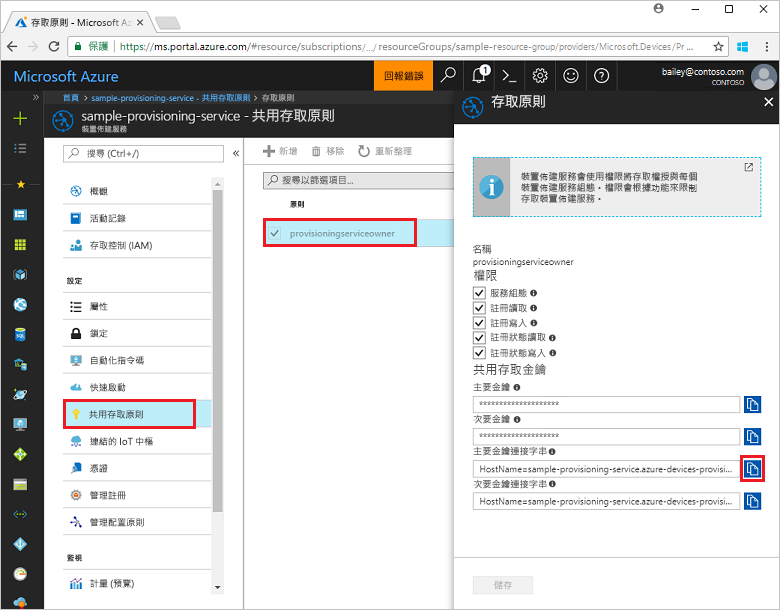
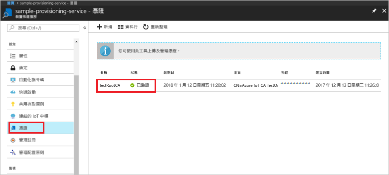

# <a name="quickstart-enroll-x509-devices-to-the-device-provisioning-service-using-nodejs"></a>快速入門：使用 Node.js 向裝置佈建服務註冊 X.509 裝置

[!INCLUDE [iot-dps-selector-quick-enroll-device-x509](../../includes/iot-dps-selector-quick-enroll-device-x509.md)]

本快速入門說明如何使用 Node.js 以程式設計方式建立中繼或根 CA X.509 憑證的[註冊群組](concepts-service.md#enrollment-group)。 註冊群組可使用 [IoT SDK for Node.js](https://github.com/Azure/azure-iot-sdk-node) 和範例 Node.js 應用程式來建立。 註冊群組可針對共用憑證鏈結中通用簽署憑證的裝置，控制對於佈建服務的存取權。 若要深入了解，請參閱[使用 X.509 憑證控制對於佈建服務的裝置存取](./concepts-security.md#controlling-device-access-to-the-provisioning-service-with-x509-certificates)。 如需使用以 X.509 憑證為基礎的公開金鑰基礎結構 (PKI) 搭配 Azure IoT 中樞和裝置佈建服務的詳細資訊，請參閱 [X.509 CA 憑證安全性概觀](https://docs.microsoft.com/azure/iot-hub/iot-hub-x509ca-overview)。 

本快速入門預期您已建立 IoT 中樞和裝置佈建服務執行個體。 如果您尚未建立這些資源，請先完成[使用 Azure 入口網站設定 IoT 中樞裝置佈建服務](./quick-setup-auto-provision.md)快速入門，再繼續閱讀本文。

雖然本文中的步驟在 Windows 和 Linux 電腦上都可運作，但本文是針對 Windows 開發電腦而撰寫的。

[!INCLUDE [quickstarts-free-trial-note](../../includes/quickstarts-free-trial-note.md)]


## <a name="prerequisites"></a>必要條件

- 安裝 [Node.js v4.0 或更新版本](https://nodejs.org)。
- 安裝 [Git](https://git-scm.com/download/)。


## <a name="prepare-test-certificates"></a>準備測試憑證

在進行本快速入門時，您必須要有 .pem 或 .cer 檔案，且該檔案必須包含中繼或根 CA X.509 憑證的公開部分。 此憑證必須上傳至佈建服務，並由服務驗證。 

[Azure IoT C SDK](https://github.com/Azure/azure-iot-sdk-c) 包含的測試工具可協助您建立 X.509 憑證鏈結、從該鏈結上傳根或中繼憑證，並使用驗證憑證的服務來執行所有權證明。 使用 SDK 工具建立的憑證依設計**僅供開發測試之用**。 這些憑證**不可用於生產環境中**。 其中包含會在 30 天後到期的硬式編碼密碼 ("1234")。 若要了解如何取得生產環境適用的憑證，請參閱 Azure IoT 中樞文件中的[如何取得 X.509 CA 憑證](https://docs.microsoft.com/azure/iot-hub/iot-hub-x509ca-overview#how-to-get-an-x509-ca-certificate)。

若要使用這項測試工具來產生憑證，請執行下列步驟： 
 
1. 開啟命令提示字元或 Git Bash 殼層中，並切換至電腦上的工作資料夾。 執行下列命令以複製 [Azure IoT C SDK](https://github.com/Azure/azure-iot-sdk-c) GitHub 存放庫：
    
   ```cmd/sh
   git clone https://github.com/Azure/azure-iot-sdk-c.git --recursive
   ```

   預期此作業需要幾分鐘的時間才能完成。

   測試工具位於您所複製的存放庫 *azure-iot-sdk-c/tools/CACertificates* 中。    

2. 依照[管理用於範例和教學課程的測試 CA 憑證](https://github.com/Azure/azure-iot-sdk-c/blob/master/tools/CACertificates/CACertificateOverview.md)中的步驟操作。 


## <a name="create-the-enrollment-group-sample"></a>建立註冊群組範例 

 
1. 從工作資料夾中的命令視窗中，執行：
  
     ```cmd\sh
     npm install azure-iot-provisioning-service
     ```  

2. 使用文字編輯器，在工作資料夾中建立 **create_enrollment_group.js** 檔案。 將下列程式碼新增至檔案，並加以儲存：

    ```
    'use strict';
    var fs = require('fs');

    var provisioningServiceClient = require('azure-iot-provisioning-service').ProvisioningServiceClient;

    var serviceClient = provisioningServiceClient.fromConnectionString(process.argv[2]);

    var enrollment = {
      enrollmentGroupId: 'first',
      attestation: {
        type: 'x509',
        x509: {
          signingCertificates: {
            primary: {
              certificate: fs.readFileSync(process.argv[3], 'utf-8').toString()
            }
          }
        }
      },
      provisioningStatus: 'disabled'
    };

    serviceClient.createOrUpdateEnrollmentGroup(enrollment, function(err, enrollmentResponse) {
      if (err) {
        console.log('error creating the group enrollment: ' + err);
      } else {
        console.log("enrollment record returned: " + JSON.stringify(enrollmentResponse, null, 2));
        enrollmentResponse.provisioningStatus = 'enabled';
        serviceClient.createOrUpdateEnrollmentGroup(enrollmentResponse, function(err, enrollmentResponse) {
          if (err) {
            console.log('error updating the group enrollment: ' + err);
          } else {
            console.log("updated enrollment record returned: " + JSON.stringify(enrollmentResponse, null, 2));
          }
        });
      }
    });
    ```

## <a name="run-the-enrollment-group-sample"></a>執行註冊群組範例
 
1. 若要執行範例，您需要佈建服務的連接字串。 
    1. 登入 Azure 入口網站，選取左側功能表上的 [所有資源]  按鈕，然後開啟您的裝置佈建服務。 
    2. 按一下 [共用存取原則]  ，然後選取您要用來開啟其屬性的存取原則。 在 [存取原則]  視窗中，複製並記下主要索引鍵連接字串。 

        


3. 如[準備測試憑證](quick-enroll-device-x509-node.md#prepare-test-certificates)中所述，您還需要 .pem 檔案，且其中必須包含先前已上傳至佈建服務、並已向佈建服務驗證的 X.509 中繼或根 CA 憑證。 若要檢查您的憑證是否已上傳和驗證，請在 Azure 入口網站的 [裝置佈建服務摘要] 頁面上，選取 [憑證]  。 找出需要用於群組註冊的憑證，並確認其狀態值已驗證  。

     

1. 若要建立憑證的註冊群組，請執行下列命令 (包括命令列引數的括號)：
 
     ```cmd\sh
     node create_enrollment_group.js "<the connection string for your provisioning service>" "<your certificate's .pem file>"
     ```
 
3. 成功建立時，命令視窗會顯示新註冊群組的屬性。

     

4. 請確認已建立註冊群組。 在 Azure 入口網站的 [裝置佈建服務摘要] 刀鋒視窗上，選取 [管理註冊]  。 選取 [註冊群組]  索引標籤，並確認新的註冊項目 (第一個  ) 存在。

     
 
## <a name="clean-up-resources"></a>清除資源
如果您打算探索 Node.js 服務範例，請勿清除本快速入門中建立的資源。 如果您不打算繼續，請使用下列步驟來刪除本快速入門建立的所有 Azure 資源。
 
1. 在您的電腦上關閉 Node.js 範例輸出視窗。
2. 在 Azure 入口網站中，瀏覽至您的裝置佈建服務，選取 [管理註冊]  ，然後選取 [註冊群組]  索引標籤。選取您使用本快速入門所註冊 X.509 裝置的 [群組名稱]  旁的核取方塊，然後按窗格頂端的 [刪除]  按鈕。    
3. 在 Azure 入口網站中，從您的裝置佈建服務中選取 [憑證]  ，選取您為本快速入門上傳的憑證，然後選取 [憑證詳細資料]  視窗頂端的 [刪除]  按鈕。  
 
## <a name="next-steps"></a>後續步驟
在本快速入門中，您已使用 Azure IoT 中樞裝置佈建服務，建立了 X.509 中繼或根 CA 憑證的群組註冊。 若要深入了解裝置佈建，請繼續在 Azure 入口網站中進行裝置佈建服務設定的教學課程。 
 
> [!div class="nextstepaction"]
> [Azure IoT 中樞裝置佈建服務教學課程](./tutorial-set-up-cloud.md)