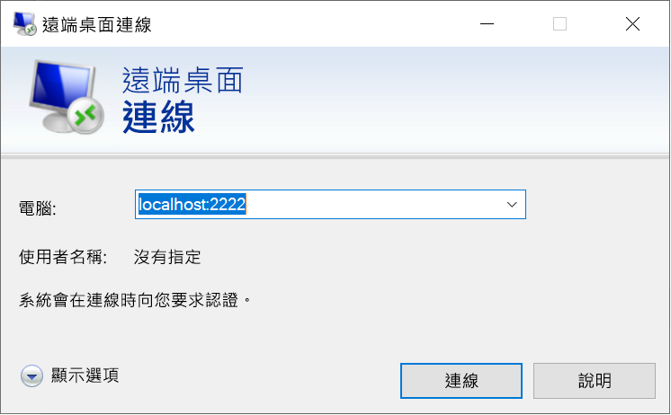

# <a name="quickstart-enable-ssh-and-rdp-over-an-iot-hub-device-stream-by-using-a-c-proxy-application-preview"></a>快速入門：使用 C# Proxy 應用程式透過 IoT 中樞裝置串流進行 SSH 和 RDP 輸送 (預覽)

[!INCLUDE [iot-hub-quickstarts-4-selector](../../includes/iot-hub-quickstarts-4-selector.md)]

Microsoft Azure IoT 中樞目前支援裝置串流作為[預覽功能](https://azure.microsoft.com/support/legal/preview-supplemental-terms/)。

[IoT 中樞裝置串流](iot-hub-device-streams-overview.md)可讓服務和裝置應用程式以安全且便於設定防火牆的方式進行通訊。 本快速入門指南會使用兩個 C# 應用程式，讓主從應用程式流量 (例如安全殼層 [SSH] 和遠端桌面通訊協定 [RDP]) 能夠透過以 IoT 中樞建立的裝置串流進行傳送。 如需設定的概觀，請參閱 [SSH 或 RDP 的本機 Proxy 應用程式範例](iot-hub-device-streams-overview.md#local-proxy-sample-for-ssh-or-rdp)。

本文說明 SSH 的設定 (使用連接埠 22)，接著說明如何針對 RDP 修改設定的連接埠。 因為裝置串流與應用程式或通訊協定無關，因此相同的範例可在修改後用於其他類型的應用程式流量。 這項修改通常只牽涉到將通訊連接埠變更為預定應用程式所使用的連接埠。

## <a name="how-it-works"></a>運作方式

下圖說明此範例中的裝置本機和服務本機 Proxy 應用程式如何進行 SSH 用戶端與 SSH 精靈程序之間的端對端連線。 在此，我們假設精靈與裝置本機 Proxy 應用程式執行於相同的裝置上。


1. 服務本機 Proxy 應用程式會連線至 IoT 中樞，並起始對目標裝置的裝置串流。

1. 裝置本機 Proxy 應用程式會完成串流起始交握，並透過 IoT 中樞對服務端的串流端點建立端對端串流通道。

1. 裝置本機 Proxy 應用程式會連線至接聽裝置上連接埠 22 的 SSH 精靈。 此設定可加以設定，如「執行裝置本機 Proxy 應用程式」一節所述。

1. 服務本機 Proxy 應用程式藉由接聽指定的連接埠 (在此案例中為連接埠 2222)，等候來自使用者的新 SSH 連線。 此設定可加以設定，如「執行服務本機 Proxy 應用程式」一節所述。 當使用者透過 SSH 用戶端連線時，通道可讓 SSH 應用程式流量在 SSH 用戶端與伺服器應用程式之間傳輸。

> [!NOTE]
> 透過裝置串流傳送的 SSH 流量會經由 IoT 中樞的串流端點進行輸送，而不是直接在服務與裝置之間傳送。 如需詳細資訊，請參閱[使用 IoT 中樞裝置串流的優點](iot-hub-device-streams-overview.md#benefits)。

[!INCLUDE [cloud-shell-try-it.md](../../includes/cloud-shell-try-it.md)]

如果您沒有 Azure 訂用帳戶，請在開始前建立[免費帳戶](https://azure.microsoft.com/free/?WT.mc_id=A261C142F) 。

## <a name="prerequisites"></a>必要條件

* 裝置串流的預覽版目前僅支援在下列區域建立的 IoT 中樞：

  * 美國中部
  * 美國中部 EUAP
  * 東南亞
  * 北歐

* 您在此快速入門中執行的兩個範例應用程式是以 C# 撰寫的。 您的開發電腦上需要有 .NET Core SDK 2.1.0 或更新版本。

  您可以[從 .NET 下載適用於多種平台的 .NET Core SDK](https://www.microsoft.com/net/download/all) \(英文\)。

* 使用下列命令，確認開發電腦上目前的 C# 版本：

    ```
    dotnet --version
    ```

* 執行下列命令，將適用於 Azure CLI 的 Azure IoT 擴充功能新增至您的 Cloud Shell 執行個體。 IoT 擴充功能可將 IoT 中樞、IoT Edge 和 IoT 裝置佈建服務的特定命令新增至 Azure CLI。

   ```azurecli-interactive
   az extension add --name azure-cli-iot-ext
   ```

* [下載範例 C# 專案](https://github.com/Azure-Samples/azure-iot-samples-csharp/archive/master.zip)並將 ZIP 封存檔解壓縮。

* 裝置 (Windows 或 Linux) 上用來驗證使用者的有效使用者帳戶和認證。

## <a name="create-an-iot-hub"></a>建立 IoT 中樞

[!INCLUDE [iot-hub-include-create-hub-device-streams](../../includes/iot-hub-include-create-hub-device-streams.md)]

## <a name="register-a-device"></a>註冊裝置

裝置必須向的 IoT 中樞註冊，才能進行連線。 在本快速入門中，您會使用 Azure Cloud Shell 來註冊模擬的裝置。

1. 若要建立裝置身分識別，請在 Cloud Shell 中執行下列命令：

   > [!NOTE]
   > * 以您為 IoT 中樞選擇的名稱取代 YourIoTHubName  預留位置。
   > * 如需您所註冊的裝置名稱，建議使用如下所示的 *MyDevice*。 如果您為裝置選擇不同的名稱，請在本文中使用該名稱，並先在應用程式範例中更新該裝置名稱，再執行應用程式。

    ```azurecli-interactive
    az iot hub device-identity create --hub-name {YourIoTHubName} --device-id MyDevice
    ```

1. 若要針對您剛註冊的裝置取得「裝置連接字串」  ，請在 Azure Cloud Shell 中執行下列命令：

   > [!NOTE]
   > 以您為 IoT 中樞選擇的名稱取代 YourIoTHubName  預留位置。

    ```azurecli-interactive
    az iot hub device-identity show-connection-string --hub-name {YourIoTHubName} --device-id MyDevice --output table
    ```

    請記下所傳回的裝置連接字串，以供稍後在本快速入門中使用。 看起來會像下列範例：

   `HostName={YourIoTHubName}.azure-devices.net;DeviceId=MyDevice;SharedAccessKey={YourSharedAccessKey}`

1. 若要連線到您的 IoT 中樞並建立裝置串流，您也需要來自 IoT 中樞的*服務連接字串*來啟用服務端應用程式。 下列命令會擷取您 IoT 中樞的這個值：

   > [!NOTE]
   > 以您為 IoT 中樞選擇的名稱取代 YourIoTHubName  預留位置。

    ```azurecli-interactive
    az iot hub show-connection-string --policy-name service --name {YourIoTHubName} --output table
    ```

    請記下所傳回的服務連接字串，以供稍後在本快速入門中使用。 看起來會像下列範例：

   `"HostName={YourIoTHubName}.azure-devices.net;SharedAccessKeyName=service;SharedAccessKey={YourSharedAccessKey}"`

## <a name="ssh-to-a-device-via-device-streams"></a>透過裝置串流使用 SSH 連線至裝置

在本節中，您會建立端對端串流來以通道輸送 SSH 流量。

### <a name="run-the-device-local-proxy-application"></a>執行裝置本機 Proxy 應用程式

在本機終端視窗中，瀏覽至未解壓縮專案資料夾中的 `device-streams-proxy/device` 目錄。 將下列資訊保存在隨手可及的位置：

| 引數名稱 | 引數值 |
|----------------|-----------------|
| `DeviceConnectionString` | 您先前所建立裝置的裝置連接字串。 |
| `targetServiceHostName` | SSH 伺服器接聽的 IP 位址。 如果此位址是裝置本機 Proxy 應用程式執行所在的相同 IP，則會是 `localhost`。 |
| `targetServicePort` | 您的應用程式通訊協定所使用的連接埠 (SSH 的預設值為連接埠 22)。  |

使用下列命令來編譯和執行程式碼：

```
cd ./iot-hub/Quickstarts/device-streams-proxy/device/

# Build the application
dotnet build

# Run the application
# In Linux or macOS
dotnet run ${DeviceConnectionString} localhost 22

# In Windows
dotnet run {DeviceConnectionString} localhost 22
```

### <a name="run-the-service-local-proxy-application"></a>執行服務本機 Proxy 應用程式

在另一個本機終端視窗中，瀏覽至未解壓縮專案資料夾中的 `device-streams-proxy/service`。 將下列資訊保存在隨手可及的位置：

| 參數名稱 | 參數值 |
|----------------|-----------------|
| `ServiceConnectionString` | IoT 中樞的服務連接字串。 |
| `MyDevice` | 您先前建立之裝置的識別碼。 |
| `localPortNumber` | 您的 SSH 用戶端將連線到的本機連接埠。 在此範例中我們使用連接埠 2222，但您可以使用其他任意數字。 |

使用下列命令來編譯和執行程式碼：

```
cd ./iot-hub/Quickstarts/device-streams-proxy/service/

# Build the application
dotnet build

# Run the application
# In Linux or macOS
dotnet run ${ServiceConnectionString} MyDevice 2222

# In Windows
dotnet run {ServiceConnectionString} MyDevice 2222
```

### <a name="run-the-ssh-client"></a>執行 SSH 用戶端

現在，使用您的 SSH 用戶端應用程式，並經由連接埠 2222 連線至服務本機 Proxy 應用程式 (而不是直接使用 SSH 精靈)。

```
ssh {username}@localhost -p 2222
```

此時，SSH 登入視窗會提示您輸入認證。

服務端的主控台輸出 (服務本機 Proxy 應用程式會接聽連接埠 2222)：


經由 IP_address:22  連線至 SSH 精靈的裝置本機 Proxy 應用程式上的主控台輸出：


SSH 用戶端應用程式的主控台輸出。 SSH 用戶端可藉由連線至服務本機 Proxy 應用程式所接聽的連接埠 22，與 SSH 精靈通訊：


## <a name="rdp-to-a-device-via-device-streams"></a>透過裝置串流使用 RDP 連線至裝置

RDP 的設定與 SSH 的設定大致相同 (如前所述)。 您會改用 RDP 目的地 IP 和連接埠 3389，並使用 RDP 用戶端 (而不是 SSH 用戶端)。

### <a name="run-the-device-local-proxy-application-rdp"></a>執行裝置本機 Proxy 應用程式 (RDP)

在本機終端視窗中，瀏覽至未解壓縮專案資料夾中的 `device-streams-proxy/device` 目錄。 將下列資訊保存在隨手可及的位置：

| 引數名稱 | 引數值 |
|----------------|-----------------|
| `DeviceConnectionString` | 您先前所建立裝置的裝置連接字串。 |
| `targetServiceHostName` | RDP 伺服器執行所在的主機名稱或 IP 位址。 如果此位址是裝置本機 Proxy 應用程式執行所在的相同 IP，則會是 `localhost`。 |
| `targetServicePort` | 您的應用程式通訊協定所使用的連接埠 (RDP 的預設值為連接埠 3389)。  |

使用下列命令來編譯和執行程式碼：

```
cd ./iot-hub/Quickstarts/device-streams-proxy/device

# Run the application
# In Linux or macOS
dotnet run ${DeviceConnectionString} localhost 3389

# In Windows
dotnet run {DeviceConnectionString} localhost 3389
```

### <a name="run-the-service-local-proxy-application-rdp"></a>執行服務本機 Proxy 應用程式 (RDP)

在另一個本機終端視窗中，瀏覽至未解壓縮專案資料夾中的 `device-streams-proxy/service`。 將下列資訊保存在隨手可及的位置：

| 參數名稱 | 參數值 |
|----------------|-----------------|
| `ServiceConnectionString` | IoT 中樞的服務連接字串。 |
| `MyDevice` | 您先前建立之裝置的識別碼。 |
| `localPortNumber` | 您的 SSH 用戶端將連線到的本機連接埠。 在此範例中我們使用連接埠 2222，但您可以將其修改為其他任意數字。 |

使用下列命令來編譯和執行程式碼：

```
cd ./iot-hub/Quickstarts/device-streams-proxy/service/

# Build the application
dotnet build

# Run the application
# In Linux or macOS
dotnet run ${ServiceConnectionString} MyDevice 2222

# In Windows
dotnet run {ServiceConnectionString} MyDevice 2222
```

### <a name="run-rdp-client"></a>執行 RDP 用戶端

現在，使用您的 RDP 用戶端應用程式，並經由連接埠 2222 (這是您先前任意選擇的可用連接埠) 連線至服務本機 Proxy 應用程式。



## <a name="clean-up-resources"></a>清除資源

[!INCLUDE [iot-hub-quickstarts-clean-up-resources](../../includes/iot-hub-quickstarts-clean-up-resources-device-streams.md)]

## <a name="next-steps"></a>後續步驟

在本快速入門中，您會設定 IoT 中樞、註冊裝置、部署裝置本機和服務本機 Proxy 應用程式以透過 IoT 中樞建立裝置串流，並使用 Proxy 應用程式來輸送 SSH 或 RDP 流量。 相同的範例可用於其他主從通訊協定，其中伺服器執行於 SSH 精靈之類的裝置上。

若要深入了解裝置串流，請參閱：

> [!div class="nextstepaction"]
> [裝置串流概觀](./iot-hub-device-streams-overview.md)
