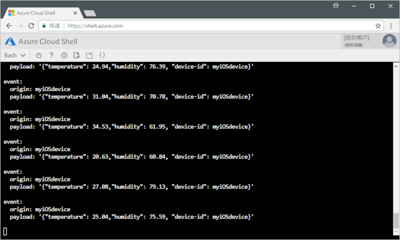

# <a name="quickstart-send-telemetry-from-a-device-to-an-iot-hub-ios"></a>快速入門：將遙測資料從裝置傳送到 IoT 中樞 (iOS)

[!INCLUDE [iot-hub-quickstarts-1-selector](../../includes/iot-hub-quickstarts-1-selector.md)]

IoT 中樞是一項 Azure 服務，可讓您從 IoT 裝置將大量的遙測擷取到雲端進行儲存或處理。 在本文中，您會將遙測從模擬的裝置應用程式傳送到 IoT 中樞。 然後您可以從後端應用程式檢視資料。

本文會使用預先撰寫的 Swift 應用程式傳送遙測，以及使用 CLI 公用程式從 IoT 中樞讀取遙測。

[!INCLUDE [cloud-shell-try-it.md](../../includes/cloud-shell-try-it.md)]

如果您沒有 Azure 訂用帳戶，請在開始前建立[免費帳戶](https://azure.microsoft.com/free/?WT.mc_id=A261C142F) 。

## <a name="prerequisites"></a>Prerequisites

- 從 [Azure 範例](https://github.com/Azure-Samples/azure-iot-samples-ios/archive/master.zip)下載程式碼範例

- 最新版的 [XCode](https://developer.apple.com/xcode/)，其執行最新版的 iOS SDK。 本快速入門已使用 XCode 10.2 和 iOS 12.2 進行測試。

- 最新版的 [CocoaPods](https://guides.cocoapods.org/using/getting-started.html)。

- 請確定您的防火牆已開啟連接埠 8883。 本快速入門中的裝置範例會使用 MQTT 通訊協定，其會透過連接埠 8883 進行通訊。 某些公司和教育網路環境可能會封鎖此連接埠。 如需此問題的詳細資訊和解決方法，請參閱[連線至 IoT 中樞 (MQTT)](iot-hub-mqtt-support.md#connecting-to-iot-hub)。


- 執行下列命令，將適用於 Azure CLI 的 Microsoft Azure IoT 擴充功能新增至您的 Cloud Shell 執行個體。 IoT 擴充功能可將 IoT 中樞、IoT Edge 和 IoT 裝置佈建服務 (DPS) 的特定命令新增至 Azure CLI。

   ```azurecli-interactive
   az extension add --name azure-iot
   ```

   [!INCLUDE [iot-hub-cli-version-info](../../includes/iot-hub-cli-version-info.md)]

## <a name="create-an-iot-hub"></a>建立 IoT 中樞

[!INCLUDE [iot-hub-include-create-hub](../../includes/iot-hub-include-create-hub.md)]

## <a name="register-a-device"></a>註冊裝置

裝置必須向的 IoT 中樞註冊，才能進行連線。 在本快速入門中，您會使用 Azure Cloud Shell 來註冊模擬的裝置。

1. 在 Azure Cloud Shell 中執行下列命令，以建立裝置身分識別。

   **YourIoTHubName**：以您為 IoT 中樞選擇的名稱取代此預留位置。

   **myiOSdevice**：這是您要註冊之裝置的名稱。 建議您使用 **myiOSdevice**，如下所示。 如果您為裝置選擇不同的名稱，則也必須在本文中使用該名稱，並先在範例應用程式中更新該裝置名稱，再執行應用程式。

   ```azurecli-interactive
   az iot hub device-identity create --hub-name {YourIoTHubName} --device-id myiOSdevice
   ```

1. 在 Azure Cloud Shell 中執行下列命令，以針對您剛註冊的裝置取得「裝置連接字串」  ：

   **YourIoTHubName**：以您為 IoT 中樞選擇的名稱取代此預留位置。

   ```azurecli-interactive
   az iot hub device-identity show-connection-string --hub-name {YourIoTHubName} --device-id myiOSdevice --output table
   ```

   記下裝置連接字串，它看起來如下：

   `HostName={YourIoTHubName}.azure-devices.net;DeviceId=myiOSdevice;SharedAccessKey={YourSharedAccessKey}`

    您稍後將會在快速入門中使用此值。

## <a name="send-simulated-telemetry"></a>傳送模擬的遙測

範例應用程式會在 iOS 裝置上執行，它會連線到 IoT 中樞上的裝置特定端點，並且傳送模擬的溫度和溼度遙測。 

### <a name="install-cocoapods"></a>安裝 CocoaPods

CocoaPods 可針對使用第三方程式庫的 iOS 專案管理相依性。

在本機終端機視窗中，巡覽至您在必要條件中下載的 Azure-IoT-Samples-iOS 資料夾。 然後，巡覽至範例專案：

```sh
cd quickstart/sample-device
```

確定已關閉 XCode，然後執行下列命令，以安裝在 **podfile** 檔案中宣告的 CocoaPods：

```sh
pod install
```

在安裝您的專案所需的 pod 時，安裝命令也建立了 XCode 工作區檔案，而該檔案已經設定為將 pod 使用於相依性。 

### <a name="run-the-sample-application"></a>執行範例應用程式 

1. 在 XCode 中開啟範例工作區。

   ```sh
   open "MQTT Client Sample.xcworkspace"
   ```

2. 展開 [MQTT 用戶端範例]  專案，然後展開同名的資料夾。  
3. 開啟 **ViewController.swift** 以便在 XCode 中編輯。 
4. 搜尋 **connectionString** 變數，並使用您稍早所記錄的裝置連接字串來更新此值。
5. 儲存您的變更。 
6. 使用 [建置並執行]  按鈕或 **Command + r** 按鍵組合，在裝置模擬器中執行專案。 

   

7. 當模擬器開啟時，在範例應用程式中選取 [啟動]  。

下列螢幕擷取畫面顯示應用程式將模擬的遙測傳送到 IoT 中樞時的一些範例輸出：

   

## <a name="read-the-telemetry-from-your-hub"></a>從您的中樞讀取遙測

您在 XCode 模擬器上執行的範例應用程式會顯示裝置所傳送訊息的相關資料。 您也可以透過 IoT 中樞檢視所收到的資料。 IoT 中樞 CLI 擴充功能可以連線到 IoT 中樞上的服務端**事件**端點。 擴充功能會接收模擬裝置所傳送的「裝置到雲端」訊息。 IoT 中樞後端應用程式通常在雲端中執行，以接收和處理「裝置到雲端」訊息。

在 Azure Cloud Shell 中執行下列命令，以您的 IoT 中樞名稱取代 `YourIoTHubName`：

```azurecli-interactive
az iot hub monitor-events --device-id myiOSdevice --hub-name {YourIoTHubName}
```

下列螢幕擷取畫面顯示由模擬裝置傳送遙測至中樞時，擴充功能接收遙測的輸出：

下列螢幕擷取畫面顯示您在本機終端機視窗中看到的遙測類型：



## <a name="clean-up-resources"></a>清除資源

[!INCLUDE [iot-hub-quickstarts-clean-up-resources](../../includes/iot-hub-quickstarts-clean-up-resources.md)]

## <a name="next-steps"></a>後續步驟

在本快速入門中，您已設定 IoT 中樞、註冊裝置，將模擬的遙測從 iOS 裝置傳送到中樞，並從中樞讀取遙測。 

若要了解如何從後端應用程式控制您的模擬裝置，請繼續下一個快速入門。

> [!div class="nextstepaction"]
> [快速入門：控制連線到 IoT 中樞的裝置](quickstart-control-device-node.md)
