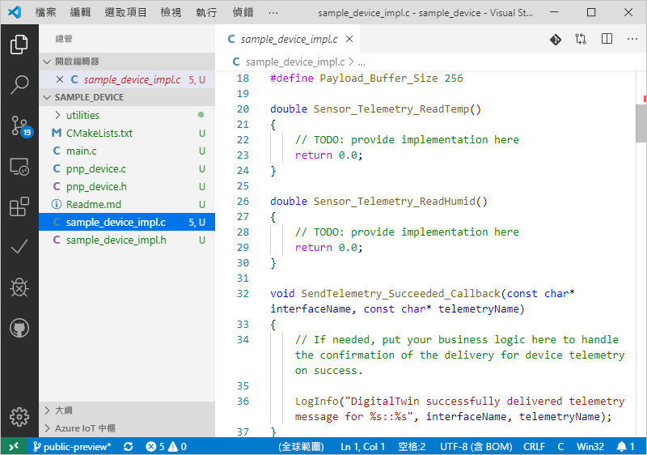

# <a name="quickstart-use-a-device-capability-model-to-create-an-iot-plug-and-play-preview-device-windows"></a>快速入門：使用裝置功能模型建立 IoT 隨插即用預覽版裝置 (Windows)

[!INCLUDE [iot-pnp-quickstarts-1-selector.md](../../includes/iot-pnp-quickstarts-1-selector.md)]

_裝置功能模型_ (DCM) 可說明 IoT 隨插即用裝置的功能。 DCM 通常會與產品 SKU 相關聯。 DCM 中定義的功能會組織成可重複使用的介面。 您可以從 DCM 產生基本架構裝置程式碼。 本快速入門說明如何在 Windows 上使用 VS Code，以便使用 DCM 建立 IoT 隨插即用裝置。

## <a name="prerequisites"></a>Prerequisites

若要完成本快速入門，您必須在本機電腦上安裝下列軟體：

* 具有 **C++ 建置工具**和 **NuGet 套件管理員元件**工作負載的 [Visual Studio 建置工具](https://visualstudio.microsoft.com/thank-you-downloading-visual-studio/?sku=BuildTools&rel=16)。 或者如果您已安裝具有相同工作負載的 [Visual Studio (Community、Professional 或 Enterprise)](https://visualstudio.microsoft.com/downloads/) 2019、2017 或 2015。
* [Git](https://git-scm.com/download/)。
* [CMake](https://cmake.org/download/)。
* [Visual Studio Code](https://code.visualstudio.com/) \(英文\)。

### <a name="install-azure-iot-tools"></a>安裝 Azure IoT Tools

請使用下列步驟安裝[適用於 VS Code 的 Azure IoT Tools](https://marketplace.visualstudio.com/items?itemName=vsciot-vscode.azure-iot-tools) \(英文\) 擴充套件：

1. 在 VS Code 中，選取 [延伸模組]  索引標籤。
1. 搜尋 **Azure IoT Tools**。
1. 選取 [安裝]  。

### <a name="install-the-azure-iot-explorer"></a>安裝 Azure IoT 檔案總管

從工具的 [存放庫](https://github.com/Azure/azure-iot-explorer/releases) 頁面下載並安裝最新版的 **Azure IoT 檔案總管**，方法是，選取 [資產] 下的 .msi 檔案，以取得最新的更新。

### <a name="get-the-connection-string-for-your-company-model-repository"></a>取得公司模型存放庫的連接字串

當您使用 Microsoft 工作或學校帳戶，或您的 Microsoft 合作夥伴識別碼 (如果您有的話) 登入時，您可以在 [Azure IoT 認證入口網站](https://preview.catalog.azureiotsolutions.com)中找到您的_公司模型存放庫連接字串_。 在登入後，依序選取 [公司存放庫]  和 [連接字串]  。

[!INCLUDE [cloud-shell-try-it.md](../../includes/cloud-shell-try-it.md)]

[!INCLUDE [iot-pnp-prepare-iot-hub.md](../../includes/iot-pnp-prepare-iot-hub.md)]

執行下列命令，以取得中樞的 _IoT 中樞連接字串_ (請記下以供後續使用)：

```azurecli-interactive
az iot hub show-connection-string --hub-name <YourIoTHubName> --output table
```

## <a name="prepare-the-development-environment"></a>準備開發環境

在本快速入門中，您會使用 [Vcpkg](https://github.com/microsoft/vcpkg) 程式庫管理員，在您的開發環境中安裝 Azure IoT C 裝置 SDK。

1. 開啟命令提示字元。 執行下列命令來安裝 Vcpkg：

    ```cmd
    git clone https://github.com/Microsoft/vcpkg.git
    cd vcpkg

    .\bootstrap-vcpkg.bat
    ```

    接著，若要連結使用者範圍的[整合](https://github.com/microsoft/vcpkg/blob/master/docs/users/integration.md)，請執行下列命令 (注意：第一次使用時需要系統管理員)：

    ```cmd
    .\vcpkg.exe integrate install
    ```

1. 安裝 Azure IoT C 裝置 SDK Vcpkg：

    ```cmd
    .\vcpkg.exe install azure-iot-sdk-c[public-preview,use_prov_client]
    ```

## <a name="author-your-model"></a>製作您的模型

在本快速入門中，您會使用現有的範例裝置功能模型和相關聯的介面。

1. 在您的本機磁碟機中建立 `pnp_app` 目錄。 您可以使用此資料夾來存放裝置模型檔案和裝置程式碼 Stub。

1. 下載[裝置功能模型及介面範例檔案](https://github.com/Azure/IoTPlugandPlay/blob/master/samples/SampleDevice.capabilitymodel.json)和[介面範例](https://github.com/Azure/IoTPlugandPlay/blob/master/samples/EnvironmentalSensor.interface.json)，並將檔案儲存到 `pnp_app` 資料夾中。

    > [!TIP]
    > 若要從 GitHub 下載檔案，請瀏覽至該檔案，並以滑鼠右鍵按一下 [Raw]  ，然後選取 [另存連結]  。

1. 使用 VS Code 開啟 `pnp_app` 資料夾。 您可以使用 IntelliSense 來檢視檔案：

    

1. 在您下載的檔案中，將 `@id` 和 `schema` 欄位中的 `<YOUR_COMPANY_NAME_HERE>` 取代為唯一值。 您只能使用字元 a-z、A-Z、0-9 和底線。 如需詳細資訊，請參閱[數位對應項識別碼格式](https://github.com/Azure/IoTPlugandPlay/tree/master/DTDL#digital-twin-identifier-format)。

## <a name="generate-the-c-code-stub"></a>產生 C 程式碼 Stub

既然您已經有 DCM 及其相關聯的介面，您可以產生實作模型的裝置程式碼。 若要在 VS Code 中產生 C 程式碼 Stub：

1. 當 `pnp_app` 資料夾在 VS Code 中開啟時，使用 **Ctrl+Shift+P** 開啟命令選擇區、輸入 **IoT 隨插即用**，然後選取 [產生裝置程式碼 Stub]  。

    > [!NOTE]
    > 第一次使用 IoT 隨插即用 CodeGen CLI 時，需要幾秒鐘的時間才能自動下載並安裝。

1. 選擇要用來產生裝置程式程式碼 Stub 的 **SampleDevice.capabilitymodel.json** 檔案。

1. 輸入專案名稱 **sample_device**。 這會是您裝置應用程式的名稱。

1. 選擇 [ANSI C]  作為您的語言。

1. 選擇 [透過 IoT 中樞裝置連接字串]  作為連線方式。

1. 選擇 [Windows 上的 CMake 專案]  作為專案範本。

1. 選擇 [透過 Vcpkg]  作為包含裝置 SDK 的方式。

1. 系統會在與 DCM 檔案相同的位置中建立一個名為 **sample_device** 的新資料夾，而且其中是產生的裝置程式碼 Stub 檔案。 VS Code 會開啟新的視窗來顯示這些內容。
    

## <a name="build-and-run-the-code"></a>建置並執行程式碼

您可以使用裝置 SDK 原始程式碼建置產生的裝置程式碼 Stub。 您所建置的應用程式會模擬連線至 IoT 中樞的裝置。 應用程式會傳送遙測資料和屬性，並接收命令。

1. 在 `sample_device` 資料夾中建立一個 `cmake` 子目錄，並瀏覽至該資料夾：

    ```cmd
    mkdir cmake
    cd cmake
    ```

1. 執行下列命令以建置產生的程式碼 Stub (將預留位置取代為 Vcpkg 存放庫的目錄)：

    ```cmd
    cmake .. -G "Visual Studio 16 2019" -A Win32 -Duse_prov_client=ON -Dhsm_type_symm_key:BOOL=ON -DCMAKE_TOOLCHAIN_FILE="<directory of your Vcpkg repo>\scripts\buildsystems\vcpkg.cmake"

    cmake --build .
    ```
    
    > [!NOTE]
    > 如果您使用的是 Visual Studio 2017 或 2015，則需要根據您所使用的建置工具來指定 CMake 產生器：
    >```cmd
    ># Either
    >cmake .. -G "Visual Studio 15 2017" -Duse_prov_client=ON -Dhsm_type_symm_key:BOOL=ON -DCMAKE_TOOLCHAIN_FILE="{directory of your Vcpkg repo}\scripts\buildsystems\vcpkg.cmake"
    ># or
    >cmake .. -G "Visual Studio 14 2015" -Duse_prov_client=ON -Dhsm_type_symm_key:BOOL=ON -DCMAKE_TOOLCHAIN_FILE="{directory of your Vcpkg repo}\scripts\buildsystems\vcpkg.cmake"
    >```

    > [!NOTE]
    > 如果 cmake 找不到您的 C++ 編譯器，您會在執行先前的命令時收到建置錯誤。 如果發生這種情況，請嘗試在 [Visual Studio 命令提示字元](https://docs.microsoft.com/dotnet/framework/tools/developer-command-prompt-for-vs)上執行此命令。

1. 組建順利完成後，請傳遞 IoT 中樞裝置連接字串作為參數，以執行您的應用程式。

    ```cmd\sh
    .\Debug\sample_device.exe "<YourDeviceConnectionString>"
    ```

1. 裝置應用程式會開始將資料傳送至 IoT 中樞。

    

## <a name="validate-the-code"></a>驗證程式碼

### <a name="publish-device-model-files-to-model-repository"></a>將裝置模型檔案發佈至模型存放庫

若要使用 **Azure IoT 檔案總管**來驗證裝置程式碼，您必須將檔案發佈至模型存放庫。

1. 當 `pnp_app` 資料夾在 VS Code 中開啟時，使用 **Ctrl+Shift+P** 開啟命令選擇區，然後輸入並選取 **[IoT 隨插即用：將檔案提交至模型存放庫]** 。

1. 選取 `SampleDevice.capabilitymodel.json` 和`EnvironmentalSensor.interface.json` 檔案。

1. 輸入您的公司模型存放庫連接字串。

    > [!NOTE]
    > 只有在第一次連線至存放庫時，才需要連接字串。

1. 在 VS Code 輸出視窗和通知中，您可以確認檔案是否已成功發佈。

    > [!NOTE]
    > 如果在發佈裝置模型檔案時發生錯誤，您可以嘗試使用命令 **[IoT 隨插即用：登出模型存放庫]** 來登出，然後重新執行步驟。

### <a name="use-the-azure-iot-explorer-to-validate-the-code"></a>使用 Azure IoT 檔案總管來驗證程式碼

[!INCLUDE [iot-pnp-iot-explorer-1.md](../../includes/iot-pnp-iot-explorer-1.md)]

4. 若要新增公司存放庫，請依序選取 [設定]  、[+ 新增模組定義來源]  和 [公司存放庫]  。 新增您的公司模型存放庫連接字串，然後選取 [儲存並連線]  。

1. 回到**裝置**概觀頁面，尋找您先前建立的裝置身分識別。 當裝置應用程式仍在命令提示字元中執行時，請在 Azure IoT 檔案總管中檢查裝置的**線上狀態**是否會回報為「已連線」  (如果不是，請按 **重新整理**，直到變成已連線為止)。 選取裝置以檢視更多詳細資料。

1. 展開識別碼為 **urn:<YOUR_INTERFACE_NAME>:EnvironmentalSensor:1** 的介面，以查看 IoT 隨插即用基本項目 - 屬性、命令和遙測資料。 將顯示的介面名稱是您在撰寫模型時所放入的名稱。

[!INCLUDE [iot-pnp-iot-explorer-2.md](../../includes/iot-pnp-iot-explorer-2.md)]

[!INCLUDE [iot-pnp-clean-resources.md](../../includes/iot-pnp-clean-resources.md)]

## <a name="next-steps"></a>後續步驟

在本快速入門中，您已了解如何使用 DCM 建立 IoT 隨插即用裝置。

若要深入了解 DCM 以及如何建立您自己的模型，請繼續進行教學課程：

> [!div class="nextstepaction"]
> [教學課程：使用 Visual Studio Code 建立和測試裝置功能模型](tutorial-pnp-visual-studio-code.md)
