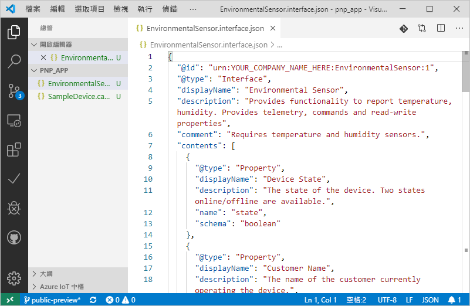

# <a name="quickstart-use-a-device-capability-model-to-create-an-iot-plug-and-play-device"></a>快速入門：使用裝置功能模型來建立 IoT 隨插即用裝置

_裝置功能模型_ (DCM) 可說明 IoT 隨插即用裝置的功能。 DCM 通常會與產品 SKU 相關聯。 DCM 中定義的功能會組織成可重複使用的介面。 您可以從 DCM 產生基本架構裝置程式碼。 本快速入門說明如何在 VS Code 中使用 DCM 建立 IoT 隨插即用裝置。

## <a name="prerequisites"></a>必要條件

若要完成本快速入門，您必須在本機電腦上安裝下列軟體：

* [Visual Studio (Community、Professional 或 Enterprise)](https://visualstudio.microsoft.com/downloads/) - 在安裝 Visual Studio 時，請確實包含 **NuGet 套件管理員**元件和**使用 C++ 的桌面開發**工作負載。
* [Git](https://git-scm.com/download/)。
* [CMake](https://cmake.org/download/)。
* [Visual Studio Code](https://code.visualstudio.com/)。

### <a name="install-azure-iot-device-workbench"></a>安裝 Azure IoT Device Workbench

請使用下列步驟，在 VS Code 中安裝 Azure IoT Device Workbench 延伸模組：

1. 在 VS Code 中，選取 [延伸模組]  索引標籤。
1. 搜尋 **Azure IoT Device Workbench**。
1. 選取 [安裝]  。

### <a name="install-the-azure-iot-explorer"></a>安裝 Azure IoT 檔案總管

從[最新版本](https://github.com/Azure/azure-iot-explorer/releases)頁面下載並安裝 Azure IoT 檔案總管工具。

### <a name="get-the-connection-string-for-your-company-model-repository"></a>取得公司模型存放庫的連接字串

當您使用 Microsoft 工作或學校帳戶，或您的 Microsoft 合作夥伴識別碼 (如果您有的話) 登入時，您可以在 [Azure IoT 認證入口網站](https://preview.catalog.azureiotsolutions.com)中找到您的_公司模型存放庫連接字串_。 在登入後，依序選取 [公司存放庫]  和 [連接字串]  。

[!INCLUDE [cloud-shell-try-it.md](../../includes/cloud-shell-try-it.md)]

## <a name="prepare-an-iot-hub"></a>準備 IoT 中樞

您的 Azure 訂用帳戶中也必須要有 Azure IoT 中樞，才能完成本快速入門。 如果您沒有 Azure 訂用帳戶，請在開始前先建立一個[免費帳戶](https://azure.microsoft.com/free/?WT.mc_id=A261C142F)。

新增適用於 Azure CLI 的 Microsoft Azure IoT 延伸模組：

```azurecli-interactive
az extension add --name azure-cli-iot-ext
```

執行下列命令，在 IoT 中樞建立裝置身分識別。 請將 **YourIoTHubName** 和 **YourDevice** 預留位置取代為您的實際名稱。 如果您沒有 IoT 中樞，請依照[下列指示建立一個](../iot-hub/iot-hub-create-using-cli.md)：

```azurecli-interactive
az iot hub device-identity create --hub-name [YourIoTHubName] --device-id [YourDevice]
```

執行下列命令，以針對您剛註冊的裝置取得_裝置連接字串_：

```azurecli-interactive
az iot hub device-identity show-connection-string --hub-name [YourIoTHubName] --device-id [YourDevice] --output table
```

執行下列命令，以取得中樞的 _IoT 中樞連接字串_：

```azurecli-interactive
az iot hub show-connection-string --hub-name [YourIoTHubName] --output table
```

## <a name="prepare-the-development-environment"></a>準備開發環境

### <a name="get-azure-iot-device-sdk-for-c"></a>適用於 C 的 Azure IoT 裝置 SDK

在本快速入門中，您會準備可用來複製及建立 Azure IoT C 裝置 SDK 的開發環境。

1. 開啟命令提示字元。 執行下列命令以複製 [Azure IoT C SDK](https://github.com/Azure/azure-iot-sdk-c) GitHub 存放庫：

    ```cmd/sh
    git clone https://github.com/Azure/azure-iot-sdk-c --recursive -b public-preview
    ```

    預期此作業需要幾分鐘的時間才能完成。

1. 在存放庫本機複本的根目錄中建立 `pnp_app` 子目錄。 您可以使用此資料夾來存放裝置模型檔案和裝置程式碼 Stub。

    ```cmd/sh
    cd azure-iot-sdk-c
    mkdir pnp_app
    ```

## <a name="author-your-model"></a>製作您的模型

在本快速入門中，您會使用現有的範例裝置功能模型和相關聯的介面。

1. 下載[裝置功能模型](https://github.com/Azure/IoTPlugandPlay/blob/master/samples/SampleDevice.capabilitymodel.json)和[介面範例](https://github.com/Azure/IoTPlugandPlay/blob/master/samples/EnvironmentalSensor.interface.json)，並將檔案儲存到 `pnp_app` 資料夾中。

    > [!TIP]
    > 若要從 GitHub 下載檔案，請瀏覽至該檔案，並以滑鼠右鍵按一下 [Raw]  ，然後選取 [另存連結]  。

1. 使用 VS Code 開啟 `pnp_app` 資料夾。 您可以使用 IntelliSense 來檢視檔案：

    

1. 在您下載的檔案中，將 `@id` 和 `schema` 欄位中的 `<YOUR_COMPANY_NAME_HERE>` 取代為唯一值。 您只能使用字元 a-z、A-Z、0-9 和底線。 如需詳細資訊，請參閱[數位對應項識別碼格式](https://github.com/Azure/IoTPlugandPlay/tree/master/DTDL#digital-twin-identifier-format)。

## <a name="generate-the-c-code-stub"></a>產生 C 程式碼 Stub

現在您已有 DCM 及其相關聯的介面，您可以產生實作模型的裝置程式碼。 若要在 VS Code 中產生 C 程式碼 Stub：

1. 開啟含有 DCM 檔案的資料夾，使用 **Ctrl+Shift+P** 開啟命令選擇區，輸入 **IoT 隨插即用**，然後選取 [產生裝置程式碼 Stub]  。

    > [!NOTE]
    > 第一次使用 IoT 隨插即用程式碼產生器公用程式時，需要幾秒鐘的時間才能下載。

1. 選擇您要用來產生裝置程式碼 Stub 的 DCM 檔案。

1. 輸入專案名稱 **sample_device**，這將是您的裝置應用程式名稱。

1. 選擇 [ANSI C]  作為您的語言。

1. 選擇 [CMake 專案]  作為您的專案類型。

1. 選擇 [透過 IoT 中樞裝置連接字串]  作為連線方式。

1. VS Code 會開啟新視窗，其中包含產生的裝置程式碼 Stub 檔案。
    

## <a name="build-the-code"></a>建置程式碼

您可以使用裝置 SDK 來建置產生的裝置程式碼 Stub。 您所建置的應用程式會模擬連線至 IoT 中樞的裝置。 應用程式會傳送遙測資料和屬性，並接收命令。

1. 在 VS Code 中，開啟裝置 SDK 根資料夾中的 `CMakeLists.txt`。

1. 在編譯時，在 `CMakeLists.txt` 檔案底部新增以下這一行，以包含裝置程式碼 Stub 資料夾：

    ```txt
    add_subdirectory(pnp_app/sample_device)
    ```

1. 在裝置 SDK 根資料夾中建立 cmake 子目錄，並瀏覽至該資料夾：

    ```cmd\sh
    mkdir cmake
    cd cmake
    ```

1. 執行下列命令，以建置裝置 SDK 和產生的程式碼 Stub：

    ```cmd\sh
    cmake .. -Duse_prov_client=ON -Dhsm_type_symm_key:BOOL=ON
    cmake --build . -- /m /p:Configuration=Release
    ```

    > [!NOTE]
    > 如果 cmake 找不到您的 C++ 編譯器，您會在執行先前的命令時收到建置錯誤。 如果發生這種情況，請嘗試在 [Visual Studio 命令提示字元](https://docs.microsoft.com/dotnet/framework/tools/developer-command-prompt-for-vs)上執行此命令。

1. 組建順利完成後，請將 IoT 中樞裝置連接字串傳入作為參數，執行您的應用程式。

    ```cmd\sh
    cd azure-iot-sdk-c\cmake\pnp_app\sample_device\Release\
    sample_device.exe "[IoT Hub device connection string]"
    ```

1. 裝置應用程式會開始將資料傳送至 IoT 中樞。

    

## <a name="validate-the-code"></a>驗證程式碼

### <a name="publish-device-model-files-to-model-repository"></a>將裝置模型檔案發佈至模型存放庫

若要使用 **Azure IoT 檔案總管**來驗證裝置程式碼，您必須將檔案發佈至模型存放庫。

1. 開啟含有 DCM 檔案的資料夾，使用 **Ctrl+Shift+P** 開啟命令選擇區，然後輸入並選取 **[IoT 隨插即用：將檔案提交至模型存放庫]** 。

1. 選取 `SampleDevice.capabilitymodel.json` 和`EnvironmentalSensor.interface.json` 檔案。

1. 輸入您的公司模型存放庫連接字串。

    > [!NOTE]
    > 只有在第一次連線至存放庫時，才需要連接字串。

1. 在 VS Code 輸出視窗和通知中，您可以確認檔案是否已成功發佈。

    > [!NOTE]
    > 如果在發佈裝置模型檔案時發生錯誤，您可以嘗試使用命令 **[IoT 隨插即用：登出模型存放庫]** 來登出，然後重新執行步驟。

### <a name="use-the-azure-iot-explorer-to-validate-the-code"></a>使用 Azure IoT 檔案總管來驗證程式碼

1. 開啟 Azure IoT 檔案總管，您會看到 [應用程式組態]  頁面。

1. 輸入您的 IoT 中樞連接字串，然後按一下 [連線]  。

1. 連線之後，您會看到 [裝置概觀] 頁面。

1. 若要新增公司存放庫，請依序選取 [設定]  、[+ 新增]  和 [公司存放庫]  。

1. 新增您的公司模型存放庫連接字串。 選取 [ **連接**]。

1. 在 [裝置概觀] 頁面上，尋找您先前建立的裝置身分識別，並加以選取以檢視更多詳細資料。

1. 展開識別碼為 **urn:azureiot:EnvironmentalSensor:1** 的介面，以查看 IoT 隨插即用基本項目 - 屬性、命令和遙測資料。

1. 選取 [遙測]  頁面，以檢視裝置正在傳送的遙測資料。

1. 選取 [屬性 (不可寫入)]  頁面，以檢視裝置所報告的不可寫入屬性。

1. 選取 [屬性 (可寫入)]  頁面，以檢視您可以更新的可寫入屬性。

1. 展開屬性**名稱**，以新名稱更新，然後選取 [更新可寫入屬性]  。 
2. 若要查看 [報告屬性]  資料行中顯示的新名稱，請按一下頁面頂端的 [重新整理]  按鈕。

1. 選取 [命令]  頁面，以檢視裝置支援的所有命令。

1. 展開 **blink** 命令，並設定新的閃爍時間間隔。 選取 [傳送命令]  ，以在裝置上呼叫命令。

1. 移至模擬裝置，以確認命令是否如預期執行。

## <a name="next-steps"></a>後續步驟

在本快速入門中，您已了解如何使用 DCM 建立 IoT 隨插即用裝置。

若要深入了解 IoT 隨插即用，請繼續進行教學課程：

> [!div class="nextstepaction"]
> [使用 Visual Studio Code 建立和測試裝置功能模型](tutorial-pnp-visual-studio-code.md)
