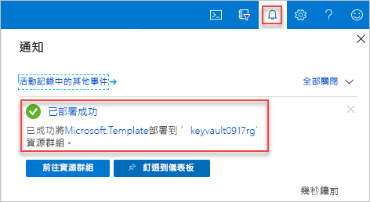

# <a name="quickstart-set-and-retrieve-a-secret-from-azure-key-vault-using-resource-manager-template"></a>快速入門：使用 Resource Manager 範本從 Azure Key Vault 設定及擷取祕密

[Azure Key Vault](./key-vault-overview.md) 是雲端服務，可安全儲存祕密，例如金鑰、密碼、憑證和其他祕密。 本快速入門著重於部署 Resource Manager 範本來建立金鑰保存庫和秘密的程序。

[Resource Manager 範本](../azure-resource-manager/templates/overview.md)是一個 JavaScript 物件標記法 (JSON) 檔案，定義了專案的基礎結構和組態。 範本會使用宣告式語法，可讓您陳述您要部署的項目，而不需要撰寫一連串程式設計命令來加以建立。 如果您要深入了解如何開發 Resource Manager 範本，請參閱 [Resource Manager 文件](/azure/azure-resource-manager/)和[範本參考](/azure/templates/microsoft.keyvault/allversions)。

如果您沒有 Azure 訂用帳戶，請在開始前建立[免費帳戶](https://azure.microsoft.com/free/?WT.mc_id=A261C142F)。

## <a name="prerequisites"></a>Prerequisites

若要完成本文，您需要：

* 範本需要您的 Azure AD 使用者物件識別碼來設定權限。 下列程序會取得物件識別碼 (GUID)。

    1. 透過選取 [試試看]  來執行下列 Azure PowerShell 或 Azure CLI 命令，然後將指令碼貼到 Shell 窗格中。 若要貼上指令碼，請以滑鼠右鍵按一下 Shell，然後選取 [貼上]  。

        # <a name="clitabcli"></a>[CLI](#tab/CLI)
        ```azurecli-interactive
        echo "Enter your email address that is used to sign in to Azure:" &&
        read upn &&
        az ad user show --id $upn --query "objectId" &&
        echo "Press [ENTER] to continue ..."
        ```

        # <a name="powershelltabpowershell"></a>[PowerShell](#tab/PowerShell)
        ```azurepowershell-interactive
        $upn = Read-Host -Prompt "Enter your email address used to sign in to Azure"
        (Get-AzADUser -UserPrincipalName $upn).Id
        Write-Host "Press [ENTER] to continue..."
        ```

        ---

    2. 請記下物件識別碼。 您會在本快速入門中的下一節用到它。

## <a name="create-a-vault-and-a-secret"></a>建立保存庫和秘密

本快速入門中使用的範本是來自 [Azure 快速入門範本](https://azure.microsoft.com/resources/templates/101-key-vault-create/)。

[!code-json[<Azure Resource Manager template create key vault>](~/quickstart-templates/101-key-vault-create/azuredeploy.json)]

範本中定義了兩個 Azure 資源：

* **Microsoft.KeyVault/vaults**：建立 Azure 金鑰保存庫。
* **Microsoft.KeyVault/vaults/secrets**：建立金鑰保存庫秘密。

更多 Azure Key Vault 範本範例可在[此處](https://azure.microsoft.com/resources/templates/?resourceType=Microsoft.Keyvault)找到。

1. 選取以下影像來登入 Azure 並開啟範本。 此範本會建立金鑰保存庫和祕密。

    <a href="https://portal.azure.com/#create/Microsoft.Template/uri/https%3A%2F%2Fraw.githubusercontent.com%2FAzure%2Fazure-quickstart-templates%2Fmaster%2F101-key-vault-create%2Fazuredeploy.json"></a>

2. 選取或輸入下列值。

    

    除非有指定，否則就使用預設值來建立金鑰保存庫和密碼。

    * **訂用帳戶**：選取 Azure 訂用帳戶。
    * [資源群組]  選取 [新建]  ，輸入資源群組的唯一名稱，然後按一下 [確認]  。
    * **位置**：選取位置。  例如，**美國中部**。
    * **Key Vault 名稱**：輸入金鑰保存庫的名稱，它在 vault.azure.net 命名空間內必須是全域唯一的。 當您在下一節中驗證部署時，會需要用到此名稱。
    * **租用戶識別碼**：範本功能會自動擷取您的租用戶識別碼。請勿變更預設值。
    * **AD 使用者識別碼**：輸入您從[必要條件](#prerequisites)中擷取的 Azure AD 使用者物件識別碼。
    * **祕密名稱**：輸入您在金鑰保存庫中儲存的祕密的名稱。  例如，**adminpassword**。
    * **祕密值**：輸入祕密值。  如果您儲存密碼，建議使用您在必要條件中建立而產生的密碼。
    * **我同意上方所述的條款及條件**：選取。
3. 選取 [購買]  。 成功部署金鑰保存庫之後，您會收到通知：

    

Azure 入口網站用於部署範本。 除了 Azure 入口網站以外，您也可以使用 Azure PowerShell、Azure CLI 和 REST API。 若要了解其他部署方法，請參閱[部署範本](../azure-resource-manager/templates/deploy-powershell.md)。

## <a name="validate-the-deployment"></a>驗證部署

您可以使用 Azure 入口網站來檢查金鑰保存庫和秘密，或使用下列 Azure CLI 或 Azure PowerShell 指令碼列出所建立的祕密。

# <a name="clitabcli"></a>[CLI](#tab/CLI)

```azurecli-interactive
echo "Enter your key vault name:" &&
read keyVaultName &&
az keyvault secret list --vault-name $keyVaultName &&
echo "Press [ENTER] to continue ..."
```

# <a name="powershelltabpowershell"></a>[PowerShell](#tab/PowerShell)

```azurepowershell-interactive
$keyVaultName = Read-Host -Prompt "Enter your key vault name"
Get-AzKeyVaultSecret -vaultName $keyVaultName
Write-Host "Press [ENTER] to continue..."
```

---

輸出大致如下：

# <a name="clitabcli"></a>[CLI](#tab/CLI)


# <a name="powershelltabpowershell"></a>[PowerShell](#tab/PowerShell)


---
## <a name="clean-up-resources"></a>清除資源

其他 Key Vault 快速入門和教學課程會以本快速入門為基礎。 如果您打算繼續進行後續的快速入門和教學課程，您可以讓這些資源留在原處。
如果不再需要，請刪除資源群組，這會刪除 Key Vault 和相關資源。 若要使用 Azure CLI 或 Azure Powershell 刪除資源群組：

# <a name="clitabcli"></a>[CLI](#tab/CLI)

```azurecli-interactive
echo "Enter the Resource Group name:" &&
read resourceGroupName &&
az group delete --name $resourceGroupName &&
echo "Press [ENTER] to continue ..."
```

# <a name="powershelltabpowershell"></a>[PowerShell](#tab/PowerShell)

```azurepowershell-interactive
$resourceGroupName = Read-Host -Prompt "Enter the Resource Group name"
Remove-AzResourceGroup -Name $resourceGroupName
Write-Host "Press [ENTER] to continue..."
```

---

## <a name="next-steps"></a>後續步驟

在本快速入門中，您已使用 Azure Resource Manager 範本建立金鑰保存庫和祕密，並已驗證部署。 若要深入了解 Key Vault 和 Azure Resource Manager，請繼續閱讀下列文章。

- 閱讀 [Azure Key Vault 概觀](key-vault-overview.md)
- 深入了解 [Azure Resource Manager](../azure-resource-manager/management/overview.md)
- 取得[金鑰、秘密和憑證](about-keys-secrets-and-certificates.md)的詳細資訊
- 檢閱 [Azure Key Vault 最佳做法](key-vault-best-practices.md)