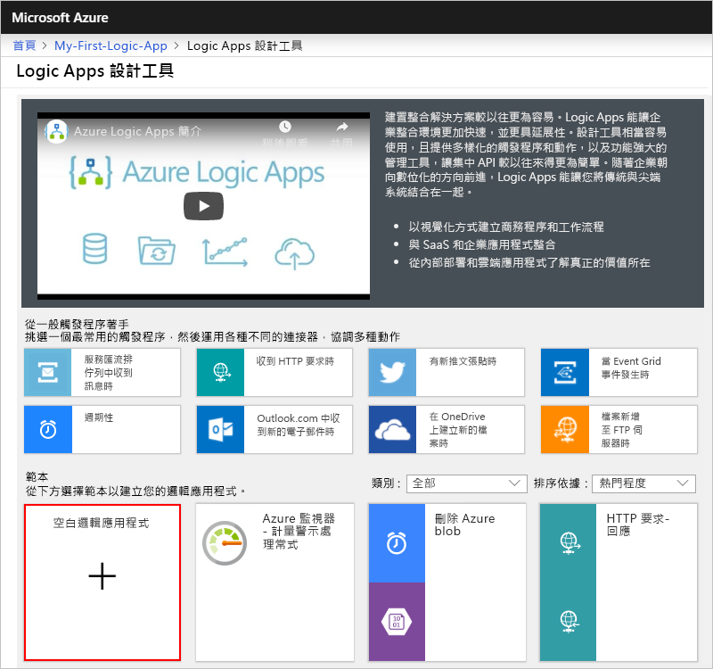
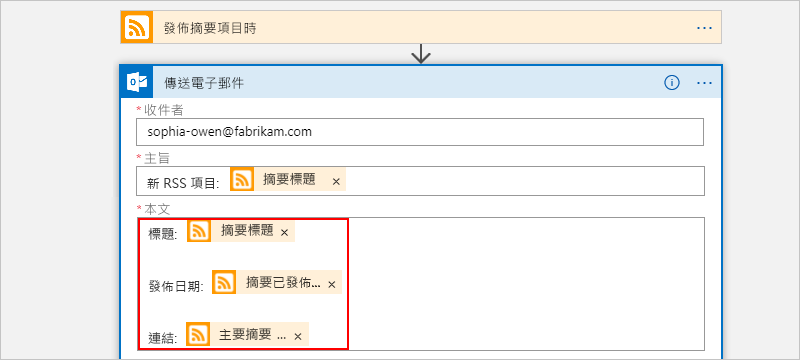
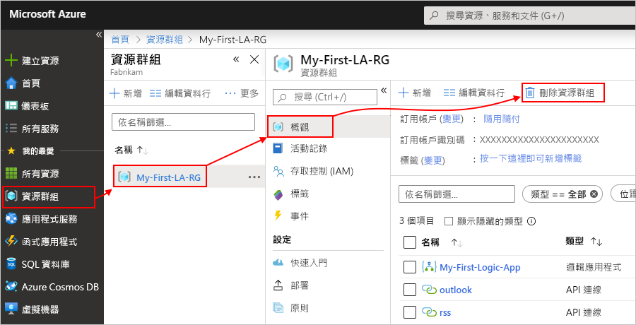

# <a name="quickstart-create-your-first-automated-workflow-with-azure-logic-apps---azure-portal"></a>快速入門：使用 Azure Logic Apps 建立第一個自動化工作流程 - Azure 入口網站

本快速入門介紹如何使用 [Azure Logic Apps](../logic-apps/logic-apps-overview.md) 建立第一個自動化工作流程。 在本文中，您會建立一個邏輯應用程式，以定期檢查網站的 RSS 摘要中是否有新項目。 如果存在新的項目，邏輯應用程式會針對每個項目傳送電子郵件。 當您完成時，邏輯應用程式大致如下列工作流程所示︰


若要依照本快速入門執行，您需有一個電子郵件帳戶，而該電子郵件帳戶來自 Logic Apps 所支援的提供者 (例如 Office 365 Outlook、Outlook.com 或 Gmail)。 對於其他提供者，請[檢閱這裡的連接器清單](https://docs.microsoft.com/connectors/)。 本邏輯應用程式會使用 Office 365 Outlook 帳戶。 如果您使用另一個電子郵件帳戶，則整體步驟相同，但您的 UI 可能稍有不同。

此外，如果您沒有 Azure 訂用帳戶，請先[註冊一個免費的 Azure 帳戶](https://azure.microsoft.com/free/)。

## <a name="sign-in-to-the-azure-portal"></a>登入 Azure 入口網站

使用您的 Azure 帳戶認證登入 [Azure 入口網站](https://portal.azure.com)。

## <a name="create-your-logic-app"></a>建立邏輯應用程式

1. 在主要 Azure 功能表中，選取 [建立資源]   > [整合]   > [邏輯應用程式]  。

   

1. 在 [建立邏輯應用程式]  底下，提供有關邏輯應用程式的詳細資訊，如下所示。 在完成作業後，選取 [建立]  。

   

   | 屬性 | 值 | 說明 |
   |----------|-------|-------------|
   | **名稱** | <*logic-app-name*> | 您的邏輯應用程式名稱，其中只能包含字母、數字、連字號 (`-`)、底線 (`_`)、括弧(`(`、`)`) 和句點 (`.`)。 此範例使用 "My-First-Logic-App"。 |
   | **訂用帳戶** | <*Azure-subscription-name*> | 您的 Azure 訂用帳戶名稱 |
   | **資源群組** | <*Azure-resource-group-name*> | 用來組織相關資源之 [Azure 資源群組](../azure-resource-manager/resource-group-overview.md)的名稱。 此範例使用 "My-First-LA-RG"。 |
   | **位置** | <*Azure-region*> | 用來存放邏輯應用程式資訊的區域。 此範例使用「美國西部」。 |
   | **Log Analytics** | 關閉 | 保留診斷記錄的 [關閉]  設定。 |
   ||||

1. 在 Azure 部署您的應用程式之後，請在 Azure 工具列上針對您部署的邏輯應用程式選取 [通知]   > [移至資源]  。

   

   或者，您可以在搜尋方塊中輸入名稱，以尋找並選取您的邏輯應用程式。

   Logic Apps 設計工具會開啟並顯示含有簡介影片和常用觸發程序的頁面。 在 [範本]  底下，選取 [空白邏輯應用程式]  。

   

接下來，新增可在新的 RSS 摘要項目出現時引發的[觸發程序](../logic-apps/logic-apps-overview.md#logic-app-concepts)。 每個邏輯應用程式都必須使用觸發程序啟動，而該觸發程序會在特定事件發生或符合特定條件時引發。 每次引發觸發程序時，Logic Apps 引擎會建立邏輯應用程式執行個體，啟動並執行您的工作流程。

<a name="add-rss-trigger"></a>

## <a name="check-rss-feed-with-a-trigger"></a>使用觸發程序檢查 RSS 摘要

1. 在邏輯應用程式設計工具中的搜尋方塊底下，選取 [全部]  。

1. 在搜尋方塊中，輸入 "rss"。 從觸發程序清單中，選取此觸發程序：**摘要項目發佈時 - RSS**

   ![選取 [摘要項目發佈時] 觸發程序](./media/quickstart-create-first-logic-app-workflow/add-rss-trigger-new-feed-item.png)

1. 為您的觸發程序提供這項資訊，如下所說明：

   

   | 屬性 | 值 | 說明 |
   |----------|-------|-------------|
   | **RSS 摘要 URL** | `http://feeds.reuters.com/reuters/topNews` | 您想要監視的 RSS 摘要連結 |
   | **間隔** | 1 | 在檢查之間所要等待的間隔數目 |
   | **頻率** | 分鐘 | 在檢查之間每個間隔的時間單位  |
   ||||

   時間間隔和頻率可一起為邏輯應用程式的觸發程序定義排程。 此邏輯應用程式會每分鐘檢查摘要。

1. 若要立即隱藏觸發程序的詳細資料，按一下觸發程序的標題列內部。

   

1. 儲存您的邏輯應用程式。 在設計工具的工具列上，選取 [儲存]  。

邏輯應用程式目前啟用中，但是不會執行檢查 RSS 摘要以外的任何其他作業。 因此，新增會在觸發程序引發時回應的動作。

## <a name="send-email-with-an-action"></a>使用動作傳送電子郵件

現在請新增一個[動作](../logic-apps/logic-apps-overview.md#logic-app-concepts)，以在 RSS 摘要中出現新項目時傳送電子郵件。

1. 在 [摘要項目發佈時]  觸發程序下方，選取 [新增步驟]  。

   ![在觸發程序下方，選取 [新增步驟]](./media/quickstart-create-first-logic-app-workflow/add-new-step-under-trigger.png)

1. 在 [選擇動作]  和搜尋方塊中，選取 [全部]  。

1. 在搜尋方塊中，輸入「傳送電子郵件」。 在動作清單中，為您想要的電子郵件提供者選取 [傳送電子郵件] 動作。

   ![選取適用於 Office 365 Outlook 的 [傳送電子郵件] 動作](./media/quickstart-create-first-logic-app-workflow/add-action-send-email.png)

   若要篩選特定應用程式或服務的動作清單，您可以先選取該應用程式或服務：

   * 對於 Azure 工作或學校帳戶，選取 Office 365 Outlook。
   * 對於個人 Microsoft 帳戶，選取 Outlook.com。

1. 如果系統要求提供認證，請登入您的電子郵件帳戶，以便 Logic Apps 建立您的電子郵件帳戶連線。

1. 在 [傳送電子郵件]  動作中，指定您要包含在電子郵件中的資料。

   1. 在 [收件者]  方塊中，輸入收件者的電子郵件地址。 為了測試用途，您可以使用自己的電子郵件地址。

      現在，請忽略出現的 [新增動態內容]  清單。 當您按一下某些編輯方塊內部時，這份清單隨即出現，並顯示上一個步驟中可在工作流程中納為輸入的任何可用參數。

   1. 在 [主旨]  方塊中，輸入以下文字且尾端加上一個空格：```New RSS item:```

      ![在 [主旨] 屬性中，輸入您的電子郵件主旨](./media/quickstart-create-first-logic-app-workflow/add-action-send-email-subject.png)

   1. 從 [新增動態內容]  清單中，選取 [摘要標題]  以包含 RSS 項目標題。

      ![從動態內容清單中，選取 [摘要標題] 屬性](./media/quickstart-create-first-logic-app-workflow/add-action-send-email-subject-dynamic-content.png)

      當您完成時，電子郵件主旨看起來如下列範例：

      

      如果 "For each" 迴圈出現在設計工具上，表示您選取了陣列的權杖，例如 **categories-item** 權杖。 對於這類權杖，設計工具會自動對參考該權杖的動作新增此迴圈。 如此一來，邏輯應用程式會在每個陣列項目上執行相同動作。 若要移除迴圈，請選取迴圈標題列上的**省略符號** ( **...** )，然後選取 [刪除]  。

   1. 在 [內文]  方塊中輸入此文字，然後為電子郵件內文選取這些權杖。 若要在編輯方塊中新增空白的行，請按 Shift + Enter。

      

      | 屬性 | 說明 |
      |----------|-------------|
      | **摘要標題** | 項目的標題 |
      | **摘要發佈時間** | 項目的發佈日期和時間 |
      | **主要摘要連結** | 項目的 URL |
      |||

1. 儲存您的邏輯應用程式。

接下來，測試邏輯應用程式。

## <a name="run-your-logic-app"></a>執行邏輯應用程式

若要手動啟動邏輯應用程式，請在設計工具的工具列上選取 [執行]  。 或者，等候邏輯應用程式依照您指定的排程 (每分鐘) 檢查 RSS 摘要。 如果 RSS 摘要有新的項目，邏輯應用程式會針對每個新的項目傳送電子郵件。 否則，邏輯應用程式會等到下一個間隔，再檢查一次。 如果您沒有得到任何電子郵件，請檢查垃圾郵件資料夾。

例如，以下是此邏輯應用程式傳送的範例電子郵件。


技術上，當觸發程序檢查 RSS 摘要並尋找新項目時，觸發程序會引發，而 Logic Apps 引擎會建立邏輯應用程式工作流程的執行個體，以在工作流程中執行動作。 如果觸發程序找不到新項目，觸發程序並不會引發，而且會「略過」具現化工作流程。

恭喜，您現在已透過 Azure 入口網站成功建置並執行您的第一個邏輯應用程式。

## <a name="clean-up-resources"></a>清除資源

如果不再需要此範例，請刪除包含邏輯應用程式的資源群組和相關資源。

1. 在主要 Azure 功能表上，選取 [資源群組]  ，然後選取邏輯應用程式的資源群組。 在 [概觀]  窗格上，選取 [刪除資源群組]  。

   

1. 輸入資源群組名稱進行確認，然後選取 [刪除]  。

   ![若要確認篩除，請選取 [刪除]](./media/quickstart-create-first-logic-app-workflow/delete-resource-group-2.png)

> [!NOTE]
> 當您刪除邏輯應用程式後，就不會具現化新的執行。 所有進行中和擱置的執行都會取消。 如果您有數千個執行，加以取消可能需要很長的時間。

## <a name="get-support"></a>取得支援

如有問題，請瀏覽 [Azure Logic Apps 論壇](https://social.msdn.microsoft.com/Forums/home?forum=azurelogicapps)。

## <a name="next-steps"></a>後續步驟

在本快速入門中，您已建立第一個邏輯應用程式，以便檢查以您指定的排程 (每分鐘) 為基礎的 RSS 更新，並且在有更新時採取動作 (傳送電子郵件)。 若要深入了解，請繼續執行本教學課程，以建立更多以排程為基礎的進階工作流程：

> [!div class="nextstepaction"]
> [使用以排程為基礎的邏輯應用程式檢查流量](../logic-apps/tutorial-build-schedule-recurring-logic-app-workflow.md)
