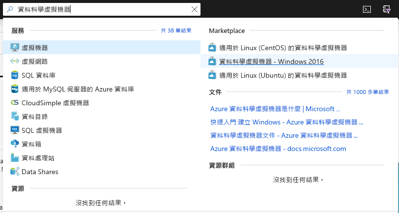
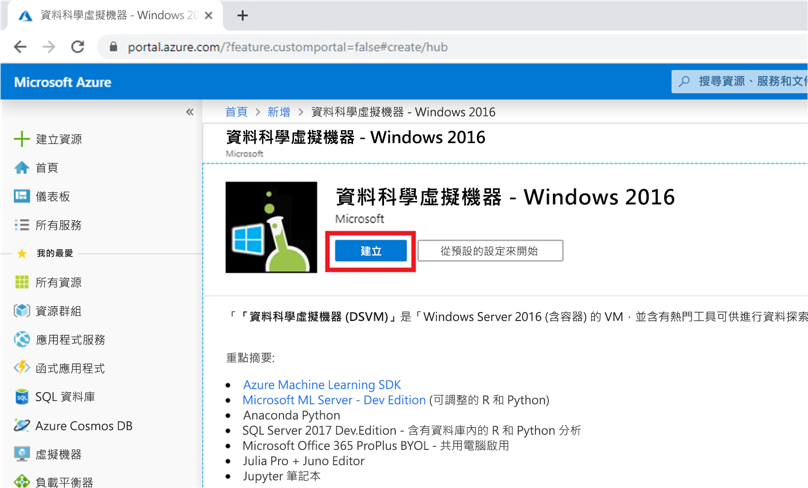

# 快速入門：設定適用於 Windows 的資料科學虛擬機器

啟動並執行 Windows 資料科學虛擬機器。

## 必要條件

若要建立 Windows 資料科學虛擬機器，您必須具有 Azrue 訂用帳戶。 [免費試用 Azure](https://azure.com/free)。
請注意，Azure 免費帳戶不支援已啟用 GPU 的虛擬機器 SKU。

## 建立您的 DSVM

若要建立 DSVM 執行個體：

1. 移至 [Azure 入口網站](https://portal.azure.com)。如果您尚未登入 Azure 帳戶，系統可能會提示您登入。
1. 在 [資料科學虛擬機器] 中輸入並選取 [資料科學虛擬機器 - Windows 2016]，以尋找虛擬機器清單。

    

1. 選取底部的 [建立]  按鈕。

    

1. 您應會重新導向至 [建立虛擬機器] 刀鋒視窗。
   ![對應至 Windows 虛擬機器的 [基本] 索引標籤](./media/provision-vm/review-create-windows.png)

1. 填寫 [基本]  索引標籤：
      * 訂用帳戶  ：如果您有多個訂用帳戶，請選取要在其中建立機器及計費的訂用帳戶。 您必須有此訂用帳戶的資源建立權限。
      * **資源群組**：建立新的群組或使用現有群組。
      * **虛擬機器名稱**：輸入虛擬機器的名稱。 這就是它在 Azure 入口網站中的顯示方式。
      * **位置**：選取最適合的資料中心。 如需最快速的網路存取，請選取擁有您大部分資料或是最接近您實際位置的資訊中心。 深入了解 [Azure 區域](https://azure.microsoft.com/global-infrastructure/regions/)。
      * **映像**：保留預設值。
      * **大小**：這應會自動填入適合一般工作負載的大小。 深入了解 [Azure 中的 Windows VM 大小](../../virtual-machines/windows/sizes.md)。
      * **使用者名稱**：輸入系統管理員的使用者名稱。 這是您將用來登入虛擬機器的使用者名稱，不需要與您的 Azure 使用者名稱相同。
      * **密碼**：輸入您將用來登入虛擬機器的密碼。    
1. 選取 [檢閱 + 建立]  。
1. **檢閱 + 建立**
   * 請確認您輸入的所有資訊都正確無誤。 
   * 選取 [建立]  。

> [!NOTE]
> * 您不需對在虛擬機器上預先載入的軟體支付授權費用。 您需支付在 [大小]  步驟中所選伺服器大小的計算成本。
> * 佈建需要 10 到 20 分鐘的時間。 您可以在 Azure 入口網站上檢視 VM 的狀態。

## 存取 DSVM

建立並佈建 VM 之後，請遵循所列的步驟來[連線到 Azure 型虛擬機器](../../marketplace/cloud-partner-portal/virtual-machine/cpp-connect-vm.md)。 請使用您在建立虛擬機器的**基本**步驟中設定的管理員帳戶憑證。 

您已準備好開始使用在 VM 上安裝及設定的工具。 許多工具都可透過 [開始]  功能表圖格和桌面圖示來存取。

您也可以將 DSVM 連結至 Azure Notebooks，以在 VM 上執行 Jupyter Notebook，並忽略免費服務層的限制。 如需詳細資訊，請參閱[管理和設定 Notebooks 專案](../../notebooks/configure-manage-azure-notebooks-projects.md#manage-and-configure-projects)。

## 後續步驟

* 開啟 [開始]  功能表，探索 DSVM 上的工具。
* 閱讀[什麼是 Azure Machine Learning 服務？](../service/overview-what-is-azure-ml.md)並嘗試使用[教學課程](../index.yml)，以了解 Azure Machine Learning 服務。
* 在檔案總管中，瀏覽至 C:\Program Files\Microsoft\ML Server\R_SERVER\library\RevoScaleR\demoScripts，以取得在 R 中使用 RevoScaleR 程式庫的範例，其支援企業規模的資料分析。 
* 閱讀文章：[您可以在資料科學虛擬機器上做的十件事](https://aka.ms/dsvmtenthings)。
* 了解如何使用 [Team Data Science Process](../team-data-science-process/index.yml)，以系統化方式建置端對端分析方案。
* 瀏覽 [Azure AI 資源庫](https://gallery.cortanaintelligence.com)，可取得在 Azure 上使用 Azure Machine Learning 和相關資料服務的機器學習和資料分析範例。 我們也已在虛擬機器的 [開始]  功能表和桌面上提供此資源庫的圖示。
* 請參閱此虛擬機器的適當[參考文件](./reference-windows-vm.md)。

