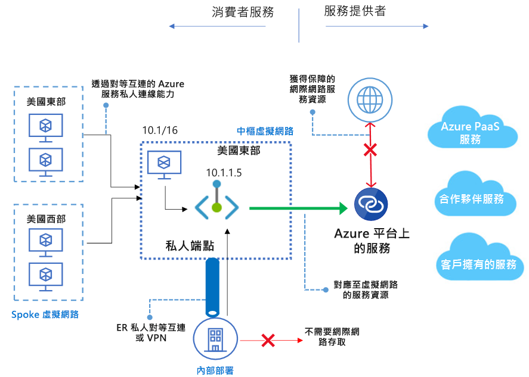

# 什麼是 Azure Private Link？ 
Azure Private Link 可讓您透過虛擬網路中的[私人端點](private-endpoint-overview.md)存取各項 Azure PaaS 服務 (例如 Azure 儲存體、Azure Cosmos DB 和 SQL Database)，以及 Azure 裝載的客戶/合作夥伴服務。 虛擬網路和服務間的流量會在通過 Microsoft 骨幹網路時隨之減少，降低資料在網際網路中公開的風險。 您也可以在虛擬網路 (VNet) 中建立自己的 [Private Link 服務](private-link-service-overview.md)，並私下提供給您的客戶。 使用 Azure Private Link 的設定和取用體驗在 Azure PaaS、客戶自有服務和共用合作夥伴服務之間是一致的。

## 主要權益
Azure Private Link 提供下列優點：  
- **私下存取 Azure 平台上的服務**：私下將您的虛擬網路連線到在 Azure 中執行的服務，而不需要來源或目的地的公用 IP 位址。 服務提供者可以私下在自己的虛擬網路中呈現其服務，而取用者可以在其區域虛擬網路中私下存取這些服務。 Private Link 平台會透過 Azure 骨幹網路處理取用者與服務之間的連線。 
 
- **內部部署及對等互連的網路**：使用私人端點透過 ExpressRoute 私人對等互連/VPN 通道 (從內部部署裝置) 及對等互連虛擬網路，從內部部署裝置存取在 Azure 中執行的服務。 不需要設定公用對等互連或穿越網際網路來觸及服務。 此功能可安全地將工作負載遷移至 Azure。
 
- **防止資料外洩**：透過 Azure Private Link，VNet 中的私人端點會對應至客戶 PaaS 資源的特定執行個體，而不是整個服務。 使用私人端點取用者只能連線到特定的資源，而不能連線到服務中的任何其他資源。 此內建機制可防範資料外泄的風險。 
 
- **觸及全球**：私下連線至其他區域中執行的服務。 這表示取用者的虛擬網路可能在區域 A 中，但可以連線到區域 B 中 Private Link 後方的服務。  
 
- **延伸至您自己的服務**：利用相同的體驗和功能，將您自己的服務私下呈現給 Azure 中的取用者。 藉由將您的服務放在 Standard Load Balancer 後方，您就可以將其用於 Private Link。 然後，取用者就可以使用自己 VNet 中的私人端點，直接連線到您的服務。 您可以使用簡單的核准呼叫流程來管理這些連線要求。 Azure Private Link 適用於屬於不同 Active Directory 租用戶的取用者和服務。 

## 可用性 
 下表列出 Private Link 服務和適用此服務的區域。 

|狀況  |支援的服務  |可用區域 | 狀態  |
|:---------|:-------------------|:-----------------|:--------|
|適用於客戶自有服務的 Private Link|Standard Load Balancer 後方的 Private Link 服務 | 所有公用區域  | 預覽  |
|適用於 Azure PaaS 服務的 Private Link   | Azure 儲存體        |  所有公用區域      | 預覽   [深入了解](/azure/storage/common/storage-private-endpoints)。  |
|  | Azure Data Lake Storage Gen2        |  所有公用區域      | 預覽   [深入了解](/azure/storage/common/storage-private-endpoints)。  |
|  |  Azure SQL Database         | 所有公用區域      |   預覽      |
||Azure SQL 資料倉儲| 所有公用區域 |預覽|
||Azure Cosmos DB| 美國中西部、美國西部、美國中北部 |預覽|
|  |  適用於 PostgreSQL 的 Azure 資料庫 - 單一伺服器         | 所有公用區域      |   預覽      |
|  |  適用於 MySQL 的 Azure 資料庫         | 所有公用區域      |   預覽      |
|  |  適用於 MariaDB 的 Azure 資料庫         | 所有公用區域      |   預覽      |
|  |  Azure 金鑰保存庫         | 所有公用區域      |   預覽      |

如需最新通知，請查看 [Azure 虛擬網路更新頁面](https://azure.microsoft.com/updates/?product=virtual-network)。

## 記錄和監視

Azure Private Link 會與 Azure 監視器整合，讓您可以將記錄封存至儲存體帳戶、將事件串流至事件中樞，或者將它們傳送到 Azure 監視器記錄。 您可以在 Azure 監視器上存取下列資訊： 
- **私人端點**：私人端點處理的資料  (IN/OUT)
 
- **Private Link 服務**：
    - Private Link 服務處理的資料  (IN/OUT)
    - NAT 連接埠可用性  
 
## 定價   
如需定價詳細資料，請參閱 [Azure Private Link 定價](https://azure.microsoft.com/pricing/details/private-link/)。
 
## 常見問題集  
若要查看常見問題集，請參閱 [Azure Private Link 常見問題集](private-link-faq.md)。
 
## 限制  
若要查看相關限制，請參閱 [Azure Private Link 限制](../azure-resource-manager/management/azure-subscription-service-limits.md#private-link-limits)。

## 後續步驟
- [使用入口網站建立適用於 SQL Database 伺服器的私人端點](create-private-endpoint-portal.md)
- [使用 PowerShell 建立適用於 SQL Database 伺服器的私人端點](create-private-endpoint-powershell.md)
- [使用 CLI 建立適用於 SQL Database 伺服器的私人端點](create-private-endpoint-cli.md)
- [使用入口網站建立適用於儲存體帳戶的私人端點](create-private-endpoint-storage-portal.md)
- [使用入口網站建立適用於 Azure Cosmos 帳戶的私人端點](../cosmos-db/how-to-configure-private-endpoints.md)
- [使用 Azure PowerShell 建立您自己的 Private Link 服務](create-private-link-service-powershell.md)

 
