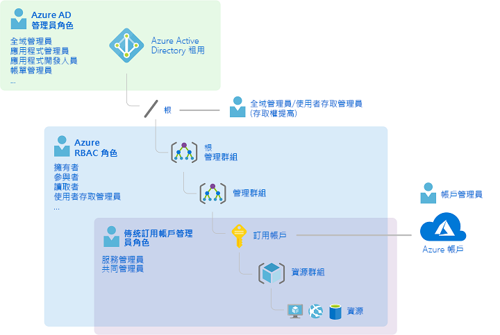

# 傳統訂用帳戶管理員角色、Azure RBAC 角色和 Azure AD 管理員角色

如果您不熟悉 Azure，您可能會發現要了解 Azure 中的所有不同角色有點挑戰。 本文協助說明下列角色，以及使用每個角色的時機：
- 傳統訂用帳戶管理員角色
- Azure 角色型存取控制 (RBAC) 角色
- Azure Active Directory (Azure AD) 管理員角色

## 角色的關聯方式

若要進一步了解 Azure 中的角色，最好先知道某些歷程記錄。 當 Azure 初次發行時，只利用三個管理員角色管理資源存取：帳戶管理員、服務管理員和共同管理員。 後來，新增了 Azure 資源的角色型存取控制 (RBAC)。 Azure RBAC 是較新的授權系統，可提供更細緻的 Azure 資源存取管理。 RBAC 包含許多內建角色，這些角色可以在不同的範圍進行指派，並可讓您建立自己的自訂角色。 若要管理 Azure AD 中的資源 (例如使用者、群組和網域)，有數個 Azure AD 管理員角色可以使用。

下圖是傳統訂用帳戶管理員角色、Azure RBAC 角色和 Azure AD 管理員角色如何產生關聯的高階檢視。

## 傳統訂用帳戶管理員角色

帳戶管理員、服務管理員和共同管理員是 Azure 中的三個傳統訂用帳戶管理員角色。 傳統訂用帳戶管理員具有 Azure 訂用帳戶的完整存取權。 他們可以使用 Azure 入口網站、Azure Resource Manager API 和傳統部署模型 API 來管理資源。 用來註冊 Azure 帳戶會自動設定為帳戶管理員和服務管理員。 接著，註冊之後才新增額外的共同管理員。 服務管理員與共同管理員具有與下列使用者同等的存取權：在訂用帳戶範圍獲派擁有者角色 (Azure RBAC 角色) 的使用者。 下表說明這三個傳統訂用帳戶系統管理角色之間的差異。

| 傳統訂用帳戶管理員 | 限制 | 權限 | 注意 |
| --- | --- | --- | --- |
| 帳戶管理員 | 每個 Azure 帳戶 1 名 | <ul><li>存取 [Azure 帳戶中心](https://account.azure.com/Subscriptions)</li><li>管理帳戶中的所有訂用帳戶</li><li>建立新的訂用帳戶</li><li>取消訂用帳戶</li><li>變更訂用帳戶的計費</li><li>變更服務管理員</li></ul> | 在概念上，就是訂用帳戶的計費擁有者。 帳戶管理員無法存取 Azure 入口網站。 |
| 服務管理員 | 每個 Azure 訂用帳戶 1 名 | <ul><li>在 [Azure 入口網站](https://portal.azure.com)中管理服務</li><li>取消訂用帳戶</li><li>將使用者指派給共同管理員角色</li></ul> | 根據預設，新訂用帳戶的帳戶管理員也是服務管理員。 服務管理員與在訂用帳戶範圍獲派擁有者角色的使用者具有同等的存取權。 服務管理員可完整存取 Azure 入口網站。 |
| 共同管理員 | 每個訂用帳戶 200 名 | <ul><li>具有與服務管理員相同的存取權限，但無法變更訂用帳戶與 Azure 目錄的關聯</li><li>將使用者指派給共同管理員角色，但無法變更服務管理員</li></ul> | 共同管理員與在訂用帳戶範圍獲派擁有者角色的使用者具有同等的存取權。 |

在 Azure 入口網站中，您可以使用 [傳統管理員]  索引標籤管理共同管理員或檢視服務管理員。

在 Azure 入口網站中，您可以在訂用帳戶的 [屬性] 刀鋒視窗上檢視或變更服務管理員或檢視帳戶管理員。

如需詳細資訊，請參閱 [Azure 傳統訂用帳戶管理員](classic-administrators.md)。

### Azure 帳戶與 Azure 訂用帳戶

Azure 帳戶代表計費關聯性。 Azure 帳戶就是使用者身分識別、一或多個 Azure 訂用帳戶，以及一組相關聯的 Azure 資源。 建立帳戶的人員就是該帳戶中所有訂用帳戶的帳戶管理員。 該人員也是訂用帳戶的預設服務管理員。

Azure 訂用帳戶可協助您組織 Azure 資源的存取權。 它們也可協助您控制如何根據資源使用量產生報告、計費及付費。 每個訂用帳戶可以有不同的計費和付款設定，因此，依照辦公室、部門、專案等等，您可有不同的訂用帳戶和不同的方案。 每個服務都屬於某個訂用帳戶，而且需要訂用帳戶識別碼才能進行程式設計作業。

每個訂用帳戶都與 Azure AD 目錄相關聯。 若要尋找與訂用帳戶相關聯的目錄，請在 Azure 入口網站中開啟 [訂用帳戶]  ，然後選取訂用帳戶以查看目錄。

帳戶和訂用帳戶都是在 [Azure 帳戶中心](https://account.azure.com/Subscriptions)中管理。

## Azure RBAC 角色

Azure RBAC 是建置於 [Azure Resource Manager](../azure-resource-manager/resource-group-overview.md) 上的授權系統，可提供更細緻的 Azure 資源存取管理，例如計算和儲存體。 Azure RBAC 包含超過 70 個內建角色。 基本 RBAC 角色有四個。 前三個適用於所有資源類型：

| Azure RBAC 角色 | 權限 | 注意 |
| --- | --- | --- |
| [擁有者](built-in-roles.md#owner) | <ul><li>所有資源的完整存取權</li><li>委派其他資源的存取權</li></ul> | 服務管理員和共同管理員都會獲派訂用帳戶範圍的擁有者角色 適用於所有資源類型。 |
| [參與者](built-in-roles.md#contributor) | <ul><li>建立和管理所有類型的 Azure 資源</li><li>無法授與其他資源的存取權</li></ul> | 適用於所有資源類型。 |
| [讀取者](built-in-roles.md#reader) | <ul><li>檢視 Azure 資源</li></ul> | 適用於所有資源類型。 |
| [使用者存取系統管理員](built-in-roles.md#user-access-administrator) | <ul><li>管理 Azure 資源的使用者存取</li></ul> |  |

其餘的 RBAC 角色可以管理特定 Azure 資源。 例如，[虛擬機器參與者](built-in-roles.md#virtual-machine-contributor)角色可讓使用者建立和管理虛擬機器。 如需內建角色清單，請參閱 [Azure 資源的內建角色](built-in-roles.md)。

只有 Azure 入口網站和 Azure Resource Manager API 支援 RBAC。 獲派 RBAC 角色的使用者、群組和應用程式無法使用 [Azure 傳統部署模型 API](../azure-resource-manager/resource-manager-deployment-model.md)。

在 Azure 入口網站中，使用 RBAC 的角色指派會出現在 [存取控制 (IAM)]  刀鋒視窗上。 在整個入口網站中都可以找到此刀鋒視窗，例如管理群組、訂用帳戶、資源群組及各種資源。

當您按一下 [角色]  索引標籤時，您會看到內建和自訂角色的清單。

如需詳細資料，請參閱[使用 RBAC 和 Azure 入口網站來管理 Azure 資源的存取權](role-assignments-portal.md)。

## Azure AD 管理員角色

Azure AD 管理員用來管理目錄中的 Azure AD 資源，例如建立或編輯使用者、將系統管理角色指派給其他人、重設使用者密碼、管理使用者授權，以及管理網域。 下表描述一些更重要的 Azure AD 管理員角色。

| Azure AD 管理員角色 | 權限 | 注意 |
| --- | --- | --- |
| [全域管理員](../active-directory/users-groups-roles/directory-assign-admin-roles.md#company-administrator-permissions) | <ul><li>管理 Azure Active Directory 中所有系統管理功能的存取權，以及 Azure Active Directory 同盟服務</li><li>將管理員角色指派給其他人</li><li>為任何使用者和所有其他管理員重設密碼</li></ul> | 註冊 Azure Active Directory 租用戶的人員會變成全域管理員。 |
| [使用者管理員](../active-directory/users-groups-roles/directory-assign-admin-roles.md#user-administrator) | <ul><li>建立及管理使用者與群組的所有層面</li><li>管理支援票證</li><li>監視服務健康情況</li><li>變更使用者、技術支援中心管理員及其他使用者管理員的密碼</li></ul> |  |
| [計費管理員](../active-directory/users-groups-roles/directory-assign-admin-roles.md#billing-administrator) | <ul><li>進行購買</li><li>管理訂用帳戶</li><li>管理支援票證</li><li>監視服務健康狀態</li></ul> |  |

在 Azure 入口網站中，您可以在 [角色和管理員]  刀鋒視窗上看到 Azure AD 管理員角色清單。 如需所有 Azure AD 管理員角色的清單，請參閱 [Azure Active Directory 中的系統管理員角色權限](../active-directory/users-groups-roles/directory-assign-admin-roles.md)。

## Azure RBAC 角色與 Azure AD 管理員角色之間的差異

概括而言，Azure RBAC 角色控制管理 Azure 資源的權限，而 Azure AD 管理員角色控制管理 Azure Active Directory 資源的權限。 下表比較一些差異。

| Azure RBAC 角色 | Azure AD 管理員角色 |
| --- | --- |
| 管理 Azure 資源的存取權 | 管理 Azure Active Directory 資源的存取權 |
| 支援自訂角色 | 支援自訂角色 |
| 您可以在多個層級指定範圍 (管理群組、訂用帳戶、資源群組、資源) | 範圍是在租用戶層級 |
| 可以在 Azure 入口網站、Azure CLI、Azure PowerShell、Azure Resource Manager 範本、Azure CLI 中存取角色資訊 | 可以在 Azure 入口網站、Microsoft 365 管理中心、Microsoft Graph、AzureAD PowerShell 中存取角色資訊 |

### Azure RBAC 角色與 Azure AD 管理員角色是否重疊？

根據預設，Azure RBAC 角色與 Azure AD 管理員角色不會跨越 Azure 和 Azure AD。 不過，如果全域管理員藉由在 Azure 入口網站中選擇 [全域管理員可以管理 Azure 訂用帳戶和管理群組]  參數來提升其存取權，則全域管理員會被授與特定租用戶中所有訂用帳戶的[使用者存取管理員](built-in-roles.md#user-access-administrator) 角色 (RBAC 角色)。 使用者存取管理員角色可讓使用者授權其他使用者存取根 Azure 資源的權限。 這個參數有助於重新取得訂用帳戶的存取權。 如需詳細資訊，請參閱[提升為 Azure AD 管理員的存取權](elevate-access-global-admin.md)。

有數個 Azure AD 管理員角色跨越 Azure AD 與 Microsoft Office 365，例如全域管理員和使用者管理員角色。 例如，如果您是全域管理員角色的成員，您就具有 Azure AD 和 Office 365 的全域管理員功能，例如對 Microsoft Exchange 和 Microsoft SharePoint 進行變更。 不過，根據預設，全域管理員沒有 Azure 資源的存取權。

## 後續步驟

- [什麼是 Azure 資源的角色型存取控制 (RBAC)？](overview.md)
- [Azure Active Directory 中的系統管理員角色權限](../active-directory/users-groups-roles/directory-assign-admin-roles.md)
- [Azure 傳統訂用帳戶管理員](classic-administrators.md)
