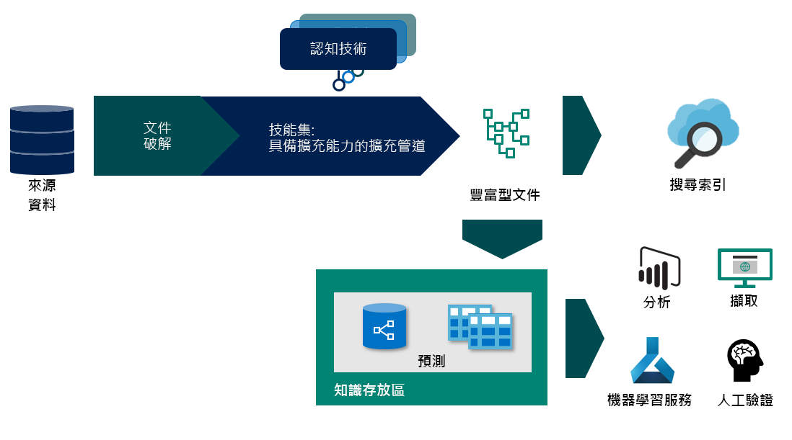

# <a name="working-with-skillsets"></a>使用技能集
本文適用于需要更深入瞭解擴充管線運作方式的開發人員，並假設您已瞭解認知搜尋程式的概念。 如果您不熟悉認知搜尋，請從下列開始：
+ [什麼是 Azure 搜尋服務中的「認知搜尋」？](cognitive-search-concept-intro.md)
+ [什麼是 Azure 搜尋服務中的知識存放區？](knowledge-store-concept-intro.md)

## <a name="specify-the-skillset"></a>指定技能集
技能集是 Azure 搜尋服務中可重複使用的資源，可指定在編制索引期間用來分析、轉換和充實文字或影像內容的認知技能集合。 建立技能集可讓您在資料內嵌階段附加文字和影像擴充，並從原始內容中解壓縮和建立新的資訊和結構。

技能集有三個屬性：

+   ```skills```，這是一種未排序的技能集合，平臺會根據每項技能所需的輸入來決定執行順序
+   ```cognitiveServices```，為所叫用的認知技能計費所需的認知服務金鑰
+   ```knowledgeStore```，將在其中投射擴充檔的儲存體帳戶


技能集是以 JSON 撰寫。 您可以使用[運算式語言](https://docs.microsoft.com/azure/search/cognitive-search-skill-conditional)來建立具有迴圈和[分支](https://docs.microsoft.com/en-us/azure/search/cognitive-search-skill-conditional)的複雜技能集。 運算式語言會使用[JSON 指標](https://tools.ietf.org/html/rfc6901)路徑標記法，並進行一些修改來識別擴充樹狀結構中的節點。 會在樹狀結構中向下```"*"``` 遍歷層級，並作為內容中的每個運算子。```"/"``` 這些概念最適合用來說明範例。 為了說明其中一些概念和功能，我們將逐步解說[飯店評論範例](knowledge-store-connect-powerbi.md)技能集。 若要在您遵循匯入資料工作流程後查看技能集，您必須使用 REST API 用戶端來[取得技能集](https://docs.microsoft.com/en-us/rest/api/searchservice/get-skillset)。

### <a name="enrichment-tree"></a>擴充樹狀結構

為了想像技能集如何逐漸來擴充您的檔，讓我們從檔在任何擴充之前的樣子開始。 檔破解的輸出取決於資料來源和所選取的特定剖析模式。 這也是在將資料新增至搜尋索引時，[欄位](search-indexer-field-mappings.md)對應可從中來源內容的檔狀態。


一旦檔在擴充管線中，就會以內容樹狀結構和相關聯的擴充表示。 此樹狀結構會具現化為檔破解的輸出。 擴充樹狀格式可讓擴充管線將中繼資料附加至基本資料類型，但它不是有效的 JSON 物件，但可以投射成有效的 JSON 格式。 下表顯示進入擴充管線的檔狀態：

|資料 Source\Parsing 模式|預設|JSON，JSON 行 & CSV|
|---|---|---|
|Blob 儲存體|/document/content<br>/document/normalized_images/*<br>…|/document/{key1}<br>/document/{key2}<br>…|
|SQL|/document/{column1}<br>/document/{column2}<br>…|N/A |
|Cosmos DB|/document/{key1}<br>/document/{key2}<br>…|N/A|

 當技能執行時，他們會將新節點新增至擴充樹狀結構。 然後，這些新節點可以做為下游技能的輸入、投射到知識存放區，或對應至索引欄位。 擴充不是可變動的：一旦建立之後，就無法編輯節點。 當您的技能集變得更複雜時，您的擴充樹狀結構，但擴充樹狀結構中的所有節點都不需要將它設為索引或知識存放區。 您可以選擇性地只將擴充的子集保存至索引或知識存放區。

您可以選擇性地只將擴充的子集保存至索引或知識存放區。
本檔的其餘部分，我們假設我們使用[飯店評論範例](https://docs.microsoft.com/en-us/azure/search/knowledge-store-connect-powerbi)，但相同的概念也適用于從其他所有資料來源充實檔。

### <a name="context"></a>內容
每項技能都需要一個內容。 內容會決定：
+   根據選取的節點，技能執行的次數。 對於類型集合的內容值， ```/*```在結尾加入會導致技能針對集合中的每個實例叫用一次。 
+   在擴充樹狀結構中，新增技能輸出的位置。 輸出一律會當做內容節點的子系加入樹狀目錄中。 
+   輸入的形狀。 針對多層集合，將內容設定為父集合會影響輸入技能的形狀。 例如，如果您的擴充樹狀目錄中有一個國家/地區清單，每個都有一份包含 zipcodes 清單的狀態清單。

|內容|Input|輸入的形狀|技能調用|
|---|---|---|---|
|```/document/countries/*``` |```/document/countries/*/states/*/zipcodes/*``` |國家/地區中所有 zipcodes 的清單 |每個國家/地區 |
|```/document/countries/*/states/*``` |```/document/countries/*/states/*/zipcodes/*``` |狀態中的 zipcodes 清單 | 每個國家/地區與州的組合一次|

### <a name="sourcecontext"></a>SourceCoNtext

僅`sourceContext`用於[整形的技能](cognitive-search-skill-shaper.md)和[投影](knowledge-store-projection-overview.md)。 它是用來建立多層級的嵌套物件。 可`sourceContext`讓您建立階層式匿名型別物件，如果您只使用內容，就需要多個技能。 使用`sourceContext`會在下一節中顯示。

### <a name="projections"></a>投影

投射是從擴充樹狀結構中選取要儲存在知識存放區中之節點的程式。 投影是檔（content 和擴充）的自訂圖形，可以輸出成資料表或物件投射。 若要深入瞭解如何使用投影，請參閱使用[投影](knowledge-store-projection-overview.md)。


上圖根據您在擴充管線中的位置，描述您使用的選取器。

## <a name="generate-enriched-data"></a>產生豐富的資料 

現在讓我們逐步執行飯店評論技能集，您可以依照[教學](knowledge-store-connect-powerbi.md)課程來建立技能集或[觀看](https://github.com/Azure-Samples/azure-search-postman-samples/blob/master/samples/skillset.json)技能集。 我們將探討：

* 擴充樹狀結構如何隨著每項技能的執行而演變 
* 內容和輸入如何用於判斷技能執行的次數 
* 輸入的形式是根據內容而定。 

因為我們針對索引子使用分隔的文字剖析模式，所以擴充程式內的檔代表 CSV 檔案內的單一資料列。

### <a name="skill-1-split-skill"></a>技能 #1：分割技能 


隨著的技能內容```"/document/reviews_text"```，此技能會`reviews_text`針對執行一次。 技能輸出是一份清單，其中`reviews_text`會分成5000個字元區段。 分割技能的輸出會命名`pages`並加入至擴充樹狀結構。 此`targetName`功能可讓您在將技能輸出新增至擴充樹狀結構之前，先將其重新命名。

擴充樹狀結構現在會在技能的內容下放置新的節點。 這個節點可用於任何技能、投射或輸出欄位對應。


所有擴充的根節點都是`"/document"`。 使用 blob 索引子時， `"/document"`節點會有和`"/document/normalized_images"`的`"/document/content"`子節點。 使用 CSV 資料時，如我們在此範例中所示，資料行名稱將會對應到`"/document"`下方的節點。 若要存取由技能加入至節點的任何擴充，則需要擴充的完整路徑。 例如，如果您想要使用來自```pages```節點的文字作為另一個技能的輸入，您必須將它指定為。 ```"/document/reviews_text/pages/*"```
 
 

### <a name="skill-2-language-detection"></a>技術 #2 語言偵測
 雖然語言偵測技能是技能集中所定義的第三個（技能 #3）技能，但它是下一項要執行的技能。 由於它不會因為要求任何輸入而遭到封鎖，因此它會與先前的技能平行執行。 就像之前的分割技能一樣，語言偵測技能也會針對每份檔叫用一次。 擴充樹狀結構現在具有適用于 language 的新節點。
 
 
 ### <a name="skill-3-key-phrases-skill"></a>技能 #3：關鍵字組技能 

假設會針對`pages`集合```/document/reviews_text/pages/*```中的每個專案叫用一次主要片語技能的內容。 技能的輸出會是關聯頁面元素下的節點。 

 您現在應該能夠查看技能集中的其他技能，並以視覺化方式呈現擴充的樹狀結構如何隨著每項技能的執行而持續成長。 有些技能（例如合併技能和整形者技能）也會建立新的節點，但只會使用現有節點的資料，而不會建立 net new 擴充。


上述樹狀結構中的連接器色彩表示擴充是由不同的技能所建立，而節點則必須個別定址，而且不會成為選取父節點時所傳回物件的一部分。

## <a name="save-enrichments-in-a-knowledge-store"></a>儲存知識存放區中的擴充 

技能集也會定義知識存放區，您可以在其中將擴充的檔投射為數據表或物件。 若要將擴充的資料儲存在知識存放區中，您可以定義一組擴充檔的預測。 若要深入瞭解知識存放區，請參閱[什麼是 Azure 搜尋服務中的知識存放區？](knowledge-store-concept-intro.md)

### <a name="slicing-projections"></a>切割投影

定義資料表投射群組時，擴充樹狀結構中的單一節點可以分割成多個相關的資料表。 如果您加入的資料表包含的來源路徑是現有資料表投射的子系，則產生的子節點將不會是現有資料表投射的子系，而是會投射到新的相關資料表。 這項切割技術可讓您在「整形程式」技能中定義單一節點，這種技能可以是所有資料表投影的來源。 

### <a name="shaping-projections"></a>成形投影

有兩種方式可以定義投射。 您可以使用「整形者」技能來建立新節點，這是您要投射之所有擴充的根節點。 然後，在您的投影中，您只會參考整形程式技能的輸出。 您也可以將投影圖形化投影定義本身中的投射。

造型方法比內嵌成形更詳細，但可確保擴充樹狀結構的所有變化都包含在技能內，而且輸出是可以重複使用的物件。 內嵌成形可讓您建立所需的圖形，但它是匿名物件，而且只適用于其定義所在的投影。 這些方法可以一起使用或分開使用。 在入口網站工作流程中為您建立的技能集包含兩者。 它會使用資料表投影的造型技能，但也會使用內嵌成形來投影關鍵字組資料表。

若要擴充範例，您可以選擇移除內嵌成形，並使用造型技能來為主要片語建立新的節點。 若要建立投影到三個數據表的圖案， `hotelReviewsDocument` `hotelReviewsPages`也就是`hotelReviewsKeyPhrases`、、和，以下各節將說明這兩個選項。


#### <a name="shaper-skill-and-projection"></a>整形的技能和預測 

> [!Note]
> 為了簡潔起見，已從這個範例中移除檔資料表中的部分資料行。
>
```json
{
    "@odata.type": "#Microsoft.Skills.Util.ShaperSkill",
    "name": "#5",
    "description": null,
    "context": "/document",
    "inputs": [        
        {
            "name": "reviews_text",
            "source": "/document/reviews_text",
            "sourceContext": null,
            "inputs": []
        },
        {
            "name": "reviews_title",
            "source": "/document/reviews_title",
            "sourceContext": null,
            "inputs": []
        },
        {
            "name": "AzureSearch_DocumentKey",
            "source": "/document/AzureSearch_DocumentKey",
            "sourceContext": null,
            "inputs": []
        },  
        {
            "name": "pages",
            "source": null,
            "sourceContext": "/document/reviews_text/pages/*",
            "inputs": [
                {
                    "name": "SentimentScore",
                    "source": "/document/reviews_text/pages/*/Sentiment",
                    "sourceContext": null,
                    "inputs": []
                },
                {
                    "name": "LanguageCode",
                    "source": "/document/Language",
                    "sourceContext": null,
                    "inputs": []
                },
                {
                    "name": "Page",
                    "source": "/document/reviews_text/pages/*",
                    "sourceContext": null,
                    "inputs": []
                },
                {
                    "name": "keyphrase",
                    "sourceContext": "/document/reviews_text/pages/*/Keyphrases/*",
                    "inputs": [
                        {
                            "source": "/document/reviews_text/pages/*/Keyphrases/*",
                            "name": "Keyphrases"
                        }
                    ]
                }
            ]
        }
    ],
    "outputs": [
        {
            "name": "output",
            "targetName": "tableprojection"
        }
    ]
}
```

在上`tableprojection` `outputs`一節中定義的節點上，我們現在可以使用切割功能`tableprojection`將節點的部分專案放入不同的資料表中：

> [!Note]
> 這只是知識存放區設定內投射的程式碼片段。
>
```json
"projections": [
    {
        "tables": [
            {
                "tableName": "hotelReviewsDocument",
                "generatedKeyName": "Documentid",
                "source": "/document/tableprojection"
            },
            {
                "tableName": "hotelReviewsPages",
                "generatedKeyName": "Pagesid",
                "source": "/document/tableprojection/pages/*"
            },
            {
                "tableName": "hotelReviewsKeyPhrases",
                "generatedKeyName": "KeyPhrasesid",
                "source": "/document/tableprojection/pages/*/keyphrase/*"
            }
        ]
    }
]
```

#### <a name="inline-shaping-projections"></a>內嵌成形投影

內嵌成形方法不需要造型技能，因為投影所需的所有圖形都是在需要時建立的。 若要投影與上一個範例相同的資料，內嵌投影選項看起來會像這樣：

```json
"projections": [
    {
        "tables": [
            {
                "tableName": "hotelReviewsInlineDocument",
                "generatedKeyName": "Documentid",
                "sourceContext": "/document",     
                "inputs": [
                    {
                        "name": "reviews_text",
                        "source": "/document/reviews_text"
                    },
                    {
                        "name": "reviews_title",
                        "source": "/document/reviews_title"
                    },
                    {
                        "name": "AzureSearch_DocumentKey",
                        "source": "/document/AzureSearch_DocumentKey"
                    }                             
                ]
            },
            {
                "tableName": "hotelReviewsInlinePages",
                "generatedKeyName": "Pagesid",
                "sourceContext": "/document/reviews_text/pages/*",
                "inputs": [
                        {
                    "name": "SentimentScore",
                    "source": "/document/reviews_text/pages/*/Sentiment"
                    },
                    {
                        "name": "LanguageCode",
                        "source": "/document/Language"
                    },
                    {
                        "name": "Page",
                        "source": "/document/reviews_text/pages/*"
                    }
                ]
            },
            {
                "tableName": "hotelReviewsInlineKeyPhrases",
                "generatedKeyName": "KeyPhraseId",
                "sourceContext": "/document/reviews_text/pages/*/Keyphrases/*",
                "inputs": [
                    {
                        "name": "Keyphrases",
                        "source": "/document/reviews_text/pages/*/Keyphrases/*"
                    }
                ]
            }
        ]
    }
]
```
  
這兩種方法的其中一個觀察是如何`"Keyphrases"` `"sourceContext"`使用來投射的值。 包含字串集合的節點本身就是頁面文字的子系。`"Keyphrases"` 不過，因為投影需要 JSON 物件，而頁面是基本型別（字串）， `"sourceContext"`所以是用來將關鍵字組包裝到具有命名屬性的物件中。 這項技術可讓您獨立預測基本專案。

## <a name="next-steps"></a>後續步驟

在下一個步驟中，使用認知技能建立您的第一個技能集。

> [!div class="nextstepaction"]
> [建立您的第一個技能集](cognitive-search-defining-skillset.md)。
