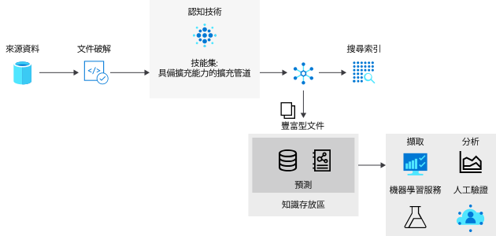

# <a name="introduction-to-knowledge-stores-in-azure-cognitive-search"></a>Azure 認知搜尋中的知識存放區簡介

> [!IMPORTANT] 
> 知識存放區目前為公開預覽狀態。 預覽功能會在沒有服務等級協定的情況下提供，不建議用於生產工作負載。 如需詳細資訊，請參閱 [Microsoft Azure 預覽版增補使用條款](https://azure.microsoft.com/support/legal/preview-supplemental-terms/)。 [REST API 版本 2019-05-06-preview](search-api-preview.md)提供預覽功能。 目前有有限的入口網站支援，而且沒有 .NET SDK 支援。

知識存放區是 Azure 認知搜尋的一項功能，可保存[AI 擴充管線](cognitive-search-concept-intro.md)的輸出，以供日後分析或其他下游處理。 擴充的*檔*是管線的輸出，從使用 AI 程式進行解壓縮、結構化和分析的內容中建立。 在標準 AI 管線中，擴充的檔是暫時性的，只會在編制索引期間使用，然後捨棄。 使用知識存放區時，會保留擴充的檔。 

如果您過去曾使用過認知技能與 Azure 認知搜尋，您已經知道*技能集*透過一連串的擴充來移動檔。 結果可以是搜尋索引，或（此預覽中的新功能）在知識存放區中的投影。 這兩個輸出、搜尋索引和知識存放區會共用相同的內容，但以非常不同的方式儲存和使用。

就實體而言，知識存放區會[Azure 儲存體](https://docs.microsoft.com/azure/storage/common/storage-account-overview)、azure 資料表儲存體、azure Blob 儲存體或兩者。 任何可連線至 Azure 儲存體的工具或程序都可以取用知識存放區的內容。



若要使用知識存放區，請將 `knowledgeStore` 元素新增至索引管線中逐步定義作業的技能集。 在執行期間，Azure 認知搜尋會在您的 Azure 儲存體帳戶中建立空間，並根據您的設定，將擴充的檔投射為 blob 或資料表。

## <a name="benefits-of-knowledge-store"></a>知識存放區的優點

知識存放區可從非結構化及半結構化資料檔案提供您結構、情境和實際的內容，如 Blob、經過分析的映像檔，甚至是重整成新格式的結構化資料。 在[逐步](knowledge-store-howto.md)解說中，您可以看到密集 JSON 檔如何分割成子結構、重組為新結構，以及其他適用于諸如機器學習服務和資料科學等下游進程方面.

雖然查看 AI 擴充管線可以產生的功能很有用，但知識存放區的真正威力在於能夠改變數據。 您可以從基本的技能集開始，然後逐一查看它以增加結構層級的增加，您可以將其合併到新結構中，以在 Azure 認知搜尋以外的其他應用程式中使用。

列舉的知識存放區優點包括：

+ 使用搜尋以外的[分析和報告工具](#tools-and-apps)取用擴充文件。 Power BI 搭配 Power Query 是相當具吸引力的選擇，但可以連線到 Azure 儲存體的任何工具或應用程式都能夠從您所建立的知識存放區提取。

+ 為步驟和技能集定義偵錯的同時，精簡 AI 索引管線。 知識存放區會在 AI 索引管線中為您顯示技能集定義的產品。 您可以使用這些結果來設計更好的技能集，因為您可以看到擴充實際的樣子。 您可以使用 Azure 儲存體中的 [[儲存體總管](https://docs.microsoft.com/azure/vs-azure-tools-storage-manage-with-storage-explorer?tabs=windows)]，檢視知識存放區的內容。

+ 將資料塑造成新的形式。 重整是在技能集中編寫的，但重點是技能集現在可以提供這項功能。 Azure 認知搜尋中的[整形器技能](cognitive-search-skill-shaper.md)已擴充，可配合這項工作。 重整可讓您定義與資料預定用途相符的投影，同時保留關聯性。

> [!Note]
> AI 擴充和認知技能的新手嗎？ Azure 認知搜尋會與認知服務願景和語言功能整合，以使用光學字元辨識（OCR）透過影像檔、實體辨識和從文字檔解壓縮的關鍵字組來解壓縮和擴充來源資料。 如需詳細資訊，請參閱[Azure 認知搜尋中的 AI 擴充](cognitive-search-concept-intro.md)。

## <a name="creating-a-knowledge-store"></a>建立知識存放區

知識存放區是[技能集](cognitive-search-working-with-skillsets.md)的一部分，而後者又是[索引子](search-indexer-overview.md)的一部分。 

在此預覽中，您可以使用 [REST API] 和 [`api-version=2019-05-06-Preview`]，或透過入口網站中的 [匯**入資料**] wizard 來建立知識存放區。

### <a name="json-representation-of-a-knowledge-store"></a>知識存放區的 JSON 標記法

下列 JSON 會指定 `knowledgeStore`，這是技能集的一部分，由索引子所叫用 (未顯示)。 如果您已經熟悉 AI 擴充，技能集會決定每個擴充檔的建立、組織和物質。 技能集至少必須包含一項技能，如果您要 modulating 資料結構，則最有可能是「整形」技能。

`knowledgeStore` 包含連接和投影。 

+ 連接到與 Azure 認知搜尋位於相同區域的儲存體帳戶。 

+ 投影是資料表-物件配對。 `Tables` 在 Azure 資料表儲存體中定義擴充檔的實體運算式。 `Objects` 定義 Azure Blob 儲存體中的實體物件。

```json
{
  "name": "my-new-skillset",
  "description": "Example showing knowledgeStore placement in a skillset.",
  "skills":
  [
    {
    "@odata.type": "#Microsoft.Skills.Util.ShaperSkill",
    "context": "/document/content/phrases/*",
    "inputs": [
        {
        "name": "text",
        "source": "/document/content/phrases/*"
        },
        {
        "name": "sentiment",
        "source": "/document/content/phrases/*/sentiment"
        }
    ],
    "outputs": [
        {
        "name": "output",
        "targetName": "analyzedText"
        }
    ]
    },
  ],
  "cognitiveServices": 
    {
    "@odata.type": "#Microsoft.Azure.Search.CognitiveServicesByKey",
    "description": "mycogsvcs resource in West US 2",
    "key": "<your key goes here>"
    },
  "knowledgeStore": { 
    "storageConnectionString": "<your connection string goes here>", 
    "projections": [ 
        { 
            "tables": [  
            { "tableName": "Reviews", "generatedKeyName": "ReviewId", "source": "/document/Review" , "sourceContext": null, "inputs": []}, 
            { "tableName": "Sentences", "generatedKeyName": "SentenceId", "source": "/document/Review/Sentences/*", "sourceContext": null, "inputs": []}, 
            { "tableName": "KeyPhrases", "generatedKeyName": "KeyPhraseId", "source": "/document/Review/Sentences/*/KeyPhrases", "sourceContext": null, "inputs": []}, 
            { "tableName": "Entities", "generatedKeyName": "EntityId", "source": "/document/Review/Sentences/*/Entities/*" ,"sourceContext": null, "inputs": []} 

            ], 
            "objects": [ 
               
            ]      
        },
        { 
            "tables": [ 
            ], 
            "objects": [ 
                { 
                "storageContainer": "Reviews", 
                "format": "json", 
                "source": "/document/Review", 
                "key": "/document/Review/Id" 
                } 
            ]      
        }        
    ]     
    } 
}
```

### <a name="sources-of-data-for-a-knowledge-store"></a>知識存放區的資料來源

如果知識存放區是來自 AI 擴充管線的輸出，什麼是輸入？ 您想要解壓縮、擴充並最終儲存到知識存放區的原始資料，可能源自搜尋索引子支援的任何 Azure 資料來源： 

* [Azure Cosmos DB](search-howto-index-cosmosdb.md)

* [Azure Blob 儲存體](search-howto-indexing-azure-blob-storage.md)

* [Azure 表格儲存體](search-howto-indexing-azure-tables.md)

* [Azure SQL](search-howto-connecting-azure-sql-database-to-azure-search-using-indexers.md)

您建立的索引子和技能集會將此內容解壓縮並擴充或轉換為索引工作負載的一部分，然後將結果儲存到知識存放區。

### <a name="rest-apis-used-in-creation-of-a-knowledge-store"></a>建立知識存放區時使用的 REST Api

只有兩個 Api 具有建立知識存放區所需的擴充功能（Create 技能集和 Create 索引子）。 其他 Api 則以相同的方式使用。

| Object | REST API | 說明 |
|--------|----------|-------------|
| 資料來源 | [建立資料來源](https://docs.microsoft.com/rest/api/searchservice/create-data-source)  | 一個資源，用以識別提供來源資料以建立擴充文件的外部 Azure 資料來源。  |
| 技能集 | [建立技能集（api 版本 = 2019-05 06-01.5.1-Preview）](https://docs.microsoft.com/rest/api/searchservice/create-skillset)  | 一個資源，在索引編製期間負責對擴充管線中使用的[內建技能](cognitive-search-predefined-skills.md)和[自訂認知技能](cognitive-search-custom-skill-interface.md)協調用法。 技能集有一個 `knowledgeStore` 定義做為子項目。 |
| index | [建立索引](https://docs.microsoft.com/rest/api/searchservice/create-index)  | 表示搜尋索引的架構。 索引中與來源資料中的欄位或在擴充階段產生的欄位 (例如，實體辨識所建立之組織名稱的欄位) 相對應的欄位。 |
| 索引子 | [建立索引子 (api-version=2019-05-06)](https://docs.microsoft.com/rest/api/searchservice/create-skillset)  | 一項資源，用以定義在索引編製期間所使用的元件：包括資料來源、技能集、來源和中繼資料結構與目標索引的欄位關聯性，以及索引本身。 執行索引子是擷取和擴充資料的觸發程序。 輸出是以索引結構描述為基礎、以來源資料填入，並透過技能集進行擴充的搜尋索引。  |

### <a name="physical-composition-of-a-knowledge-store"></a>知識存放區的實體組合

 *投影*是 `knowledgeStore` 定義的元素，闡述輸出的架構和結構，使其符合您的預期用途。 如果您的應用程式使用不同的格式和圖形來取用資料，您可以定義多個投射。 

投影可以表達為物件或資料表：

+ 若是物件，投影會對應至 Blob 儲存體，其中投影會儲存到容器中，在諸如資料科學管線的案例中，JSON 的容器內會有物件或階層式表示法。

+ 若是資料表，投影則會對應至資料表儲存體。 表格式表示法會保留資料分析或匯出等案例的關聯性，作為機器學習的資料框架。 擴充的投影之後就可以輕鬆地匯入到其他資料存放區中。 

您可以在一個知識存放區中建立多個投影，以便在組織中容納各種組成單位。 雖然資料科學家或分析師可能需要由您的技能集所組合的細微或模組化資料結構，但是開發人員可能需要存取擴充文件的完整 JSON 表示法。

例如，如果其中一個擴充程序的目標是也要建立用來定型模型的資料集，將資料投射至物件存放區將會是一種在資料科學管線中使用資料的方法。 或者，如果您想要根據擴充的文件建立快速 Power BI 儀表板，表格式投影將非常適合。

<a name="tools-and-apps"></a>

## <a name="connecting-with-tools-and-apps"></a>使用工具和應用程式進行連接

一旦擴充存在於儲存體之後，連線到 Azure Blob 或資料表儲存體的任何工具或技術都可以用來探索、分析或取用內容。 下列清單是一個起點：

+ [儲存體總管](knowledge-store-view-storage-explorer.md)，可檢視擴充的文件結構及內容。 您可以將此視為基準工具來檢視知識存放區內容。

+ 如果您有數值資料，請[Power BI](knowledge-store-connect-power-bi.md)報表和分析工具。

+ [Azure Data Factory](https://docs.microsoft.com/azure/data-factory/)，用於進一步操作。

## <a name="next-steps"></a>後續步驟

知識存放區提供擴充檔的持續性，在設計技能集時很有用，或建立新結構和內容以供任何能夠存取 Azure 儲存體帳戶的用戶端應用程式使用。

建立擴充檔的最簡單方法是透過 [匯**入資料**] [wizard]，但您也可以使用 Postman 和 REST API，如果您想要深入瞭解如何建立和參考物件，這會更有用。

> [!div class="nextstepaction"]
> [使用入口網站建立知識存放區](knowledge-store-create-portal.md)
> [使用 Postman 和 REST APi 建立知識存放區](knowledge-store-create-rest.md)
