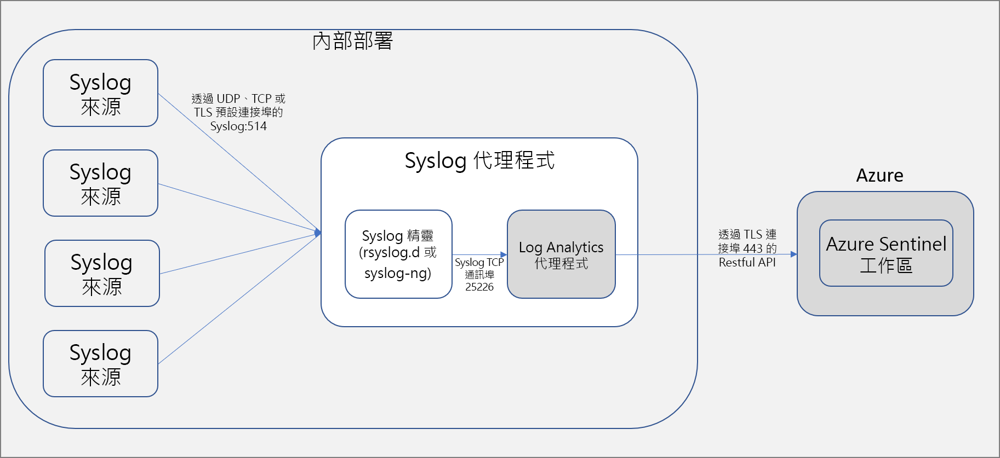

# 使用一般事件格式來連接您的外部解決方案

您可以使用可讓您將記錄檔儲存在 Syslog 中的外部解決方案，連接 Azure Sentinel。 如果您的設備可讓您將記錄儲存為 Syslog 通用事件格式（CEF），與 Azure Sentinel 的整合可讓您輕鬆地跨資料執行分析和查詢。

> [!NOTE] 
> 資料會儲存在您執行 Azure Sentinel 之工作區的地理位置中。

## 運作方式

Azure Sentinel 和 CEF 設備之間的連線會以三個步驟進行：

1. 在設備上，您必須設定這些值，讓應用裝置根據 Microsoft Monitoring Agent，將必要的記錄檔傳送至 Azure Sentinel Syslog 代理程式。 您可以在應用裝置中修改這些參數，只要您也在 Azure Sentinel 代理程式上的 Syslog daemon 中加以修改即可。
    - 通訊協定 = UDP
    - 埠 = 514
    - 設備 = Local4
    - 格式 = CEF
2. Syslog 代理程式會收集資料，並安全地將它傳送至 Log Analytics，並在其中進行剖析和擴充。
3. 代理程式會將資料儲存在 Log Analytics 工作區中，以便視需要查詢、流量分析、相互關聯規則和儀表板。

> [!NOTE]
> 代理程式可以從多個來源收集記錄，但必須安裝在專用電腦上。

 

或者，您可以透過手動方式在現有的 Azure VM、在另一個雲端中的 VM 或在內部部署機器上部署代理程式。 

 

## 安全性考量

請務必根據貴組織的安全性原則來設定電腦的安全性。 例如，您可以設定您的網路以配合公司網路安全性原則，並變更背景程式中的埠和通訊協定，以符合您的需求。 您可以使用下列指示來改善您的電腦安全性性設定：  [Azure 中的安全 VM](../virtual-machines/linux/security-policy.md)、[網路安全性的最佳作法](../security/fundamentals/network-best-practices.md)。

若要在安全性解決方案和 Syslog 電腦之間使用 TLS 通訊，您必須設定 Syslog daemon （rsyslog 或 Syslog-ng）以在 TLS 中進行通訊：[使用 tls rsyslog 來加密 Syslog 流量](https://www.rsyslog.com/doc/v8-stable/tutorials/tls_cert_summary.html)，[使用 tls-Syslog-ng 加密記錄檔訊息](https://support.oneidentity.com/technical-documents/syslog-ng-open-source-edition/3.22/administration-guide/60#TOPIC-1209298)。

## 步驟 1:設定 Syslog VM

您需要在專用的 Linux 機器（VM 或內部部署）上部署代理程式，以支援設備與 Azure Sentinel 之間的通訊。 

> [!NOTE]
> 請務必根據貴組織的安全性原則來設定電腦的安全性。 例如，您可以設定您的網路以配合公司網路安全性原則，並變更背景程式中的埠和通訊協定，以符合您的需求。 

1. 在 Azure Sentinel 入口網站中，按一下 [**資料連線器**]，然後選取 **[一般事件格式（CEF）** ]，然後**開啟 [連接器] 頁面**。 

1. 在 **[下載並安裝 Syslog 代理程式**] 底下，選取 [Azure] 或 [內部部署] 電腦類型。 
1. 在開啟的 [**虛擬機器**] 畫面中，選取您要使用的機器，然後按一下 [連線 **]** 。
1. 如果您選擇 [**下載並安裝 Azure Linux 虛擬機器的代理程式**]，請選取該機器，然後按一下 [連線 **]** 。 如果您選擇 [**下載並安裝非 Azure Linux 虛擬機器的代理程式**]，請在 [**直接代理程式**] 畫面中，執行 [**下載並上架代理程式**] 底下的腳本。
1. 在 [CEF 連接器] 畫面的 [**設定並轉寄 Syslog**] 底下，設定 syslog daemon 為**rsyslog**或**syslog-ng**。 
1. 複製這些命令，並在您的應用裝置上執行：
    - 如果您已選取 [rsyslog]：
              
       1. 告訴 Syslog 守護程式在設備 local_4 上接聽，並使用埠25226將 Syslog 訊息傳送至 Azure Sentinel 代理程式。 `sudo bash -c "printf 'local4.debug  @127.0.0.1:25226' > /etc/rsyslog.d/security-config-omsagent.conf"`
            
       2. 下載並安裝[security_events 設定檔](https://aka.ms/asi-syslog-config-file-linux)，將 Syslog 代理程式設定為在埠25226上接聽。 `sudo wget -O /etc/opt/microsoft/omsagent/{0}/conf/omsagent.d/security_events.conf "https://aka.ms/syslog-config-file-linux"`其中{0}應該取代為您的工作區 GUID。
            
       1. 重新開機 syslog daemon`sudo service rsyslog restart`  如需詳細資訊，請參閱[rsyslog 檔](https://www.rsyslog.com/doc/v8-stable/tutorials/tls_cert_summary.html)
           
    - 如果您選取 syslog-ng：
       1. 告訴 Syslog 守護程式在設備 local_4 上接聽，並使用埠25226將 Syslog 訊息傳送至 Azure Sentinel 代理程式。 `sudo bash -c "printf 'filter f_local4_oms { facility(local4); };\n  destination security_oms { tcp(\"127.0.0.1\" port(25226)); };\n  log { source(src); filter(f_local4_oms); destination(security_oms); };' > /etc/syslog-ng/security-config-omsagent.conf"`
       2. 下載並安裝[security_events 設定檔](https://aka.ms/asi-syslog-config-file-linux)，將 Syslog 代理程式設定為在埠25226上接聽。 `sudo wget -O /etc/opt/microsoft/omsagent/{0}/conf/omsagent.d/security_events.conf "https://aka.ms/syslog-config-file-linux"`其中{0}應該取代為您的工作區 GUID。

        3. 重新開機 syslog daemon`sudo service syslog-ng restart`  如需詳細資訊，請參閱[syslog-ng 檔](https://www.syslog-ng.com/technical-documents/doc/syslog-ng-open-source-edition/3.16/mutual-authentication-using-tls/2)
1. 使用此命令重新開機 Syslog 代理程式：`sudo /opt/microsoft/omsagent/bin/service_control restart [{workspace GUID}]`
1. 執行下列命令，確認代理程式記錄檔中沒有任何錯誤：`tail /var/opt/microsoft/omsagent/log/omsagent.log`

若要在 Log Analytics 中針對 CEF 事件使用相關的架構，請`CommonSecurityLog`搜尋。

## 步驟 2:將通用事件格式（CEF）記錄轉送到 Syslog 代理程式

設定您的安全性解決方案，以 CEF 格式將 Syslog 訊息傳送到 Syslog 代理程式。 請確定您使用的是代理程式設定中所顯示的相同參數。 這些通常是：

- 埠514
- 設施 local4

## 步驟 3：驗證連線能力

可能需要20分鐘的時間，您的記錄才會開始出現在 Log Analytics 中。 

1. 請確定您使用的是正確的設備。 設備和 Azure Sentinel 中的設備必須相同。 您可以在 Azure Sentinel 中檢查您所使用的設施檔案，並在檔案中`security-config-omsagent.conf`加以修改。 

2. 請確定您的記錄檔會到達 Syslog 代理程式中的正確埠。 在 Syslog 代理程式電腦上執行此命令：`tcpdump -A -ni any  port 514 -vv`此命令會顯示從裝置串流到 Syslog 電腦的記錄。 請確定已從正確埠和適當設施的來源應用裝置接收記錄。

3. 請確定您傳送的記錄符合[RFC 3164](https://tools.ietf.org/html/rfc3164)。

4. 在執行 Syslog 代理程式的電腦上，使用命令`netstat -a -n:`確定這些埠514、25226已開啟且正在接聽。 如需使用此命令的詳細資訊，請參閱[netstat （8）-Linux man 頁面](https://linux.die.net/man/8/netstat)。 如果接聽正常，您會看到：

    

5. 請確定守護程式已設定為在您要傳送記錄的埠514上接聽。
    - 針對 rsyslog： 請確定`/etc/rsyslog.conf`檔案包含下列設定：

           # provides UDP syslog reception
           module(load="imudp")
           input(type="imudp" port="514")
        
           # provides TCP syslog reception
           module(load="imtcp")
           input(type="imtcp" port="514")

      如需詳細資訊， [請參閱 imudp：UDP Syslog 輸入模組](https://www.rsyslog.com/doc/v8-stable/configuration/modules/imudp.html#imudp-udp-syslog-input-module)和[imtcp：TCP Syslog 輸入模組](https://www.rsyslog.com/doc/v8-stable/configuration/modules/imtcp.html#imtcp-tcp-syslog-input-module)

   - 針對 syslog-ng： 請確定`/etc/syslog-ng/syslog-ng.conf`檔案包含下列設定：

           # source s_network {
            network( transport(UDP) port(514));
             };
     如需詳細資訊，請參閱[syslog-Ng 開放原始碼版本 3.16-系統管理指南](https://www.syslog-ng.com/technical-documents/doc/syslog-ng-open-source-edition/3.16/administration-guide/19#TOPIC-956455)。

1. 檢查 Syslog daemon 和代理程式之間是否有通訊。 在 Syslog 代理程式電腦上執行此命令：`tcpdump -A -ni any  port 25226 -vv`此命令會顯示從裝置串流到 Syslog 電腦的記錄。 請確定代理程式上也收到記錄。

6. 如果這兩個命令都提供成功的結果，請檢查 Log Analytics，以查看您的記錄是否到達。 所有從這些設備串流的事件都會以原始格式顯示在 Log `CommonSecurityLog` Analytics 的 [類型] 之下。

7. 若要檢查是否有錯誤，或記錄檔未抵達，請查看`tail /var/opt/microsoft/omsagent/<workspace id>/log/omsagent.log`。 如果出現記錄檔格式不符的錯誤，請移至`/etc/opt/microsoft/omsagent/{0}/conf/omsagent.d/security_events.conf "https://aka.ms/syslog-config-file-linux"`並查看`security_events.conf`檔案，並確定您的記錄檔符合您在此檔案中看到的 RegEx 格式。

8. 請確定您的 Syslog 訊息預設大小限制為2048個位元組（2 KB）。 如果記錄太長，請使用此命令來更新 security_events： `message_length_limit 4096`

## 後續步驟
在本檔中，您已瞭解如何將 CEF 設備連線到 Azure Sentinel。 若要深入了解 Azure Sentinel，請參閱下列文章：
- 瞭解如何[查看您的資料和潛在威脅](quickstart-get-visibility.md)。
- 開始[使用 Azure Sentinel 偵測威脅](tutorial-detect-threats-built-in.md)。

