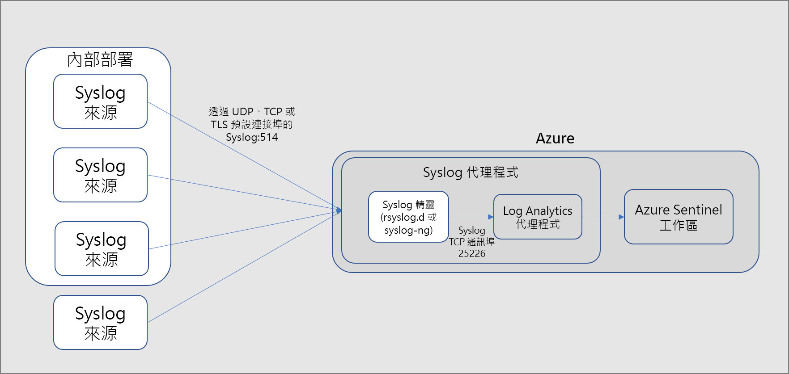

# 連線資料來源

> [!IMPORTANT]
> Azure Sentinel 目前為公開預覽狀態。
> 此預覽版本是在沒有服務等級協定的情況下提供，不建議用於生產工作負載。 可能不支援特定功能，或可能已經限制功能。 如需詳細資訊，請參閱 [Microsoft Azure 預覽版增補使用條款](https://azure.microsoft.com/support/legal/preview-supplemental-terms/)。

若要將 Azure Sentinel 上架，必須先連線到資料來源。 Azure Sentinel 隨附多種適用於 Microsoft 解決方案的連接器，現成可用且提供即時整合，包括 Microsoft 威脅防護解決方案與 Microsoft 365 來源，例如 Office 365、Azure AD、Azure ATP 和 Microsoft Cloud App Security 等等。 此外，還有適用於非 Microsoft 解決方案的內建連接器，用於連線至更廣泛的安全性生態系統。 您也可以使用常見事件格式 (Syslog 或 REST API) 來連線資料來源與 Azure Sentinel。  

1. 在功能表上，選取 [資料連接器]  。 此頁面可讓您查看 Azure Sentinel 提供的連接器完整清單及其狀態。 選取您想要連線的連接器，然後選取 [開啟連接器頁面]  。 

   

1. 在特定連接器頁面上，確定您已符合所有必要條件，並遵循指示將資料連線到 Azure Sentinel。 可能需要一些時間，記錄才能開始與 Azure Sentinel 同步處理。 連線之後，您會在 [接收的資料]  圖表中看見資料摘要，以及資料類型的連線狀態。

   
  
1. 按一下 [後續步驟]  索引標籤，以取得 Azure Sentinel 針對特定資料類型提供的立即可用內容清單。

   
 

## 資料連線方法

Azure Sentinel 支援下列資料連線方法：

- **Microsoft 服務**：  Microsoft 服務會以原生方式連線，並運用 Azure 基礎進行立即整合，只需按幾下就可以與下列解決方案連線：
    - [Office 365](connect-office-365.md)
    - [Azure AD 稽核記錄和登入](connect-azure-active-directory.md)
    - [Azure 活動](connect-azure-activity.md)
    - [Azure AD Identity Protection](connect-azure-ad-Identity-protection.md)
    - [Azure 資訊安全中心](connect-azure-security-center.md)
    - [Azure 資訊保護](connect-azure-information-protection.md)
    - [Azure 進階威脅防護](connect-azure-atp.md)
    - [Cloud App Security](connect-cloud-app-security.md)
    - [Windows 安全性事件](connect-windows-security-events.md) 
    - [Windows 防火牆](connect-windows-firewall.md)

- **透過 API 連線的外部解決方案**：某些資料來源會使用自身提供的 API 進行連線。 一般而言，大部分的安全性技術都會提供一組 API，藉此來擷取事件記錄。API 可連線到 Azure Sentinel 並收集特定資料類型，然後將其傳送至 Azure Log Analytics。 透過 API 連線的設備包括：
    - [Barracuda](connect-barracuda.md)
    - [Symantec](connect-symantec.md)
- **透過代理程式連線的外部解決方案**：透過代理程式，Azure Sentinel 可以連線到所有其他使用 Syslog 通訊協定執行即時記錄串流的資料來源。  大部分設備會使用 Syslog 通訊協定來傳送事件訊息，包含記錄本身和記錄的相關資料。 記錄的格式並不相同，但大部分的設備都支援常見事件格式 (CEF) 標準。  Azure Sentinel 代理程式以 Microsoft Monitoring Agent 作為基礎，可將 CEF 格式的記錄轉換成 Log Analytics 可擷取的格式。 根據不同設備類型，代理程式可能會直接安裝在設備上，或安裝在專用的 Linux 伺服器上。 適用於 Linux 的代理程式會透過 UDP 從 Syslog 精靈接收事件，但如果預期 Linux 機器會收集大量的 Syslog 事件，則會透過 TCP 將事件從 Syslog 精靈傳送到代理程式，然後從該處傳送至 Log Analytics。
    - 防火牆、Proxy 和端點：
        - [F5](connect-f5.md)
        - [Check Point](connect-checkpoint.md)
        - [Cisco ASA](connect-cisco.md)
        - [Fortinet](connect-fortinet.md)
        - [Palo Alto](connect-paloalto.md)
        - [其他 CEF 設備](connect-common-event-format.md)
        - [其他 Syslog 設備](connect-syslog.md)
    - DLP 解決方案
    - [威脅情報提供者](connect-threat-intelligence.md)
    - [DNS 機器](connect-dns.md) - 直接在 DNS 機器上安裝代理程式
    - Linux 伺服器
    - 其他雲端
    
## 代理程式連接選項

若要將外部設備連接至 Azure Sentinel，代理程式必須部署在專用的機器上 (VM 或內部部署裝置)，才能支援設備與 Azure Sentinel 之間的通訊。 您可以透過自動或手動來部署代理程式。 只有當您的專用機器是在 Azure 中建立的新 VM 時，才能使用自動部署。 

或者，您可以透過手動方式在現有的 Azure VM、在另一個雲端中的 VM 或在內部部署機器上部署代理程式。

## 後續步驟

- 若要開始使用 Azure Sentinel，您需要 Microsoft Azure 訂用帳戶。 如果您沒有訂用帳戶，可以註冊[免費試用](https://azure.microsoft.com/free/)。
- 了解如何[將資料上架到 Azure Sentinel](quickstart-onboard.md)，並[掌握您的資料和潛在威脅](quickstart-get-visibility.md)。
