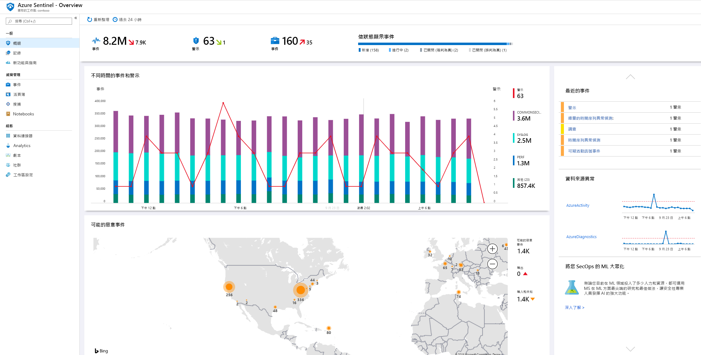

# 快速入門：開始使用 Azure Sentinel

在本快速入門中，您將了解如何使用 Azure Sentinel 快速檢視和監視您的環境中發生什麼情況。 在您將資料來源連線到 Azure Sentinel 之後，您會取得即時視覺效果和分析資料，讓您得知所有已連線的資料來源發生什麼情況。 Azure Sentinel 的活頁簿可為您提供 Azure 中已經可用工具的完整功能，以及可供分析記錄和查詢的內建資料表和圖表。 您可以使用內建活頁簿，或輕鬆地建立新活頁簿 (從頭開始或根據現有的活頁簿)。 

## 取得視覺效果

若要將您的環境狀況視覺化並取得其分析，首先，請先查看概觀儀表板，以了解貴組織的安全性現況。 您可以按一下這些圖格的每個元素，向下切入至其建立來源的未經處理資料。 為了協助您減少雜訊並盡可能減少您必須檢閱和調查的警示數目，Azure Sentinel 使用融合技巧讓警示相互關聯成為事件。 **事件**是一組相關警示，可一起建立可操作的事件，以便您進行調查並予以解決。

- 在 Azure 入口網站中，選取 Azure Sentinel，然後選取您想要監視的工作區。

  

- 位於頂端的工具列會告知您在所選的這段期間內取得的事件數目，並將其與前 24 小時比較。 此工具列會告知您從這些事件所觸發的警示 (小數字代表過去 24 小時內的變更)，然後告知您這些事件有多少已開啟、進行中和已關閉的警示。 請查看事件數目是否大幅提高或下降。 如果下降，則可能是連線停止向 Azure Sentinel 回報。 如果增加，則可能發生可疑的情況。 查看您是否有新的警示。

   

[概觀] 頁面的主體讓您能夠快速概覽工作區的安全性狀態：

- **一段時間的事件和警示**：列出事件數目，以及從這些事件建立了多少個警示。 如果您看到不尋常的尖峰，則應查看其警示 - 如果有事件尖峰但未看到警示的不尋常情況，有可能是值得關注的原因。

- **潛在惡意事件**：從已知為惡意的來源偵測到流量時，Azure Sentinel 會在地圖上對您提出警示。 如果看到橘色，就是輸入流量：有人正從已知的惡意 IP 位址嘗試存取貴組織。 如果看到輸出 (紅色) 活動，則表示您網路中的資料正從貴組織串流到已知的惡意 IP 位址。

   

- **最近的事件**：可檢視近期事件、其嚴重性和事件相關警示的數目。 如果您看到特定警示類型突然出現尖峰，這可能表示目前有作用中的攻擊正在進行。 比方說，如果突然出現 20 個來自 Azure ATP 的雜湊傳遞事件，則可能是有人目前正試圖攻擊您。

- **資料來源異常**：Microsoft 的資料分析師建立了一些模型，這些模型會不斷地在您資料來源的資料中搜尋異常情況。 如果沒有任何異常狀況，則不會顯示任何內容。 如果偵測到異常，您應該深入探討這些異常以查看發生什麼情況。 例如，按一下 Azure 活動中的尖峰。 您可以按一下 [圖表]  來查看何時發生尖峰，然後篩選在那段期間發生的活動，以了解造成尖峰的原因。

   

## 使用內建活頁簿

內建活頁簿會從已連線的資料來源提供整合式資料，讓您深入探討這些服務中所產生的事件。 內建活頁簿包含 Azure AD、Azure 活動事件和內部部署資料，該資料可以是來自伺服器、來自第一方警示、來自任何第三方 (包括防火牆流量記錄、Office 365 和以 Windows 為基礎的不安全通訊協定) 的 Windows 事件資料。 活頁簿是以 Azure 監視器活頁簿為基礎，可讓您在設計自己的活頁簿時使用增強的自訂功能和彈性。 如需詳細資訊，請參閱[活頁簿](../azure-monitor/app/usage-workbooks.md)。

1. 在 [設定]  之下，選取 [活頁簿]  。 在 [已安裝]  之下，您可以看到所有已安裝的活頁簿。 在 [全部]  底下，您可以看到可供安裝的完整內建活頁簿資源庫。 
2. 搜尋特定活頁簿，以查看所提供功能的完整清單和描述。 
3. 假設您使用 Azure AD 來啟動並執行 Azure Sentinel，我們建議您至少安裝下列活頁簿：
   - **Azure AD**：使用下列其中一項或兩項：
       - **Azure AD 登入**會分析一段時間的登入，以查看是否有異常。 此活頁簿會依照應用程式、裝置和位置提供失敗的登入，讓您能夠一眼就注意到有異常情況發生。 請注意多個失敗登入。 
       - **Azure AD 稽核記錄**可分析系統管理活動，例如使用者變更 (新增、移除等等)、群組建立及修改。  

   - 為您的防火牆新增活頁簿。 例如，新增 Palo Alto 活頁簿。 此活頁簿可分析防火牆流量，提供防火牆資料與威脅事件之間的相互關聯，以及醒目提示各實體的可疑事件。 活頁簿會提供您的流量趨勢相關資訊，並且讓您向下切入及篩選結果。 

      

您可藉由編輯主要查詢來自訂活頁簿。 您可以按一下按鈕前往 [Log Analytics 來編輯查詢](../azure-monitor/log-query/get-started-portal.md)，而且可以選取省略符號 (...) 並選取 [自訂圖格資料]  ，這可讓您編輯主要時間篩選器，或從活頁簿中移除特定圖格。

如需使用查詢的詳細資訊，請參閱[教學課程︰Log Analytics 中的視覺化資料](../azure-monitor/learn/tutorial-logs-dashboards.md)

### 新增圖格

如果您想要新增圖格，則可將它新增至現有活頁簿 (您所建立的活頁簿或 Azure Sentinel 內建活頁簿)。 
1. 在 Log Analytics 中，使用[教學課程：Log Analytics 中的視覺化資料](../azure-monitor/learn/tutorial-logs-dashboards.md)中的指示建立圖格。 
2. 建立圖格之後，在 [釘選]  之下，選取您希望出現圖格的活頁簿。

## 建立新活頁簿
您可以從頭開始建立新的活頁簿，或使用內建活頁簿作為新活頁簿的基礎。

1. 若要從頭開始建立新的活頁簿，請依序選取 [活頁簿]  和 [+新增活頁簿]  。
2. 選取活頁簿建立所在的訂用帳戶，並為它提供描述性名稱。 每個活頁簿都是一項 Azure 資源，您可以指派其角色 (RBAC) 來定義及限制可以存取的人員。 
3. 若要讓它顯示在您要釘選視覺效果的活頁簿中，您必須共用它。 按一下 [共用]  ，然後按一下 [管理使用者]  。 
 
1. 如同處理任何其他 Azure 資源一樣，使用 [檢查存取權]  和 [角色指派]  。 如需詳細資訊，請參閱[使用 RBAC 共用 Azure 活頁簿](../azure-portal/azure-portal-dashboard-share-access.md)。

## 新的活頁簿範例

下列範例查詢可讓您比較各週的流量趨勢。 您可以輕鬆地切換您執行查詢的裝置廠商和資料來源。 此範例使用來自 Windows 的 SecurityEvent，您可以將它切換成對任何其他防火牆上的 AzureActivity 或 CommonSecurityLog 執行。

     |where DeviceVendor == "Palo Alto Networks":
      // week over week query
      SecurityEvent
      | where TimeGenerated > ago(14d)
      | summarize count() by bin(TimeGenerated, 1d)
      | extend Week = iff(TimeGenerated>ago(7d), "This Week", "Last Week"), TimeGenerated = iff(TimeGenerated>ago(7d), TimeGenerated, TimeGenerated + 7d)

您可能想建立一項查詢，其中併入多個來源的資料。 您可以建立查詢，以查看剛針對新使用者建立的 Azure Active Directory 稽核記錄，然後檢查您的 Azure 記錄，查看使用者是否在建立的 24 小時內開始進行角色指派變更。 此儀表板會顯示該可疑的活動：

    AuditLogs
    | where OperationName == "Add user"
    | project AddedTime = TimeGenerated, user = tostring(TargetResources[0].userPrincipalName)
    | join (AzureActivity
    | where OperationName == "Create role assignment"
    | project OperationName, RoleAssignmentTime = TimeGenerated, user = Caller) on user
    | project-away user1

您可以根據查看資料的人員角色及其查看的內容，建立不同的活頁簿。 比方說，您可為網路管理員建立包含防火牆資料的活頁簿。 您也可以根據您想要查看的頻率來建立活頁簿：是否有您想要每天檢閱的項目，以及您想要每小時檢查一次的其他項目，例如，您可能想要每小時查看您的 Azure AD 登入以搜尋異常情況。 

## 建立新的偵測

在[資料來源連接到 Azure 的 Sentinel](connect-data-sources.md)上產生偵測，以調查貴組織中的威脅。

當您建立新的偵測時，利用 Microsoft 安全性研究人員鎖建立的內建偵測，其已針對您連線的資料來源量身訂製。

若要檢視所有現成的偵測，請依序移至 [分析]  和 [規則範本]  。 此索引標籤包含所有 Azure Sentinel 內建規則。

   

如需有關如何取得現成偵測的詳細資訊，請參閱[教學課程：取得內建分析](tutorial-detect-threats-built-in.md)。
 
## 後續步驟
在此快速入門中，您已了解如何開始使用 Azure Sentinel。 繼續進行教學課程以了解[如何偵測威脅](tutorial-detect-threats-built-in.md)。
> [!div class="nextstepaction"]
> [建立自訂威脅偵測規則](tutorial-detect-threats-custom.md)，將您對威脅的回應自動化。

