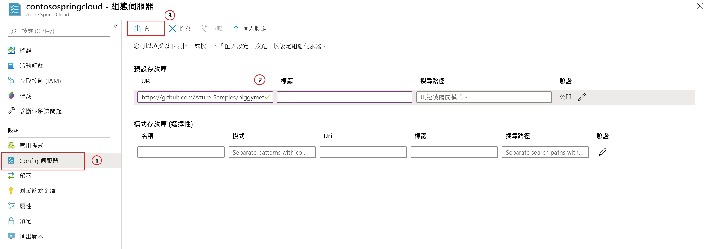

# <a name="quickstart-launch-an-azure-spring-cloud-app-using-the-maven-plug-in"></a>快速入門：使用 Maven 外掛程式啟動 Azure Spring Cloud 應用程式

您可以使用 Azure Spring Cloud 的 Maven 外掛程式，輕鬆地建立及更新 Azure Spring Cloud 應用程式。 藉由預先定義設定，您可以將應用程式部署到現有 Azure Spring Cloud 服務。 在此文章中，您將使用稱為 PiggyMetrics 的範例應用程式來示範此功能。

透過遵循本快速入門，您將能了解如何：

> [!div class="checklist"]
> * 佈建服務執行個體
> * 設定執行個體的設定伺服器
> * 在本機複製並建置微服務應用程式
> * 部署每個微服務
> * 為您的應用程式指派公用端點

>[!Note]
> Azure Spring Cloud 目前提供公開預覽版。 公開預覽版供應項目可讓客戶在其正式發行前，先試驗新功能。  公開預覽功能和服務不適用於生產環境。  如需有關預覽期間支援的詳細資訊，請參閱我們的[常見問題集](https://azure.microsoft.com/support/faq/)或提出[支援要求](https://docs.microsoft.com/azure/azure-supportability/how-to-create-azure-support-request)以深入了解。


>[!TIP]
> Azure Cloud Shell 是免費的互動式 Shell，可讓您用來執行本文中的命令。 其中已預先安裝常用的 Azure 工具，包括 Git、Java 開發套件 (JDK)、Maven 和 Azure CLI 的最新版本。 如果您已登入 Azure 訂用帳戶，請啟動 [Azure Cloud Shell](https://shell.azure.com)。 如需詳細資訊，請參閱 [Azure Cloud Shell 概觀](../cloud-shell/overview.md)。

若要完成本快速入門：

1. [安裝 Git](https://git-scm.com/)。
2. [安裝 JDK 8](https://docs.microsoft.com/java/azure/jdk/?view=azure-java-stable)。
3. [安裝 Maven 3.0 或更新版本](https://maven.apache.org/download.cgi)。
4. [註冊免費的 Azure 訂用帳戶](https://azure.microsoft.com/free/)。

## <a name="provision-a-service-instance-on-the-azure-portal"></a>在 Azure 入口網站上佈建服務執行個體

1. 在網頁瀏覽器中，開啟 [Azure 入口網站中 Azure Spring Cloud 的這個連結](https://ms.portal.azure.com/#create/Microsoft.AppPlatform)，並登入您的帳戶。

1. 提供範例應用程式的**專案詳細資料**，如下所示：

    1. 選取將與應用程式建立關聯的 [訂用帳戶]  。
    1. 選取或建立應用程式的資源群組。 建議您建立新的資源群組。  下列範例顯示一個名為 `myspringservice` 的新資源群組。
    1. 為新的 Azure Spring Cloud 服務提供一個名稱。  名稱長度必須為 4 到 32 個字元，且只能包含小寫字母、數字及連字號。 服務名稱的第一個字元必須是字母，且最後一個字元必須是字母或數字。  下列範例中服務的名稱為 `contosospringcloud`。
    1. 從提供的選項中選取您應用程式的位置。  在此範例中，我們選取 `East US`。
    1. 選取 [檢閱 + 建立]  來檢閱新服務的摘要。  如果一切看起來都正確，請選取 [建立]  。

    > [!div class="mx-imgBorder"]
    > ![選取 [檢閱 + 建立]](media/maven-qs-review-create.jpg)

部署服務需要約 5 分鐘。 部署服務之後，選取 [前往資源]  ，服務執行個體的 [概觀]  頁面隨即出現。

## <a name="set-up-your-configuration-server"></a>設定您的設定伺服器

1. 在服務的 [概觀]  頁面上選取 [設定伺服器]  。
1. 在 [預設存放庫]  區段中，將 [URI]  設定為 **https://github.com/Azure-Samples/piggymetrics** ，將 [標籤]  設定為 **config**，然後選取 [套用]  以儲存變更。

    > [!div class="mx-imgBorder"]
    > 

## <a name="clone-and-build-the-sample-application-repository"></a>複製並建置範例應用程式存放庫

1. 啟動 [Azure Cloud Shell](https://shell.azure.com)。

1. 執行下列命令以複製 Git 存放庫：

    ```azurecli
    git clone https://github.com/Azure-Samples/PiggyMetrics
    ```
  
1. 變更目錄，並執行下列命令來建置專案：

    ```azurecli
    cd piggymetrics
    mvn clean package -DskipTests
    ```

## <a name="generate-configurations-and-deploy-to-the-azure-spring-cloud"></a>產生設定並部署至 Azure Spring Cloud

1. 在包含父系 POM 的 PiggyMetrics 根資料夾中執行下列命令，以產生設定：

    ```azurecli
    mvn com.microsoft.azure:azure-spring-cloud-maven-plugin:1.0.0:config
    ```

    a. 選取模組 `gateway`、`auth-service` 和 `account-service`。

    b. 選取您的訂用帳戶和 Azure Spring Cloud 服務叢集。

    c. 從提供的專案清單中，輸入與 `gateway` 相對應的數字，以授與公用存取權。
    
    d. 確認設定。

1. POM 現在包含外掛程式相依性和設定。 使用下列命令部署應用程式：

   ```azurecli
   mvn azure-spring-cloud:deploy
   ```

1. 部署完成後，您可以使用上述命令輸出中提供的 URL 存取 PiggyMetrics。

## <a name="next-steps"></a>後續步驟

在本快速入門中，您已經從 Maven 存放庫部署 Spring Cloud 應用程式。 若要深入了解 Azure Spring Cloud，請繼續進行準備應用程式以進行部署的教學課程。

> [!div class="nextstepaction"]
> [準備您的 Azure Spring Cloud 應用程式以進行部署](spring-cloud-tutorial-prepare-app-deployment.md)
> [深入了解適用於 Azure 的 Maven 外掛程式](https://github.com/microsoft/azure-maven-plugin)
