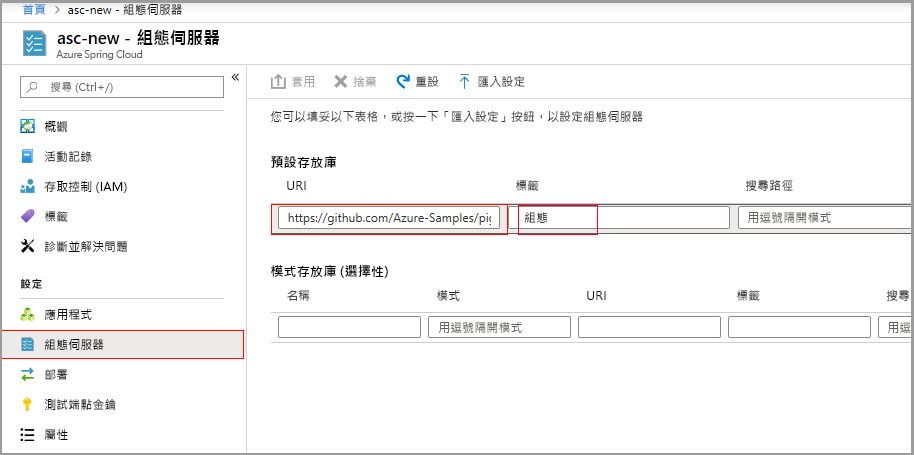

# <a name="quickstart-launch-an-azure-spring-cloud-application-using-the-azure-portal"></a>快速入門：使用 Azure 入口網站來啟動 Azure Spring Cloud 應用程式

Azure Spring Cloud 可讓您輕鬆地在 Azure 上執行以 Spring Cloud 為基礎的微服務應用程式。

本快速入門會示範如何將現有的 Spring Cloud 應用程式部署到 Azure。  您可以在我們的 [GitHub 範例存放庫](https://github.com/Azure-Samples/PiggyMetrics)中找到本教學課程中使用的範例應用程式程式碼。 當您完成時，所提供的範例應用程式將可在線上存取，並可透過 Azure 入口網站來管理。

透過遵循本快速入門，您將能了解如何：

> [!div class="checklist"]
> * 佈建服務執行個體
> * 設定執行個體的設定伺服器
> * 於本機建置微服務應用程式
> * 部署每個微服務
> * 為您的應用程式指派公用端點

## <a name="prerequisites"></a>必要條件

>[!Note]
> Azure Spring Cloud 目前提供公開預覽版。 公開預覽版供應項目可讓客戶在其正式發行前，先試驗新功能。  公開預覽功能和服務不適用於生產環境。  如需有關預覽期間支援的詳細資訊，請參閱我們的[常見問題集](https://azure.microsoft.com/support/faq/)或提出[支援要求](https://docs.microsoft.com/azure/azure-supportability/how-to-create-azure-support-request)以深入了解。

>[!TIP]
> Azure Cloud Shell 是免費的互動式 Shell，可讓您用來執行本文中的步驟。  它已預先安裝常用的 Azure 工具，包括 Git、JDK、Maven 和 Azure CLI 的最新版本。 如果您已登入 Azure 訂用帳戶，請從 shell.azure.com 啟動您的 [Azure Cloud Shell](https://shell.azure.com) \(英文\)。  您可以[閱讀我們的文件](../cloud-shell/overview.md)，以深入了解 Azure Cloud Shell

若要完成本快速入門：

1. [安裝 Git](https://git-scm.com/)
2. [安裝 JDK 8](https://docs.microsoft.com/java/azure/jdk/?view=azure-java-stable)
3. [安裝 Maven 3.0 或更新版本](https://maven.apache.org/download.cgi) \(英文\)
4. [安裝 Azure CLI 2.0.67 版或更新版本](https://docs.microsoft.com/cli/azure/install-azure-cli?view=azure-cli-latest)
5. [註冊 Azure 訂用帳戶](https://azure.microsoft.com/free/)

## <a name="install-the-azure-cli-extension"></a>安裝 Azure CLI 擴充功能

使用下列命令安裝適用於 Azure CLI 的 Azure Spring Cloud 擴充功能

```Azure CLI
az extension add --name spring-cloud
```

## <a name="provision-a-service-instance-on-the-azure-portal"></a>在 Azure 入口網站上佈建服務執行個體

1. 在網頁瀏覽器中，開啟 [Azure 入口網站中 Azure Spring Cloud 的這個連結](https://ms.portal.azure.com/#create/Microsoft.AppPlatform)。

1. 填寫 Azure Spring Cloud [建立]  頁面上的表單。  請參考下列指引：
    - 服務名稱：指定您服務執行個體的名稱。  名稱長度必須為 4 到 32 個字元，且只能包含小寫字母、數字及連字號。  服務名稱的第一個字元必須是字母，且最後一個字元必須是字母或數字。
    - 訂用帳戶：選取您想要用來支付此資源費用的訂用帳戶。  請確定此訂用帳戶已新增至我們的 Azure Spring Cloud 允許清單。
    - 資源群組：為新資源建立新資源群組是最佳做法。
    - 位置：選取您服務執行個體的位置。 目前支援的位置包括美國東部、美國西部 2、歐洲西部和東南亞。

1. 按一下 [檢閱及建立]  。

1. 確認規格，然後按一下 [建立]  。

部署服務需要約 5 分鐘。  一旦部署之後，服務執行個體的 [概觀]  頁面隨即出現。

## <a name="set-up-your-configuration-server"></a>設定您的設定伺服器

1. 移至服務 [概觀]  頁面並選取 [設定伺服器]  。

1. 在 [預設存放庫]  區段中，將 [URI]  設定為 "https\://github.com/Azure-Samples/piggymetrics"、將 [標籤]  設定為 "config"，然後選取 [套用]  以儲存變更。

    

## <a name="build-and-deploy-microservice-applications"></a>建置並部署微服務應用程式

1. 開啟 [Azure Cloudshell](https://shell.azure.com)，並將範例應用程式存放庫複製到本機電腦。  在這裡，我們會先建立一個名為 `source-code` 的暫存目錄，然後再複製應用程式。

    ```azurecli
    mkdir source-code
    cd source-code
    git clone https://github.com/Azure-Samples/piggymetrics
    ```

1. 建置複製的封裝。

    ```azurecli
    cd piggymetrics
    mvn clean package -DskipTests
    ```
1. 將名稱指派給您的資源群組和服務。 務必將下列預留位置取代為您稍早在本教學課程中所佈建的資源群組名稱和服務名稱。

    ```azurecli
    az configure --defaults group=<resource group name>
    az configure --defaults spring-cloud=<service instance name>
    ```

1. 建立 `gateway` 應用程式並部署 JAR 檔案。

    ```azurecli
    az spring-cloud app create -n gateway
    az spring-cloud app deploy -n gateway --jar-path ./gateway/target/gateway.jar
    ```

1. 遵循相同的模式來建立 `account-service` 和 `auth-service` 應用程式，並部署它們的 JAR 檔案。

    ```azurecli
    az spring-cloud app create -n account-service
    az spring-cloud app deploy -n account-service --jar-path ./account-service/target/account-service.jar
    az spring-cloud app create -n auth-service
    az spring-cloud app deploy -n auth-service --jar-path ./auth-service/target/auth-service.jar
    ```

1. 系統需要幾分鐘的時間來完成部署應用程式。 若要確認它們已部署，請移至 Azure 入口網站的 [應用程式]  刀鋒視窗。 您應該會看到個別與這三個應用程式個別的行。

## <a name="assign-a-public-endpoint-to-gateway"></a>將公用端點指派到閘道

1. 開啟左側功能表中的 [應用程式]  索引標籤。

1. 選取 `gateway` 應用程式，以顯示 [概觀]  頁面。

1. 選取 [指派網域]  來將公用端點指派到閘道。 這可能會需要幾分鐘的時間。

    

1. 將已指派的公用端點 (標示為 **URL**) 輸入至您的瀏覽器，以檢視正在執行的應用程式。

    


## <a name="next-steps"></a>後續步驟

在此快速入門中，您已了解如何：

> [!div class="checklist"]
> * 佈建服務執行個體
> * 設定執行個體的設定伺服器
> * 於本機建置微服務應用程式
> * 部署每個微服務
> * 為您的應用程式閘道指派公用端點

> [!div class="nextstepaction"]
> [準備您的 Azure Spring Cloud 應用程式以進行部署](spring-cloud-tutorial-prepare-app-deployment.md)
