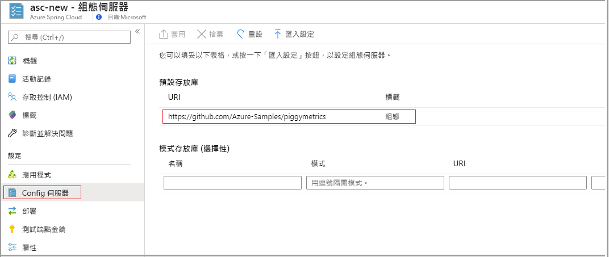

# <a name="tutorial-set-up-a-spring-cloud-config-server-for-your-service"></a>教學課程：為您的服務設定 Spring Cloud Config Server

此此教學課程將為您示範如何將 Spring Cloud Config Server 連線至 Azure Spring Cloud 服務。

Spring Cloud Config 能夠在分散式系統中提供外部化設定的伺服器端和用戶端支援。 透過 Config Server，您就可以在所有環境中集中管理應用程式的外部屬性。 若要深入了解，請造訪 [Spring Cloud Config Server 參考](https://spring.io/projects/spring-cloud-config) \(英文\)。

## <a name="prerequisites"></a>必要條件
* Azure 訂用帳戶。 如果您沒有 Azure 訂用帳戶，請在開始前建立[免費帳戶](https://azure.microsoft.com/free/?WT.mc_id=A261C142F)。 
* 已佈建且正在執行的 Azure Spring Cloud 服務。  完成[本快速入門](spring-cloud-quickstart-launch-app-cli.md)以佈建並啟動 Azure Spring Cloud 服務。

## <a name="restriction"></a>限制

當您使用 __Config Server__ 搭配 git 後端時，會有一些限制。 有些屬性將會自動插入至您的應用程式環境，以存取 __Config Server__ 和__服務探索__。 如果您也從 **Config Server** 檔案中設定這些屬性，可能會發生衝突和非預期的行為。 這些屬性包括： 

```yaml
eureka.client.service-url.defaultZone
eureka.client.tls.keystore
server.port
spring.cloud.config.tls.keystore
spring.application.name
```
> [!CAUTION]
> 我們強烈建議您__不要__將上述屬性放在您的 __Config Server__ 應用程式檔案中。

## <a name="create-your-config-server-files"></a>建立 Config Server 檔案

Azure Spring Cloud 支援 Azure DevOps、GitHub、GitLab 和 Bitbucket，以儲存您的 Config Server 檔案。 當您的存放庫準備就緒時，請使用下列指示建立組態檔，並將其儲存在該處。

此外，有些可設定的屬性僅適用於特定類型。 下列小節會列出每個存放庫類型的屬性。

### <a name="public-repository"></a>公用存放庫

使用公用存放庫時，可設定的屬性將會受到更多限制。

以下列出用來設定公用 `Git` 存放庫的所有可設定屬性。

> [!NOTE]
> 使用連字號 ("-") 來分隔字組是目前唯一支援的命名慣例。 例如，您可以使用 `default-label` 但不能使用 `defaultLabel`。

| 屬性        | 必要 | 功能                                                      |
| :-------------- | -------- | ------------------------------------------------------------ |
| `uri`           | `yes`    | 當作 Config Server 後端使用的 `Git` 存放庫 `uri` 應該以 `http://`、`https://`、`git@` 或 `ssh://` 開頭。 |
| `default-label` | `no`     | `Git` 存放庫的預設標籤應該是存放庫的 `branch name`、`tag name` 或 `commit-id`。 |
| `search-paths`  | `no`     | 用來搜尋 `Git` 存放庫子目錄的字串陣列。 |

------

### <a name="private-repository-with-ssh-authentication"></a>使用 SSH 驗證的私人存放庫

以下列出透過 `Ssh` 設定私人 `Git` 存放庫所使用的所有可設定屬性。

> [!NOTE]
> 使用連字號 ("-") 來分隔字組是目前唯一支援的命名慣例。 例如，您可以使用 `default-label` 但不能使用 `defaultLabel`。

| 屬性                   | 必要 | 功能                                                      |
| :------------------------- | -------- | ------------------------------------------------------------ |
| `uri`                      | `yes`    | 當作 Config Server 後端使用的 `Git` 存放庫 `uri` 應該以 `http://`、`https://`、`git@` 或 `ssh://` 開頭。 |
| `default-label`            | `no`     | `Git` 存放庫的預設標籤應該是存放庫的 `branch name`、`tag name` 或 `commit-id`。 |
| `search-paths`             | `no`     | 用來搜尋 `Git` 存放庫子目錄的字串陣列。 |
| `private-key`              | `no`     | 用於存取 `Git` 存放庫的 `Ssh` 私密金鑰，如果 `uri` 是以 `git@` 或 `ssh://` 開頭，則這是__必要項目__。 |
| `host-key`                 | `no`     | Git 存放庫伺服器的主機金鑰不應包含 `host-key-algorithm` 所涵蓋的演算法前置詞。 |
| `host-key-algorithm`       | `no`     | 主機金鑰演算法，應為 `ssh-dss`、`ssh-rsa`、`ecdsa-sha2-nistp256`、`ecdsa-sha2-nistp384` 或 `ecdsa-sha2-nistp521`。 只有在 `host-key` 存在時才需要。 |
| `strict-host-key-checking` | `no`     | 指出利用私密 `host-key` 時，Config Server 是否無法啟動。 應為 `true` (預設值) 或 `false`。 |

-----

### <a name="private-repository-with-basic-authentication"></a>使用基本驗證的私人存放庫

以下列出透過基本驗證設定私人 Git 存放庫所使用的所有可設定屬性。

> [!NOTE]
> 使用連字號 ("-") 來分隔字組是目前唯一支援的命名慣例。 例如，使用 `default-label`，而不是 `defaultLabel`。

| 屬性        | 必要 | 功能                                                      |
| :-------------- | -------- | ------------------------------------------------------------ |
| `uri`           | `yes`    | 當作 Config Server 後端使用的 `Git` 存放庫 `uri` 應該以 `http://`、`https://`、`git@` 或 `ssh://` 開頭。 |
| `default-label` | `no`     | `Git` 存放庫的預設標籤應該是存放庫的 `branch name`、`tag name` 或 `commit-id`。 |
| `search-paths`  | `no`     | 用來搜尋 `Git` 存放庫子目錄的字串陣列。 |
| `username`      | `no`     | 用來存取 `Git` 存放庫伺服器的 `username`，如果 `Git`存放庫伺服器支援 `Http Basic Authentication`，則這是__必要項目__。 |
| `password`      | `no`     | 用來存取 `Git` 存放庫伺服器的密碼，如果 `Git` 存放庫伺服器支援 `Http Basic Authentication`，則這是__必要項目__。 |

> [!NOTE]
> 某些 `Git` 存放庫伺服器 (例如 GitHub) 支援「個人權杖」或「存取權杖」作為 `HTTP Basic Authentication` 的密碼。 您也可以在這裡使用該類型的權杖作為密碼，而且「個人權杖」或「存取權杖」將不會過期。 但若是 Git 存放庫伺服器 (例如 BitBucket 和 Azure DevOps)，權杖將會在一或兩個小時後過期，讓該選項無法搭配 Azure Spring Cloud 使用。

### <a name="git-repositories-with-pattern"></a>使用模式的 Git 存放庫

以下列出透過模式設定 Git 存放庫所使用的所有可設定屬性。

> [!NOTE]
> 使用連字號 ("-") 來分隔字組是目前唯一支援的命名慣例。 例如，使用 `default-label`，而不是 `defaultLabel`。

| 屬性                           | 必要         | 功能                                                      |
| :--------------------------------- | ---------------- | ------------------------------------------------------------ |
| `repos`                            | `no`             | 包含具名 `Git` 存放庫設定的對應。 |
| `repos."uri"`                      | `repos` 上的 `yes` | 當作 Config Server 後端使用的 `Git` 存放庫 `uri` 應該以 `http://`、`https://`、`git@` 或 `ssh://` 開頭。 |
| `repos."name"`                     | `repos` 上的 `yes` | 用於識別一個 `Git` 存放庫的名稱，只有在 `repos` 存在時，才__需要__。 例如，從上面的 `team-A`、`team-B`。 |
| `repos."pattern"`                  | `no`             | 用來比對應用程式名稱的字串陣列。 每個模式都應使用 `{application}/{profile}` 格式搭配萬用字元。 |
| `repos."default-label"`            | `no`             | `Git` 存放庫的預設標籤應該是存放庫的 `branch name`、`tag name` 或 `commit-id`。 |
| `repos."search-paths`"             | `no`             | 用來搜尋 `Git` 存放庫子目錄的字串陣列。 |
| `repos."username"`                 | `no`             | 用來存取 `Git` 存放庫伺服器的 `username`，如果 `Git`存放庫伺服器支援 `Http Basic Authentication`，則這是__必要項目__。 |
| `repos."password"`                 | `no`             | 用來存取 `Git` 存放庫伺服器的密碼，如果 `Git` 存放庫伺服器支援 `Http Basic Authentication`，則這是__必要項目__。 |
| `repos."private-key"`              | `no`             | 用於存取 `Git` 存放庫的 `Ssh` 私密金鑰，如果 `uri` 是以 `git@` 或 `ssh://` 開頭，則這是__必要項目__。 |
| `repos."host-key"`                 | `no`             | Git 存放庫伺服器的主機金鑰不應包含 `host-key-algorithm` 所涵蓋的演算法前置詞。 |
| `repos."host-key-algorithm"`       | `no`             | 主機金鑰演算法，應為 `ssh-dss`、`ssh-rsa`、`ecdsa-sha2-nistp256`、`ecdsa-sha2-nistp384` 或 `ecdsa-sha2-nistp521`。 只有在 `host-key` 存在時才__需要__。 |
| `repos."strict-host-key-checking"` | `no`             | 指出利用私密 `host-key` 時，Config Server 是否無法啟動。 應為 `true` (預設值) 或 `false`。 |

## <a name="attaching-your-config-server-repository-to-azure-spring-cloud"></a>將 Config Server 存放庫連接至 Azure Spring Cloud

既然您已經將設定檔儲存在存放庫中，您需要將 Azure Spring Cloud 連線到該存放庫。

1. 登入 [Azure 入口網站](https://portal.azure.com)。

1. 瀏覽至您的 Azure Spring Cloud 的 [概觀]  頁面。

1. 移至左側功能表中 [Config Server]  索引標籤的 [設定]  標題底下。



### <a name="input-repository-information-directly-to-the-azure-portal"></a>將存放庫資訊直接輸入至 Azure 入口網站

#### <a name="default-repository"></a>預設存放庫

* 公用存放庫：在 [預設存放庫]  區段的 **Uri** 區段中，貼上存放庫 URI。  將**標籤**設定為 `config`。 請確定 [驗證]  設定是 [公用]  ，然後選取 [套用]  來完成作業。 

* 私人存放庫：Azure Spring Cloud 支援基本密碼/權杖型驗證和 SSH。

    * 基本驗證：在 [預設存放庫]  區段的 **Uri** 區段中，貼上存放庫 URI，然後按一下 [驗證]  。 選取 [基本]  作為 [驗證類型]  ，並輸入您的使用者名稱和密碼/權杖，以授與 Azure Spring Cloud 的存取權。 按一下 [確定]  和 [套用]  ，完成 Config Server 的設定。

    
    
    > [!CAUTION]
    > 某些 Git 存放庫伺服器 (例如 GitHub) 會使用 `personal-token` 或 `access-token`，例如作為**基本驗證**的密碼。 您可以使用這種權杖作為 Azure Spring Cloud 中的密碼，因為該權杖永遠不會過期。 但是對於其他 Git 存放庫伺服器 (例如 BitBucket 和 Azure DevOps)，`access-token` 會在一個或兩個小時後過期。 這表示在搭配 Azure Spring Cloud 使用這些存放庫伺服器時，無法使用此選項。

    * SSH：在 [預設存放庫]  區段的 **Uri** 區段中，貼上存放庫 URI，然後按一下 [驗證]  。 選取 [SSH]  作為 [驗證類型]  ，並輸入您的**私密金鑰**。 您可以選擇性地指定**主機金鑰**和**主機金鑰演算法**。 請務必將您的公開金鑰包含在 Config Server 存放庫中。 按一下 [確定]  和 [套用]  ，完成 Config Server 的設定。

    

#### <a name="pattern-repository"></a>模式存放庫

如果您想要使用選擇性的**模式存放庫**來設定服務，請指定 **URI** 和**驗證**，指定方式與**預設存放庫**相同。 請務必包含您模式的**名稱**，然後按一下 [套用]  以將其附加至您的執行個體。 

### <a name="enter-repository-information-into-a-yaml-file"></a>在 YAML 檔案中輸入存放庫資訊

如果您已使用存放庫設定來撰寫 YAML 檔案，您可以將 YAML 檔案直接從本機電腦匯入 Azure Spring Cloud。 在使用基本驗證的私人存放庫中，簡單的 YAML 檔案看起來像這樣：

```yml
spring:
    cloud:
        config:
            server:
                git:
                    uri: https://github.com/azure-spring-cloud-samples/config-server-repository.git
                    username: <username>
                    password: <password/token>

```

按一下 [匯入設定]  按鈕，然後從您的專案目錄中選取 `.yml` 檔案。 按一下 [匯入]  ，您的 [通知]  中將會顯示 `async` 作業。 1-2 分鐘後，系統應該會回報成功訊息。


您應該會看到 YAML 檔案中的資訊顯示在 Azure 入口網站中。 按一下 [套用]  以完成作業。 


## <a name="delete-your-app-configuration"></a>刪除應用程式設定

儲存組態檔之後，[刪除應用程式設定]  按鈕將會出現在 [設定]  索引標籤中。這會完全清除您現有的設定。 如果您想要將 Config Server 連線至另一個來源 (例如從 GitHub 移至 Azure DevOps)，您應該執行此動作。


## <a name="next-steps"></a>後續步驟

在此教學課程中，您了解如何啟用和設定 Config Server。 若要深入了解如何管理您的應用程式，請繼續進行手動調整應用程式的教學課程。

> [!div class="nextstepaction"]
> [了解如何手動調整您的 Azure Spring Cloud 應用程式](spring-cloud-tutorial-scale-manual.md)。

