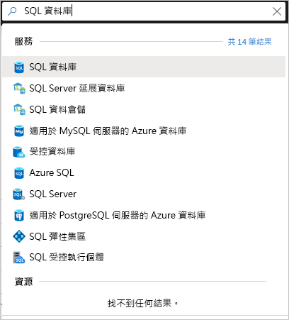
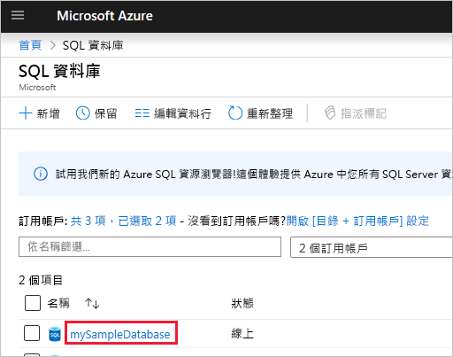
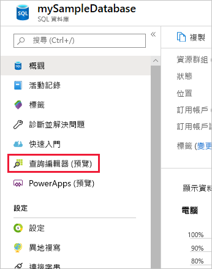
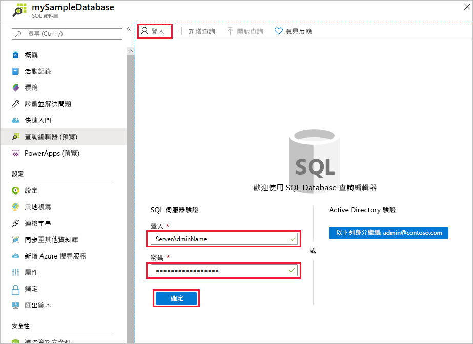
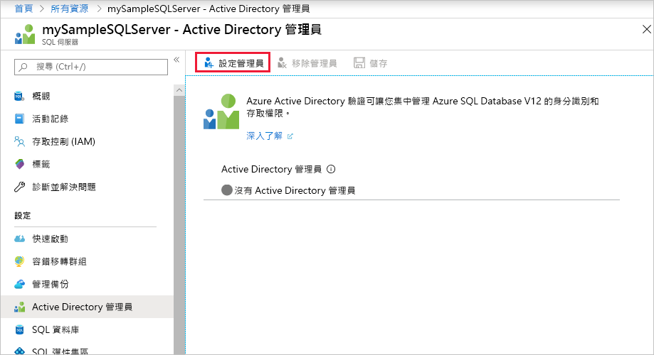

# <a name="quickstart-use-the-azure-portals-sql-query-editor-to-connect-and-query-data"></a>快速入門：使用 Azure 入口網站的 SQL 查詢編輯器進行連線並查詢資料

SQL 查詢編輯器是 Azure 入口網站瀏覽器工具，提供簡單的方法在您的 Azure SQL Database 或 Azure SQL 資料倉儲上執行 SQL 查詢。 在此快速入門中，您將使用查詢編輯器連線至 SQL 資料庫，然後使用 Transact-SQL 陳述式查詢、插入、更新及刪除資料。

## <a name="prerequisites"></a>必要條件

若要完成本教學課程，您需要：

- Azure SQL 資料庫。 您可以使用其中一個快速入門，在 Azure SQL Database 中建立資料庫並加以設定：

  || 單一資料庫 |
  |:--- |:--- |
  | 建立| [入口網站](sql-database-single-database-get-started.md) |
  || [CLI](scripts/sql-database-create-and-configure-database-cli.md) |
  || [PowerShell](scripts/sql-database-create-and-configure-database-powershell.md) |
  | 設定 | [伺服器層級 IP 防火牆規則](sql-database-server-level-firewall-rule.md)|
  |||

> [!NOTE]
> 查詢編輯器會使用連接埠 443 和 1443 來進行通訊。  請確定您已在這些連接埠上啟用輸出 HTTPS 流量。 您也必須將輸出 IP 位址新增至伺服器的允許防火牆規則，以存取您的資料庫和資料倉儲。

## <a name="sign-in-the-azure-portal"></a>登入 Azure 入口網站

登入 [Azure 入口網站](https://portal.azure.com/)。

## <a name="connect-using-sql-authentication"></a>使用 SQL 驗證進行連線

1. 移至 Azure 入口網站以連線到 SQL 資料庫。 搜尋並選取 [SQL 資料庫]  。

    

2. 選取您的 SQL 資料庫。

    

3. 在 [SQL 資料庫]  功能表中，選取 [查詢編輯器 (預覽)]  。

    

4. 從 [登入]  頁面的 [SQL Server 驗證]  標籤下方，輸入用來建立資料庫之伺服器系統管理員帳戶的**登入**識別碼和**密碼**。 然後選取 [確定]  。

    

## <a name="connect-using-azure-active-directory"></a>使用 Azure Active Directory 連線

設定 Azure Active Directory (Azure AD) 系統管理員，可讓您使用單一身分識別來登入 Azure 入口網站和您的 SQL 資料庫。 遵循下列步驟來設定 SQL Server 的 Azure AD 系統管理員。

> [!NOTE]
> * Azure AD 系統管理員尚未支援電子郵件帳戶 (例如 outlook.com、gmail.com、yahoo.com 等)。 請務必選擇使用者在 Azure AD 中原生建立，或與 Azure AD 同盟的 AD 系統管理員。
> * Azure AD 系統管理員登入無法搭配已啟用 2 雙因素驗證的帳戶使用。

1. 從 Azure 入口網站功能表或**首頁**，選取 [所有資源]  。

2. 選取您的 SQL Server。

3. 從 [SQL Server]  功能表的 [設定]  下方，選取 [Active Directory 系統管理員]  。

4. 從 SQL Server 的 [Active Directory 系統管理員]  頁面工具列中，選取 [設定系統管理員]  ，然後選擇使用者或群組作為您的 Azure AD 系統管理員。

    

5. 從 [新增系統管理員]  頁面的搜尋方塊中，輸入要尋找的使用者或群組、將其選取來作為系統管理員，然後選擇 [選取]  按鈕。

6. 返回 SQL Server 的 [Active Directory 系統管理員]  頁面工具列，選取 [儲存]  。

7. 在 [SQL Server]  功能表中，選取 [SQL 資料庫]  ，然後選取您的 SQL 資料庫。

8. 在 [SQL 資料庫]  功能表中，選取 [查詢編輯器 (預覽)]  。 在 [登入]  頁面的 [Active Directory 驗證]  標籤下方，如果您是 Azure AD 系統管理員，即會顯示一則訊息，指出您已登入。然後選取 [作為 \<您的使用者或群組識別碼>  繼續]  按鈕。

## <a name="view-data"></a>檢視資料

1. 經過驗證後，在查詢編輯器中貼上以下 SQL，即可擷取到依類別分類的前 20 個產品。

   ```sql
    SELECT TOP 20 pc.Name as CategoryName, p.name as ProductName
    FROM SalesLT.ProductCategory pc
    JOIN SalesLT.Product p
    ON pc.productcategoryid = p.productcategoryid;
   ```

2. 在工具列上，選取 [執行]  ，然後檢閱 [結果]  窗格中的輸出結果。

   

## <a name="insert-data"></a>插入資料

執行以下 [INSERT](https://msdn.microsoft.com/library/ms174335.aspx) Transact-SQL 陳述式在 `SalesLT.Product` 資料表中加入新產品。

1. 使用此查詢取代先前的查詢。

    ```sql
    INSERT INTO [SalesLT].[Product]
           ( [Name]
           , [ProductNumber]
           , [Color]
           , [ProductCategoryID]
           , [StandardCost]
           , [ListPrice]
           , [SellStartDate]
           )
    VALUES
           ('myNewProduct'
           ,123456789
           ,'NewColor'
           ,1
           ,100
           ,100
           ,GETDATE() );
   ```


2. 選取 [執行]  以在 `Product` 資料表中插入新資料列。 [訊息]  窗格會顯示**成功的查詢：受影響的資料列：1**。


## <a name="update-data"></a>更新資料

執行以下 [UPDATE](https://msdn.microsoft.com/library/ms177523.aspx) Transact-SQL 陳述式修改您的新產品。

1. 使用此查詢取代先前的查詢。

   ```sql
   UPDATE [SalesLT].[Product]
   SET [ListPrice] = 125
   WHERE Name = 'myNewProduct';
   ```

2. 選取 [執行]  以在 `Product` 資料表中更新指定的資料列。 [訊息]  窗格會顯示**成功的查詢：受影響的資料列：1**。

## <a name="delete-data"></a>刪除資料

執行以下 [DELETE](https://msdn.microsoft.com/library/ms189835.aspx) Transact-SQL 陳述式移除您的新產品。

1. 使用此查詢取代先前的查詢：

   ```sql
   DELETE FROM [SalesLT].[Product]
   WHERE Name = 'myNewProduct';
   ```

2. 選取 [執行]  以在 `Product` 資料表中刪除指定的資料列。 [訊息]  窗格會顯示**成功的查詢：受影響的資料列：1**。


## <a name="query-editor-considerations"></a>查詢編輯器考量

使用查詢編輯器時，有一些使用事項須注意。

* 查詢編輯器會使用連接埠 443 和 1443 來進行通訊。  請確定您已在這些連接埠上啟用輸出 HTTPS 流量。 您也必須將輸出 IP 位址新增至伺服器的允許防火牆規則，以存取您的資料庫和資料倉儲。

* 按下 F5 可重新整理查詢編輯器頁面，而且任何正在進行的查詢都會遺失。

* 查詢編輯器不支援連線到 `master` 資料庫。

* 查詢執行的逾時時間是 5 分鐘。

* 查詢編輯器僅支援地理資料類型的圓柱形投影。

* 不支援用於資料庫表格和檢視的 IntelliSense。 但編輯器支援已輸入名稱的自動完成功能。


## <a name="next-steps"></a>後續步驟

若要深入了解 Azure SQL 資料庫中支援的 Transact-SQL，請參閱[解析移轉至 SQL 資料庫時的 Transact-SQL 差異](sql-database-transact-sql-information.md)。
